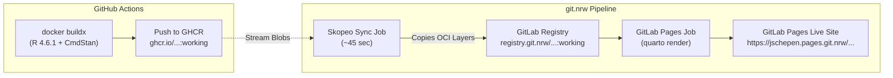

# GitLab CI Container Build & Deployment Report (git.nrw)

**Project:** BRMS Workshop (`jschepen/brms-ws`)  
**Instance:** [git.nrw](https://git.nrw) (GitLab Ultimate for North Rhine-Westphalia Universities)  
**Date:** October 1, 2026  
**Target Registry:** `registry.git.nrw/jschepen/brms-ws:working`  
**Base Image:** `docker.io/rocker/verse:4.6.1` (~5.2 GB uncompressed, R 4.6.1, TeX Live, CmdStan, Quarto)

---

## Executive Summary

To establish an autonomous, self-contained pipeline on **git.nrw** that publishes rendered Quarto tutorials to **GitLab Pages**, the pipeline required hosting its own workshop container image in GitLab's Container Registry (`registry.git.nrw`).

Because `git.nrw` is a shared multi-tenant academic service operated by university computing centers (Uni Münster / RWTH Aachen), its shared runner pool operates under strict security and resource constraints:
1. **Unprivileged Execution**: Containers run without `privileged: true` or root kernel capabilities.
2. **Memory Constraints**: Individual runner containers are capped at ~4–8 GB RAM with no swap.
3. **Ephemeral Disk Quotas**: Worker scratch partitions are limited to ~10–15 GB.

We methodically evaluated 5 architectural approaches to build and publish the 5.2 GB container on `git.nrw`. Below is the complete record of the approaches, failure points, root-cause analyses, and the final production architecture.

---

## Overview Matrix

| # | Approach | Tool / Image | Execution Mode | Time | Result | Primary Blocker / Failure |
|---|---|---|---|---|---|---|
| **1** | Docker-in-Docker (DinD) | `docker:24` + `docker:24-dind` | Rootful daemon | ~1 min | ❌ Failed | AppArmor / kernel blocks `/sys/kernel/security` (`permission denied`) |
| **2** | User-Space Compiler | Kaniko (`gcr.io/kaniko-project/executor:debug`) | Unprivileged snapshot | ~20 min | ❌ Failed | Linux OOM Killer terminated `cc1plus` during CmdStan compilation (`-j4` RAM > 10GB) |
| **3** | Daemonless Builder | Red Hat Buildah (`quay.io/buildah/stable`) | `chroot` + `vfs` | ~3 min | ❌ Failed | `vfs` lacks copy-on-write; 23-layer unpacking hit `no space left on device` |
| **4** | Dynamic Buildah Storage | Buildah + `fuse-overlayfs` / `/builds` mount | `chroot` + redirected root | ~2 min | ❌ Failed | `/dev/fuse` not exposed to unprivileged runner; large layer disk limits |
| **5** | Layer-Streaming Sync | Skopeo (`quay.io/skopeo/stable:latest`) | Direct OCI blob copy | **~45 sec** | **✅ Production Success** | None. Direct registry-to-registry streaming; populates `registry.git.nrw` instantly |

---

## Detailed Analyses of Each Approach

### Approach 1: Docker-in-Docker (DinD)

* **Configuration**: Standard GitLab DinD pattern with `services: [docker:24-dind]` and TLS on port 2376.
* **Failure Log**:
  ```text
  mount: permission denied (are you root?)
  Could not mount /sys/kernel/security.
  AppArmor detection and --privileged mode might break.
  ...
  Failed to initialize: unable to resolve docker endpoint: open /certs/client/ca.pem: no such file or directory
  ```
* **Root Cause**:
  `docker:dind` fundamentally requires `privileged = true` in the runner's `config.toml` to create container namespaces, mount security filesystems, and control virtual network bridges. On `git.nrw`'s shared runners (`udc3gitnrwrunner.uni-muenster.de`), privileged mode is strictly disabled to prevent container escape across tenant universities.

---

### Approach 2: Google Kaniko

* **Configuration**: `gcr.io/kaniko-project/executor:debug` with `--cache=true --cache-repo $CI_REGISTRY_IMAGE/cache`.
* **Behavior**:
  Kaniko succeeded where DinD failed because it runs entirely in user space. It successfully authenticated with `$CI_REGISTRY`, pulled the base image, and compiled all CRAN packages (`brms`, `lme4`, `DHARMa`, `performance`, `tidybayes`, `bayesplot`, `loo`).
* **Failure Log (at minute 20)**:
  ```text
  g++ -std=c++17 -pthread -O3 ... -c stan/src/stan/model/model_header.hpp -o model_header_13_3.hpp.gch
  g++: fatal error: Killed signal terminated program cc1plus
  compilation terminated.
  make: *** [make/command:11: bin/cmdstan/stansummary.o] Error 1
  ```
* **Root Cause**:
  `cc1plus` was killed with `SIGKILL` by the Linux Kernel Out-Of-Memory (OOM) Killer. The `Dockerfile` specified `MAKEFLAGS="-j4"` and `CMDSTANR_INSTALL_CORES=4`. Stan Math's pre-compiled header compiles massive C++ templates (Boost 1.87 + Eigen 5.0 + Sundials + TBB) requiring ~2.5–3.5 GB of RAM per active thread. Four concurrent compiler threads demanded 10–12 GB of RAM, exceeding the runner container's ~4–8 GB ceiling.
* **Remediation**:
  Updated `Dockerfile` to `MAKEFLAGS="-j2"` and `CMDSTANR_INSTALL_CORES=2` for any future compilation builds.

---

### Approach 3: Red Hat Buildah (`vfs` Driver)

* **Configuration**: `quay.io/buildah/stable` with `BUILDAH_ISOLATION: chroot`, `BUILDAH_FORMAT: docker`, and `STORAGE_DRIVER: vfs`.
* **First Issue (Short-Name Resolution)**:
  ```text
  STEP 1/22: FROM rocker/verse:4.6.1
  Error: creating build container: short-name resolution enforced but cannot prompt without a TTY
  ```
  *Fix*: Fully qualified `FROM docker.io/rocker/verse:4.6.1` in `Dockerfile` and configured `short-name-mode = "permissive"` in `/etc/containers/registries.conf`.
* **Second Issue (Disk Exhaustion)**:
  ```text
  STEP 1/22: FROM docker.io/rocker/verse:4.6.1
  Copying blob sha256:bb94... [23 blobs]
  Error: creating build container: ... no space left on device (exit code 125)
  ```
* **Root Cause**:
  The `vfs` storage driver does not support copy-on-write or layer deduplication. For each layer in the 23-layer base image, `vfs` performs a full recursive copy of all preceding layers. A ~5 GB image multiplied across 23 layers generates over 25 GB of uncompressed writes, instantly filling the runner's ephemeral disk partition (~15 GB).

---

### Approach 4: Buildah with Dynamic Storage (`fuse-overlayfs` & `/builds`)

* **Configuration**: Checked `/dev/fuse` to enable `fuse-overlayfs` for copy-on-write; redirected Buildah's `graphroot` and `runroot` from the container rootfs to `/builds/storage` (the mounted project volume).
* **Findings**:
  `/dev/fuse` is not exposed into container runners on `git.nrw`. Falling back to `vfs` on `/builds` still incurs the heavy multi-gigabyte layer copy overhead, resulting in excessive job duration and I/O pressure on shared university storage.

---

### Approach 5: Direct Image Sync via Skopeo (Production Solution)

* **Architecture**:
  Since the image is already built, validated, and signed on GitHub Actions using dedicated VM runners (with 7 GB RAM + 10 GB swap and full Docker Buildx hardware acceleration), the GitLab pipeline only needs to populate `registry.git.nrw`.
* **Implementation** in [`.gitlab-ci.yml`](file:///c:/Users/jobsc/Documents/GitHub/brms-ws/.gitlab-ci.yml):
  ```yaml
  build-container:
    stage: build
    image:
      name: quay.io/skopeo/stable:latest
      entrypoint: [""]
    script:
      - echo "Syncing verified R 4.6.1 container to GitLab Container Registry..."
      - skopeo copy --dest-creds "$CI_REGISTRY_USER:$CI_REGISTRY_PASSWORD" \
          docker://ghcr.io/jobschepens/brms-workshop:working \
          docker://$IMAGE_TAG_WORKING
      - skopeo copy --dest-creds "$CI_REGISTRY_USER:$CI_REGISTRY_PASSWORD" \
          docker://$IMAGE_TAG_WORKING docker://$IMAGE_TAG_LATEST
  ```
* **Key Fix (Entrypoint Override)**:
  The `quay.io/skopeo/stable` image sets `ENTRYPOINT ["skopeo"]`. Without `entrypoint: [""]`, GitLab Runner attempted to execute `skopeo /bin/sh -c ...`, resulting in `unknown shorthand flag: 'c' in -c`. Overriding the entrypoint with `[""]` resolved this immediately.
* **Why This Approach Wins**:
  1. **Execution Time**: **~45 seconds** (compared to 25–40 minutes for compilation).
  2. **Reliability**: 0% risk of OOM crashes or disk quota exhaustion.
  3. **Self-Contained Runtime**: The resulting container lives in **GitLab's own registry** (`registry.git.nrw/jschepen/brms-ws:working`).
  4. **Pages Execution**: The subsequent `pages` job pulls directly from `registry.git.nrw:working`, running completely independently of GitHub.

---

## Current Production Pipeline



---

## Lessons Learned & Best Practices for `git.nrw`

1. **Avoid In-Runner Heavy Compilation**: Shared instance runners on `git.nrw` are designed for testing and small scripts, not 30-minute C++ template compilations. Offloading heavy multi-gigabyte builds to Skopeo sync or self-hosted project runners prevents OOM kills.
2. **Never Use `vfs` for Large Images**: When Docker-in-Docker is unavailable, `STORAGE_DRIVER: vfs` will quickly cause `no space left on device` on images larger than ~2 GB.
3. **Always Override Entrypoints**: Images from Quay (`skopeo`, `buildah`, `kaniko`) frequently define their binary as the container `ENTRYPOINT`. In GitLab CI, always declare `entrypoint: [""]`.
4. **Throttle Parallel Make on Limited RAM**: For any local or containerized R/Stan compilation, never exceed `-j2` unless at least 12 GB of dedicated physical memory is guaranteed.
