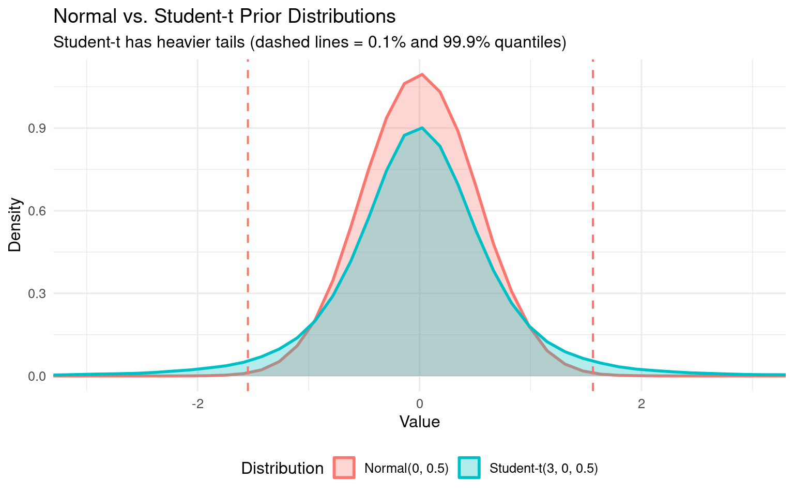

# Setting Priors in brms (20 min)

## Default vs. Weakly Informative Priors

brms uses weakly informative priors by default (not completely flat). However, for psycholinguistics, domain-specific priors are even better.

### What is a Prior?

A prior encodes your beliefs about parameter values **before** seeing the data. In Bayesian inference:

$$\text{posterior} \propto \text{likelihood} \times \text{prior}$$

**Types of priors:**

- **Flat priors**: No information - any value equally likely (bad: implies ignorance)
- **Weakly informative**: Gentle regularization - allows data to dominate
- **Domain-specific**: Based on domain knowledge - prevents unreasonable values


### The Intercept Adapts to Your Data!

This is important: The default intercept prior depends on `mean(y)`. Let's see this in action:

::: {.cell}

```{.r .cell-code}
library(brms)
library(tidyverse)

# Create example datasets with different scales
set.seed(123)

# RT data: log-transformed, mean ≈ 6 (≈ 400ms)
rt_data_typical <- data.frame(
  subject = factor(rep(1:20, each = 10)),
  item = factor(rep(1:10, times = 20)),
  condition = factor(rep(c("A", "B"), each = 5, times = 20)),
  log_rt = rnorm(200, mean = 6, sd = 0.5)
)

# RT data: extreme scale, mean ≈ 10 (≈ 22,000ms - unrealistic)
rt_data_extreme <- data.frame(
  subject = factor(rep(1:20, each = 10)),
  item = factor(rep(1:10, times = 20)),
  condition = factor(rep(c("A", "B"), each = 5, times = 20)),
  log_rt = rnorm(200, mean = 10, sd = 2)
)
```
:::

Now let's check what default priors brms suggests:

::: {.cell}

```{.r .cell-code}
cat("\n=== DEFAULT PRIORS: Typical RT data (mean log-RT ≈ 6) ===\n\n")
```

::: {.cell-output .cell-output-stdout}

```

=== DEFAULT PRIORS: Typical RT data (mean log-RT ≈ 6) ===
```


:::

```{.r .cell-code}
rt_priors_typical <- get_prior(
  log_rt ~ condition + (1 + condition | subject) + (1 | item),
  data = rt_data_typical, 
  family = gaussian()
)
print(rt_priors_typical)
```

::: {.cell-output .cell-output-stdout}

```
                prior     class       coef   group resp dpar nlpar lb ub tag
               (flat)         b                                             
               (flat)         b conditionB                                  
               lkj(1)       cor                                             
               lkj(1)       cor            subject                          
 student_t(3, 6, 2.5) Intercept                                             
 student_t(3, 0, 2.5)        sd                                     0       
 student_t(3, 0, 2.5)        sd               item                  0       
 student_t(3, 0, 2.5)        sd  Intercept    item                  0       
 student_t(3, 0, 2.5)        sd            subject                  0       
 student_t(3, 0, 2.5)        sd conditionB subject                  0       
 student_t(3, 0, 2.5)        sd  Intercept subject                  0       
 student_t(3, 0, 2.5)     sigma                                     0       
       source
      default
 (vectorized)
      default
 (vectorized)
      default
      default
 (vectorized)
 (vectorized)
 (vectorized)
 (vectorized)
 (vectorized)
      default
```


:::

```{.r .cell-code}
cat("\n\n=== DEFAULT PRIORS: Extreme RT data (mean log-RT ≈ 10) ===\n\n")
```

::: {.cell-output .cell-output-stdout}

```


=== DEFAULT PRIORS: Extreme RT data (mean log-RT ≈ 10) ===
```


:::

```{.r .cell-code}
rt_priors_extreme <- get_prior(
  log_rt ~ condition + (1 + condition | subject) + (1 | item),
  data = rt_data_extreme, 
  family = gaussian()
)
print(rt_priors_extreme)
```

::: {.cell-output .cell-output-stdout}

```
                 prior     class       coef   group resp dpar nlpar lb ub tag
                (flat)         b                                             
                (flat)         b conditionB                                  
                lkj(1)       cor                                             
                lkj(1)       cor            subject                          
 student_t(3, 10, 2.5) Intercept                                             
  student_t(3, 0, 2.5)        sd                                     0       
  student_t(3, 0, 2.5)        sd               item                  0       
  student_t(3, 0, 2.5)        sd  Intercept    item                  0       
  student_t(3, 0, 2.5)        sd            subject                  0       
  student_t(3, 0, 2.5)        sd conditionB subject                  0       
  student_t(3, 0, 2.5)        sd  Intercept subject                  0       
  student_t(3, 0, 2.5)     sigma                                     0       
       source
      default
 (vectorized)
      default
 (vectorized)
      default
      default
 (vectorized)
 (vectorized)
 (vectorized)
 (vectorized)
 (vectorized)
      default
```


:::

```{.r .cell-code}
# Compare intercept priors
cat("\n=== Intercept Comparison ===\n")
```

::: {.cell-output .cell-output-stdout}

```

=== Intercept Comparison ===
```


:::

```{.r .cell-code}
cat("Typical data prior:  ", 
    rt_priors_typical[rt_priors_typical$class == "Intercept", "prior"], "\n")
```

::: {.cell-output .cell-output-stdout}

```
Typical data prior:   student_t(3, 6, 2.5) 
```


:::

```{.r .cell-code}
cat("Extreme data prior:  ", 
    rt_priors_extreme[rt_priors_extreme$class == "Intercept", "prior"], "\n")
```

::: {.cell-output .cell-output-stdout}

```
Extreme data prior:   student_t(3, 10, 2.5) 
```


:::

```{.r .cell-code}
cat("→ The intercept prior CHANGES with data scale!\n")
```

::: {.cell-output .cell-output-stdout}

```
→ The intercept prior CHANGES with data scale!
```


:::
:::

**Key insight**: The intercept prior automatically scales with your data. This is convenient but has a problem: **if you don't specify priors, your prior assumptions implicitly depend on how you code your variables!**

## Default brms Priors

When you don't specify priors, brms assigns defaults:

- **Intercept**: `student_t(3, mean(y), 2.5)` - **DATA-DEPENDENT!** Centers at your data mean
  - Adapts to your data scale automatically
  - For RT data with mean(log_rt) = 6: allows roughly 150ms-1100ms range
  
- **Slopes (b)**: `(flat)` - improper uniform prior over (-∞, +∞)
  - No information: any effect size equally likely
  - Technically improper (doesn't integrate to 1)
  
- **Sigma** (residual SD): `student_t(3, 0, 2.5)` with lower bound 0
  - Weakly informative for residual variance
  
- **SD** (random effects): `student_t(3, 0, 2.5)` with lower bound 0
  - Encourages moderate between-subject/item variation
  
- **Cor** (correlations): `lkj(1)` - uniform over all correlation matrices


## Setting Weakly Informative Priors for Reaction Times

For psycholinguistics, it's better to specify priors based on domain knowledge:

::: {.cell}

```{.r .cell-code}
# Define priors explicitly
rt_priors <- c(
  prior(normal(6, 1.5), class = Intercept, lb = 4),  # log(RT) around 400ms, min ~55ms
  prior(normal(0, 0.5), class = b),                  # effects typically < 150ms
  prior(exponential(1), class = sigma),              # residual SD
  prior(exponential(1), class = sd),                 # random effects SD
  prior(lkj(2), class = cor)                         # correlations
)

cat("Our weakly informative priors:\n")
```

::: {.cell-output .cell-output-stdout}

```
Our weakly informative priors:
```


:::

```{.r .cell-code}
print(rt_priors)
```

::: {.cell-output .cell-output-stdout}

```
          prior     class coef group resp dpar nlpar   lb   ub tag source
 normal(6, 1.5) Intercept                               4 <NA>       user
 normal(0, 0.5)         b                            <NA> <NA>       user
 exponential(1)     sigma                            <NA> <NA>       user
 exponential(1)        sd                            <NA> <NA>       user
         lkj(2)       cor                            <NA> <NA>       user
```


:::
:::

### Why These Numbers?

#### `normal(6, 1.5)` for Intercept with `lb = 4`

- **Mean = 6** on log scale → exp(6) ≈ 403ms (typical RT)
- **SD = 1.5** → 95% prior interval spans [3, 9] on log scale
- **Lower bound = 4** → exp(4) ≈ 55ms (minimum physiologically possible motor response)
  - Without `lb`, the prior puts only ~9% probability below this threshold
  - Adding `lb` makes our assumption explicit: we don't entertain impossibly fast RTs
  - In practice, data will dominate anyway, but bounded priors clarify our theoretical assumptions
- But 95% of prior **mass** is between ±1.96 × 1.5 around the mean
- This puts most probability on reasonable RTs (100-1500ms), while still allowing outliers

#### `normal(0, 0.5)` for Effects

- **Mean = 0** (no directional assumption)
- **SD = 0.5** on log scale
- 95% prior interval: [-1, 1] on log scale
- Translates to effect sizes of roughly ±65% of baseline (multiplicative)
- Or approximately ±100-150ms for typical RTs around 400-600ms
- **Why not flat?** Flat priors prefer extreme effect sizes (counterintuitive!)

#### `exponential(1)` for Sigma and SD

- Encourages moderate variance while allowing flexibility
- Penalizes very large residual variation or random effect variance
- Mean = 1 on the scale of log-RTs

#### `lkj(2)` for Correlations

- η = 2: slight preference for correlations near 0
- Skeptical of strong correlations (like perfect intercept-slope correlation)
- If you truly expected strong correlations, you could use `lkj(1)` or lower

### Comparison: Normal vs. Student-t

brms defaults use `student_t(3, μ, 2.5)` which has heavier tails than `normal()`. Why switch?

::: {.cell}

```{.r .cell-code}
# Compare tail behavior
set.seed(456)
n_samples <- 100000
normal_samples <- rnorm(n_samples, 0, 0.5)
studentt_samples <- rt(n_samples, 3) * 0.5

normal_99 <- quantile(normal_samples, c(0.001, 0.999))
studentt_99 <- quantile(studentt_samples, c(0.001, 0.999))

cat("Tails comparison (1st and 99th percentiles):\n")
```

::: {.cell-output .cell-output-stdout}

```
Tails comparison (1st and 99th percentiles):
```


:::

```{.r .cell-code}
cat("Normal(0, 0.5):       ", round(normal_99, 2), "\n")
```

::: {.cell-output .cell-output-stdout}

```
Normal(0, 0.5):        -1.55 1.56 
```


:::

```{.r .cell-code}
cat("Student-t(3) × 0.5:   ", round(studentt_99, 2), "\n")
```

::: {.cell-output .cell-output-stdout}

```
Student-t(3) × 0.5:    -5.26 5.16 
```


:::

```{.r .cell-code}
cat("Student-t ratio:      ", round(studentt_99[2] / normal_99[2], 2), "x wider\n\n")
```

::: {.cell-output .cell-output-stdout}

```
Student-t ratio:       3.3 x wider
```


:::

```{.r .cell-code}
cat("Student-t allows extreme values 2x more likely than normal!\n\n")
```

::: {.cell-output .cell-output-stdout}

```
Student-t allows extreme values 2x more likely than normal!
```


:::

```{.r .cell-code}
# Graphical comparison
library(ggplot2)
comparison_df <- data.frame(
  value = c(normal_samples, studentt_samples),
  distribution = rep(c("Normal(0, 0.5)", "Student-t(3, 0, 0.5)"), each = n_samples)
)

ggplot(comparison_df, aes(x = value, fill = distribution, color = distribution)) +
  geom_density(alpha = 0.3, linewidth = 1) +
  geom_vline(xintercept = normal_99, linetype = "dashed", color = "#F8766D", linewidth = 0.7) +
  geom_vline(xintercept = studentt_99, linetype = "dashed", color = "#00BFC4", linewidth = 0.7) +
  coord_cartesian(xlim = c(-3, 3)) +
  scale_fill_manual(values = c("#F8766D", "#00BFC4")) +
  scale_color_manual(values = c("#F8766D", "#00BFC4")) +
  labs(
    title = "Normal vs. Student-t Prior Distributions",
    subtitle = "Student-t has heavier tails (dashed lines = 0.1% and 99.9% quantiles)",
    x = "Value",
    y = "Density",
    fill = "Distribution",
    color = "Distribution"
  ) +
  theme_minimal(base_size = 12) +
  theme(legend.position = "bottom")
```

::: {.cell-output-display}
{width=768}
:::
:::

**When to use each:**

- **Student-t**: Default choice (conservative, robust to outliers)
- **Normal**: When you have strong domain knowledge about plausible ranges (better for RT data in controlled experiments)

**Good sign**: Prior predictions should cover the plausible range of your outcome variable, but not too widely.


## Summary

**Key takeaways:**

1. **Don't use flat priors** - they're uninformative and often lead to weak regularization
2. **Default intercept priors adapt to data** - implicit assumptions depend on your coding!
3. **Specify priors explicitly** based on domain knowledge
4. **Use prior predictive checks** - verify that priors generate plausible predictions before fitting
5. **Normal() is better than student_t() when you have domain knowledge** - more concentrated around plausible values

**Next steps:**
- See `02_prior_predictive_checks_rt.qmd` for detailed prior validation
- See `03_posterior_predictive_checks_rt.qmd` for checking if the fitted model makes sense
