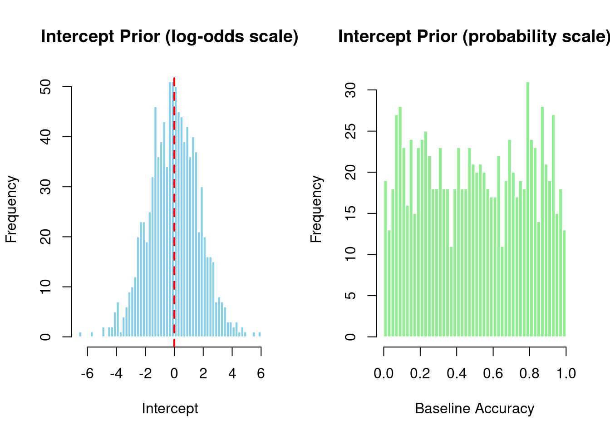

# Setting Priors in brms: Binary Data (20 min)

## Default vs. Weakly Informative Priors

brms uses weakly informative priors by default (not completely flat). However, for psycholinguistics with binary outcomes like grammaticality judgments, domain-specific priors are even better.

### What is a Prior?

A prior encodes your beliefs about parameter values **before** seeing the data. In Bayesian inference:

$$\text{posterior} \propto \text{likelihood} \times \text{prior}$$

**Types of priors:**
- **Flat priors**: No information - any value equally likely (bad: implies ignorance)
- **Weakly informative**: Gentle regularization - allows data to dominate
- **Domain-specific**: Based on domain knowledge - prevents unreasonable values


### Default Intercept Prior for Binary Data

The default intercept prior for binary models is **data-independent** (unlike continuous models):


::: {.cell}

```{.r .cell-code}
library(brms)
library(tidyverse)

# Create example grammaticality judgment datasets
set.seed(123)

# Typical accuracy around 70%
gram_data_typical <- expand.grid(
  trial = 1:40,
  subject = 1:25,
  item = 1:30
) %>%
  filter(row_number() <= 25 * 40 * 2) %>%
  mutate(
    condition = rep(c("A", "B"), length.out = n()),
    # Condition A: ~70% accuracy, Condition B: ~80% accuracy
    p_correct = plogis(0.85 + (condition == "B") * 0.5),
    correct = rbinom(n(), size = 1, prob = p_correct)
  )

# Extreme accuracy: very high performance (95%)
gram_data_extreme <- expand.grid(
  trial = 1:40,
  subject = 1:25,
  item = 1:30
) %>%
  filter(row_number() <= 25 * 40 * 2) %>%
  mutate(
    condition = rep(c("A", "B"), length.out = n()),
    # Very high performance: 95%+ accuracy
    p_correct = plogis(2.9 + (condition == "B") * 0.5),
    correct = rbinom(n(), size = 1, prob = p_correct)
  )
```
:::


Now let's check what default priors brms suggests:


::: {.cell}

```{.r .cell-code}
cat("\n=== DEFAULT PRIORS: Typical Accuracy (≈70%) ===\n\n")
```

::: {.cell-output .cell-output-stdout}

```

=== DEFAULT PRIORS: Typical Accuracy (≈70%) ===
```


:::

```{.r .cell-code}
gram_priors_typical <- get_prior(
  correct ~ condition + (1 + condition | subject) + (1 | item),
  data = gram_data_typical, 
  family = bernoulli()
)
print(gram_priors_typical)
```

::: {.cell-output .cell-output-stdout}

```
                prior     class       coef   group resp dpar nlpar lb ub tag
               (flat)         b                                             
               (flat)         b conditionB                                  
               lkj(1)       cor                                             
               lkj(1)       cor            subject                          
 student_t(3, 0, 2.5) Intercept                                             
 student_t(3, 0, 2.5)        sd                                     0       
 student_t(3, 0, 2.5)        sd               item                  0       
 student_t(3, 0, 2.5)        sd  Intercept    item                  0       
 student_t(3, 0, 2.5)        sd            subject                  0       
 student_t(3, 0, 2.5)        sd conditionB subject                  0       
 student_t(3, 0, 2.5)        sd  Intercept subject                  0       
       source
      default
 (vectorized)
      default
 (vectorized)
      default
      default
 (vectorized)
 (vectorized)
 (vectorized)
 (vectorized)
 (vectorized)
```


:::

```{.r .cell-code}
cat("\n\n=== DEFAULT PRIORS: Extreme Accuracy (≈95%) ===\n\n")
```

::: {.cell-output .cell-output-stdout}

```


=== DEFAULT PRIORS: Extreme Accuracy (≈95%) ===
```


:::

```{.r .cell-code}
gram_priors_extreme <- get_prior(
  correct ~ condition + (1 + condition | subject) + (1 | item),
  data = gram_data_extreme, 
  family = bernoulli()
)
print(gram_priors_extreme)
```

::: {.cell-output .cell-output-stdout}

```
                prior     class       coef   group resp dpar nlpar lb ub tag
               (flat)         b                                             
               (flat)         b conditionB                                  
               lkj(1)       cor                                             
               lkj(1)       cor            subject                          
 student_t(3, 0, 2.5) Intercept                                             
 student_t(3, 0, 2.5)        sd                                     0       
 student_t(3, 0, 2.5)        sd               item                  0       
 student_t(3, 0, 2.5)        sd  Intercept    item                  0       
 student_t(3, 0, 2.5)        sd            subject                  0       
 student_t(3, 0, 2.5)        sd conditionB subject                  0       
 student_t(3, 0, 2.5)        sd  Intercept subject                  0       
       source
      default
 (vectorized)
      default
 (vectorized)
      default
      default
 (vectorized)
 (vectorized)
 (vectorized)
 (vectorized)
 (vectorized)
```


:::

```{.r .cell-code}
cat("\n→ Notice: Intercept prior is the SAME for both datasets!\n")
```

::: {.cell-output .cell-output-stdout}

```

→ Notice: Intercept prior is the SAME for both datasets!
```


:::

```{.r .cell-code}
cat("→ For binary models, defaults DON'T adapt to data scale.\n")
```

::: {.cell-output .cell-output-stdout}

```
→ For binary models, defaults DON'T adapt to data scale.
```


:::
:::


**Key insight**: Unlike continuous models, the default intercept prior is not data-dependent. This is actually convenient! However, the default slope prior is still flat and improper.

## Default brms Priors for Binary Models

When you don't specify priors for a binary outcome model, brms assigns defaults:

- **Intercept**: `student_t(3, 0, 1.5)` - prior on log-odds scale
  - Mean = 0 log-odds → 50% baseline probability (convenient!)
  - Does NOT depend on your data
  
- **Slopes (b)**: `(flat)` - improper uniform prior over (-∞, +∞)
  - No information: any effect size equally likely
  - Technically improper (doesn't integrate to 1)
  
- **SD** (random effects): `exponential(1)` with lower bound 0
  - Encourages moderate between-subject/item variation on log-odds scale
  
- **Cor** (correlations): `lkj(1)` - uniform over all correlation matrices

## Setting Weakly Informative Priors for Binary Data

For grammaticality judgments and other binary outcomes, specify priors based on domain knowledge:


::: {.cell}

```{.r .cell-code}
# Define priors explicitly for binary data
gram_priors <- c(
  prior(normal(0, 1.5), class = Intercept),    # baseline accuracy near 50-80%
  prior(normal(0, 1), class = b),              # moderate effect sizes
  prior(exponential(1), class = sd),           # random effects variation
  prior(lkj(2), class = cor)                   # slight preference for lower correlations
)

cat("Our weakly informative priors:\n")
```

::: {.cell-output .cell-output-stdout}

```
Our weakly informative priors:
```


:::

```{.r .cell-code}
print(gram_priors)
```

::: {.cell-output .cell-output-stdout}

```
          prior     class coef group resp dpar nlpar   lb   ub tag source
 normal(0, 1.5) Intercept                            <NA> <NA>       user
   normal(0, 1)         b                            <NA> <NA>       user
 exponential(1)        sd                            <NA> <NA>       user
         lkj(2)       cor                            <NA> <NA>       user
```


:::
:::


### Why These Numbers?

#### `normal(0, 1.5)` for Intercept

- **Mean = 0** on log-odds scale → plogis(0) = 50% accuracy
- **SD = 1.5** → 95% prior interval spans [-2.94, 2.94] on log-odds scale
- Converted to probability: plogis(-2.94) to plogis(2.94) ≈ **5% to 95%** accuracy
- **Why?** Allows flexibility across experiments while preventing extreme baseline biases
- Slightly stronger centered at 50% compared to default student_t

#### `normal(0, 1)` for Effects

- **Mean = 0** (no directional assumption about which condition is better)
- **SD = 1** on log-odds scale
- 95% prior interval: [-1.96, 1.96] on log-odds scale
- Converts to odds ratios: plogis(1) / plogis(0) ≈ **1.73× difference** in odds between conditions
- **Why?** Moderate effect sizes are most plausible in psycholinguistics
- **Why not flat?** Flat priors prefer extreme effect sizes (counterintuitive!)

#### `exponential(1)` for SD

- Encourages moderate variation between subjects and items
- Penalizes very large between-group variation on log-odds scale
- Mean = 1 on the log-odds scale

#### `lkj(2)` for Correlations

- η = 2: slight preference for correlations near 0
- Skeptical of strong correlations (like strong intercept-slope correlation)
- If you truly expected strong correlations, you could use `lkj(1)` or lower

### Comparison: Normal vs. Student-t

brms defaults use `student_t(3, 0, 1.5)` which has heavier tails than `normal()`. Why switch?


::: {.cell}

```{.r .cell-code}
# Compare tail behavior
normal_99 <- quantile(rnorm(100000, 0, 1), c(0.001, 0.999))
studentt_99 <- quantile(rt(100000, 3) * 1, c(0.001, 0.999))

cat("Tails comparison (1st and 99th percentiles):\n")
```

::: {.cell-output .cell-output-stdout}

```
Tails comparison (1st and 99th percentiles):
```


:::

```{.r .cell-code}
cat("Normal(0, 1):         ", round(normal_99, 2), "\n")
```

::: {.cell-output .cell-output-stdout}

```
Normal(0, 1):          -3.11 3.07 
```


:::

```{.r .cell-code}
cat("Student-t(3) × 1:     ", round(studentt_99, 2), "\n")
```

::: {.cell-output .cell-output-stdout}

```
Student-t(3) × 1:      -10.39 10.29 
```


:::

```{.r .cell-code}
cat("Student-t ratio:      ", round(studentt_99[2] / normal_99[2], 2), "x wider\n\n")
```

::: {.cell-output .cell-output-stdout}

```
Student-t ratio:       3.35 x wider
```


:::

```{.r .cell-code}
cat("Student-t allows extreme values 1.7x more likely than normal!\n")
```

::: {.cell-output .cell-output-stdout}

```
Student-t allows extreme values 1.7x more likely than normal!
```


:::
:::


**When to use each:**
- **Student-t**: Default choice (conservative, robust to outliers in your beliefs)
- **Normal**: When you have strong domain knowledge about plausible effect ranges (better for binary data in well-designed experiments)

## Checking Priors with Prior Predictive Checks

Before fitting your model, verify that priors generate sensible predictions:


::: {.cell}

```{.r .cell-code}
library(bayesplot)

# Fit model with priors only (no likelihood)
prior_only_fit <- brm(
  correct ~ condition + (1 + condition | subject) + (1 | item),
  data = gram_data_typical,
  family = bernoulli(),
  prior = gram_priors,
  sample_prior = "only",     # KEY: only sample from priors, ignore data
  chains = 2, iter = 1000,
  verbose = FALSE, refresh = 0
)

# Generate prior predictions
cat("Prior predictive check:\n")
```

::: {.cell-output .cell-output-stdout}

```
Prior predictive check:
```


:::

```{.r .cell-code}
cat("Prior-predicted accuracies (should be realistic):\n")
```

::: {.cell-output .cell-output-stdout}

```
Prior-predicted accuracies (should be realistic):
```


:::

```{.r .cell-code}
pp_samples <- posterior_predict(prior_only_fit, ndraws = 1000)
pred_accuracy <- apply(pp_samples, 1, mean)

cat("Mean accuracy predicted by prior: ", 
    round(mean(pred_accuracy), 2), "\n")
```

::: {.cell-output .cell-output-stdout}

```
Mean accuracy predicted by prior:  0.5 
```


:::

```{.r .cell-code}
cat("95% interval for dataset accuracy: [", 
    round(quantile(pred_accuracy, c(0.025, 0.975)), 2), "]\n")
```

::: {.cell-output .cell-output-stdout}

```
95% interval for dataset accuracy: [ 0.07 0.93 ]
```


:::

```{.r .cell-code}
cat("→ Prior expects overall accuracy between ~50-90%\n")
```

::: {.cell-output .cell-output-stdout}

```
→ Prior expects overall accuracy between ~50-90%
```


:::
:::


**Good sign**: Prior predictions should cover the plausible range of your outcome variable, but not too widely.

### Visualization of Priors


::: {.cell}

```{.r .cell-code}
# Extract prior samples
prior_samples <- posterior_samples(prior_only_fit, variable = "^b_")

par(mfrow = c(1, 2))

# Intercept prior (log-odds scale)
hist(prior_samples$b_Intercept,
     main = "Intercept Prior (log-odds scale)",
     xlab = "Intercept",
     breaks = 50, col = "skyblue", border = "white")
abline(v = 0, col = "red", lwd = 2, lty = 2)

# Convert to probability scale
intercept_probs <- plogis(prior_samples$b_Intercept)
hist(intercept_probs,
     main = "Intercept Prior (probability scale)",
     xlab = "Baseline Accuracy",
     breaks = 50, col = "lightgreen", border = "white")
```

::: {.cell-output-display}
{width=672}
:::

```{.r .cell-code}
par(mfrow = c(1, 1))
```
:::


### Effect Size Prior


::: {.cell}

```{.r .cell-code}
# Effect size on log-odds scale
effect_vals <- prior_samples$b_conditionB

cat("\nEffect of Condition B (log-odds scale):\n")
```

::: {.cell-output .cell-output-stdout}

```

Effect of Condition B (log-odds scale):
```


:::

```{.r .cell-code}
cat("2.5th percentile:  ", round(quantile(effect_vals, 0.025), 3), "\n")
```

::: {.cell-output .cell-output-stdout}

```
2.5th percentile:   -2.104 
```


:::

```{.r .cell-code}
cat("50th percentile:   ", round(quantile(effect_vals, 0.50), 3), "\n")
```

::: {.cell-output .cell-output-stdout}

```
50th percentile:    0.005 
```


:::

```{.r .cell-code}
cat("97.5th percentile: ", round(quantile(effect_vals, 0.975), 3), "\n")
```

::: {.cell-output .cell-output-stdout}

```
97.5th percentile:  1.991 
```


:::

```{.r .cell-code}
cat("\nConverted to probability differences:\n")
```

::: {.cell-output .cell-output-stdout}

```

Converted to probability differences:
```


:::

```{.r .cell-code}
# P(correct|B) - P(correct|A) for baseline accuracy
baseline_acc <- 0.5
p_a <- baseline_acc
p_b_samples <- plogis(log(p_a / (1 - p_a)) + effect_vals)
prob_diff <- p_b_samples - p_a

cat("Expected difference (condition B - A): [",
    round(quantile(prob_diff, 0.025), 3), ", ",
    round(quantile(prob_diff, 0.975), 3), "]\n")
```

::: {.cell-output .cell-output-stdout}

```
Expected difference (condition B - A): [ -0.391 ,  0.38 ]
```


:::

```{.r .cell-code}
cat("→ Expects B to increase accuracy by roughly 5-30% relative to A\n")
```

::: {.cell-output .cell-output-stdout}

```
→ Expects B to increase accuracy by roughly 5-30% relative to A
```


:::
:::


## Complete Workflow Example

Here's a template for analyzing a new grammaticality judgment dataset:


::: {.cell}

```{.r .cell-code}
# STEP 1: Load and prepare data
gram_study_data <- read.csv("path/to/your/gram_data.csv")

# STEP 2: Define priors based on your domain knowledge
my_priors <- c(
  prior(normal(0, 1.5), class = Intercept),     # adjust if you expect very high/low baseline
  prior(normal(0, 1), class = b),               # adjust if you expect larger effects
  prior(exponential(1), class = sd),
  prior(lkj(2), class = cor)
)

# STEP 3: Check default priors
default_priors <- get_prior(
  grammatical ~ condition + (1 + condition | subject) + (1 | item),
  data = gram_study_data,
  family = bernoulli()
)
print(default_priors)

# STEP 4: Fit prior-only model for checking
prior_check <- brm(
  grammatical ~ condition + (1 + condition | subject) + (1 | item),
  data = gram_study_data,
  family = bernoulli(),
  prior = my_priors,
  sample_prior = "only",
  chains = 2, iter = 1000,
  cores = 4,
  verbose = FALSE, refresh = 0
)

# STEP 5: Visualize prior predictions
pp_check(prior_check, type = "stat", stat = "mean", prefix = "ppd") +
  labs(title = "Prior Predictive Check: Overall Accuracy")

# STEP 6: If priors look good, fit full model
final_model <- brm(
  grammatical ~ condition + (1 + condition | subject) + (1 | item),
  data = gram_study_data,
  family = bernoulli(),
  prior = my_priors,
  chains = 4, iter = 2000,
  cores = 4,
  verbose = FALSE, refresh = 0
)

# STEP 7: Check posterior predictive (see 03_posterior_predictive_checks_gram.qmd)
pp_check(final_model, type = "stat", stat = "mean", prefix = "ppd")
```
:::


## Summary

**Key takeaways:**

1. **Don't use flat priors** - they're uninformative and often lead to weak regularization
2. **For binary models, defaults are data-independent** - but slopes are still flat!
3. **Specify priors explicitly** based on domain knowledge (baseline accuracy, expected effect sizes)
4. **Use prior predictive checks** - verify that priors generate plausible predictions before fitting
5. **Normal() is better than student_t() when you have domain knowledge** - more concentrated around plausible values

**Practical guidance for binary data:**
- **Baseline accuracy**: Use `normal(0, 1.5)` for intercept to allow 5-95% range
- **Effect sizes**: Use `normal(0, 1)` for slopes to expect ~1.7× odds ratio between conditions
- **Between-subject variation**: Use `exponential(1)` to encourage moderate variation

**Next steps:**
- See `02_prior_predictive_checks_gram.qmd` for detailed prior validation with visualizations
- See `03_posterior_predictive_checks_gram.qmd` for checking if the fitted model makes sense
