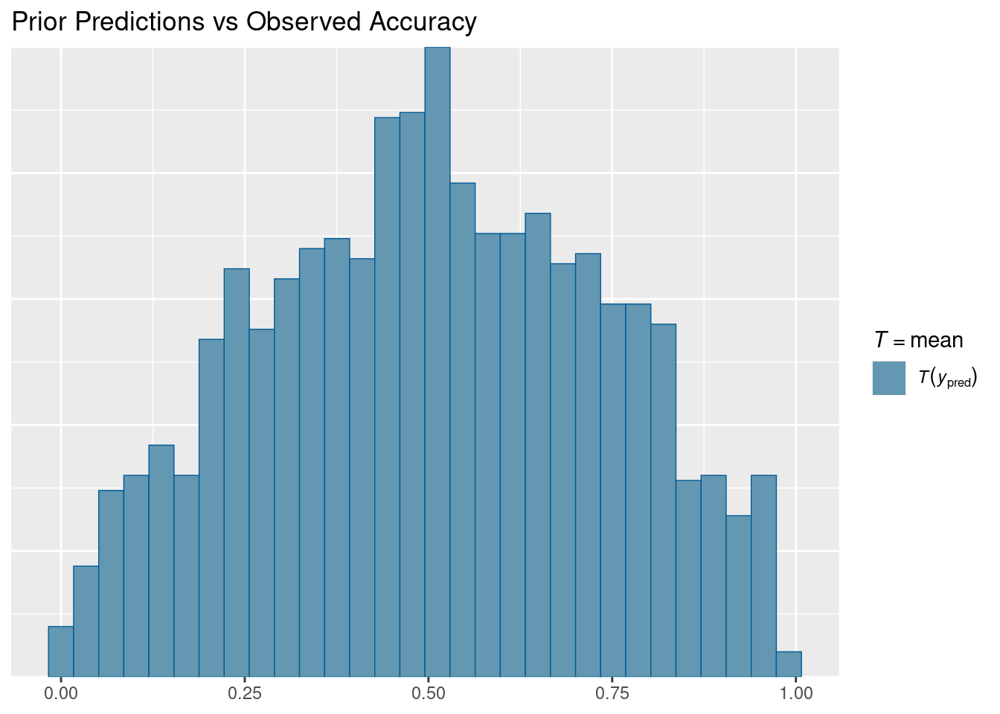
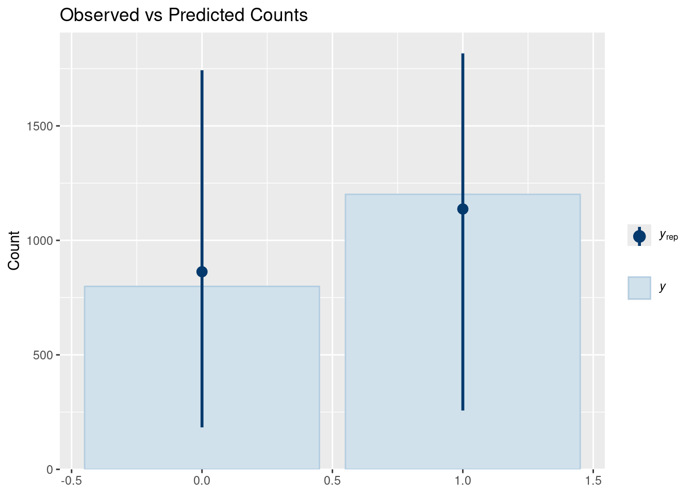
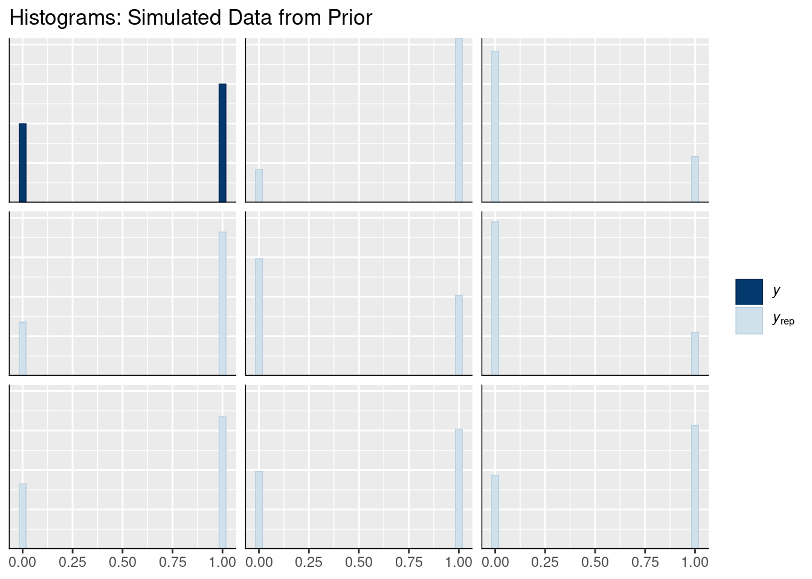
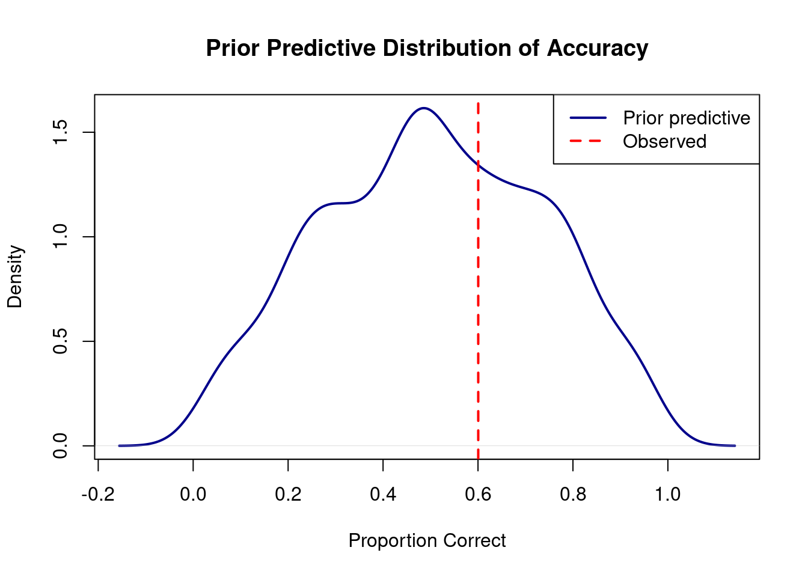
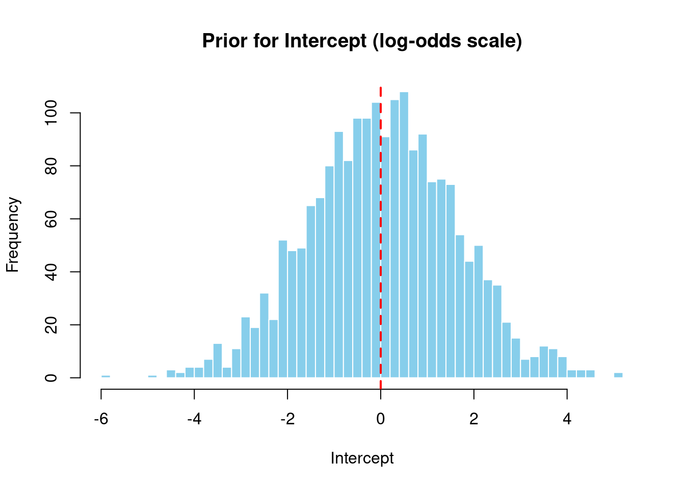
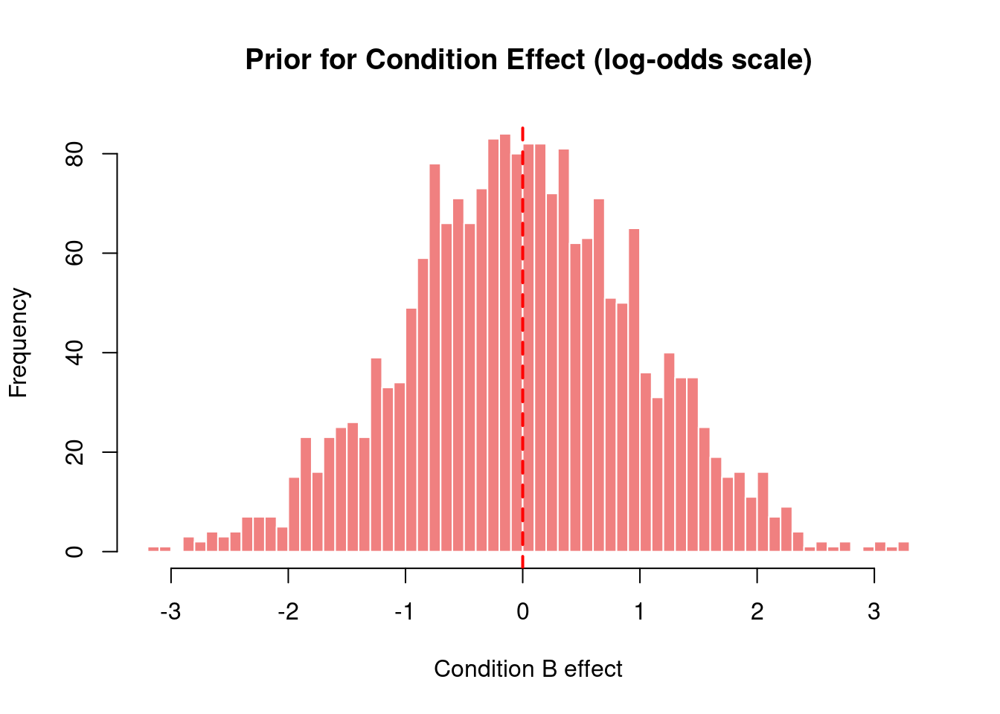
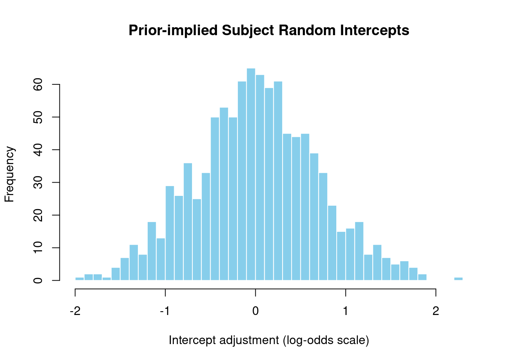
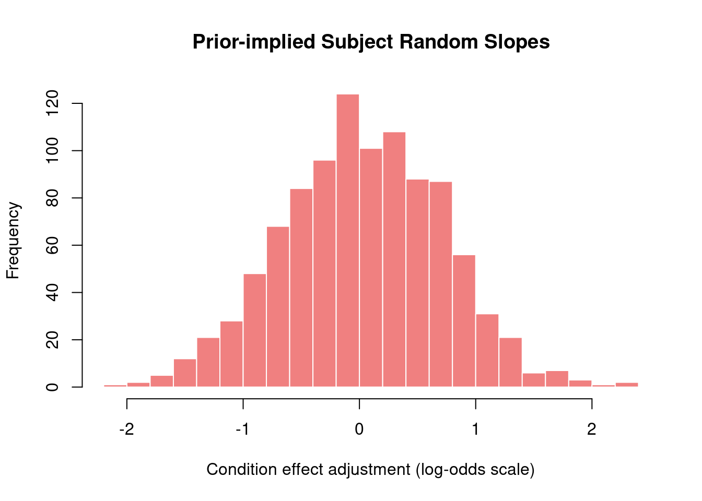
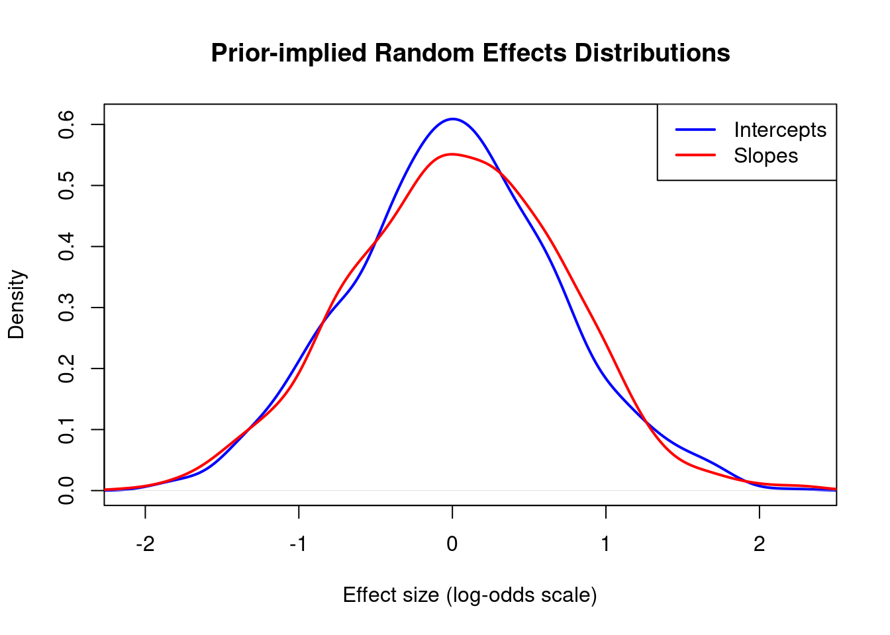

# Prior Predictive Checks for Binary Data

This document demonstrates how to validate priors for a Bayesian binary model (grammaticality judgments) before fitting to data.

## Setup


::: {.cell}

```{.r .cell-code}
library(brms)
library(tidyverse)
library(bayesplot)
library(posterior)  # For as_draws_df() - following Kurz's approach

# Create example grammaticality judgment data
set.seed(42)
n_subj <- 25
n_trials <- 40
n_items <- 30

gram_data <- expand.grid(
  trial = 1:n_trials,
  subject = 1:n_subj,
  item = 1:n_items
) %>%
  filter(row_number() <= n_subj * n_trials * 2) %>%
  mutate(
    condition = rep(c("A", "B"), length.out = n()),
    p_correct = plogis(0.2 + (condition == "B") * 0.4),
    correct = rbinom(n(), size = 1, prob = p_correct)
  )

# Define priors for binary model
gram_priors <- c(
  prior(normal(0, 1.5), class = Intercept),
  prior(normal(0, 1), class = b),
  prior(exponential(1), class = sd),
  prior(lkj(2), class = cor)
)
```
:::


## Fitting Prior Only Model


::: {.cell}

```{.r .cell-code}
# Create fits directory if it doesn't exist
if (!dir.exists("fits")) dir.create("fits")

# Fit model with priors only
# Using file argument to cache the fitted model and speed up re-runs
prior_pred_gram <- brm(
  correct ~ condition + (1 + condition | subject) + (1 | item),
  data = gram_data, 
  family = bernoulli(),
  prior = gram_priors,
  sample_prior = "only",
  chains = 4, iter = 1000,  # 4 chains, fewer iterations for prior checks
  cores = 4,                 # Use 4 cores for parallel sampling
  verbose = FALSE,
  refresh = 0,
  file = "fits/prior_pred_gram",  # Cache model - only refits if data/formula/priors change
  file_refit = "on_change"         # Only refit when necessary
)
```
:::


## Prior Predictive Checks

### Visual Checks


::: {.cell}

```{.r .cell-code}
# Mean comparison (proportion correct)
pp_check(prior_pred_gram, type = "stat", stat = "mean", prefix = "ppd") +
  labs(title = "Prior Predictions vs Observed Accuracy")
```

::: {.cell-output-display}
{width=672}
:::

```{.r .cell-code}
# Bar plot
pp_check(prior_pred_gram, type = "bars", ndraws = 100) +
  labs(title = "Observed vs Predicted Counts")
```

::: {.cell-output-display}
{width=672}
:::

```{.r .cell-code}
# Histogram of simulated datasets
pp_check(prior_pred_gram, type = "hist", ndraws = 8) +
  labs(title = "Histograms: Simulated Data from Prior")
```

::: {.cell-output-display}
{width=672}
:::
:::


### Prior Predictive Accuracy Distribution


::: {.cell}

```{.r .cell-code}
prior_pred_samples <- posterior_predict(prior_pred_gram, ndraws = 1000)
obs_acc <- mean(gram_data$correct)
pred_acc <- apply(prior_pred_samples, 1, mean)

plot(density(pred_acc), 
     main = "Prior Predictive Distribution of Accuracy",
     xlab = "Proportion Correct",
     lwd = 2, col = "darkblue")
abline(v = obs_acc, col = "red", lwd = 2, lty = 2)
legend("topright", c("Prior predictive", "Observed"), 
       col = c("darkblue", "red"), lwd = 2, lty = c(1, 2))
```

::: {.cell-output-display}
{width=672}
:::
:::


## Prior Distributions

Following Kurz's approach, we extract prior samples using `as_draws_df()` from the posterior package.


::: {.cell}

```{.r .cell-code}
# Extract prior draws as a data frame (Kurz's method)
# This works seamlessly with tidyverse and gives us a proper data frame
prior_samples <- as_draws_df(prior_pred_gram)
```
:::


### Intercept Prior


::: {.cell}

```{.r .cell-code}
# Now we can access columns directly from the data frame
intercept_vals <- prior_samples$b_Intercept

cat("Intercept prior (log-odds scale):\n")
```

::: {.cell-output .cell-output-stdout}

```
Intercept prior (log-odds scale):
```


:::

```{.r .cell-code}
intercept_logodds <- quantile(intercept_vals, c(0.025, 0.5, 0.975), na.rm = TRUE)
print(intercept_logodds)
```

::: {.cell-output .cell-output-stdout}

```
       2.5%         50%       97.5% 
-2.98728595  0.04194952  3.19327008 
```


:::

```{.r .cell-code}
cat("\nIntercept prior (probability scale):\n")
```

::: {.cell-output .cell-output-stdout}

```

Intercept prior (probability scale):
```


:::

```{.r .cell-code}
intercept_prob <- plogis(intercept_logodds)
print(intercept_prob)
```

::: {.cell-output .cell-output-stdout}

```
      2.5%        50%      97.5% 
0.04800357 0.51048584 0.96058023 
```


:::

```{.r .cell-code}
cat("Prior expects", round(intercept_prob[1]*100), "-", 
    round(intercept_prob[3]*100), "% baseline accuracy (median", 
    round(intercept_prob[2]*100), "%)\n")
```

::: {.cell-output .cell-output-stdout}

```
Prior expects 5 - 96 % baseline accuracy (median 51 %)
```


:::

```{.r .cell-code}
# Visualization
hist(intercept_vals, 
     main = "Prior for Intercept (log-odds scale)",
     xlab = "Intercept",
     breaks = 50, col = "skyblue", border = "white")
abline(v = 0, col = "red", lwd = 2, lty = 2)
```

::: {.cell-output-display}
{width=672}
:::
:::


### Effect Size Prior


::: {.cell}

```{.r .cell-code}
effect_vals <- prior_samples$b_conditionB

cat("Condition effect prior (log-odds scale):\n")
```

::: {.cell-output .cell-output-stdout}

```
Condition effect prior (log-odds scale):
```


:::

```{.r .cell-code}
effect_logodds <- quantile(effect_vals, c(0.025, 0.5, 0.975), na.rm = TRUE)
print(effect_logodds)
```

::: {.cell-output .cell-output-stdout}

```
       2.5%         50%       97.5% 
-1.93961957 -0.01510226  1.96317214 
```


:::

```{.r .cell-code}
cat("\nCondition effect (odds multiplier):\n")
```

::: {.cell-output .cell-output-stdout}

```

Condition effect (odds multiplier):
```


:::

```{.r .cell-code}
print(exp(effect_logodds))
```

::: {.cell-output .cell-output-stdout}

```
     2.5%       50%     97.5% 
0.1437586 0.9850112 7.1218829 
```


:::

```{.r .cell-code}
# Visualization
hist(effect_vals, 
     main = "Prior for Condition Effect (log-odds scale)",
     xlab = "Condition B effect",
     breaks = 50, col = "lightcoral", border = "white")
abline(v = 0, col = "red", lwd = 2, lty = 2)
```

::: {.cell-output-display}
{width=672}
:::
:::


## Random Effects Distributions

For prior predictive checks, we examine the **implied distribution** of subject-specific parameters by extracting the hyperprior SDs and simulating random effects.

### Subject Random Intercepts


::: {.cell}

```{.r .cell-code}
# Extract hyperprior SDs from prior samples
sd_subject_intercept <- prior_samples$sd_subject__Intercept

cat("Subject random intercept SD prior:\n")
```

::: {.cell-output .cell-output-stdout}

```
Subject random intercept SD prior:
```


:::

```{.r .cell-code}
print(quantile(sd_subject_intercept, c(0.025, 0.5, 0.975)))
```

::: {.cell-output .cell-output-stdout}

```
      2.5%        50%      97.5% 
0.02900055 0.68343780 3.86970012 
```


:::

```{.r .cell-code}
# Simulate random effects from this prior
set.seed(123)
n_sims <- 1000
simulated_intercepts <- rnorm(n_sims, mean = 0, sd = median(sd_subject_intercept))

cat("\nImplied subject random intercepts (log-odds scale):\n")
```

::: {.cell-output .cell-output-stdout}

```

Implied subject random intercepts (log-odds scale):
```


:::

```{.r .cell-code}
subject_int <- quantile(simulated_intercepts, c(0.025, 0.5, 0.975))
print(subject_int)
```

::: {.cell-output .cell-output-stdout}

```
        2.5%          50%        97.5% 
-1.326931618  0.006294215  1.392768861 
```


:::

```{.r .cell-code}
cat("\nImplied subject-specific accuracy (probability scale):\n")
```

::: {.cell-output .cell-output-stdout}

```

Implied subject-specific accuracy (probability scale):
```


:::

```{.r .cell-code}
# Combine with typical intercept value from prior
intercept_median <- median(intercept_vals)
subject_prob <- plogis(intercept_median + subject_int)
print(subject_prob)
```

::: {.cell-output .cell-output-stdout}

```
     2.5%       50%     97.5% 
0.2167034 0.5120586 0.8076354 
```


:::

```{.r .cell-code}
cat("Prior implies subject accuracy ranges from", 
    round(subject_prob[1]*100), "% to", 
    round(subject_prob[3]*100), "%\n")
```

::: {.cell-output .cell-output-stdout}

```
Prior implies subject accuracy ranges from 22 % to 81 %
```


:::

```{.r .cell-code}
# Visualization
hist(simulated_intercepts, 
     main = "Prior-implied Subject Random Intercepts",
     xlab = "Intercept adjustment (log-odds scale)",
     breaks = 30, col = "skyblue", border = "white")
```

::: {.cell-output-display}
{width=672}
:::
:::


### Subject Random Slopes


::: {.cell}

```{.r .cell-code}
# Extract hyperprior SDs for slopes
sd_subject_slope <- prior_samples$sd_subject__conditionB

cat("Subject random slope SD prior:\n")
```

::: {.cell-output .cell-output-stdout}

```
Subject random slope SD prior:
```


:::

```{.r .cell-code}
print(quantile(sd_subject_slope, c(0.025, 0.5, 0.975)))
```

::: {.cell-output .cell-output-stdout}

```
      2.5%        50%      97.5% 
0.02717447 0.68593886 3.63193775 
```


:::

```{.r .cell-code}
# Simulate random slope effects
simulated_slopes <- rnorm(n_sims, mean = 0, sd = median(sd_subject_slope))

cat("\nImplied subject random slopes (log-odds scale):\n")
```

::: {.cell-output .cell-output-stdout}

```

Implied subject random slopes (log-odds scale):
```


:::

```{.r .cell-code}
subject_slope <- quantile(simulated_slopes, c(0.025, 0.5, 0.975))
print(subject_slope)
```

::: {.cell-output .cell-output-stdout}

```
       2.5%         50%       97.5% 
-1.36609138  0.03762538  1.30733868 
```


:::

```{.r .cell-code}
cat("\nImplied subject-specific effects (odds multipliers):\n")
```

::: {.cell-output .cell-output-stdout}

```

Implied subject-specific effects (odds multipliers):
```


:::

```{.r .cell-code}
print(exp(subject_slope))
```

::: {.cell-output .cell-output-stdout}

```
     2.5%       50%     97.5% 
0.2551021 1.0383422 3.6963235 
```


:::

```{.r .cell-code}
cat("Weak effect subjects (2.5%): ", round(exp(subject_slope[1]), 2), "× odds multiplier\n")
```

::: {.cell-output .cell-output-stdout}

```
Weak effect subjects (2.5%):  0.26 × odds multiplier
```


:::

```{.r .cell-code}
cat("Average effect subjects (50%): ", round(exp(subject_slope[2]), 2), "× odds multiplier\n")
```

::: {.cell-output .cell-output-stdout}

```
Average effect subjects (50%):  1.04 × odds multiplier
```


:::

```{.r .cell-code}
cat("Strong effect subjects (97.5%): ", round(exp(subject_slope[3]), 2), "× odds multiplier\n")
```

::: {.cell-output .cell-output-stdout}

```
Strong effect subjects (97.5%):  3.7 × odds multiplier
```


:::

```{.r .cell-code}
# Visualization
hist(simulated_slopes,
     main = "Prior-implied Subject Random Slopes",
     xlab = "Condition effect adjustment (log-odds scale)",
     breaks = 30, col = "lightcoral", border = "white")
```

::: {.cell-output-display}
{width=672}
:::
:::


### Random Effects Comparison


::: {.cell}

```{.r .cell-code}
# Density plot comparing intercepts and slopes
plot(density(simulated_intercepts),
     main = "Prior-implied Random Effects Distributions",
     xlab = "Effect size (log-odds scale)",
     col = "blue", lwd = 2, xlim = range(c(simulated_intercepts, simulated_slopes)),
     ylim = c(0, max(density(simulated_intercepts)$y, density(simulated_slopes)$y)))
lines(density(simulated_slopes),
      col = "red", lwd = 2)
legend("topright", c("Intercepts", "Slopes"), col = c("blue", "red"), lwd = 2)
```

::: {.cell-output-display}
{width=672}
:::
:::


## Interpretation

### Good Signs (Prior is Reasonable)
- ✓ Prior generates ~50% baseline accuracy (Intercept ≈ 0)
- ✓ Condition effect varies but is typically moderate
- ✓ Between-subject accuracy ranges 30-70% or similar
- ✓ No impossible values (all between 0 and 1)

### Problems to Watch For
- ✗ Mean accuracy >> 90%: intercept prior too high
- ✗ All subjects 50% ± 1%: intercept SD too small
- ✗ Very weak prior predictions: slopes prior too small

## Summary

Before fitting your model to actual data, always validate that your priors:
1. Generate reasonable predictions for your domain
2. Allow sufficient flexibility for the data to inform the posterior
3. Respect constraints (e.g., 0-1 for probabilities)
4. Account for variation across subjects/items

Adjust priors as needed and rerun these checks.
