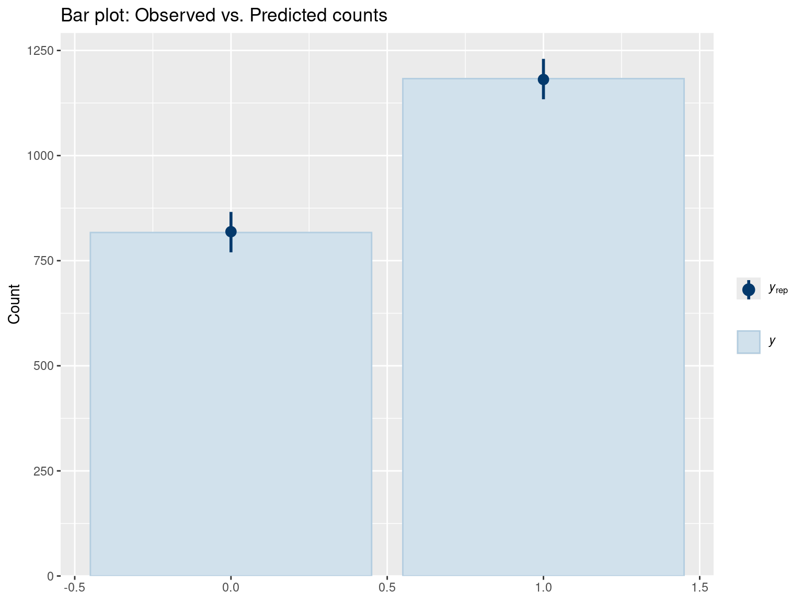
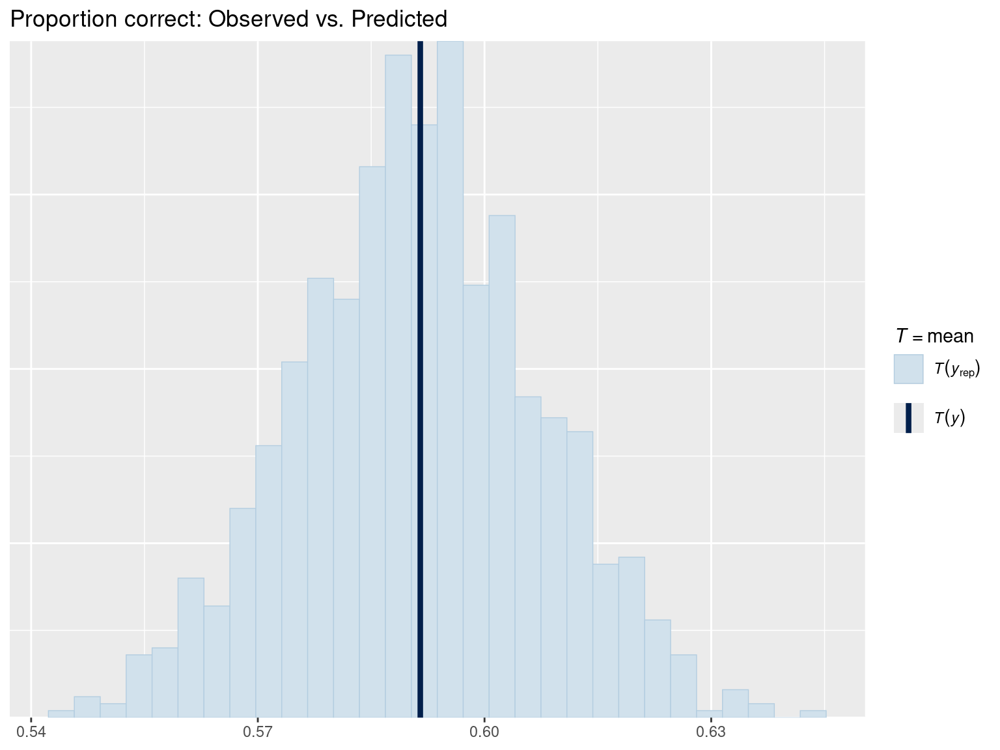
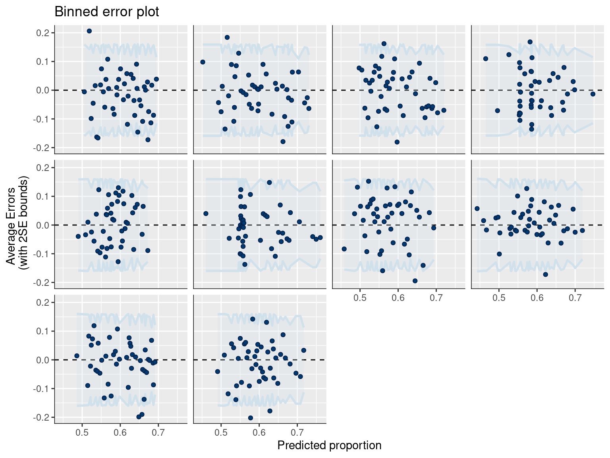
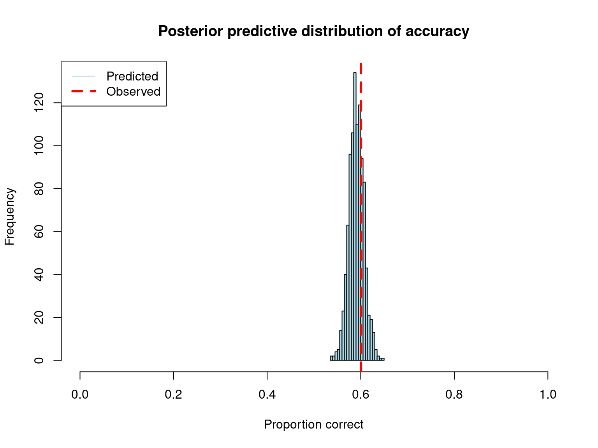
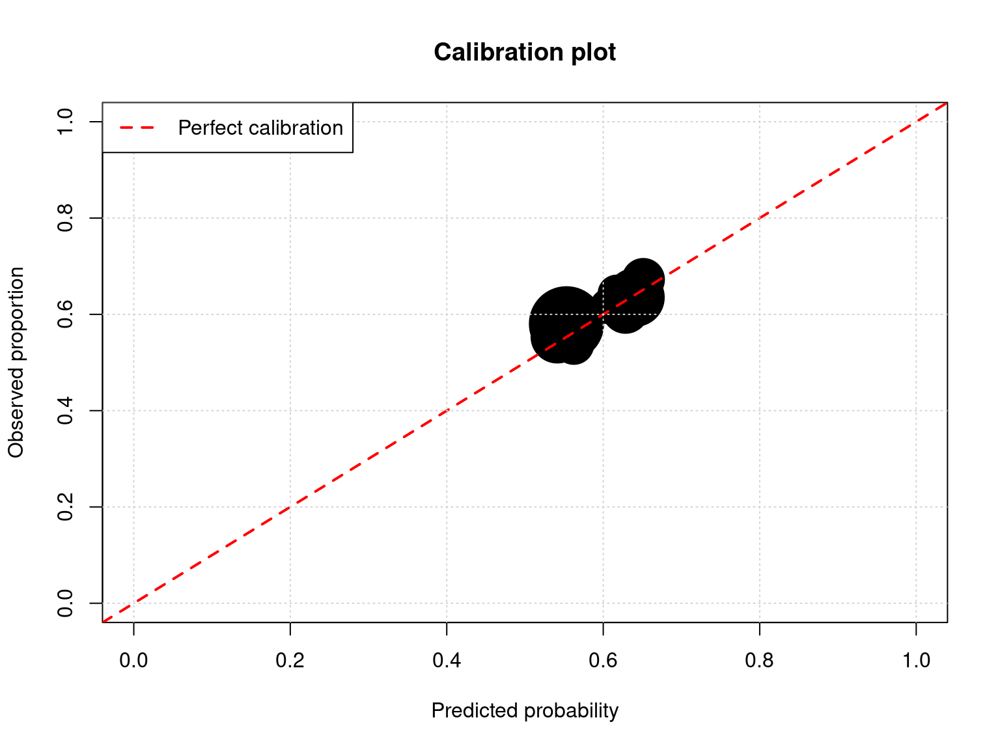
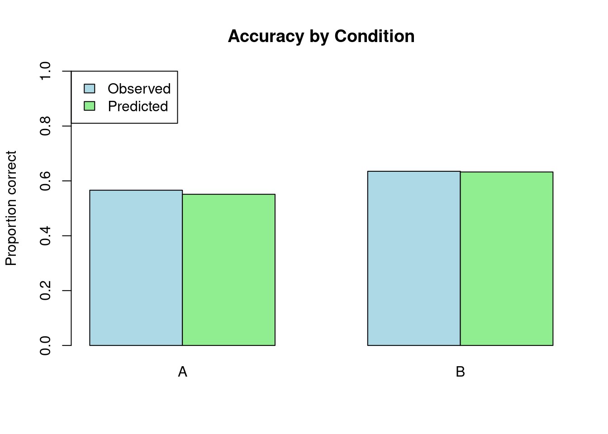
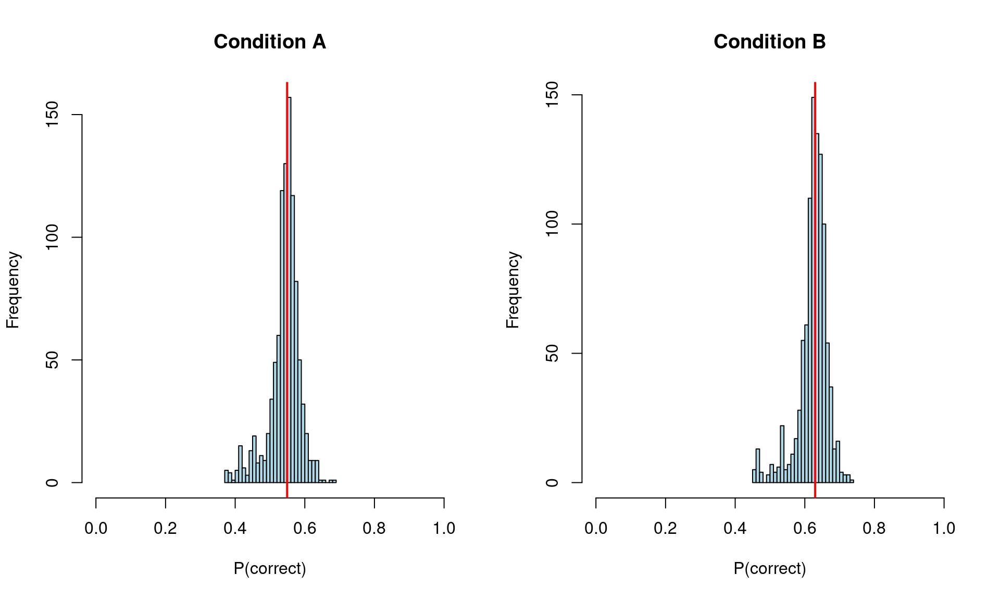

# Posterior Predictive Checks for Binary Data

After fitting your model, validate that it generates data similar to what you observed.

## Why Posterior Predictive Checks Matter

Posterior predictive checks answer: "If I were to generate new data from my fitted model, would it look like my actual data?" This validates that your model has captured the essential structure of your data.

For binary outcomes (correct/incorrect, yes/no), we focus on: - **Proportion of successes** (mean of 0/1 outcomes) - **Accuracy by condition** - **Calibration** (predicted probabilities match observed frequencies)

## Setup


::: {.cell}

```{.r .cell-code}
library(brms)
library(tidyverse)
library(bayesplot)

# Set seed for reproducibility
set.seed(42)
```
:::


## Load or Fit Model


::: {.cell}

```{.r .cell-code}
# Create example grammaticality judgment data (same as prior checks)
n_subj <- 25
n_trials <- 40
n_items <- 30

gram_data <- expand.grid(
  trial = 1:n_trials,
  subject = 1:n_subj,
  item = 1:n_items
) %>%
  filter(row_number() <= n_subj * n_trials * 2) %>%
  mutate(
    condition = rep(c('A', 'B'), length.out = n()),
    p_correct = plogis(0.2 + (condition == 'B') * 0.4),
    correct = rbinom(n(), size = 1, prob = p_correct)
  )

# Define priors
gram_priors <- c(
  prior(normal(0, 1.5), class = Intercept),
  prior(normal(0, 1), class = b),
  prior(exponential(1), class = sd),
  prior(lkj(2), class = cor)
)

# Check if model exists, otherwise fit it
model_file <- "fits/fit_gram.rds"
if (file.exists(model_file)) {
  cat("Loading saved model from:", model_file, "\n")
  fit_gram <- readRDS(model_file)
} else {
  cat("Fitting model (this may take a while)...\n")
  cat("Note: Model fitting requires significant computational resources.\n")
  cat("Consider fitting the model separately and saving to fits/fit_gram.rds\n\n")
  
  # Fit with reduced complexity for demonstration
  fit_gram <- brm(
    correct ~ condition + (1 + condition | subject) + (1 | item),
    data = gram_data,
    family = bernoulli(),
    prior = gram_priors,
    chains = 2,  # Reduced for faster fitting
    iter = 1000,
    cores = 2,
    backend = "rstan",
    refresh = 0
  )
  # Save for future use
  dir.create("fits", showWarnings = FALSE, recursive = TRUE)
  saveRDS(fit_gram, model_file)
  cat("Model saved to:", model_file, "\n")
}
```

::: {.cell-output .cell-output-stdout}

```
Loading saved model from: fits/fit_gram.rds 
```


:::

```{.r .cell-code}
# Display model summary
cat("\n=== Model Summary ===\n")
```

::: {.cell-output .cell-output-stdout}

```

=== Model Summary ===
```


:::

```{.r .cell-code}
print(summary(fit_gram))
```

::: {.cell-output .cell-output-stdout}

```
 Family: bernoulli 
  Links: mu = logit 
Formula: correct ~ condition + (1 + condition | subject) + (1 | item) 
   Data: gram_data (Number of observations: 2000) 
  Draws: 2 chains, each with iter = 1000; warmup = 500; thin = 1;
         total post-warmup draws = 1000

Multilevel Hyperparameters:
~item (Number of levels: 2) 
              Estimate Est.Error l-95% CI u-95% CI Rhat Bulk_ESS Tail_ESS
sd(Intercept)     0.21      0.24     0.01     0.91 1.03      102      119

~subject (Number of levels: 25) 
                          Estimate Est.Error l-95% CI u-95% CI Rhat Bulk_ESS
sd(Intercept)                 0.10      0.07     0.00     0.26 1.00      213
sd(conditionB)                0.13      0.09     0.01     0.34 1.00      254
cor(Intercept,conditionB)    -0.06      0.44    -0.81     0.76 1.01      427
                          Tail_ESS
sd(Intercept)                  268
sd(conditionB)                 560
cor(Intercept,conditionB)      635

Regression Coefficients:
           Estimate Est.Error l-95% CI u-95% CI Rhat Bulk_ESS Tail_ESS
Intercept      0.17      0.18    -0.34     0.46 1.02      125       64
conditionB     0.34      0.09     0.17     0.51 1.01      970      657

Draws were sampled using sampling(NUTS). For each parameter, Bulk_ESS
and Tail_ESS are effective sample size measures, and Rhat is the potential
scale reduction factor on split chains (at convergence, Rhat = 1).
```


:::
:::


## Posterior Predictive Checks for Binary Data

### Bar Plot Comparison


::: {.cell}

```{.r .cell-code}
# Bar plot for binary outcomes
pp_check(fit_gram, type = "bars", ndraws = 500) +
  ggtitle("Bar plot: Observed vs. Predicted counts")
```

::: {.cell-output-display}
{width=768}
:::
:::


**Interpretation:**

-   Bars show frequency of 0s (incorrect) and 1s (correct)
-   Light blue bars = observed data
-   Dark lines = posterior predictions
-   Should see good overlap between observed and predicted frequencies

### Check Proportion Correct


::: {.cell}

```{.r .cell-code}
# Check observed proportion vs. predicted
pp_check(fit_gram, type = "stat", stat = "mean") +
  ggtitle("Proportion correct: Observed vs. Predicted")
```

::: {.cell-output-display}
{width=768}
:::
:::


The mean of binary data = proportion of 1's (proportion correct). This check verifies that the model's predicted accuracy matches the observed accuracy.

### Error Plot for Discrete Data


::: {.cell}

```{.r .cell-code}
# Error plot for discrete data
pp_check(fit_gram, type = "error_binned") +
  ggtitle("Binned error plot")
```

::: {.cell-output-display}
{width=768}
:::
:::


**Interpretation:**

-   Shows prediction error patterns
-   Points should scatter around zero
-   Systematic patterns suggest model misspecification

## Extract and Analyze Posterior Predictions

### Predicted Binary Outcomes


::: {.cell}

```{.r .cell-code}
# Draw from posterior predictive distribution (binary outcomes: 0 or 1)
post_pred <- posterior_predict(fit_gram, ndraws = 1000)
dim(post_pred)  # 1000 draws × n observations
```

::: {.cell-output .cell-output-stdout}

```
[1] 1000 2000
```


:::

```{.r .cell-code}
cat("\nDimensions of posterior predictions:\n")
```

::: {.cell-output .cell-output-stdout}

```

Dimensions of posterior predictions:
```


:::

```{.r .cell-code}
cat("Draws:", nrow(post_pred), "\n")
```

::: {.cell-output .cell-output-stdout}

```
Draws: 1000 
```


:::

```{.r .cell-code}
cat("Observations:", ncol(post_pred), "\n")
```

::: {.cell-output .cell-output-stdout}

```
Observations: 2000 
```


:::

```{.r .cell-code}
# Calculate overall accuracy
obs_accuracy <- mean(gram_data$correct)
pred_accuracy <- apply(post_pred, 1, mean)

cat("\nOverall Accuracy:\n")
```

::: {.cell-output .cell-output-stdout}

```

Overall Accuracy:
```


:::

```{.r .cell-code}
cat("Observed:", round(obs_accuracy, 3), "\n")
```

::: {.cell-output .cell-output-stdout}

```
Observed: 0.601 
```


:::

```{.r .cell-code}
cat("Predicted (median):", round(median(pred_accuracy), 3), "\n")
```

::: {.cell-output .cell-output-stdout}

```
Predicted (median): 0.591 
```


:::

```{.r .cell-code}
cat("95% CI:", round(quantile(pred_accuracy, c(0.025, 0.975)), 3), "\n")
```

::: {.cell-output .cell-output-stdout}

```
95% CI: 0.56 0.624 
```


:::
:::


### Distribution of Predicted Accuracy


::: {.cell}

```{.r .cell-code}
hist(pred_accuracy,
     main = "Posterior predictive distribution of accuracy",
     xlab = "Proportion correct",
     col = "lightblue",
     breaks = 30,
     xlim = c(0, 1))
abline(v = obs_accuracy, col = "red", lwd = 3, lty = 2)
legend("topleft",
       legend = c("Predicted", "Observed"),
       col = c("lightblue", "red"),
       lwd = c(1, 3),
       lty = c(1, 2))
```

::: {.cell-output-display}
{width=768}
:::

```{.r .cell-code}
# Check if observed is within reasonable range
if (obs_accuracy < quantile(pred_accuracy, 0.025) || 
    obs_accuracy > quantile(pred_accuracy, 0.975)) {
  cat("\n⚠ Warning: Observed accuracy outside 95% posterior predictive interval\n")
  cat("Model may not be capturing the data well.\n")
} else {
  cat("\n✓ Observed accuracy within 95% posterior predictive interval\n")
}
```

::: {.cell-output .cell-output-stdout}

```

✓ Observed accuracy within 95% posterior predictive interval
```


:::
:::


## Expected Value (Probability) Summaries


::: {.cell}

```{.r .cell-code}
# Get predicted probabilities (on 0-1 scale)
post_epred <- posterior_epred(fit_gram)
dim(post_epred)  # n_draws × n observations
```

::: {.cell-output .cell-output-stdout}

```
[1] 1000 2000
```


:::

```{.r .cell-code}
cat("\nPosterior expected probabilities:\n")
```

::: {.cell-output .cell-output-stdout}

```

Posterior expected probabilities:
```


:::

```{.r .cell-code}
cat("Dimensions:", dim(post_epred), "\n")
```

::: {.cell-output .cell-output-stdout}

```
Dimensions: 1000 2000 
```


:::

```{.r .cell-code}
# Posterior probability of correct for first observation
cat("\nExample: First observation\n")
```

::: {.cell-output .cell-output-stdout}

```

Example: First observation
```


:::

```{.r .cell-code}
cat("Observed outcome:", gram_data$correct[1], "\n")
```

::: {.cell-output .cell-output-stdout}

```
Observed outcome: 0 
```


:::

```{.r .cell-code}
cat("Predicted P(correct):", 
    round(quantile(post_epred[, 1], c(0.025, 0.5, 0.975)), 3), "\n")
```

::: {.cell-output .cell-output-stdout}

```
Predicted P(correct): 0.501 0.554 0.614 
```


:::
:::


### Calibration Check


::: {.cell}

```{.r .cell-code}
# Check calibration: do predicted probabilities match observed frequencies?
# Bin by predicted probability and compare to observed proportion

pred_prob_median <- apply(post_epred, 2, median)

# Create bins
n_bins <- 10
bins <- cut(pred_prob_median, breaks = n_bins, include.lowest = TRUE)

calibration_data <- data.frame(
  predicted = pred_prob_median,
  observed = gram_data$correct,
  bin = bins
) %>%
  group_by(bin) %>%
  summarise(
    mean_predicted = mean(predicted),
    mean_observed = mean(observed),
    n = n()
  ) %>%
  filter(n > 0)

plot(calibration_data$mean_predicted, 
     calibration_data$mean_observed,
     pch = 19,
     cex = sqrt(calibration_data$n) / 3,
     xlab = "Predicted probability",
     ylab = "Observed proportion",
     main = "Calibration plot",
     xlim = c(0, 1),
     ylim = c(0, 1))
abline(0, 1, col = "red", lwd = 2, lty = 2)
grid()
legend("topleft", 
       legend = "Perfect calibration",
       col = "red",
       lwd = 2,
       lty = 2)
```

::: {.cell-output-display}
{width=768}
:::

```{.r .cell-code}
cat("\nCalibration:\n")
```

::: {.cell-output .cell-output-stdout}

```

Calibration:
```


:::

```{.r .cell-code}
cat("Points should fall near the diagonal line.\n")
```

::: {.cell-output .cell-output-stdout}

```
Points should fall near the diagonal line.
```


:::

```{.r .cell-code}
cat("Point size proportional to number of observations.\n")
```

::: {.cell-output .cell-output-stdout}

```
Point size proportional to number of observations.
```


:::
:::


## Check by Condition


::: {.cell}

```{.r .cell-code}
# Observed accuracy by condition
obs_by_condition <- gram_data %>%
  group_by(condition) %>%
  summarise(
    accuracy = mean(correct),
    n = n()
  )

# Predicted accuracy by condition
gram_data$pred_prob <- apply(post_epred, 2, median)
pred_by_condition <- gram_data %>%
  group_by(condition) %>%
  summarise(
    pred_accuracy = mean(pred_prob)
  )

comparison <- left_join(obs_by_condition, pred_by_condition, by = "condition")

cat("\nAccuracy by Condition:\n")
```

::: {.cell-output .cell-output-stdout}

```

Accuracy by Condition:
```


:::

```{.r .cell-code}
print(comparison, n = Inf)
```

::: {.cell-output .cell-output-stdout}

```
# A tibble: 2 × 4
  condition accuracy     n pred_accuracy
  <chr>        <dbl> <int>         <dbl>
1 A            0.566  1000         0.551
2 B            0.635  1000         0.633
```


:::

```{.r .cell-code}
# Visualize
barplot(
  height = rbind(comparison$accuracy, comparison$pred_accuracy),
  beside = TRUE,
  names.arg = comparison$condition,
  col = c("lightblue", "lightgreen"),
  main = "Accuracy by Condition",
  ylab = "Proportion correct",
  ylim = c(0, 1),
  legend.text = c("Observed", "Predicted"),
  args.legend = list(x = "topleft")
)
```

::: {.cell-output-display}
{width=672}
:::
:::


### Posterior Predictions by Condition


::: {.cell}

```{.r .cell-code}
# Get predictions for each condition with population-level effects only
new_data <- data.frame(
  condition = c("A", "B"),
  subject = NA,
  item = NA
)

epred_condition <- posterior_epred(fit_gram, 
                                   newdata = new_data, 
                                   re_formula = NA)  # population-level only

# Summarize
condition_summary <- apply(epred_condition, 2, quantile, c(0.025, 0.5, 0.975))
colnames(condition_summary) <- new_data$condition

cat("\nPopulation-level P(correct) by condition:\n")
```

::: {.cell-output .cell-output-stdout}

```

Population-level P(correct) by condition:
```


:::

```{.r .cell-code}
print(round(condition_summary, 3))
```

::: {.cell-output .cell-output-stdout}

```
          A     B
2.5%  0.417 0.501
50%   0.549 0.630
97.5% 0.614 0.690
```


:::

```{.r .cell-code}
# Plot
par(mfrow = c(1, 2))

for (i in 1:2) {
  hist(epred_condition[, i],
       main = paste("Condition", new_data$condition[i]),
       xlab = "P(correct)",
       col = "lightblue",
       breaks = 30,
       xlim = c(0, 1))
  abline(v = median(epred_condition[, i]), col = "red", lwd = 2)
}
```

::: {.cell-output-display}
{width=960}
:::
:::


## Summary

### Key Diagnostics Checked

1.  [x] **Bar plot** - Observed counts match posterior predictions
2.  [x] **Proportion correct** - Overall accuracy captured correctly
3.  [x] **Calibration** - Predicted probabilities align with observed frequencies
4.  [x] **By condition** - Model captures differences between conditions
5.  [x] **Expected values** - Posterior probabilities are reasonable

### Interpreting Binary Model Checks

-   **Observed proportion correct** should be near the central tendency of the posterior predictions
-   If observed is far from predicted → model isn't capturing the accuracy pattern
-   Common issues:
    -   Forgetting interactions
    -   Wrong random effect structure
    -   Not accounting for item-level variation

### Common Problems and Solutions

| Problem | Diagnosis | Solution |
|----------------------|--------------------------|------------------------|
| Poor calibration | Points far from diagonal | Add predictors, check formula |
| Misses condition effects | Different accuracy by condition not captured | Add condition × random effect interaction |
| Predictions too certain | Predicted probs near 0 or 1 | Check priors, may be too strong |
| Predictions too uncertain | Predicted probs all near 0.5 | Add more structure, informative priors |

### Next Steps

If posterior predictive checks reveal problems:

1.  **Adjust model formula** - Add missing predictors or interactions
2.  **Revise priors** - May be too restrictive or too vague
3.  **Check random effects structure** - Subjects and items may vary in unexpected ways
4.  **Consider response time cutoffs** - Fast guesses vs. thoughtful responses


::: {.cell}

```{.r .cell-code}
sessionInfo()
```

::: {.cell-output .cell-output-stdout}

```
R version 4.4.1 (2024-06-14)
Platform: x86_64-pc-linux-gnu
Running under: Ubuntu 22.04.5 LTS

Matrix products: default
BLAS:   /usr/lib/x86_64-linux-gnu/openblas-pthread/libblas.so.3 
LAPACK: /usr/lib/x86_64-linux-gnu/openblas-pthread/libopenblasp-r0.3.20.so;  LAPACK version 3.10.0

locale:
 [1] LC_CTYPE=en_US.UTF-8       LC_NUMERIC=C              
 [3] LC_TIME=en_US.UTF-8        LC_COLLATE=en_US.UTF-8    
 [5] LC_MONETARY=en_US.UTF-8    LC_MESSAGES=en_US.UTF-8   
 [7] LC_PAPER=en_US.UTF-8       LC_NAME=C                 
 [9] LC_ADDRESS=C               LC_TELEPHONE=C            
[11] LC_MEASUREMENT=en_US.UTF-8 LC_IDENTIFICATION=C       

time zone: Etc/UTC
tzcode source: system (glibc)

attached base packages:
[1] stats     graphics  grDevices utils     datasets  methods   base     

other attached packages:
 [1] bayesplot_1.14.0 lubridate_1.9.3  forcats_1.0.0    stringr_1.5.1   
 [5] dplyr_1.1.4      purrr_1.0.2      readr_2.1.5      tidyr_1.3.1     
 [9] tibble_3.2.1     ggplot2_4.0.0    tidyverse_2.0.0  brms_2.23.0     
[13] Rcpp_1.0.13     

loaded via a namespace (and not attached):
 [1] gtable_0.3.6          tensorA_0.36.2.1      QuickJSR_1.8.1       
 [4] xfun_0.54             htmlwidgets_1.6.4     inline_0.3.21        
 [7] lattice_0.22-6        tzdb_0.4.0            vctrs_0.6.5          
[10] tools_4.4.1           generics_0.1.3        stats4_4.4.1         
[13] parallel_4.4.1        fansi_1.0.6           pkgconfig_2.0.3      
[16] Matrix_1.7-0          checkmate_2.3.3       RColorBrewer_1.1-3   
[19] S7_0.2.0              distributional_0.5.0  RcppParallel_5.1.11-1
[22] lifecycle_1.0.4       compiler_4.4.1        farver_2.1.2         
[25] Brobdingnag_1.2-9     codetools_0.2-20      htmltools_0.5.8.1    
[28] yaml_2.3.10           pillar_1.9.0          StanHeaders_2.32.10  
[31] bridgesampling_1.1-2  abind_1.4-8           nlme_3.1-164         
[34] posterior_1.6.1.9000  rstan_2.32.7          tidyselect_1.2.1     
[37] digest_0.6.37         mvtnorm_1.3-3         stringi_1.8.4        
[40] reshape2_1.4.4        labeling_0.4.3        fastmap_1.2.0        
[43] grid_4.4.1            cli_3.6.5             magrittr_2.0.3       
[46] loo_2.8.0             pkgbuild_1.4.8        utf8_1.2.4           
[49] withr_3.0.2           scales_1.4.0          backports_1.5.0      
[52] estimability_1.5.1    timechange_0.3.0      rmarkdown_2.30       
[55] matrixStats_1.5.0     emmeans_2.0.0         gridExtra_2.3        
[58] hms_1.1.3             coda_0.19-4.1         evaluate_1.0.1       
[61] knitr_1.50            rstantools_2.5.0      rlang_1.1.6          
[64] xtable_1.8-4          glue_1.8.0            jsonlite_1.8.9       
[67] plyr_1.8.9            R6_2.5.1             
```


:::
:::