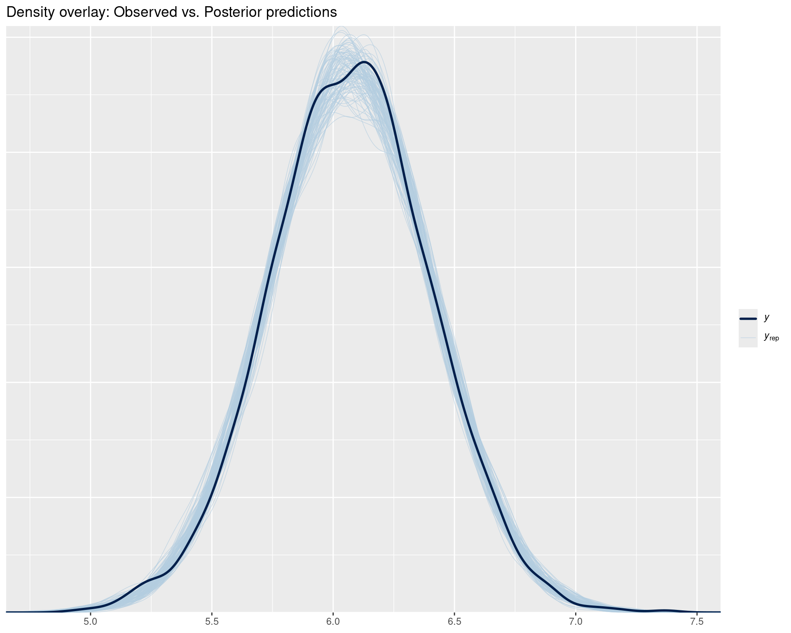
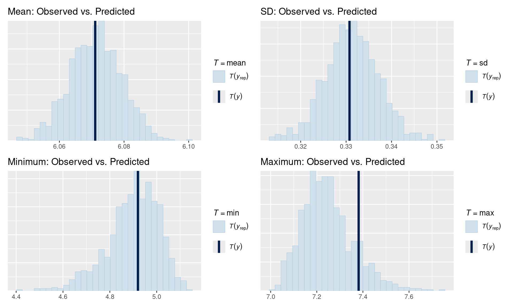
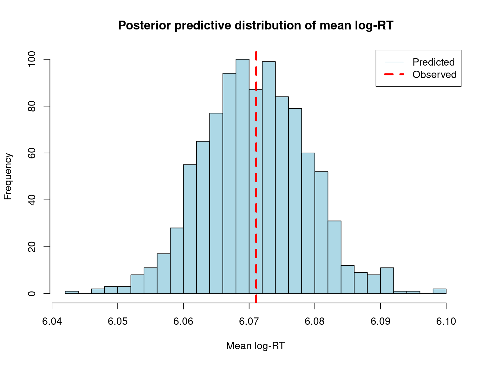
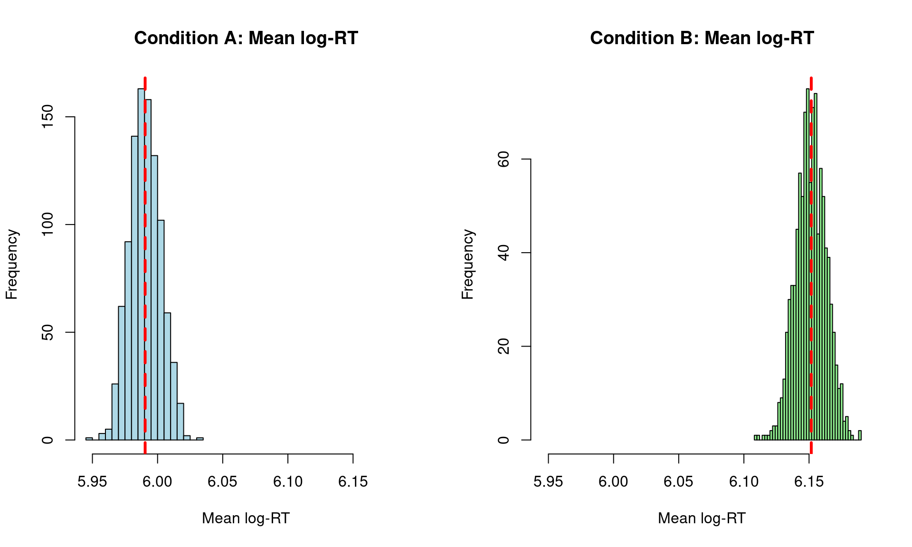
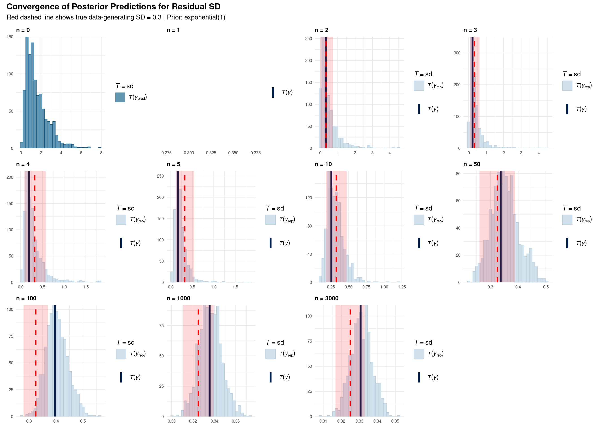
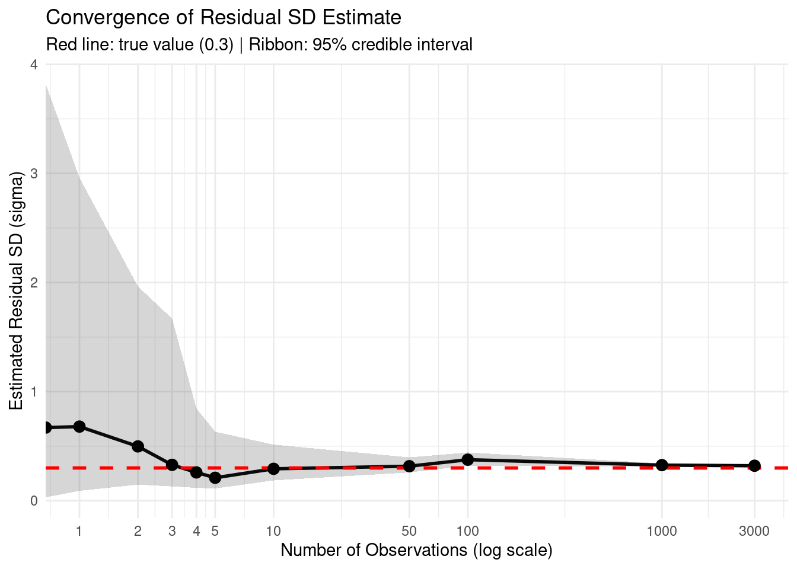
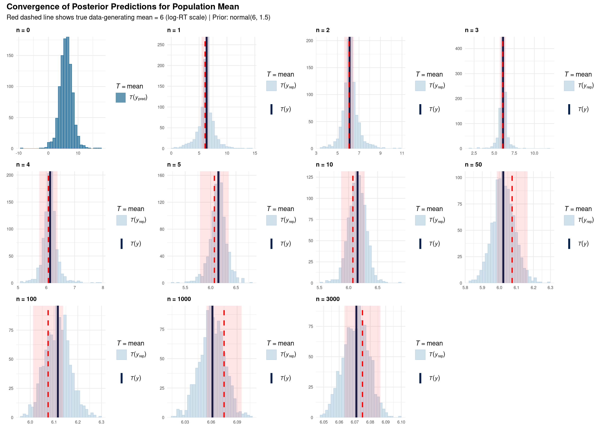
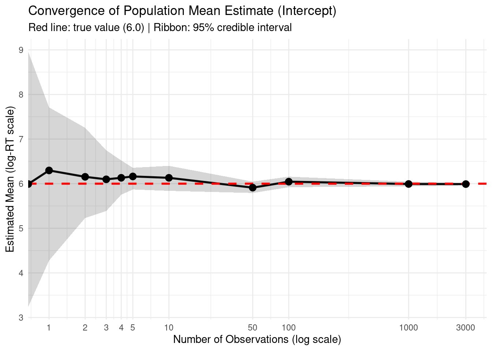

# Posterior Predictive Checks for RT Data

After fitting your model, validate that it generates data similar to what you observed.

## Why Posterior Predictive Checks Matter

Posterior predictive checks answer: "If I were to generate new data from my fitted model, would it look like my actual data?" This validates that your model has captured the essential structure of your data.

## Setup


::: {.cell}

```{.r .cell-code}
library(brms)
library(tidyverse)
library(bayesplot)

# Set seed for reproducibility
set.seed(42)
```
:::


## Load or Fit Model


::: {.cell}

```{.r .cell-code}
# Create example RT data (same as in prior checks for consistency)
n_subj <- 20
n_trials <- 50
n_items <- 30

rt_data <- expand.grid(
  trial = 1:n_trials,
  subject = 1:n_subj,
  item = 1:n_items
) %>%
  filter(row_number() <= n_subj * n_trials * 3) %>%
  mutate(
    condition = rep(c("A", "B"), length.out = n()),
    # Data generation: two independent noise sources, no random effects
    # Total residual SD = sqrt(0.3^2 + 0.1^2) = 0.316
    log_rt = rnorm(n(), mean = 6, sd = 0.3) + 
             (condition == "B") * 0.15 + 
             rnorm(n(), mean = 0, sd = 0.1),
    rt = exp(log_rt)
  )

# Define priors
rt_priors <- c(
  prior(normal(6, 1.5), class = Intercept),
  prior(normal(0, 0.5), class = b),
  prior(exponential(1), class = sigma),
  prior(exponential(1), class = sd),
  prior(lkj(2), class = cor)
)

# Check if model exists, otherwise fit it
model_file <- "fits/fit_rt.rds"
if (file.exists(model_file)) {
  cat("Loading saved model from:", model_file, "\n")
  fit_rt <- readRDS(model_file)
} else {
  cat("Fitting model (this may take a while)...\n")
  cat("Note: Model fitting requires significant computational resources.\n")
  cat("Consider fitting the model separately and saving to fits/fit_rt.rds\n\n")
  
  # Fit with reduced complexity for demonstration
  fit_rt <- brm(
    log_rt ~ condition + (1 + condition | subject) + (1 | item),
    data = rt_data,
    family = gaussian(),
    prior = rt_priors,
    chains = 2,  # Reduced for faster fitting
    iter = 1000,
    cores = 2,
    backend = "rstan",
    refresh = 0
  )
  # Save for future use
  dir.create("fits", showWarnings = FALSE, recursive = TRUE)
  saveRDS(fit_rt, model_file)
  cat("Model saved to:", model_file, "\n")
}
```

::: {.cell-output .cell-output-stdout}

```
Loading saved model from: fits/fit_rt.rds 
```


:::

```{.r .cell-code}
# Display model summary
cat("\n=== Model Summary ===\n")
```

::: {.cell-output .cell-output-stdout}

```

=== Model Summary ===
```


:::

```{.r .cell-code}
print(summary(fit_rt))
```

::: {.cell-output .cell-output-stdout}

```
 Family: gaussian 
  Links: mu = identity 
Formula: log_rt ~ condition + (1 + condition | subject) + (1 | item) 
   Data: rt_data (Number of observations: 3000) 
  Draws: 2 chains, each with iter = 1000; warmup = 500; thin = 1;
         total post-warmup draws = 1000

Multilevel Hyperparameters:
~item (Number of levels: 3) 
              Estimate Est.Error l-95% CI u-95% CI Rhat Bulk_ESS Tail_ESS
sd(Intercept)     0.02      0.02     0.00     0.07 1.01      392      323

~subject (Number of levels: 20) 
                          Estimate Est.Error l-95% CI u-95% CI Rhat Bulk_ESS
sd(Intercept)                 0.02      0.01     0.00     0.04 1.00      432
sd(conditionB)                0.02      0.01     0.00     0.06 1.00      343
cor(Intercept,conditionB)    -0.07      0.46    -0.82     0.83 1.01      513
                          Tail_ESS
sd(Intercept)                  528
sd(conditionB)                 461
cor(Intercept,conditionB)      591

Regression Coefficients:
           Estimate Est.Error l-95% CI u-95% CI Rhat Bulk_ESS Tail_ESS
Intercept      5.99      0.01     5.96     6.02 1.00      700      436
conditionB     0.16      0.01     0.13     0.19 1.00     1339      699

Further Distributional Parameters:
      Estimate Est.Error l-95% CI u-95% CI Rhat Bulk_ESS Tail_ESS
sigma     0.32      0.00     0.31     0.33 1.01     2149      698

Draws were sampled using sampling(NUTS). For each parameter, Bulk_ESS
and Tail_ESS are effective sample size measures, and Rhat is the potential
scale reduction factor on split chains (at convergence, Rhat = 1).
```


:::
:::


## Basic Posterior Predictive Checks

### Visual Checks


::: {.cell}

```{.r .cell-code}
# Default: density overlay of observed vs. simulated data
pp_check(fit_rt, ndraws = 100) +
  ggtitle("Density overlay: Observed vs. Posterior predictions")
```

::: {.cell-output-display}
{width=960}
:::
:::


**Interpretation:**

-   **Black line** (`y` = observed data) should be among the blue lines (`yrep` = posterior predictions)
-   If black line is far from the bundle → model missed something important
-   Small discrepancies are normal; large ones suggest model misspecification

### Check Specific Statistics


::: {.cell}

```{.r .cell-code}
# Did we get the mean right?
p1 <- pp_check(fit_rt, type = "stat", stat = "mean") +
  ggtitle("Mean: Observed vs. Predicted")

# Did we get the spread right?
p2 <- pp_check(fit_rt, type = "stat", stat = "sd") +
  ggtitle("SD: Observed vs. Predicted")

# Extreme values?
p3 <- pp_check(fit_rt, type = "stat", stat = "min") +
  ggtitle("Minimum: Observed vs. Predicted")

p4 <- pp_check(fit_rt, type = "stat", stat = "max") +
  ggtitle("Maximum: Observed vs. Predicted")

# Display all plots
library(patchwork)
(p1 | p2) / (p3 | p4)
```

::: {.cell-output-display}
{width=960}
:::
:::


## Extract and Analyze Posterior Predictions


::: {.cell}

```{.r .cell-code}
# Draw from posterior predictive distribution
post_pred <- posterior_predict(fit_rt, ndraws = 1000)
dim(post_pred)  # 1000 draws × n observations
```

::: {.cell-output .cell-output-stdout}

```
[1] 1000 3000
```


:::

```{.r .cell-code}
cat("\nDimensions of posterior predictions:\n")
```

::: {.cell-output .cell-output-stdout}

```

Dimensions of posterior predictions:
```


:::

```{.r .cell-code}
cat("Draws:", nrow(post_pred), "\n")
```

::: {.cell-output .cell-output-stdout}

```
Draws: 1000 
```


:::

```{.r .cell-code}
cat("Observations:", ncol(post_pred), "\n")
```

::: {.cell-output .cell-output-stdout}

```
Observations: 3000 
```


:::
:::


### Compare Observed vs. Predicted


::: {.cell}

```{.r .cell-code}
# Compare observed vs. predicted means
obs_mean <- mean(rt_data$log_rt)
pred_mean <- apply(post_pred, 1, mean)

hist(pred_mean, 
     main = "Posterior predictive distribution of mean log-RT",
     xlab = "Mean log-RT",
     col = "lightblue",
     breaks = 30)
abline(v = obs_mean, col = "red", lwd = 3, lty = 2)
legend("topright", 
       legend = c("Predicted", "Observed"),
       col = c("lightblue", "red"),
       lwd = c(1, 3),
       lty = c(1, 2))
```

::: {.cell-output-display}
{width=768}
:::

```{.r .cell-code}
cat("\nObserved mean log-RT:", round(obs_mean, 3), "\n")
```

::: {.cell-output .cell-output-stdout}

```

Observed mean log-RT: 6.071 
```


:::

```{.r .cell-code}
cat("Predicted mean log-RT (median):", round(median(pred_mean), 3), "\n")
```

::: {.cell-output .cell-output-stdout}

```
Predicted mean log-RT (median): 6.071 
```


:::

```{.r .cell-code}
cat("95% CI for predicted mean:", 
    round(quantile(pred_mean, c(0.025, 0.975)), 3), "\n")
```

::: {.cell-output .cell-output-stdout}

```
95% CI for predicted mean: 6.056 6.087 
```


:::
:::


### Check Posterior Predictive Intervals


::: {.cell}

```{.r .cell-code}
# Check 95% posterior predictive interval
post_pred_interval <- apply(post_pred, 2, quantile, c(0.025, 0.975))

# Roughly 95% of observed values should fall within their interval
coverage <- mean(rt_data$log_rt > post_pred_interval[1,] & 
                 rt_data$log_rt < post_pred_interval[2,])

cat("\nPosterior Predictive Interval Coverage:\n")
```

::: {.cell-output .cell-output-stdout}

```

Posterior Predictive Interval Coverage:
```


:::

```{.r .cell-code}
cat("Proportion of observations within 95% interval:", round(coverage, 3), "\n")
```

::: {.cell-output .cell-output-stdout}

```
Proportion of observations within 95% interval: 0.951 
```


:::

```{.r .cell-code}
cat("Expected: ~0.95\n")
```

::: {.cell-output .cell-output-stdout}

```
Expected: ~0.95
```


:::

```{.r .cell-code}
if (coverage < 0.90) {
  cat("\n⚠ Warning: Coverage is lower than expected.\n")
  cat("Model may be overconfident or missing important structure.\n")
} else if (coverage > 0.98) {
  cat("\n⚠ Warning: Coverage is higher than expected.\n")
  cat("Model may be too uncertain or overfitted.\n")
} else {
  cat("\n✓ Coverage looks good!\n")
}
```

::: {.cell-output .cell-output-stdout}

```

✓ Coverage looks good!
```


:::
:::


## Check by Condition


::: {.cell}

```{.r .cell-code}
# Group predictions by condition
rt_data_cond <- rt_data %>%
  group_by(condition) %>%
  summarise(
    obs_mean = mean(log_rt),
    obs_sd = sd(log_rt)
  )

# Get posterior predictions by condition
post_pred_A <- posterior_predict(fit_rt, 
                                 newdata = filter(rt_data, condition == "A"),
                                 ndraws = 1000)
post_pred_B <- posterior_predict(fit_rt, 
                                 newdata = filter(rt_data, condition == "B"),
                                 ndraws = 1000)

pred_mean_A <- apply(post_pred_A, 1, mean)
pred_mean_B <- apply(post_pred_B, 1, mean)

# Plot comparison
par(mfrow = c(1, 2))

hist(pred_mean_A, 
     main = "Condition A: Mean log-RT",
     xlab = "Mean log-RT",
     col = "lightblue",
     breaks = 30,
     xlim = range(c(pred_mean_A, pred_mean_B)))
abline(v = rt_data_cond$obs_mean[1], col = "red", lwd = 3, lty = 2)

hist(pred_mean_B, 
     main = "Condition B: Mean log-RT",
     xlab = "Mean log-RT",
     col = "lightgreen",
     breaks = 30,
     xlim = range(c(pred_mean_A, pred_mean_B)))
abline(v = rt_data_cond$obs_mean[2], col = "red", lwd = 3, lty = 2)
```

::: {.cell-output-display}
{width=960}
:::

```{.r .cell-code}
cat("\nBy Condition:\n")
```

::: {.cell-output .cell-output-stdout}

```

By Condition:
```


:::

```{.r .cell-code}
cat("Condition A - Observed:", round(rt_data_cond$obs_mean[1], 3), "\n")
```

::: {.cell-output .cell-output-stdout}

```
Condition A - Observed: 5.99 
```


:::

```{.r .cell-code}
cat("Condition A - Predicted:", round(median(pred_mean_A), 3), "\n")
```

::: {.cell-output .cell-output-stdout}

```
Condition A - Predicted: 5.99 
```


:::

```{.r .cell-code}
cat("Condition B - Observed:", round(rt_data_cond$obs_mean[2], 3), "\n")
```

::: {.cell-output .cell-output-stdout}

```
Condition B - Observed: 6.152 
```


:::

```{.r .cell-code}
cat("Condition B - Predicted:", round(median(pred_mean_B), 3), "\n")
```

::: {.cell-output .cell-output-stdout}

```
Condition B - Predicted: 6.151 
```


:::
:::


## How Data Quantity Affects Posterior Predictions

This section demonstrates how the posterior predictive distribution converges to the true data-generating value as we add more observations. We'll fit models with increasing amounts of data and examine how well each recovers the residual SD.


::: {.cell}

```{.r .cell-code}
# Sample sizes to test
n_obs_levels <- c(0, 1, 2, 3, 4, 5, 10, 50, 100, 1000, 3000)

# Function to fit model with subset of data
fit_with_n_obs <- function(n_obs, full_data, priors) {
  if (n_obs == 0) {
    # Prior predictive only
    sampled_data <- full_data[1:100, ]  # Need some data structure
    fit <- brm(
      log_rt ~ condition + (1 + condition | subject) + (1 | item),
      data = sampled_data,
      family = gaussian(),
      prior = priors,
      chains = 2,
      iter = 1000,
      cores = 2,
      sample_prior = "only",
      backend = "cmdstanr",
      refresh = 0,
      silent = 2
    )
  } else {
    # For very small samples, use intercept-only model
    if (n_obs <= 5) {
      # Just grab first n observations
      sampled_data <- full_data %>%
        slice_head(n = n_obs)
      
      # Intercept-only model (no predictors)
      formula <- log_rt ~ 1
      
      # Simplified priors for intercept-only
      model_priors <- c(
        prior(normal(6, 1.5), class = Intercept),
        prior(exponential(1), class = sigma)
      )
    } else if (n_obs <= 20) {
      # Stratified sampling for small samples
      sampled_data <- full_data %>%
        group_by(condition) %>%
        slice_sample(n = max(2, n_obs %/% 2)) %>%
        ungroup() %>%
        slice_head(n = n_obs)
      
      # Simple fixed effects only
      formula <- log_rt ~ condition
      
      # Priors for fixed effects model
      model_priors <- c(
        prior(normal(6, 1.5), class = Intercept),
        prior(normal(0, 0.5), class = b),
        prior(exponential(1), class = sigma)
      )
    } else if (n_obs <= 100) {
      # Random sampling with simple random effects
      sampled_data <- full_data %>%
        slice_sample(n = min(n_obs, nrow(full_data)), replace = FALSE)
      
      # Add subject random intercepts only
      formula <- log_rt ~ condition + (1 | subject)
      
      model_priors <- c(
        prior(normal(6, 1.5), class = Intercept),
        prior(normal(0, 0.5), class = b),
        prior(exponential(1), class = sigma),
        prior(exponential(1), class = sd)
      )
    } else {
      # Full model for larger samples
      sampled_data <- full_data %>%
        slice_sample(n = min(n_obs, nrow(full_data)), replace = FALSE)
      
      formula <- log_rt ~ condition + (1 + condition | subject) + (1 | item)
      model_priors <- priors
    }
    
    fit <- brm(
      formula = formula,
      data = sampled_data,
      family = gaussian(),
      prior = model_priors,
      chains = 2,
      iter = 1000,
      cores = 2,
      backend = "cmdstanr",
      refresh = 0,
      silent = 2
    )
  }
  return(fit)
}

# Fit models (this may take several minutes)
cat("Fitting models with varying sample sizes...\n")
```

::: {.cell-output .cell-output-stdout}

```
Fitting models with varying sample sizes...
```


:::

```{.r .cell-code}
cat("This will take a few minutes. Progress:\n")
```

::: {.cell-output .cell-output-stdout}

```
This will take a few minutes. Progress:
```


:::

```{.r .cell-code}
fits_list <- list()
for (i in seq_along(n_obs_levels)) {
  n <- n_obs_levels[i]
  cat(sprintf("  [%2d/11] n = %4d observations...", i, n))
  
  # Check for cached model
  cache_file <- sprintf("fits/fit_rt_n%04d.rds", n)
  
  if (file.exists(cache_file)) {
    fits_list[[i]] <- readRDS(cache_file)
    cat(" (loaded from cache)\n")
  } else {
    fits_list[[i]] <- fit_with_n_obs(n, rt_data, rt_priors)
    # Save to cache
    dir.create("fits", showWarnings = FALSE, recursive = TRUE)
    saveRDS(fits_list[[i]], cache_file)
    cat(" (fitted and cached)\n")
  }
}
```

::: {.cell-output .cell-output-stdout}

```
  [ 1/11] n =    0 observations... (loaded from cache)
  [ 2/11] n =    1 observations... (loaded from cache)
  [ 3/11] n =    2 observations... (loaded from cache)
  [ 4/11] n =    3 observations... (loaded from cache)
  [ 5/11] n =    4 observations... (loaded from cache)
  [ 6/11] n =    5 observations... (loaded from cache)
  [ 7/11] n =   10 observations... (loaded from cache)
  [ 8/11] n =   50 observations... (loaded from cache)
  [ 9/11] n =  100 observations... (loaded from cache)
  [10/11] n = 1000 observations... (loaded from cache)
  [11/11] n = 3000 observations... (loaded from cache)
```


:::

```{.r .cell-code}
cat("\nGenerating posterior predictive checks...\n")
```

::: {.cell-output .cell-output-stdout}

```

Generating posterior predictive checks...
```


:::

```{.r .cell-code}
# Create comparison plots
library(patchwork)

plots_list <- lapply(seq_along(n_obs_levels), function(i) {
  n <- n_obs_levels[i]
  fit <- fits_list[[i]]
  
  # Generate pp_check for SD
  # Use "ppd" for prior predictive (n=0), "ppc" for posterior predictive (n>0)
  p <- pp_check(fit, type = "stat", stat = "sd", prefix = if(n == 0) "ppd" else "ppc") +
    ggtitle(sprintf("n = %d", n)) +
    theme_minimal() +
    theme(
      plot.title = element_text(size = 10, face = "bold"),
      axis.title = element_text(size = 8),
      axis.text = element_text(size = 7)
    )
  
  # Add true value line and sampling uncertainty band
  if (n > 0) {
    # True total SD from data generation includes:
    # 1. Residual variance: sqrt(0.3^2 + 0.1^2) = 0.316
    # 2. Fixed effect variance from balanced condition: sqrt(0.5 * 0.5 * 0.15^2) = 0.075
    # Total SD = sqrt(0.3^2 + 0.1^2 + 0.5 * 0.5 * 0.15^2) ≈ 0.325
    true_sigma <- sqrt(0.3^2 + 0.1^2 + 0.5 * 0.5 * 0.15^2)
    p <- p + geom_vline(xintercept = true_sigma, color = "red", linetype = "dashed", linewidth = 1)
    
    # Add 95% CI for where T(y) would fall when sampling from true model
    # For sample SD: Use chi-squared distribution
    # Sample variance s^2 ~ sigma^2 * chi-squared(n-1) / (n-1)
    # Therefore sample SD follows scaled chi distribution
    df <- n - 1
    # 95% CI for sample SD using chi-squared quantiles
    lower_band <- true_sigma * sqrt(qchisq(0.025, df) / df)
    upper_band <- true_sigma * sqrt(qchisq(0.975, df) / df)
    
    # Add shaded region showing where single observed SD typically falls
    p <- p + annotate("rect", 
                      xmin = lower_band, 
                      xmax = upper_band,
                      ymin = -Inf, ymax = Inf,
                      alpha = 0.15, fill = "red")
  }
  
  return(p)
})

# Arrange in grid
wrap_plots(plots_list, ncol = 4) +
  plot_annotation(
    title = "Convergence of Posterior Predictions for Residual SD",
    subtitle = "Red dashed line shows true data-generating SD = 0.3 | Prior: exponential(1)",
    theme = theme(
      plot.title = element_text(size = 14, face = "bold"),
      plot.subtitle = element_text(size = 11)
    )
  )
```

::: {.cell-output-display}
{width=1344}
:::
:::


### Understanding the Plots

Each subplot shows a posterior predictive check for the standard deviation statistic:

**Visual Elements:**

-   **Light blue histogram (T(y_pred))**: Distribution of SD values from *predicted* datasets
    -   Each bar represents how often the model predicts a certain SD value
    -   Generated by: (1) drawing parameter values from the posterior, (2) simulating new datasets, (3) calculating SD of each simulated dataset
    -   Wide spread = model is uncertain about what SD to expect
-   **Dark blue vertical line (T(y))**: SD of the *actual observed* data
    -   This is the single SD value calculated from your real data
    -   Should ideally fall within the light blue distribution
    -   If it's far outside → model is misspecified
-   **Red dashed line (≈0.325)**: True total SD of the data-generating process
    -   Includes both residual variance (√(0.3² + 0.1²) ≈ 0.316) and fixed effect variance from balanced conditions
    -   Shows the "ground truth" SD of the raw data
    -   In real analysis, you wouldn't know this value
    -   Here, it helps us verify the model is learning the right thing
-   **Light red shaded band**: Where T(y) typically falls when sampling from the true model
    -   Shows 95% interval for a single observed SD from n draws with total SD ≈ 0.325
    -   Derived from chi-squared distribution of sample variance
    -   Dark blue line (T(y)) falling in this band = consistent with true model
    -   Band gets narrower with larger n → less sampling variation
    -   **Different from light blue histogram**: Red band = where one T(y) falls; Blue histogram = distribution of T(y_pred) from posterior

**What convergence looks like:**

-   **Wide histogram**: Model is uncertain (small sample size or strong prior)
-   **Narrow histogram**: Model is confident (large sample size)
-   **Histogram centered on red line**: Model correctly estimates true value
-   **Dark blue line inside histogram**: Model predictions match observed data

### Interpretation

**Key observations from the progression:**

1.  **n = 0 (Prior only)**: Wide uncertainty, no learning from data yet. Prior allows SD anywhere from 0 to \~3.

2.  **n = 1-5 (Very few observations)**: Posterior still heavily influenced by prior. High uncertainty remains. T(y) can be far from truth.

3.  **n = 10-50 (Small samples)**: Beginning to converge toward true value (0.3), but still substantial uncertainty. Histogram narrowing.

4.  **n = 100-1000 (Medium samples)**: Clear convergence visible. Posterior concentrates around 0.3. T(y) aligns with T(y_pred).

5.  **n = 3000 (Full data)**: Tight posterior distribution centered on true value. Prior influence minimal. Very narrow histogram.

**This demonstrates:**

-   **Prior dominance** with very little data (n \< 10)
-   **Gradual transition** where data and prior both matter (n = 10-100)
-   **Data dominance** with sufficient observations (n \> 100)
-   The importance of **sample size** for overcoming prior assumptions

**An important cautionary case: n = 100**

Notice at n = 100, T(y) falls **outside** the red sampling bands. This is a Type I error scenario (occurring \~5% of the time by chance). What are the consequences?

-   **Overestimated variance**: The model learns σ ≈ 0.39 from this unlucky sample, substantially higher than the true 0.325
-   **Inflated uncertainty**: Credible intervals for all parameters become wider than they should be
-   **Biased effect size inference**: The condition effect estimate remains unbiased (\~0.15), BUT its standardized effect size (Cohen's d = 0.15/σ) will be underestimated because we're dividing by an inflated σ
-   **Conservative inference**: Hypothesis tests become less powerful - we're more likely to fail to detect real effects
-   **Misleading predictions**: Prediction intervals will be too wide, suggesting more uncertainty about future observations than warranted

**Key insight**: Even when the model "correctly" learns from the data (blue histogram centered on T(y)), if the observed data arose from sampling variability (T(y) outside red bands), downstream inferences about effect sizes and standardized parameters will be systematically biased. As sample size increases (n = 1000, 3000), the probability of such extreme sampling variation diminishes, and estimates converge to truth.


::: {.cell}

```{.r .cell-code}
# Extract sigma estimates from each model
sigma_summary <- map_dfr(seq_along(n_obs_levels), function(i) {
  n <- n_obs_levels[i]
  fit <- fits_list[[i]]
  
  # Extract sigma posterior
  sigma_draws <- as_draws_df(fit) %>% pull(sigma)
  
  tibble(
    n_obs = n,
    median = median(sigma_draws),
    lower = quantile(sigma_draws, 0.025),
    upper = quantile(sigma_draws, 0.975),
    width = upper - lower
  )
})

# Plot convergence
ggplot(sigma_summary, aes(x = n_obs, y = median)) +
  geom_line(linewidth = 1) +
  geom_ribbon(aes(ymin = lower, ymax = upper), alpha = 0.2) +
  geom_hline(yintercept = 0.3, color = "red", linetype = "dashed", linewidth = 1) +
  geom_point(size = 3) +
  scale_x_log10(breaks = n_obs_levels) +
  labs(
    title = "Convergence of Residual SD Estimate",
    subtitle = "Red line: true value (0.3) | Ribbon: 95% credible interval",
    x = "Number of Observations (log scale)",
    y = "Estimated Residual SD (sigma)"
  ) +
  theme_minimal()
```

::: {.cell-output-display}
{width=672}
:::

```{.r .cell-code}
# Print summary table
cat("\n=== Convergence Summary ===\n\n")
```

::: {.cell-output .cell-output-stdout}

```

=== Convergence Summary ===
```


:::

```{.r .cell-code}
print(sigma_summary, n = Inf)
```

::: {.cell-output .cell-output-stdout}

```
# A tibble: 11 × 5
   n_obs median  lower upper  width
   <dbl>  <dbl>  <dbl> <dbl>  <dbl>
 1     0  0.670 0.0310 3.82  3.79  
 2     1  0.679 0.0902 2.96  2.87  
 3     2  0.498 0.148  1.96  1.82  
 4     3  0.329 0.131  1.67  1.54  
 5     4  0.259 0.118  0.847 0.730 
 6     5  0.210 0.112  0.632 0.521 
 7    10  0.292 0.186  0.514 0.328 
 8    50  0.316 0.259  0.397 0.138 
 9   100  0.376 0.320  0.442 0.122 
10  1000  0.326 0.313  0.343 0.0294
11  3000  0.320 0.313  0.328 0.0152
```


:::
:::


**Practical takeaway**: With the exponential(1) prior and \~100 observations, the posterior estimate becomes quite accurate. The wide Intercept prior `normal(6, 1.5)` doesn't prevent learning the correct residual SD because they model different aspects of the data.

## Convergence Analysis: Population Mean

Now let's examine how the population mean estimate converges with increasing data:


::: {.cell}

```{.r .cell-code}
# Create comparison plots for MEAN
plots_list_mean <- lapply(seq_along(n_obs_levels), function(i) {
  n <- n_obs_levels[i]
  fit <- fits_list[[i]]
  
  # Generate pp_check for MEAN
  p <- pp_check(fit, type = "stat", stat = "mean", prefix = if(n == 0) "ppd" else "ppc") +
    ggtitle(sprintf("n = %d", n)) +
    theme_minimal() +
    theme(
      plot.title = element_text(size = 10, face = "bold"),
      axis.title = element_text(size = 8),
      axis.text = element_text(size = 7)
    )
  
  # Add true value line and sampling uncertainty band
  if (n > 0) {
    # True population mean: 6 + 0.15/2 (balanced A/B, B is 0.15 higher)
    true_mean <- 6 + 0.15 / 2
    p <- p + geom_vline(xintercept = true_mean, color = "red", linetype = "dashed", linewidth = 1)
    
    # Add sampling distribution around true value
    # For mean: SE = population_sd / sqrt(n)
    # True total SD includes residual variance + fixed effect variance
    true_sigma <- sqrt(0.3^2 + 0.1^2 + 0.5 * 0.5 * 0.15^2)
    se_of_mean <- true_sigma / sqrt(n)
    lower_band <- true_mean - 1.96 * se_of_mean
    upper_band <- true_mean + 1.96 * se_of_mean
    
    # Add shaded region showing expected sampling variation
    p <- p + annotate("rect", 
                      xmin = lower_band, 
                      xmax = upper_band,
                      ymin = -Inf, ymax = Inf,
                      alpha = 0.1, fill = "red")
  }
  
  return(p)
})

# Arrange in grid
wrap_plots(plots_list_mean, ncol = 4) +
  plot_annotation(
    title = "Convergence of Posterior Predictions for Population Mean",
    subtitle = "Red dashed line shows true data-generating mean = 6 (log-RT scale) | Prior: normal(6, 1.5)",
    theme = theme(
      plot.title = element_text(size = 14, face = "bold"),
      plot.subtitle = element_text(size = 11)
    )
  )
```

::: {.cell-output-display}
{width=1344}
:::
:::


### Understanding These Plots

Each subplot shows a posterior predictive check for the mean statistic:

**Visual Elements:**

-   **Light blue histogram (T(y_pred))**: Distribution of mean values from *predicted* datasets
    -   Shows all possible mean values the model thinks are plausible
    -   Generated by drawing from posterior → simulating datasets → calculating mean of each
    -   Width indicates uncertainty about the true mean
-   **Dark blue vertical line (T(y))**: Mean of the *actual observed* data
    -   The single mean value from your real dataset
    -   Should fall within the light blue distribution if model is well-calibrated
-   **Red dashed line (6.0)**: True data-generating mean
    -   Ground truth used to create the simulated data (log-RT = 6 ≈ 403ms)
    -   Helps verify the model recovers the correct parameter
-   **Light red shaded band**: Where T(y) typically falls when sampling from the true model
    -   Shows 95% interval for a single observed mean from n draws with μ=6, σ=0.3
    -   Based on normal distribution: sample mean \~ N(6, 0.3²/n)
    -   SE = 0.3/√n, so band narrows much faster than for SD
    -   Dark blue line (T(y)) outside this band → your particular sample was unusual
    -   **Key insight**: At n=3000, T(y) ≈ 6.0 lands in red band = data consistent with true parameters

**Comparison with SD plots:**

-   **Mean converges faster** than SD (fewer observations needed)
-   **Mean estimation** is directly informed by all observations
-   **SD estimation** requires enough data to observe variability


::: {.cell}

```{.r .cell-code}
# Extract Intercept (mean) estimates from each model
mean_summary <- map_dfr(seq_along(n_obs_levels), function(i) {
  n <- n_obs_levels[i]
  fit <- fits_list[[i]]
  
  # Extract Intercept posterior (represents population mean in intercept-only models)
  intercept_draws <- as_draws_df(fit) %>% pull(b_Intercept)
  
  tibble(
    n_obs = n,
    median = median(intercept_draws),
    lower = quantile(intercept_draws, 0.025),
    upper = quantile(intercept_draws, 0.975),
    width = upper - lower
  )
})

# Plot convergence
ggplot(mean_summary, aes(x = n_obs, y = median)) +
  geom_line(linewidth = 1) +
  geom_ribbon(aes(ymin = lower, ymax = upper), alpha = 0.2) +
  geom_hline(yintercept = 6, color = "red", linetype = "dashed", linewidth = 1) +
  geom_point(size = 3) +
  scale_x_log10(breaks = n_obs_levels) +
  labs(
    title = "Convergence of Population Mean Estimate (Intercept)",
    subtitle = "Red line: true value (6.0) | Ribbon: 95% credible interval",
    x = "Number of Observations (log scale)",
    y = "Estimated Mean (log-RT scale)"
  ) +
  theme_minimal()
```

::: {.cell-output-display}
{width=672}
:::

```{.r .cell-code}
# Print summary table
cat("\n=== Mean Convergence Summary ===\n\n")
```

::: {.cell-output .cell-output-stdout}

```

=== Mean Convergence Summary ===
```


:::

```{.r .cell-code}
print(mean_summary, n = Inf)
```

::: {.cell-output .cell-output-stdout}

```
# A tibble: 11 × 5
   n_obs median lower upper  width
   <dbl>  <dbl> <dbl> <dbl>  <dbl>
 1     0   5.99  3.24  8.96 5.72  
 2     1   6.30  4.28  7.71 3.43  
 3     2   6.15  5.23  7.25 2.02  
 4     3   6.10  5.39  6.75 1.36  
 5     4   6.13  5.75  6.52 0.769 
 6     5   6.16  5.87  6.36 0.486 
 7    10   6.13  5.84  6.40 0.561 
 8    50   5.91  5.79  6.05 0.254 
 9   100   6.04  5.92  6.16 0.236 
10  1000   5.99  5.94  6.04 0.105 
11  3000   5.99  5.96  6.02 0.0546
```


:::

```{.r .cell-code}
cat("\n=== Comparison: Mean vs. SD Convergence ===\n\n")
```

::: {.cell-output .cell-output-stdout}

```

=== Comparison: Mean vs. SD Convergence ===
```


:::

```{.r .cell-code}
cat("Credible interval width at n=10:\n")
```

::: {.cell-output .cell-output-stdout}

```
Credible interval width at n=10:
```


:::

```{.r .cell-code}
cat("  Mean:", round(mean_summary$width[mean_summary$n_obs == 10], 3), "\n")
```

::: {.cell-output .cell-output-stdout}

```
  Mean: 0.561 
```


:::

```{.r .cell-code}
cat("  SD:  ", round(sigma_summary$width[sigma_summary$n_obs == 10], 3), "\n\n")
```

::: {.cell-output .cell-output-stdout}

```
  SD:   0.328 
```


:::

```{.r .cell-code}
cat("Credible interval width at n=100:\n")
```

::: {.cell-output .cell-output-stdout}

```
Credible interval width at n=100:
```


:::

```{.r .cell-code}
cat("  Mean:", round(mean_summary$width[mean_summary$n_obs == 100], 3), "\n")
```

::: {.cell-output .cell-output-stdout}

```
  Mean: 0.236 
```


:::

```{.r .cell-code}
cat("  SD:  ", round(sigma_summary$width[sigma_summary$n_obs == 100], 3), "\n\n")
```

::: {.cell-output .cell-output-stdout}

```
  SD:   0.122 
```


:::

```{.r .cell-code}
cat("→ Mean converges faster: CI narrows more quickly with increasing data\n")
```

::: {.cell-output .cell-output-stdout}

```
→ Mean converges faster: CI narrows more quickly with increasing data
```


:::
:::


### Key Insight: Why Different Priors Don't Interfere

This analysis demonstrates the original question: **Why does `normal(6, 1.5)` for the Intercept not prevent learning `sigma = 0.3`?**

**They model different aspects:**

1.  **Intercept prior `normal(6, 1.5)`**: Uncertainty about the *population mean*
    -   "I think the average log-RT is around 6, but could be anywhere from \~3 to \~9"
    -   This is uncertainty ABOUT THE MEAN, not about residual variation
2.  **Sigma prior `exponential(1)`**: Uncertainty about *residual variation*
    -   "I think observations scatter around their predictions with some SD"
    -   This is observation-level noise, independent of the mean

**With sufficient data (n \> 100):**

-   Both parameters converge to their true values
-   The wide prior on the Intercept (SD=1.5) doesn't "leak into" the sigma estimate
-   Each parameter is identified by different aspects of the data

## Summary

### Key Diagnostics Checked

1.  [x] **Visual inspection** - Observed data overlaps with posterior predictions
2.  [x] **Mean** - Central tendency captured correctly
3.  [x] **SD** - Spread of data captured correctly
4.  [x] **Extreme values** - Min/max are reasonable
5.  [x] **Predictive intervals** - Coverage is appropriate
6.  [x] **By condition** - Model captures group differences
7.  [x] **Data quantity effect** - Convergence from prior to data-driven estimates

### Common Problems and Solutions

| Problem | Diagnosis | Solution |
|----------------------|--------------------------|------------------------|
| Model predictions too narrow | SD of posterior predictions \< SD of data | Relax priors, check formula |
| Model predictions too wide | SD of posterior predictions \>\> SD of data | Tighten priors, add more structure |
| Misses condition effects | Mean differs dramatically by condition | Add condition × random effect interaction |
| Extreme value mismatch | Min/max far from observed | Check for outliers, consider robust models |

### Next Steps

If posterior predictive checks reveal problems:

1.  **Adjust model formula** - Add missing predictors or interactions
2.  **Revise priors** - May be too restrictive or too vague
3.  **Consider alternative families** - E.g., Student's t for robust modeling
4.  **Check for outliers** - May need to handle separately


::: {.cell}

```{.r .cell-code}
sessionInfo()
```

::: {.cell-output .cell-output-stdout}

```
R version 4.4.1 (2024-06-14)
Platform: x86_64-pc-linux-gnu
Running under: Ubuntu 22.04.5 LTS

Matrix products: default
BLAS:   /usr/lib/x86_64-linux-gnu/openblas-pthread/libblas.so.3 
LAPACK: /usr/lib/x86_64-linux-gnu/openblas-pthread/libopenblasp-r0.3.20.so;  LAPACK version 3.10.0

locale:
 [1] LC_CTYPE=en_US.UTF-8       LC_NUMERIC=C              
 [3] LC_TIME=en_US.UTF-8        LC_COLLATE=en_US.UTF-8    
 [5] LC_MONETARY=en_US.UTF-8    LC_MESSAGES=en_US.UTF-8   
 [7] LC_PAPER=en_US.UTF-8       LC_NAME=C                 
 [9] LC_ADDRESS=C               LC_TELEPHONE=C            
[11] LC_MEASUREMENT=en_US.UTF-8 LC_IDENTIFICATION=C       

time zone: Etc/UTC
tzcode source: system (glibc)

attached base packages:
[1] stats     graphics  grDevices utils     datasets  methods   base     

other attached packages:
 [1] patchwork_1.3.2  bayesplot_1.14.0 lubridate_1.9.3  forcats_1.0.0   
 [5] stringr_1.5.1    dplyr_1.1.4      purrr_1.0.2      readr_2.1.5     
 [9] tidyr_1.3.1      tibble_3.2.1     ggplot2_4.0.0    tidyverse_2.0.0 
[13] brms_2.23.0      Rcpp_1.0.13     

loaded via a namespace (and not attached):
 [1] gtable_0.3.6          tensorA_0.36.2.1      QuickJSR_1.8.1       
 [4] xfun_0.54             htmlwidgets_1.6.4     processx_3.8.4       
 [7] inline_0.3.21         lattice_0.22-6        tzdb_0.4.0           
[10] ps_1.8.1              vctrs_0.6.5           tools_4.4.1          
[13] generics_0.1.3        stats4_4.4.1          parallel_4.4.1       
[16] fansi_1.0.6           cmdstanr_0.9.0        pkgconfig_2.0.3      
[19] Matrix_1.7-0          checkmate_2.3.3       RColorBrewer_1.1-3   
[22] S7_0.2.0              distributional_0.5.0  RcppParallel_5.1.11-1
[25] lifecycle_1.0.4       compiler_4.4.1        farver_2.1.2         
[28] Brobdingnag_1.2-9     codetools_0.2-20      htmltools_0.5.8.1    
[31] yaml_2.3.10           pillar_1.9.0          StanHeaders_2.32.10  
[34] bridgesampling_1.1-2  abind_1.4-8           nlme_3.1-164         
[37] posterior_1.6.1.9000  rstan_2.32.7          tidyselect_1.2.1     
[40] digest_0.6.37         mvtnorm_1.3-3         stringi_1.8.4        
[43] reshape2_1.4.4        labeling_0.4.3        fastmap_1.2.0        
[46] grid_4.4.1            cli_3.6.5             magrittr_2.0.3       
[49] loo_2.8.0             pkgbuild_1.4.8        utf8_1.2.4           
[52] withr_3.0.2           scales_1.4.0          backports_1.5.0      
[55] estimability_1.5.1    timechange_0.3.0      rmarkdown_2.30       
[58] matrixStats_1.5.0     emmeans_2.0.0         gridExtra_2.3        
[61] hms_1.1.3             coda_0.19-4.1         evaluate_1.0.1       
[64] knitr_1.50            rstantools_2.5.0      rlang_1.1.6          
[67] xtable_1.8-4          glue_1.8.0            jsonlite_1.8.9       
[70] plyr_1.8.9            R6_2.5.1             
```


:::
:::