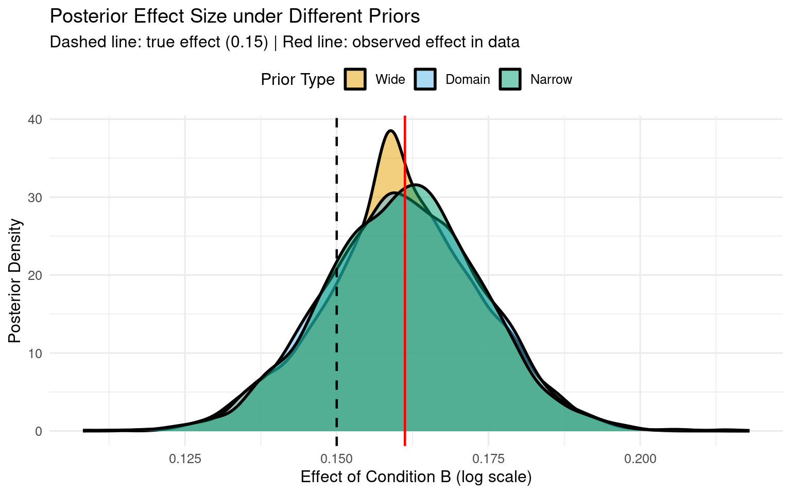
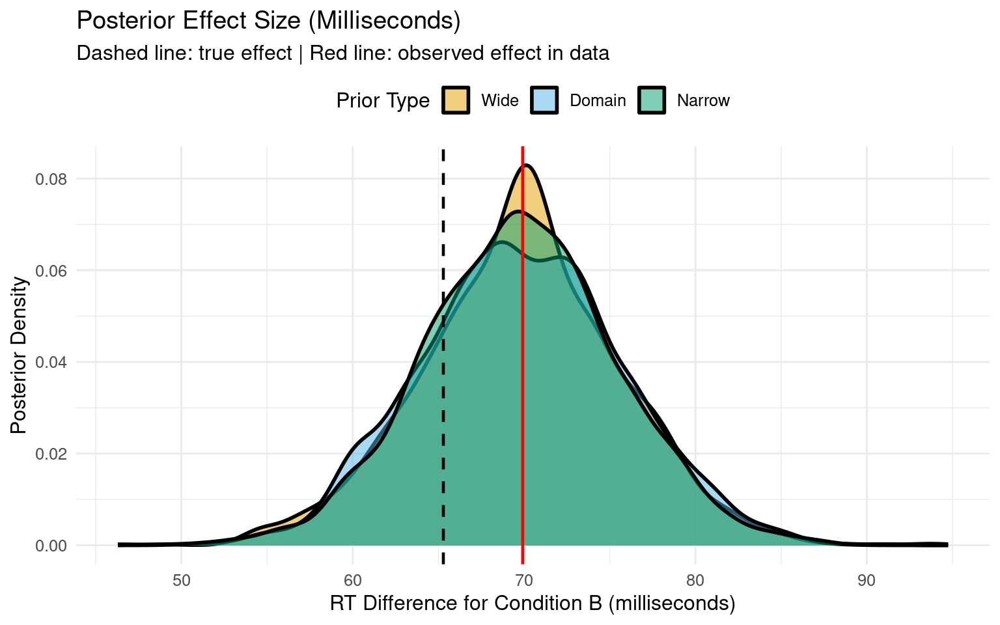
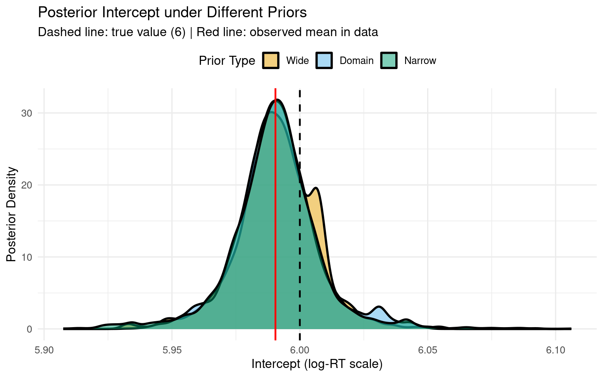
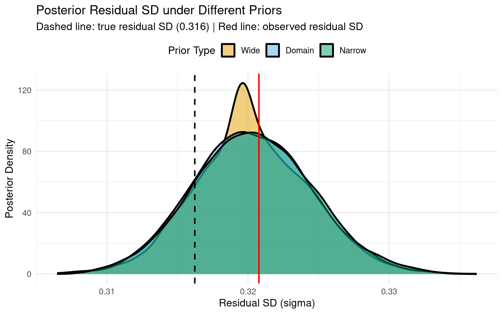
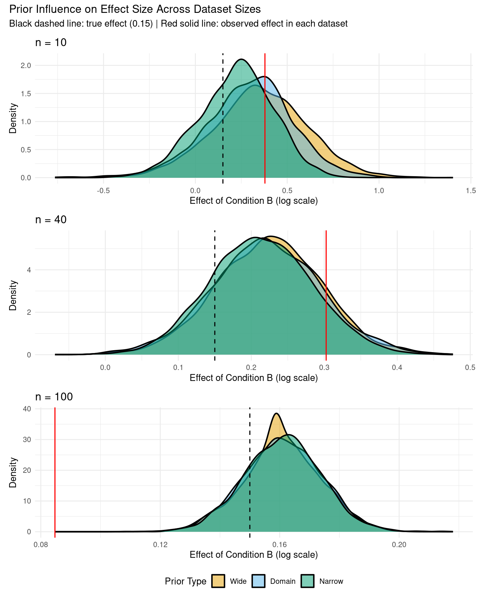
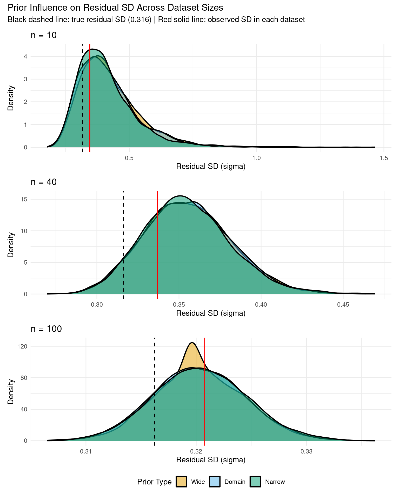
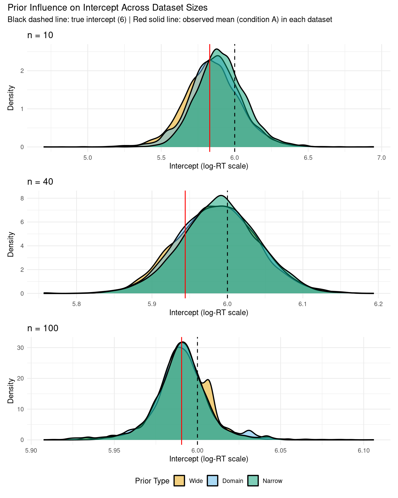

# Comparing Priors: Influence on Coefficients and Effect Sizes

How sensitive are your results to prior choice? Validate robustness by fitting models with different plausible priors.

## Why Compare Priors?

Prior sensitivity analysis shows whether your conclusions depend heavily on specific prior choices or whether they're robust across reasonable alternatives. This is especially important for:

- **Publication**: reviewers will ask "how robust is your result?"
- **Model criticism**: if results change dramatically with different priors, something's wrong
- **Theory building**: consistent results across priors = stronger evidence

## Setup


::: {.cell}

```{.r .cell-code}
# Configure backend BEFORE loading brms
if (requireNamespace("cmdstanr", quietly = TRUE)) {
  tryCatch({
    cmdstanr::cmdstan_path()
    options(brms.backend = "cmdstanr")
  }, error = function(e) {
    options(brms.backend = "rstan")
  })
}

library(brms)
library(tidyverse)
library(bayesplot)
library(posterior)
library(patchwork)

# Set seed for reproducibility
set.seed(42)
```
:::


## Create Reaction Time Data


::: {.cell}

```{.r .cell-code}
# Create example RT data
n_subj <- 20
n_trials <- 50
n_items <- 30

rt_data <- expand.grid(
  trial = 1:n_trials,
  subject = 1:n_subj,
  item = 1:n_items
) %>%
  filter(row_number() <= n_subj * n_trials * 3) %>%
  mutate(
    condition = rep(c("A", "B"), length.out = n()),
    # Data generation: two independent noise sources, no random effects
    # Total residual SD = sqrt(0.3^2 + 0.1^2) = 0.316
    log_rt = rnorm(n(), mean = 6, sd = 0.3) + 
             (condition == "B") * 0.15 + 
             rnorm(n(), mean = 0, sd = 0.1),
    rt = exp(log_rt)
  )

# Data summary
cat("Data summary:\n")
```

::: {.cell-output .cell-output-stdout}

```
Data summary:
```


:::

```{.r .cell-code}
cat("Sample size:", nrow(rt_data), "observations\n")
```

::: {.cell-output .cell-output-stdout}

```
Sample size: 3000 observations
```


:::

```{.r .cell-code}
cat("Mean log-RT:", round(mean(rt_data$log_rt), 2), "\n")
```

::: {.cell-output .cell-output-stdout}

```
Mean log-RT: 6.07 
```


:::

```{.r .cell-code}
cat("SD log-RT:", round(sd(rt_data$log_rt), 3), "\n")
```

::: {.cell-output .cell-output-stdout}

```
SD log-RT: 0.331 
```


:::
:::


## Fit Models with Different Priors

We'll fit three models with different prior specifications:

1. **Domain-informed priors** (our best guess based on RT literature)
2. **Wide priors** (less informative, more uncertainty)
3. **Narrow priors** (more informative, regularizing)

### Define Prior Specifications


::: {.cell}

```{.r .cell-code}
# 1. Original (domain-informed) priors
rt_priors_domain <- c(
  prior(normal(6, 1.5), class = Intercept, lb = 4),  # exp(4) ≈ 55ms minimum
  prior(normal(0, 0.5), class = b),
  prior(exponential(1), class = sigma),
  prior(exponential(1), class = sd),
  prior(lkj(2), class = cor)
)

# 2. Wider priors (less informative)
rt_priors_wide <- c(
  prior(normal(6, 3), class = Intercept, lb = 4),    # More uncertainty
  prior(normal(0, 1), class = b),                    # Slopes could be larger
  prior(exponential(0.5), class = sigma),            # Less constraint on noise
  prior(exponential(0.5), class = sd),               # Less constraint on RE
  prior(lkj(2), class = cor)
)

# 3. Narrower priors (more informative / regularizing)
rt_priors_narrow <- c(
  prior(normal(6, 0.8), class = Intercept, lb = 4),  # Tight around 400ms
  prior(normal(0, 0.3), class = b),                  # Small effects expected
  prior(exponential(2), class = sigma),              # Low noise expected
  prior(exponential(2), class = sd),
  prior(lkj(2), class = cor)
)

# Display priors side by side
prior_table <- data.frame(
  Parameter = c("Intercept", "Slopes (b)", "Residual SD", "Random Effect SD", "Correlation"),
  Domain = c("N(6, 1.5)", "N(0, 0.5)", "Exp(1)", "Exp(1)", "LKJ(2)"),
  Wide = c("N(6, 3)", "N(0, 1)", "Exp(0.5)", "Exp(0.5)", "LKJ(2)"),
  Narrow = c("N(6, 0.8)", "N(0, 0.3)", "Exp(2)", "Exp(2)", "LKJ(2)")
)

knitr::kable(prior_table, 
             caption = "Prior Specifications for Sensitivity Analysis",
             align = c("l", "c", "c", "c"))
```

::: {.cell-output-display}


Table: Prior Specifications for Sensitivity Analysis

|Parameter        |  Domain   |   Wide   |  Narrow   |
|:----------------|:---------:|:--------:|:---------:|
|Intercept        | N(6, 1.5) | N(6, 3)  | N(6, 0.8) |
|Slopes (b)       | N(0, 0.5) | N(0, 1)  | N(0, 0.3) |
|Residual SD      |  Exp(1)   | Exp(0.5) |  Exp(2)   |
|Random Effect SD |  Exp(1)   | Exp(0.5) |  Exp(2)   |
|Correlation      |  LKJ(2)   |  LKJ(2)  |  LKJ(2)   |


:::
:::


### Fit Models


::: {.cell}

```{.r .cell-code}
# Model formula
model_formula <- log_rt ~ condition + (1 + condition | subject) + (1 | item)

# Check for cached models
dir.create("fits", showWarnings = FALSE, recursive = TRUE)

# Fit with domain priors
if (file.exists("fits/fit_rt_domain.rds")) {
  cat("Loading domain prior model from cache...\n")
  fit_rt_domain <- readRDS("fits/fit_rt_domain.rds")
} else {
  cat("Fitting domain prior model...\n")
  fit_rt_domain <- brm(
    model_formula,
    data = rt_data, 
    family = gaussian(), 
    prior = rt_priors_domain,
    chains = 4,
    iter = 2000,
    cores = 4,
    backend = "cmdstanr",
    seed = 1234,
    refresh = 0
  )
  saveRDS(fit_rt_domain, "fits/fit_rt_domain.rds")
}
```

::: {.cell-output .cell-output-stdout}

```
Loading domain prior model from cache...
```


:::

```{.r .cell-code}
# Fit with wide priors
if (file.exists("fits/fit_rt_wide.rds")) {
  cat("Loading wide prior model from cache...\n")
  fit_rt_wide <- readRDS("fits/fit_rt_wide.rds")
} else {
  cat("Fitting wide prior model...\n")
  fit_rt_wide <- brm(
    model_formula,
    data = rt_data, 
    family = gaussian(), 
    prior = rt_priors_wide,
    chains = 4,
    iter = 2000,
    cores = 4,
    backend = "cmdstanr",
    seed = 1234,
    refresh = 0
  )
  saveRDS(fit_rt_wide, "fits/fit_rt_wide.rds")
}
```

::: {.cell-output .cell-output-stdout}

```
Loading wide prior model from cache...
```


:::

```{.r .cell-code}
# Fit with narrow priors
if (file.exists("fits/fit_rt_narrow.rds")) {
  cat("Loading narrow prior model from cache...\n")
  fit_rt_narrow <- readRDS("fits/fit_rt_narrow.rds")
} else {
  cat("Fitting narrow prior model...\n")
  fit_rt_narrow <- brm(
    model_formula,
    data = rt_data, 
    family = gaussian(), 
    prior = rt_priors_narrow,
    chains = 4,
    iter = 2000,
    cores = 4,
    backend = "cmdstanr",
    seed = 1234,
    refresh = 0
  )
  saveRDS(fit_rt_narrow, "fits/fit_rt_narrow.rds")
}
```

::: {.cell-output .cell-output-stdout}

```
Loading narrow prior model from cache...
```


:::

```{.r .cell-code}
cat("\n✓ All models fitted successfully\n")
```

::: {.cell-output .cell-output-stdout}

```

✓ All models fitted successfully
```


:::
:::


## Compare Posterior Summaries


::: {.cell}

```{.r .cell-code}
# Extract key parameters using posterior::summarise_draws()
extract_key_params <- function(fit, prior_name) {
  draws <- as_draws_df(fit)
  # Get fixed effects (b_*)
  fixed_params <- names(draws)[grepl("^b_", names(draws))]
  summary_df <- posterior::summarise_draws(draws[, fixed_params])
  result <- summary_df[, c("variable", "mean", "q5", "q95")]
  names(result) <- c("Parameter", "Mean", "Q5", "Q95")
  result$Prior <- prior_name
  result[, c("Prior", "Parameter", "Mean", "Q5", "Q95")]
}

# Combine all results
summary_table <- rbind(
  extract_key_params(fit_rt_domain, "Domain"),
  extract_key_params(fit_rt_wide, "Wide"),
  extract_key_params(fit_rt_narrow, "Narrow")
)

knitr::kable(summary_table, 
             digits = 3,
             caption = "Fixed Effects Posterior Summaries Across Prior Specifications",
             row.names = FALSE)
```

::: {.cell-output-display}


Table: Fixed Effects Posterior Summaries Across Prior Specifications

|Prior  |Parameter    |  Mean|    Q5|   Q95|
|:------|:------------|-----:|-----:|-----:|
|Domain |b_Intercept  | 5.991| 5.966| 6.020|
|Domain |b_conditionB | 0.161| 0.139| 0.182|
|Wide   |b_Intercept  | 5.991| 5.966| 6.015|
|Wide   |b_conditionB | 0.161| 0.139| 0.182|
|Narrow |b_Intercept  | 5.990| 5.963| 6.017|
|Narrow |b_conditionB | 0.161| 0.139| 0.181|


:::
:::


### Compact Comparison Table


::: {.cell}

```{.r .cell-code}
# Extract draws from all three models
draws_domain <- as_draws_df(fit_rt_domain)
draws_wide <- as_draws_df(fit_rt_wide)
draws_narrow <- as_draws_df(fit_rt_narrow)

# Create compact comparison table for key parameters
compact_summary <- data.frame(
  Parameter = rep(c("Intercept", "Condition B Effect", "Residual SD"), each = 3),
  Prior = rep(c("Domain", "Wide", "Narrow"), 3),
  Lower_95 = c(
    quantile(draws_domain$b_Intercept, 0.025),
    quantile(draws_wide$b_Intercept, 0.025),
    quantile(draws_narrow$b_Intercept, 0.025),
    quantile(draws_domain$b_conditionB, 0.025),
    quantile(draws_wide$b_conditionB, 0.025),
    quantile(draws_narrow$b_conditionB, 0.025),
    quantile(draws_domain$sigma, 0.025),
    quantile(draws_wide$sigma, 0.025),
    quantile(draws_narrow$sigma, 0.025)
  ),
  Median = c(
    median(draws_domain$b_Intercept),
    median(draws_wide$b_Intercept),
    median(draws_narrow$b_Intercept),
    median(draws_domain$b_conditionB),
    median(draws_wide$b_conditionB),
    median(draws_narrow$b_conditionB),
    median(draws_domain$sigma),
    median(draws_wide$sigma),
    median(draws_narrow$sigma)
  ),
  Upper_95 = c(
    quantile(draws_domain$b_Intercept, 0.975),
    quantile(draws_wide$b_Intercept, 0.975),
    quantile(draws_narrow$b_Intercept, 0.975),
    quantile(draws_domain$b_conditionB, 0.975),
    quantile(draws_wide$b_conditionB, 0.975),
    quantile(draws_narrow$b_conditionB, 0.975),
    quantile(draws_domain$sigma, 0.975),
    quantile(draws_wide$sigma, 0.975),
    quantile(draws_narrow$sigma, 0.975)
  )
)

knitr::kable(compact_summary,
             digits = 3,
             col.names = c("Parameter", "Prior", "2.5%", "Median", "97.5%"),
             caption = "Posterior Summaries: 95% Credible Intervals Across Prior Specifications",
             row.names = FALSE)
```

::: {.cell-output-display}


Table: Posterior Summaries: 95% Credible Intervals Across Prior Specifications

|Parameter          |Prior  |  2.5%| Median| 97.5%|
|:------------------|:------|-----:|------:|-----:|
|Intercept          |Domain | 5.959|  5.991| 6.031|
|Intercept          |Wide   | 5.957|  5.991| 6.021|
|Intercept          |Narrow | 5.951|  5.991| 6.028|
|Condition B Effect |Domain | 0.135|  0.161| 0.186|
|Condition B Effect |Wide   | 0.135|  0.160| 0.186|
|Condition B Effect |Narrow | 0.136|  0.161| 0.186|
|Residual SD        |Domain | 0.312|  0.320| 0.329|
|Residual SD        |Wide   | 0.313|  0.320| 0.328|
|Residual SD        |Narrow | 0.312|  0.320| 0.329|


:::
:::


## Visualize Posterior Comparisons

### Effect Size Distributions (Log Scale)


::: {.cell}

```{.r .cell-code}
# Combine all draws
draws_all <- bind_rows(
  draws_domain %>% mutate(prior_type = "Domain"),
  draws_wide %>% mutate(prior_type = "Wide"),
  draws_narrow %>% mutate(prior_type = "Narrow")
) %>%
  mutate(prior_type = factor(prior_type, levels = c("Wide", "Domain", "Narrow")))

# Calculate observed effect from data
observed_effect <- coef(lm(log_rt ~ condition, data = rt_data))["conditionB"]

# Plot effect size distributions (log scale)
ggplot(draws_all, aes(x = b_conditionB, fill = prior_type)) +
  geom_density(alpha = 0.5, linewidth = 1) +
  geom_vline(xintercept = 0.15, linetype = "dashed", color = "black", linewidth = 0.8) +
  geom_vline(xintercept = observed_effect, linetype = "solid", color = "red", linewidth = 0.8) +
  scale_fill_manual(
    values = c("Wide" = "#E69F00", "Domain" = "#56B4E9", "Narrow" = "#009E73"),
    name = "Prior Type"
  ) +
  labs(
    title = "Posterior Effect Size under Different Priors",
    subtitle = "Dashed line: true effect (0.15) | Red line: observed effect in data",
    x = "Effect of Condition B (log scale)",
    y = "Posterior Density"
  ) +
  theme_minimal(base_size = 12) +
  theme(legend.position = "top")
```

::: {.cell-output-display}
{width=768}
:::
:::


### Effect Size in Milliseconds


::: {.cell}

```{.r .cell-code}
# Convert to milliseconds
# Effect = exp(baseline + effect) - exp(baseline)
# Using baseline Intercept from each model
draws_all_ms <- draws_all %>%
  mutate(
    rt_A = exp(b_Intercept),  # Baseline RT for condition A
    rt_B = exp(b_Intercept + b_conditionB),  # RT for condition B
    effect_ms = rt_B - rt_A  # Difference in milliseconds
  )

# Calculate observed effect in milliseconds
mean_log_rt_A <- mean(rt_data$log_rt[rt_data$condition == "A"])
mean_log_rt_B <- mean(rt_data$log_rt[rt_data$condition == "B"])
observed_effect_ms <- exp(mean_log_rt_B) - exp(mean_log_rt_A)

# Plot effect size in milliseconds
ggplot(draws_all_ms, aes(x = effect_ms, fill = prior_type)) +
  geom_density(alpha = 0.5, linewidth = 1) +
  geom_vline(xintercept = exp(6 + 0.15) - exp(6), 
             linetype = "dashed", color = "black", linewidth = 0.8) +
  geom_vline(xintercept = observed_effect_ms, 
             linetype = "solid", color = "red", linewidth = 0.8) +
  scale_fill_manual(
    values = c("Wide" = "#E69F00", "Domain" = "#56B4E9", "Narrow" = "#009E73"),
    name = "Prior Type"
  ) +
  labs(
    title = "Posterior Effect Size (Milliseconds)",
    subtitle = "Dashed line: true effect | Red line: observed effect in data",
    x = "RT Difference for Condition B (milliseconds)",
    y = "Posterior Density"
  ) +
  theme_minimal(base_size = 12) +
  theme(legend.position = "top")
```

::: {.cell-output-display}
{width=768}
:::
:::


### Intercept Comparisons


::: {.cell}

```{.r .cell-code}
# Calculate observed intercept (baseline for condition A only)
observed_intercept <- mean(rt_data$log_rt[rt_data$condition == "A"])

# Plot Intercept distributions
ggplot(draws_all, aes(x = b_Intercept, fill = prior_type)) +
  geom_density(alpha = 0.5, linewidth = 1) +
  geom_vline(xintercept = 6, linetype = "dashed", color = "black", linewidth = 0.8) +
  geom_vline(xintercept = observed_intercept, linetype = "solid", color = "red", linewidth = 0.8) +
  scale_fill_manual(
    values = c("Wide" = "#E69F00", "Domain" = "#56B4E9", "Narrow" = "#009E73"),
    name = "Prior Type"
  ) +
  labs(
    title = "Posterior Intercept under Different Priors",
    subtitle = "Dashed line: true value (6) | Red line: observed mean in data",
    x = "Intercept (log-RT scale)",
    y = "Posterior Density"
  ) +
  theme_minimal(base_size = 12) +
  theme(legend.position = "top")
```

::: {.cell-output-display}
{width=768}
:::
:::


### Residual SD Comparisons


::: {.cell}

```{.r .cell-code}
# Calculate observed residual SD (after removing fixed effect of condition)
# Fit simple linear model to get residuals
lm_fit <- lm(log_rt ~ condition, data = rt_data)
observed_residual_sd <- sd(residuals(lm_fit))

# True residual SD (from data generation, not including fixed effects)
true_residual_sd <- sqrt(0.3^2 + 0.1^2)

# Plot sigma distributions
ggplot(draws_all, aes(x = sigma, fill = prior_type)) +
  geom_density(alpha = 0.5, linewidth = 1) +
  geom_vline(xintercept = true_residual_sd, 
             linetype = "dashed", color = "black", linewidth = 0.8) +
  geom_vline(xintercept = observed_residual_sd, 
             linetype = "solid", color = "red", linewidth = 0.8) +
  scale_fill_manual(
    values = c("Wide" = "#E69F00", "Domain" = "#56B4E9", "Narrow" = "#009E73"),
    name = "Prior Type"
  ) +
  labs(
    title = "Posterior Residual SD under Different Priors",
    subtitle = "Dashed line: true residual SD (0.316) | Red line: observed residual SD",
    x = "Residual SD (sigma)",
    y = "Posterior Density"
  ) +
  theme_minimal(base_size = 12) +
  theme(legend.position = "top")
```

::: {.cell-output-display}
{width=768}
:::
:::


# Prior Sensitivity with Limited Data (n = 10, 40, 100)

To see the impact of priors more clearly, let's compare results from three dataset sizes: extremely small (n=10), very small (n=40), and moderate (n=100).

## Create Small Datasets


::: {.cell}

```{.r .cell-code}
set.seed(123)

# Subsample for different dataset sizes
rt_data_tiny <- rt_data[sample(nrow(rt_data), 10), ]  # Extremely small
rt_data_small <- rt_data[sample(nrow(rt_data), 40), ]  # Very small
cat("\nExtremely small dataset (n=10) summary:\n")
```

::: {.cell-output .cell-output-stdout}

```

Extremely small dataset (n=10) summary:
```


:::

```{.r .cell-code}
cat("Sample size:", nrow(rt_data_tiny), "observations\n")
```

::: {.cell-output .cell-output-stdout}

```
Sample size: 10 observations
```


:::

```{.r .cell-code}
cat("Mean log-RT:", round(mean(rt_data_tiny$log_rt), 2), "\n")
```

::: {.cell-output .cell-output-stdout}

```
Mean log-RT: 6.02 
```


:::

```{.r .cell-code}
cat("SD log-RT:", round(sd(rt_data_tiny$log_rt), 3), "\n")
```

::: {.cell-output .cell-output-stdout}

```
SD log-RT: 0.399 
```


:::

```{.r .cell-code}
cat("\nVery small dataset (n=40) summary:\n")
```

::: {.cell-output .cell-output-stdout}

```

Very small dataset (n=40) summary:
```


:::

```{.r .cell-code}
cat("Sample size:", nrow(rt_data_small), "observations\n")
```

::: {.cell-output .cell-output-stdout}

```
Sample size: 40 observations
```


:::

```{.r .cell-code}
cat("Mean log-RT:", round(mean(rt_data_small$log_rt), 2), "\n")
```

::: {.cell-output .cell-output-stdout}

```
Mean log-RT: 6.07 
```


:::

```{.r .cell-code}
cat("SD log-RT:", round(sd(rt_data_small$log_rt), 3), "\n")
```

::: {.cell-output .cell-output-stdout}

```
SD log-RT: 0.369 
```


:::
:::


## Fit Models on Small Datasets


::: {.cell}

```{.r .cell-code}
# For n=10: intercept only (too small for any complexity)
model_formula_tiny <- log_rt ~ condition

# For n=40: simple random intercepts
model_formula_small <- log_rt ~ condition + (1 | subject)

# Priors for n=10 (no random effects, only fixed effects + sigma)
rt_priors_domain_tiny <- c(
  prior(normal(6, 1.5), class = Intercept, lb = 4),
  prior(normal(0, 0.5), class = b),
  prior(exponential(1), class = sigma)
)

rt_priors_wide_tiny <- c(
  prior(normal(6, 3), class = Intercept, lb = 4),
  prior(normal(0, 1), class = b),
  prior(exponential(0.5), class = sigma)
)

rt_priors_narrow_tiny <- c(
  prior(normal(6, 0.8), class = Intercept, lb = 4),
  prior(normal(0, 0.3), class = b),
  prior(exponential(2), class = sigma)
)

# Fit models on n=10
if (file.exists("fits/fit_rt_domain_tiny.rds")) {
  fit_rt_domain_tiny <- readRDS("fits/fit_rt_domain_tiny.rds")
} else {
  fit_rt_domain_tiny <- brm(
    formula = model_formula_tiny,
    data = rt_data_tiny,
    family = gaussian(),
    prior = rt_priors_domain_tiny,
    chains = 4,
    iter = 2000,
    cores = 4,
    backend = "cmdstanr",
    seed = 1234,
    refresh = 0
  )
  saveRDS(fit_rt_domain_tiny, "fits/fit_rt_domain_tiny.rds")
}

if (file.exists("fits/fit_rt_wide_tiny.rds")) {
  fit_rt_wide_tiny <- readRDS("fits/fit_rt_wide_tiny.rds")
} else {
  fit_rt_wide_tiny <- brm(
    formula = model_formula_tiny,
    data = rt_data_tiny,
    family = gaussian(),
    prior = rt_priors_wide_tiny,
    chains = 4,
    iter = 2000,
    cores = 4,
    backend = "cmdstanr",
    seed = 1234,
    refresh = 0
  )
  saveRDS(fit_rt_wide_tiny, "fits/fit_rt_wide_tiny.rds")
}

if (file.exists("fits/fit_rt_narrow_tiny.rds")) {
  fit_rt_narrow_tiny <- readRDS("fits/fit_rt_narrow_tiny.rds")
} else {
  fit_rt_narrow_tiny <- brm(
    formula = model_formula_tiny,
    data = rt_data_tiny,
    family = gaussian(),
    prior = rt_priors_narrow_tiny,
    chains = 4,
    iter = 2000,
    cores = 4,
    backend = "cmdstanr",
    seed = 1234,
    refresh = 0
  )
  saveRDS(fit_rt_narrow_tiny, "fits/fit_rt_narrow_tiny.rds")
}

cat("\n✓ n=10 models fitted successfully\n")
```

::: {.cell-output .cell-output-stdout}

```

✓ n=10 models fitted successfully
```


:::

```{.r .cell-code}
# Priors for n=40 model (no correlation prior needed with simple random effects)
rt_priors_domain_small <- c(
  prior(normal(6, 1.5), class = Intercept, lb = 4),
  prior(normal(0, 0.5), class = b),
  prior(exponential(1), class = sigma),
  prior(exponential(1), class = sd)
)

rt_priors_wide_small <- c(
  prior(normal(6, 3), class = Intercept, lb = 4),
  prior(normal(0, 1), class = b),
  prior(exponential(0.5), class = sigma),
  prior(exponential(0.5), class = sd)
)

rt_priors_narrow_small <- c(
  prior(normal(6, 0.8), class = Intercept, lb = 4),
  prior(normal(0, 0.3), class = b),
  prior(exponential(2), class = sigma),
  prior(exponential(2), class = sd)
)

# Fit with domain priors
if (file.exists("fits/fit_rt_domain_small.rds")) {
  cat("Loading small domain prior model from cache...\n")
  fit_rt_domain_small <- readRDS("fits/fit_rt_domain_small.rds")
} else {
  cat("Fitting small domain prior model...\n")
  fit_rt_domain_small <- brm(
    model_formula_small,
    data = rt_data_small, 
    family = gaussian(), 
    prior = rt_priors_domain_small,
    chains = 4,
    iter = 2000,
    cores = 4,
    backend = "cmdstanr",
    seed = 1234,
    refresh = 0
  )
  saveRDS(fit_rt_domain_small, "fits/fit_rt_domain_small.rds")
}
```

::: {.cell-output .cell-output-stdout}

```
Loading small domain prior model from cache...
```


:::

```{.r .cell-code}
# Fit with wide priors
if (file.exists("fits/fit_rt_wide_small.rds")) {
  cat("Loading small wide prior model from cache...\n")
  fit_rt_wide_small <- readRDS("fits/fit_rt_wide_small.rds")
} else {
  cat("Fitting small wide prior model...\n")
  fit_rt_wide_small <- brm(
    model_formula_small,
    data = rt_data_small, 
    family = gaussian(), 
    prior = rt_priors_wide_small,
    chains = 4,
    iter = 2000,
    cores = 4,
    backend = "cmdstanr",
    seed = 1234,
    refresh = 0
  )
  saveRDS(fit_rt_wide_small, "fits/fit_rt_wide_small.rds")
}
```

::: {.cell-output .cell-output-stdout}

```
Loading small wide prior model from cache...
```


:::

```{.r .cell-code}
# Fit with narrow priors
if (file.exists("fits/fit_rt_narrow_small.rds")) {
  cat("Loading small narrow prior model from cache...\n")
  fit_rt_narrow_small <- readRDS("fits/fit_rt_narrow_small.rds")
} else {
  cat("Fitting small narrow prior model...\n")
  fit_rt_narrow_small <- brm(
    model_formula_small,
    data = rt_data_small, 
    family = gaussian(), 
    prior = rt_priors_narrow_small,
    chains = 4,
    iter = 2000,
    cores = 4,
    backend = "cmdstanr",
    seed = 1234,
    refresh = 0
  )
  saveRDS(fit_rt_narrow_small, "fits/fit_rt_narrow_small.rds")
}
```

::: {.cell-output .cell-output-stdout}

```
Loading small narrow prior model from cache...
```


:::

```{.r .cell-code}
cat("\n✓ n=40 models fitted successfully\n")
```

::: {.cell-output .cell-output-stdout}

```

✓ n=40 models fitted successfully
```


:::

```{.r .cell-code}
cat("\n✓ All small dataset models fitted successfully\n")
```

::: {.cell-output .cell-output-stdout}

```

✓ All small dataset models fitted successfully
```


:::
:::


## Compare Across Dataset Sizes


::: {.cell}

```{.r .cell-code}
# Extract draws from n=10 models
draws_domain_tiny <- as_draws_df(fit_rt_domain_tiny)
draws_wide_tiny <- as_draws_df(fit_rt_wide_tiny)
draws_narrow_tiny <- as_draws_df(fit_rt_narrow_tiny)

# Extract draws from n=40 models
draws_domain_small <- as_draws_df(fit_rt_domain_small)
draws_wide_small <- as_draws_df(fit_rt_wide_small)
draws_narrow_small <- as_draws_df(fit_rt_narrow_small)

# For n=100 comparison, use first 100 observations from full dataset
set.seed(456)
rt_data_100 <- rt_data[sample(nrow(rt_data), 100), ]

# Combine all draws with dataset indicator
draws_comparison <- bind_rows(
  draws_domain_tiny %>% mutate(prior_type = "Domain", dataset = "n=10"),
  draws_wide_tiny %>% mutate(prior_type = "Wide", dataset = "n=10"),
  draws_narrow_tiny %>% mutate(prior_type = "Narrow", dataset = "n=10"),
  draws_domain_small %>% mutate(prior_type = "Domain", dataset = "n=40"),
  draws_wide_small %>% mutate(prior_type = "Wide", dataset = "n=40"),
  draws_narrow_small %>% mutate(prior_type = "Narrow", dataset = "n=40"),
  draws_all %>% mutate(prior_type = prior_type, dataset = "n=100")
) %>%
  mutate(
    prior_type = factor(prior_type, levels = c("Wide", "Domain", "Narrow")),
    dataset = factor(dataset, levels = c("n=10", "n=40", "n=100"))
  )

# Create comparison table
comparison_table <- bind_rows(
  # n=10 dataset
  data.frame(
    Dataset = "n=10",
    Prior = c("Domain", "Wide", "Narrow"),
    Effect_Lower = c(
      quantile(draws_domain_tiny$b_conditionB, 0.025),
      quantile(draws_wide_tiny$b_conditionB, 0.025),
      quantile(draws_narrow_tiny$b_conditionB, 0.025)
    ),
    Effect_Median = c(
      median(draws_domain_tiny$b_conditionB),
      median(draws_wide_tiny$b_conditionB),
      median(draws_narrow_tiny$b_conditionB)
    ),
    Effect_Upper = c(
      quantile(draws_domain_tiny$b_conditionB, 0.975),
      quantile(draws_wide_tiny$b_conditionB, 0.975),
      quantile(draws_narrow_tiny$b_conditionB, 0.975)
    )
  ),
  # n=40 dataset
  data.frame(
    Dataset = "n=40",
    Prior = c("Domain", "Wide", "Narrow"),
    Effect_Lower = c(
      quantile(draws_domain_small$b_conditionB, 0.025),
      quantile(draws_wide_small$b_conditionB, 0.025),
      quantile(draws_narrow_small$b_conditionB, 0.025)
    ),
    Effect_Median = c(
      median(draws_domain_small$b_conditionB),
      median(draws_wide_small$b_conditionB),
      median(draws_narrow_small$b_conditionB)
    ),
    Effect_Upper = c(
      quantile(draws_domain_small$b_conditionB, 0.975),
      quantile(draws_wide_small$b_conditionB, 0.975),
      quantile(draws_narrow_small$b_conditionB, 0.975)
    )
  ),
  # n=100 dataset
  data.frame(
    Dataset = "n=100",
    Prior = c("Domain", "Wide", "Narrow"),
    Effect_Lower = c(
      quantile(draws_domain$b_conditionB, 0.025),
      quantile(draws_wide$b_conditionB, 0.025),
      quantile(draws_narrow$b_conditionB, 0.025)
    ),
    Effect_Median = c(
      median(draws_domain$b_conditionB),
      median(draws_wide$b_conditionB),
      median(draws_narrow$b_conditionB)
    ),
    Effect_Upper = c(
      quantile(draws_domain$b_conditionB, 0.975),
      quantile(draws_wide$b_conditionB, 0.975),
      quantile(draws_narrow$b_conditionB, 0.975)
    )
  )
)

knitr::kable(comparison_table,
             digits = 3,
             col.names = c("Dataset", "Prior", "2.5%", "Median", "97.5%"),
             caption = "Condition B Effect: Comparing Prior Influence with Different Sample Sizes",
             row.names = FALSE)
```

::: {.cell-output-display}


Table: Condition B Effect: Comparing Prior Influence with Different Sample Sizes

|Dataset |Prior  |   2.5%| Median| 97.5%|
|:-------|:------|------:|------:|-----:|
|n=10    |Domain | -0.198|  0.308| 0.751|
|n=10    |Wide   | -0.180|  0.351| 0.850|
|n=10    |Narrow | -0.194|  0.234| 0.597|
|n=40    |Domain |  0.069|  0.220| 0.372|
|n=40    |Wide   |  0.080|  0.226| 0.369|
|n=40    |Narrow |  0.079|  0.212| 0.351|
|n=100   |Domain |  0.135|  0.161| 0.186|
|n=100   |Wide   |  0.135|  0.160| 0.186|
|n=100   |Narrow |  0.136|  0.161| 0.186|


:::
:::


## Side-by-Side Visualizations

### Effect Size Comparison


::: {.cell}

```{.r .cell-code}
library(patchwork)

# Calculate observed effects for all three datasets
observed_effect_tiny <- coef(lm(log_rt ~ condition, data = rt_data_tiny))["conditionB"]
observed_effect_small <- coef(lm(log_rt ~ condition, data = rt_data_small))["conditionB"]
observed_effect_100 <- coef(lm(log_rt ~ condition, data = rt_data_100))["conditionB"]

# Create separate plots for each dataset
p_effect_10 <- draws_comparison %>%
  filter(dataset == "n=10") %>%
  ggplot(aes(x = b_conditionB, fill = prior_type)) +
  geom_density(alpha = 0.5, linewidth = 0.8) +
  geom_vline(xintercept = 0.15, linetype = "dashed", color = "black", linewidth = 0.6) +
  geom_vline(xintercept = observed_effect_tiny, linetype = "solid", color = "red", linewidth = 0.6) +
  scale_fill_manual(
    values = c("Wide" = "#E69F00", "Domain" = "#56B4E9", "Narrow" = "#009E73"),
    name = "Prior Type"
  ) +
  labs(
    title = "n = 10",
    x = "Effect of Condition B (log scale)",
    y = "Density"
  ) +
  theme_minimal(base_size = 11) +
  theme(legend.position = "none")

p_effect_40 <- draws_comparison %>%
  filter(dataset == "n=40") %>%
  ggplot(aes(x = b_conditionB, fill = prior_type)) +
  geom_density(alpha = 0.5, linewidth = 0.8) +
  geom_vline(xintercept = 0.15, linetype = "dashed", color = "black", linewidth = 0.6) +
  geom_vline(xintercept = observed_effect_small, linetype = "solid", color = "red", linewidth = 0.6) +
  scale_fill_manual(
    values = c("Wide" = "#E69F00", "Domain" = "#56B4E9", "Narrow" = "#009E73"),
    name = "Prior Type"
  ) +
  labs(
    title = "n = 40",
    x = "Effect of Condition B (log scale)",
    y = "Density"
  ) +
  theme_minimal(base_size = 11) +
  theme(legend.position = "none")

p_effect_100 <- draws_comparison %>%
  filter(dataset == "n=100") %>%
  ggplot(aes(x = b_conditionB, fill = prior_type)) +
  geom_density(alpha = 0.5, linewidth = 0.8) +
  geom_vline(xintercept = 0.15, linetype = "dashed", color = "black", linewidth = 0.6) +
  geom_vline(xintercept = observed_effect_100, linetype = "solid", color = "red", linewidth = 0.6) +
  scale_fill_manual(
    values = c("Wide" = "#E69F00", "Domain" = "#56B4E9", "Narrow" = "#009E73"),
    name = "Prior Type"
  ) +
  labs(
    title = "n = 100",
    x = "Effect of Condition B (log scale)",
    y = "Density"
  ) +
  theme_minimal(base_size = 11) +
  theme(legend.position = "bottom")

# Combine with patchwork
(p_effect_10 / p_effect_40 / p_effect_100) +
  plot_annotation(
    title = "Prior Influence on Effect Size Across Dataset Sizes",
    subtitle = "Black dashed line: true effect (0.15) | Red solid line: observed effect in each dataset"
  )
```

::: {.cell-output-display}
{width=768}
:::
:::


### Residual SD Comparison


::: {.cell}

```{.r .cell-code}
# Calculate observed residual SD for all three datasets
lm_fit_tiny <- lm(log_rt ~ condition, data = rt_data_tiny)
observed_residual_sd_tiny <- sd(residuals(lm_fit_tiny))
lm_fit_small <- lm(log_rt ~ condition, data = rt_data_small)
observed_residual_sd_small <- sd(residuals(lm_fit_small))
# For n=100, use the full dataset since draws_all comes from models fit on full data
lm_fit_full <- lm(log_rt ~ condition, data = rt_data)
observed_residual_sd_100 <- sd(residuals(lm_fit_full))
true_residual_sd <- sqrt(0.3^2 + 0.1^2)

# Create separate plots for each dataset
p_sigma_10 <- draws_comparison %>%
  filter(dataset == "n=10") %>%
  ggplot(aes(x = sigma, fill = prior_type)) +
  geom_density(alpha = 0.5, linewidth = 0.8) +
  geom_vline(xintercept = true_residual_sd, linetype = "dashed", color = "black", linewidth = 0.6) +
  geom_vline(xintercept = observed_residual_sd_tiny, linetype = "solid", color = "red", linewidth = 0.6) +
  scale_fill_manual(
    values = c("Wide" = "#E69F00", "Domain" = "#56B4E9", "Narrow" = "#009E73"),
    name = "Prior Type"
  ) +
  labs(
    title = "n = 10",
    x = "Residual SD (sigma)",
    y = "Density"
  ) +
  theme_minimal(base_size = 11) +
  theme(legend.position = "none")

p_sigma_40 <- draws_comparison %>%
  filter(dataset == "n=40") %>%
  ggplot(aes(x = sigma, fill = prior_type)) +
  geom_density(alpha = 0.5, linewidth = 0.8) +
  geom_vline(xintercept = true_residual_sd, linetype = "dashed", color = "black", linewidth = 0.6) +
  geom_vline(xintercept = observed_residual_sd_small, linetype = "solid", color = "red", linewidth = 0.6) +
  scale_fill_manual(
    values = c("Wide" = "#E69F00", "Domain" = "#56B4E9", "Narrow" = "#009E73"),
    name = "Prior Type"
  ) +
  labs(
    title = "n = 40",
    x = "Residual SD (sigma)",
    y = "Density"
  ) +
  theme_minimal(base_size = 11) +
  theme(legend.position = "none")

p_sigma_100 <- draws_comparison %>%
  filter(dataset == "n=100") %>%
  ggplot(aes(x = sigma, fill = prior_type)) +
  geom_density(alpha = 0.5, linewidth = 0.8) +
  geom_vline(xintercept = true_residual_sd, linetype = "dashed", color = "black", linewidth = 0.6) +
  geom_vline(xintercept = observed_residual_sd_100, linetype = "solid", color = "red", linewidth = 0.6) +
  scale_fill_manual(
    values = c("Wide" = "#E69F00", "Domain" = "#56B4E9", "Narrow" = "#009E73"),
    name = "Prior Type"
  ) +
  labs(
    title = "n = 100",
    x = "Residual SD (sigma)",
    y = "Density"
  ) +
  theme_minimal(base_size = 11) +
  theme(legend.position = "bottom")

# Combine with patchwork
(p_sigma_10 / p_sigma_40 / p_sigma_100) +
  plot_annotation(
    title = "Prior Influence on Residual SD Across Dataset Sizes",
    subtitle = "Black dashed line: true residual SD (0.316) | Red solid line: observed SD in each dataset"
  )
```

::: {.cell-output-display}
{width=768}
:::
:::


### Intercept Comparison


::: {.cell}

```{.r .cell-code}
# Calculate observed intercepts for all three datasets (condition A only)
observed_intercept_tiny <- mean(rt_data_tiny$log_rt[rt_data_tiny$condition == "A"])
observed_intercept_small <- mean(rt_data_small$log_rt[rt_data_small$condition == "A"])
# For n=100, use the full dataset since draws_all comes from models fit on full data
observed_intercept_100 <- mean(rt_data$log_rt[rt_data$condition == "A"])
true_intercept <- 6

# Create separate plots for each dataset
p_intercept_10 <- draws_comparison %>%
  filter(dataset == "n=10") %>%
  ggplot(aes(x = b_Intercept, fill = prior_type)) +
  geom_density(alpha = 0.5, linewidth = 0.8) +
  geom_vline(xintercept = true_intercept, linetype = "dashed", color = "black", linewidth = 0.6) +
  geom_vline(xintercept = observed_intercept_tiny, linetype = "solid", color = "red", linewidth = 0.6) +
  scale_fill_manual(
    values = c("Wide" = "#E69F00", "Domain" = "#56B4E9", "Narrow" = "#009E73"),
    name = "Prior Type"
  ) +
  labs(
    title = "n = 10",
    x = "Intercept (log-RT scale)",
    y = "Density"
  ) +
  theme_minimal(base_size = 11) +
  theme(legend.position = "none")

p_intercept_40 <- draws_comparison %>%
  filter(dataset == "n=40") %>%
  ggplot(aes(x = b_Intercept, fill = prior_type)) +
  geom_density(alpha = 0.5, linewidth = 0.8) +
  geom_vline(xintercept = true_intercept, linetype = "dashed", color = "black", linewidth = 0.6) +
  geom_vline(xintercept = observed_intercept_small, linetype = "solid", color = "red", linewidth = 0.6) +
  scale_fill_manual(
    values = c("Wide" = "#E69F00", "Domain" = "#56B4E9", "Narrow" = "#009E73"),
    name = "Prior Type"
  ) +
  labs(
    title = "n = 40",
    x = "Intercept (log-RT scale)",
    y = "Density"
  ) +
  theme_minimal(base_size = 11) +
  theme(legend.position = "none")

p_intercept_100 <- draws_comparison %>%
  filter(dataset == "n=100") %>%
  ggplot(aes(x = b_Intercept, fill = prior_type)) +
  geom_density(alpha = 0.5, linewidth = 0.8) +
  geom_vline(xintercept = true_intercept, linetype = "dashed", color = "black", linewidth = 0.6) +
  geom_vline(xintercept = observed_intercept_100, linetype = "solid", color = "red", linewidth = 0.6) +
  scale_fill_manual(
    values = c("Wide" = "#E69F00", "Domain" = "#56B4E9", "Narrow" = "#009E73"),
    name = "Prior Type"
  ) +
  labs(
    title = "n = 100",
    x = "Intercept (log-RT scale)",
    y = "Density"
  ) +
  theme_minimal(base_size = 11) +
  theme(legend.position = "bottom")

# Combine with patchwork
(p_intercept_10 / p_intercept_40 / p_intercept_100) +
  plot_annotation(
    title = "Prior Influence on Intercept Across Dataset Sizes",
    subtitle = "Black dashed line: true intercept (6) | Red solid line: observed mean (condition A) in each dataset"
  )
```

::: {.cell-output-display}
{width=768}
:::
:::


### Key Observations

**With n = 10:**

- Posteriors show **dramatic separation** between prior specifications
- **Extremely wide credible intervals** - massive uncertainty
- Prior **dominates** the posterior - data barely influences results
- Narrow prior strongly regularizes toward zero
- Conclusions are **highly sensitive** to prior choice
- Wide prior may produce unrealistic estimates due to limited data

**With n = 40:**

- Posteriors show **substantial separation** between prior specifications
- **Very wide credible intervals** - high uncertainty
- Priors have **strong influence** but data is starting to matter
- Narrow prior pulls estimates toward zero (regularization visible)
- Risk of conclusions depending heavily on prior choice

**With n = 100:**

- Posteriors show **moderate overlap** - priors still matter but less
- **Narrower credible intervals** - reduced uncertainty
- Data begins to dominate, but prior influence still visible
- Estimates converging toward similar values

**Conclusion**: With n < 20, priors dominate and results are highly sensitive. With n = 20-100, prior choice still matters significantly. For robust conclusions regardless of reasonable prior choice, aim for n > 200-300 per group.

## Interpretation Guide

### What to Look For

**Robust results:**

- Posteriors roughly overlap across prior specifications
- Conclusions (e.g., "effect exists" vs. "effect absent") consistent
- Differences are small relative to uncertainty

**Fragile results:**

- Posteriors diverge substantially
- Conclusions flip depending on prior
- Suggests your data isn't informative enough or model is misspecified

### Assess Your Results


::: {.cell}

```{.r .cell-code}
# Calculate overlap metrics
effect_overlap <- function(draws1, draws2) {
  # Proportion of draws from distribution 1 that fall within 95% CI of distribution 2
  ci_lower <- quantile(draws2, 0.025)
  ci_upper <- quantile(draws2, 0.975)
  mean(draws1 >= ci_lower & draws1 <= ci_upper)
}

# Overlap analysis table
overlap_table <- data.frame(
  Comparison = c("Domain vs Wide", "Domain vs Narrow", "Wide vs Narrow"),
  Overlap_Percent = c(
    100 * effect_overlap(draws_domain$b_conditionB, draws_wide$b_conditionB),
    100 * effect_overlap(draws_domain$b_conditionB, draws_narrow$b_conditionB),
    100 * effect_overlap(draws_wide$b_conditionB, draws_narrow$b_conditionB)
  )
)

cat("\n**Condition B Effect - Overlap Analysis:**\n\n")
```

::: {.cell-output .cell-output-stdout}

```

**Condition B Effect - Overlap Analysis:**
```


:::

```{.r .cell-code}
knitr::kable(overlap_table,
             digits = 1,
             col.names = c("Comparison", "Overlap (%)"),
             caption = "Posterior Overlap: Percentage of draws from first prior within 95% CI of second",
             row.names = FALSE)
```

::: {.cell-output-display}


Table: Posterior Overlap: Percentage of draws from first prior within 95% CI of second

|Comparison       | Overlap (%)|
|:----------------|-----------:|
|Domain vs Wide   |        95.0|
|Domain vs Narrow |        94.6|
|Wide vs Narrow   |        94.4|


:::
:::


## Common Questions & Answers

### "Isn't using domain priors just imposing my beliefs?"

**Answer**: Yes, exactly. The question is whether your beliefs are *reasonable*. Prior specification is:

- **Data**: "Everyone agrees this is fact"
- **Reasonable prior**: "Domain experts expect this range"
- **Unreasonable prior**: "I want results to look like this"

If experts in linguistics expect RTs of 200-1000ms, that's reasonable. If your prior forces results to match your hypothesis, that's not.

### "How different should my alternative priors be?"

**Answer**: Use the range of *reasonable* specifications:

- **Narrow**: Informed by strong prior knowledge
- **Domain**: Your best guess (typically used for main analysis)
- **Wide**: Vague but still plausible (not completely flat)

**Don't use:**

- Priors that violate domain knowledge (e.g., negative RTs)
- Priors that are technically possible but implausible

### "What if results change with different priors?"

**Options:**

1. **Collect more data** - let data dominate the prior
2. **Refine your prior** - discuss with domain experts
3. **Simplify the model** - maybe you're overfitting
4. **Report the sensitivity** - honest science: "Results depend on prior choice"

### "Should I always compare priors?"

**Recommended:**

- ✅ Always: For main effects you're claiming are "real"
- ✅ Always: For publication
- ✅ Always: If anyone questions your priors

**Optional:**

- For exploratory analyses
- For well-established effects with strong data
- For parameters you're not making inferences about


## Session Info


::: {.cell}

```{.r .cell-code}
sessionInfo()
```

::: {.cell-output .cell-output-stdout}

```
R version 4.4.1 (2024-06-14)
Platform: x86_64-pc-linux-gnu
Running under: Ubuntu 22.04.5 LTS

Matrix products: default
BLAS:   /usr/lib/x86_64-linux-gnu/openblas-pthread/libblas.so.3 
LAPACK: /usr/lib/x86_64-linux-gnu/openblas-pthread/libopenblasp-r0.3.20.so;  LAPACK version 3.10.0

locale:
 [1] LC_CTYPE=en_US.UTF-8       LC_NUMERIC=C              
 [3] LC_TIME=en_US.UTF-8        LC_COLLATE=en_US.UTF-8    
 [5] LC_MONETARY=en_US.UTF-8    LC_MESSAGES=en_US.UTF-8   
 [7] LC_PAPER=en_US.UTF-8       LC_NAME=C                 
 [9] LC_ADDRESS=C               LC_TELEPHONE=C            
[11] LC_MEASUREMENT=en_US.UTF-8 LC_IDENTIFICATION=C       

time zone: Etc/UTC
tzcode source: system (glibc)

attached base packages:
[1] stats     graphics  grDevices utils     datasets  methods   base     

other attached packages:
 [1] rstan_2.32.7         StanHeaders_2.32.10  patchwork_1.3.2     
 [4] posterior_1.6.1.9000 bayesplot_1.14.0     lubridate_1.9.3     
 [7] forcats_1.0.0        stringr_1.5.1        dplyr_1.1.4         
[10] purrr_1.0.2          readr_2.1.5          tidyr_1.3.1         
[13] tibble_3.2.1         ggplot2_4.0.0        tidyverse_2.0.0     
[16] brms_2.23.0          Rcpp_1.0.13         

loaded via a namespace (and not attached):
 [1] gtable_0.3.6          tensorA_0.36.2.1      QuickJSR_1.8.1       
 [4] xfun_0.54             htmlwidgets_1.6.4     processx_3.8.4       
 [7] inline_0.3.21         lattice_0.22-6        tzdb_0.4.0           
[10] vctrs_0.6.5           tools_4.4.1           ps_1.8.1             
[13] generics_0.1.3        stats4_4.4.1          parallel_4.4.1       
[16] fansi_1.0.6           cmdstanr_0.9.0        pkgconfig_2.0.3      
[19] Matrix_1.7-0          checkmate_2.3.3       RColorBrewer_1.1-3   
[22] S7_0.2.0              distributional_0.5.0  RcppParallel_5.1.11-1
[25] lifecycle_1.0.4       compiler_4.4.1        farver_2.1.2         
[28] Brobdingnag_1.2-9     codetools_0.2-20      htmltools_0.5.8.1    
[31] yaml_2.3.10           pillar_1.9.0          bridgesampling_1.1-2 
[34] abind_1.4-8           nlme_3.1-164          tidyselect_1.2.1     
[37] digest_0.6.37         mvtnorm_1.3-3         stringi_1.8.4        
[40] labeling_0.4.3        fastmap_1.2.0         grid_4.4.1           
[43] cli_3.6.5             magrittr_2.0.3        loo_2.8.0            
[46] pkgbuild_1.4.8        utf8_1.2.4            withr_3.0.2          
[49] scales_1.4.0          backports_1.5.0       timechange_0.3.0     
[52] estimability_1.5.1    rmarkdown_2.30        matrixStats_1.5.0    
[55] emmeans_2.0.0         gridExtra_2.3         hms_1.1.3            
[58] coda_0.19-4.1         evaluate_1.0.1        knitr_1.50           
[61] rstantools_2.5.0      rlang_1.1.6           xtable_1.8-4         
[64] glue_1.8.0            jsonlite_1.8.9        R6_2.5.1             
```


:::
:::
