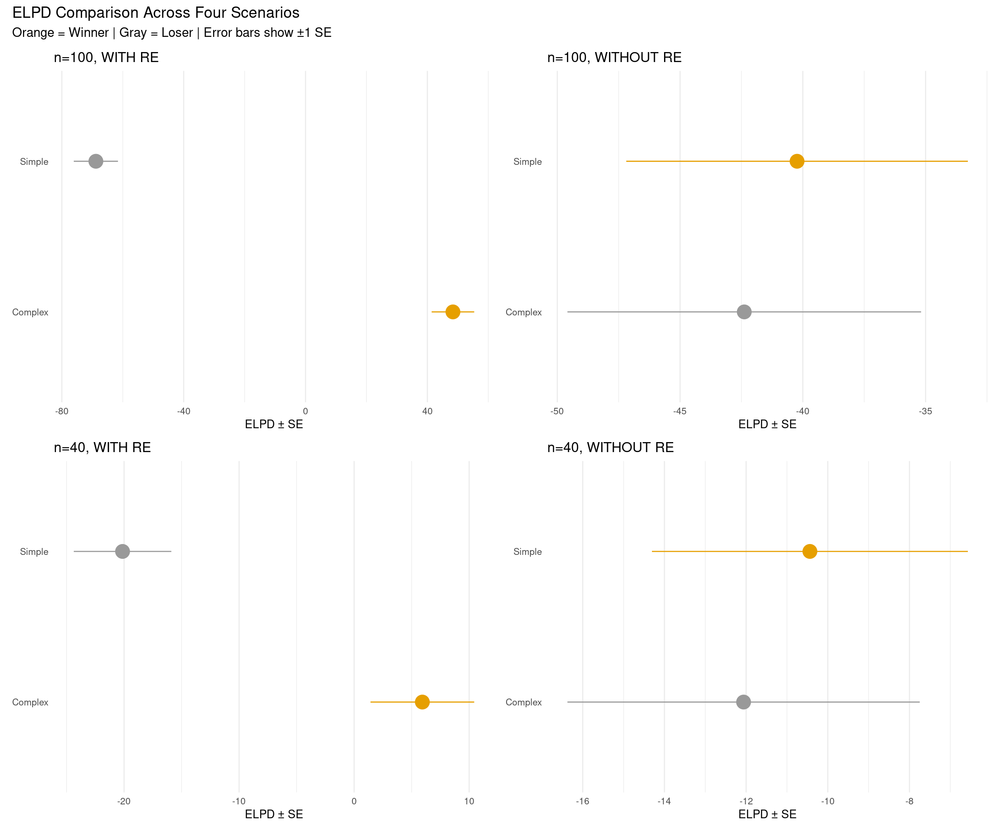
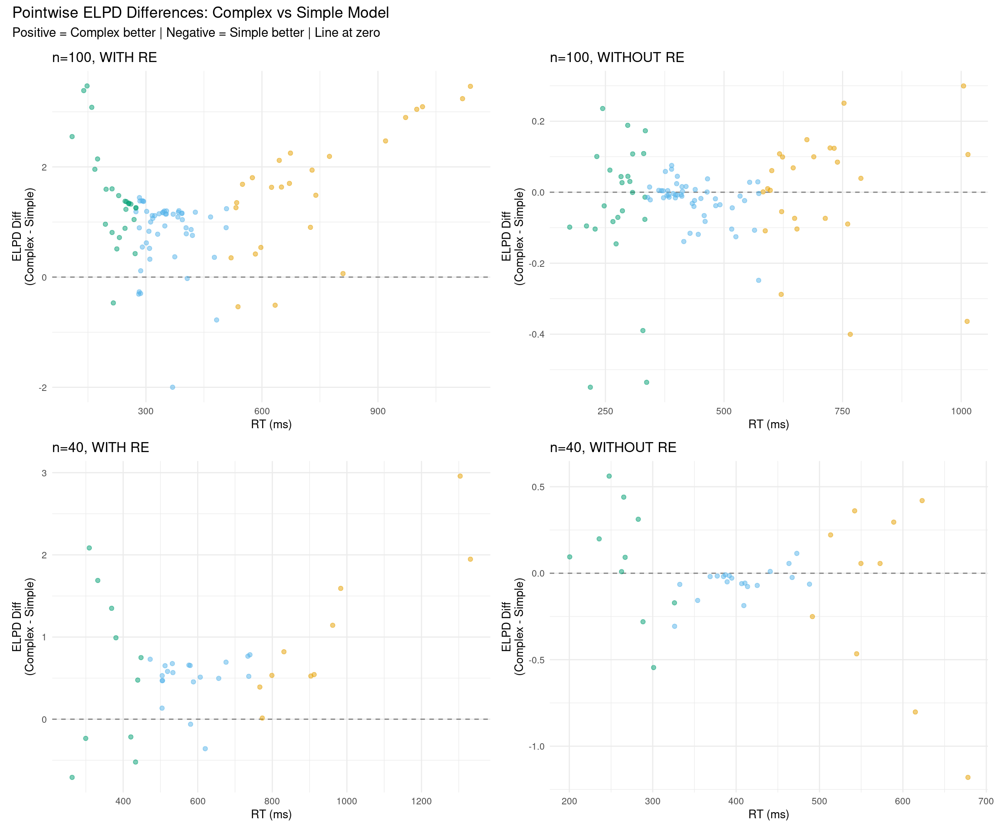
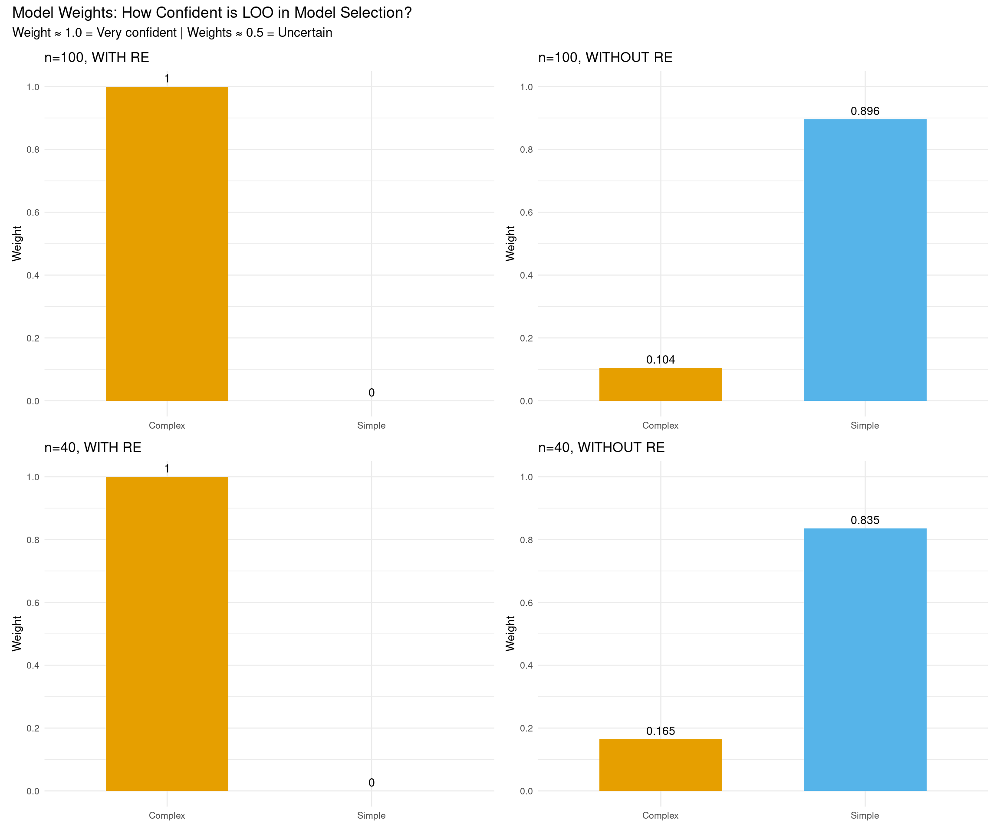
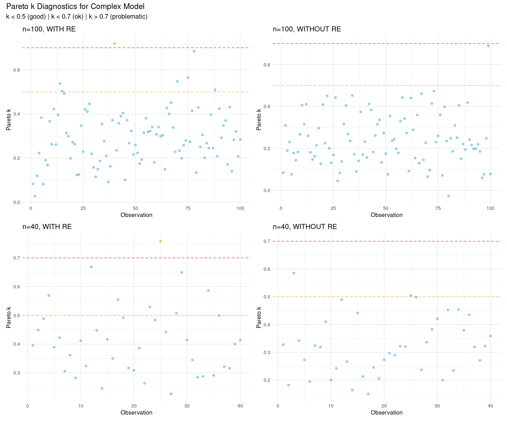
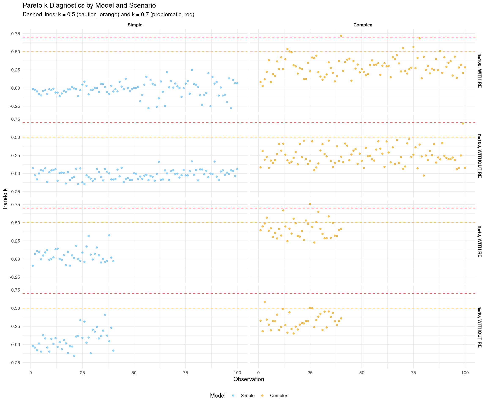
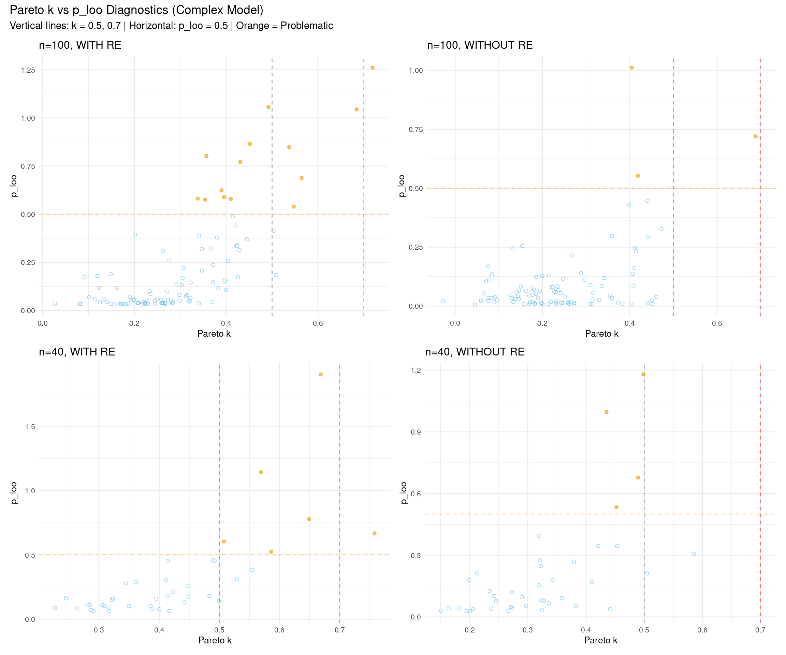
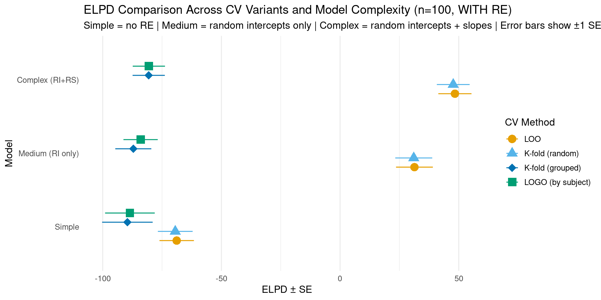

# LOO-PSIS: Leave-One-Out Cross-Validation

LOO-PSIS (Leave-One-Out Cross-Validation with Pareto-Smoothed Importance Sampling) helps answer: **Which model predicts new data better?**

## Why Use LOO Instead of Prior Comparison?

These approaches answer different questions:

**Prior comparison** (what we did earlier):

- Shows if posterior coefficient estimates and effect sizes are sensitive to prior choice
- Good for: reporting robustness of conclusions
- Question: "Do my results depend on my priors?"

**LOO comparison** (this approach):

- Shows which model predicts better
- Good for: feature selection, model building
- Question: "Which model structure produces better predictions?"
- Can compare:
  - Different priors (e.g., narrow/regularizing vs. wide priors)
  - Different likelihoods (e.g., normal vs. lognormal)
  - Different model structures (e.g., with/without random slopes)

**You can do both:**

1. First: Compare different priors within same model structure (sensitivity analysis)
2. Then: Use LOO to compare different model structures with best priors (model selection)

## Why Use LOO Instead of Bayes Factors?

**LOO advantages:**

- Priors less important because we evaluate predictive performance on new data
- Number of samples less important - most uncertainty comes from the data itself
- More stable and interpretable

**Bayes factors:**

- Very sensitive to prior choice
- Sensitive to number of samples
- Harder to interpret (what does BF = 3.2 mean?)

## Setup


::: {.cell}

```{.r .cell-code}
# Configure backend BEFORE loading brms
if (requireNamespace("cmdstanr", quietly = TRUE)) {
  tryCatch({
    cmdstanr::cmdstan_path()
    options(brms.backend = "cmdstanr")
  }, error = function(e) {
    options(brms.backend = "rstan")
  })
}

library(brms)
library(tidyverse)
library(bayesplot)
library(posterior)
library(loo)
library(patchwork)

# Set seed for reproducibility
set.seed(42)
```
:::


## Create Four Test Datasets

We'll create four datasets to test how LOO behaves under different conditions:


::: {.cell}

```{.r .cell-code}
# Ensure tidyverse is loaded for pipe operator
library(dplyr)

# Helper function to generate RT data
generate_rt_data <- function(n_obs, with_random_effects = TRUE, seed = 42) {
  set.seed(seed)
  
  # Determine number of subjects and items (ensure at least 2 for factors)
  n_subj <- max(5, min(10, ceiling(n_obs / 8)))
  n_items <- max(5, min(10, ceiling(n_obs / 8)))
  
  # Create base structure ensuring balanced conditions
  n_per_cond <- ceiling(n_obs / 2)
  
  data <- dplyr::bind_rows(
    expand.grid(
      subject = 1:n_subj,
      item = 1:n_items,
      condition = "A"
    ) %>% dplyr::slice(1:n_per_cond),
    expand.grid(
      subject = 1:n_subj,
      item = 1:n_items,
      condition = "B"
    ) %>% dplyr::slice(1:(n_obs - n_per_cond))
  ) %>%
    dplyr::mutate(
      subject = factor(subject),
      item = factor(item),
      condition = factor(condition)
    )
  
  if (with_random_effects) {
    # Generate data WITH true random effects (STRONGER effects for clear demonstration)
    subj_intercept <- rnorm(n_subj, 0, 0.4)  # Increased from 0.2
    subj_slope <- rnorm(n_subj, 0, 0.2)       # Increased from 0.1
    item_intercept <- rnorm(n_items, 0, 0.3)  # Increased from 0.15
    
    data <- data %>%
      dplyr::mutate(
        re_subject_int = subj_intercept[as.numeric(subject)],
        re_subject_slope = subj_slope[as.numeric(subject)] * (condition == "B"),
        re_item = item_intercept[as.numeric(item)],
        log_rt = 6 + 0.15 * (condition == "B") + 
                 re_subject_int + re_subject_slope + re_item +
                 rnorm(n(), 0, 0.15),  # Reduced residual noise from 0.2
        rt = exp(log_rt)
      ) %>%
      dplyr::select(subject, item, condition, log_rt, rt)
  } else {
    # Generate data WITHOUT random effects (pure fixed effect + noise)
    data <- data %>%
      dplyr::mutate(
        log_rt = 6 + 0.15 * (condition == "B") + rnorm(n(), 0, 0.4),  # Increased noise
        rt = exp(log_rt)
      )
  }
  
  return(data)
}

# Generate four datasets
rt_data_100_with <- generate_rt_data(100, with_random_effects = TRUE, seed = 123)
rt_data_100_without <- generate_rt_data(100, with_random_effects = FALSE, seed = 124)
rt_data_40_with <- generate_rt_data(40, with_random_effects = TRUE, seed = 125)
rt_data_40_without <- generate_rt_data(40, with_random_effects = FALSE, seed = 126)

# Create summary table
data_summaries <- data.frame(
  Scenario = c("n=100, WITH RE", "n=100, WITHOUT RE", "n=40, WITH RE", "n=40, WITHOUT RE"),
  N = c(nrow(rt_data_100_with), nrow(rt_data_100_without), 
        nrow(rt_data_40_with), nrow(rt_data_40_without)),
  Mean_logRT = c(
    round(mean(rt_data_100_with$log_rt), 2),
    round(mean(rt_data_100_without$log_rt), 2),
    round(mean(rt_data_40_with$log_rt), 2),
    round(mean(rt_data_40_without$log_rt), 2)
  ),
  SD_logRT = c(
    round(sd(rt_data_100_with$log_rt), 3),
    round(sd(rt_data_100_without$log_rt), 3),
    round(sd(rt_data_40_with$log_rt), 3),
    round(sd(rt_data_40_without$log_rt), 3)
  ),
  True_Structure = c("Random slopes + intercepts", "Fixed effect only",
                     "Random slopes + intercepts", "Fixed effect only")
)

knitr::kable(data_summaries,
             caption = "Four Test Datasets: 2×2 Design (Sample Size × Data Structure)",
             col.names = c("Scenario", "N", "Mean log-RT", "SD log-RT", "True Data Structure"),
             align = c("l", "r", "r", "r", "l"))
```

::: {.cell-output-display}


Table: Four Test Datasets: 2×2 Design (Sample Size × Data Structure)

|Scenario          |   N| Mean log-RT| SD log-RT|True Data Structure        |
|:-----------------|---:|-----------:|---------:|:--------------------------|
|n=100, WITH RE    | 100|        5.91|     0.478|Random slopes + intercepts |
|n=100, WITHOUT RE | 100|        6.08|     0.366|Fixed effect only          |
|n=40, WITH RE     |  40|        6.37|     0.377|Random slopes + intercepts |
|n=40, WITHOUT RE  |  40|        5.98|     0.296|Fixed effect only          |


:::
:::


## Fit Models for All Four Scenarios

For each dataset, we'll fit two models:

1. **Simple model**: No random effects (just fixed effects) - `log_rt ~ condition`
2. **Complex model**: Random slopes for subjects - `(1 + condition | subject) + (1 | item)`


::: {.cell}

```{.r .cell-code}
# Ensure brms is loaded
library(brms)

# Define priors
# Simple model: no random effects, just fixed effects + residual
rt_priors_simple <- c(
  prior(normal(6, 1.5), class = Intercept, lb = 4),
  prior(normal(0, 0.5), class = b),
  prior(exponential(1), class = sigma)
)

# Medium model: random intercepts only (no correlation)
rt_priors_medium <- c(
  prior(normal(6, 1.5), class = Intercept, lb = 4),
  prior(normal(0, 0.5), class = b),
  prior(exponential(1), class = sigma),
  prior(exponential(1), class = sd)
)

# Complex model: includes random effects with correlation
rt_priors_complex <- c(
  prior(normal(6, 1.5), class = Intercept, lb = 4),
  prior(normal(0, 0.5), class = b),
  prior(exponential(1), class = sigma),
  prior(exponential(1), class = sd),
  prior(lkj(2), class = cor)
)

# Create fits directory
dir.create("fits", showWarnings = FALSE, recursive = TRUE)

# Helper function to fit or load models
fit_or_load <- function(model_name, formula, data, priors) {
  filepath <- paste0("fits/", model_name, ".rds")
  if (file.exists(filepath)) {
    readRDS(filepath)
  } else {
    fit <- brm(
      formula = formula,
      data = data,
      family = gaussian(),
      prior = priors,
      chains = 4,
      iter = 2000,
      cores = 4,
      backend = "cmdstanr",
      seed = 1234,
      refresh = 0
    )
    saveRDS(fit, filepath)
    fit
  }
}

# Scenario 1: n=100, WITH random effects
fit_simple_100_with <- fit_or_load(
  "fit_simple_100_with",
  log_rt ~ condition,
  rt_data_100_with,
  rt_priors_simple
)

fit_medium_100_with <- fit_or_load(
  "fit_medium_100_with",
  log_rt ~ condition + (1 | subject) + (1 | item),
  rt_data_100_with,
  rt_priors_medium
)

fit_complex_100_with <- fit_or_load(
  "fit_complex_100_with",
  log_rt ~ condition + (1 + condition | subject) + (1 | item),
  rt_data_100_with,
  rt_priors_complex
)

# Scenario 2: n=100, WITHOUT random effects
fit_simple_100_without <- fit_or_load(
  "fit_simple_100_without",
  log_rt ~ condition,
  rt_data_100_without,
  rt_priors_simple
)

fit_complex_100_without <- fit_or_load(
  "fit_complex_100_without",
  log_rt ~ condition + (1 + condition | subject) + (1 | item),
  rt_data_100_without,
  rt_priors_complex
)

# Scenario 3: n=40, WITH random effects
fit_simple_40_with <- fit_or_load(
  "fit_simple_40_with",
  log_rt ~ condition,
  rt_data_40_with,
  rt_priors_simple
)

fit_complex_40_with <- fit_or_load(
  "fit_complex_40_with",
  log_rt ~ condition + (1 + condition | subject) + (1 | item),
  rt_data_40_with,
  rt_priors_complex
)

# Scenario 4: n=40, WITHOUT random effects
fit_simple_40_without <- fit_or_load(
  "fit_simple_40_without",
  log_rt ~ condition,
  rt_data_40_without,
  rt_priors_simple
)

fit_complex_40_without <- fit_or_load(
  "fit_complex_40_without",
  log_rt ~ condition + (1 + condition | subject) + (1 | item),
  rt_data_40_without,
  rt_priors_complex
)
```
:::


# Comparing Models with LOO Across Four Scenarios

## Add LOO Criterion to All Models


::: {.cell}

```{.r .cell-code}
# Add LOO criterion to all models
fit_simple_100_with <- add_criterion(fit_simple_100_with, "loo")
fit_medium_100_with <- add_criterion(fit_medium_100_with, "loo")
fit_complex_100_with <- add_criterion(fit_complex_100_with, "loo")

fit_simple_100_without <- add_criterion(fit_simple_100_without, "loo")
fit_complex_100_without <- add_criterion(fit_complex_100_without, "loo")

fit_simple_40_with <- add_criterion(fit_simple_40_with, "loo")
fit_complex_40_with <- add_criterion(fit_complex_40_with, "loo")

fit_simple_40_without <- add_criterion(fit_simple_40_without, "loo")
fit_complex_40_without <- add_criterion(fit_complex_40_without, "loo")

# Display individual LOO results showing progression of model complexity
print("Example: Individual LOO output for simple model (n=100, WITH RE)")
```

::: {.cell-output .cell-output-stdout}

```
[1] "Example: Individual LOO output for simple model (n=100, WITH RE)"
```


:::

```{.r .cell-code}
print(fit_simple_100_with$criteria$loo)
```

::: {.cell-output .cell-output-stdout}

```

Computed from 4000 by 100 log-likelihood matrix.

         Estimate   SE
elpd_loo    -68.8  7.3
p_loo         2.9  0.5
looic       137.7 14.5
------
MCSE of elpd_loo is 0.0.
MCSE and ESS estimates assume MCMC draws (r_eff in [0.7, 1.0]).

All Pareto k estimates are good (k < 0.7).
See help('pareto-k-diagnostic') for details.
```


:::

```{.r .cell-code}
print("Example: Individual LOO output for medium model (n=100, WITH RE)")
```

::: {.cell-output .cell-output-stdout}

```
[1] "Example: Individual LOO output for medium model (n=100, WITH RE)"
```


:::

```{.r .cell-code}
print(fit_medium_100_with$criteria$loo)
```

::: {.cell-output .cell-output-stdout}

```

Computed from 4000 by 100 log-likelihood matrix.

         Estimate   SE
elpd_loo     31.3  7.8
p_loo        15.1  2.2
looic       -62.7 15.5
------
MCSE of elpd_loo is 0.1.
MCSE and ESS estimates assume MCMC draws (r_eff in [0.5, 1.2]).

All Pareto k estimates are good (k < 0.7).
See help('pareto-k-diagnostic') for details.
```


:::

```{.r .cell-code}
print("Example: Individual LOO output for complex model (n=100, WITH RE)")
```

::: {.cell-output .cell-output-stdout}

```
[1] "Example: Individual LOO output for complex model (n=100, WITH RE)"
```


:::

```{.r .cell-code}
print(fit_complex_100_with$criteria$loo)
```

::: {.cell-output .cell-output-stdout}

```

Computed from 4000 by 100 log-likelihood matrix.

         Estimate   SE
elpd_loo     48.4  7.0
p_loo        21.6  2.6
looic       -96.8 14.0
------
MCSE of elpd_loo is NA.
MCSE and ESS estimates assume MCMC draws (r_eff in [0.6, 1.4]).

Pareto k diagnostic values:
                         Count Pct.    Min. ESS
(-Inf, 0.7]   (good)     99    99.0%   573     
   (0.7, 1]   (bad)       1     1.0%   <NA>    
   (1, Inf)   (very bad)  0     0.0%   <NA>    
See help('pareto-k-diagnostic') for details.
```


:::
:::


**Understanding individual LOO output:**

- **Estimate**: The ELPD (higher = better predictive accuracy)
- **SE**: Standard error of the estimate (uncertainty)
- **p_loo**: Effective number of parameters (how much the model "uses" the data)
- **looic**: -2 × elpd_loo (lower = better, analogous to AIC)
- **Pareto k diagnostic**: Checks reliability of the LOO approximation
  - All k < 0.5: Excellent
  - k < 0.7: Good
  - k > 0.7: Problematic (may need `reloo = TRUE`)

## Compare Models for Each Scenario


::: {.cell}

```{.r .cell-code}
# Compare models for each scenario
loo_comp_100_with <- loo_compare(fit_simple_100_with, fit_complex_100_with)
loo_comp_100_without <- loo_compare(fit_simple_100_without, fit_complex_100_without)
loo_comp_40_with <- loo_compare(fit_simple_40_with, fit_complex_40_with)
loo_comp_40_without <- loo_compare(fit_simple_40_without, fit_complex_40_without)

# Show all columns including p_loo
print("\nFull comparison with p_loo values:")
```

::: {.cell-output .cell-output-stdout}

```
[1] "\nFull comparison with p_loo values:"
```


:::

```{.r .cell-code}
print(loo_comp_100_with, simplify = FALSE)
```

::: {.cell-output .cell-output-stdout}

```
                     elpd_diff se_diff elpd_loo se_elpd_loo p_loo  se_p_loo
fit_complex_100_with    0.0       0.0    48.4      7.0        21.6    2.6  
fit_simple_100_with  -117.2       9.2   -68.8      7.3         2.9    0.5  
                     looic  se_looic
fit_complex_100_with  -96.8   14.0  
fit_simple_100_with   137.7   14.5  
```


:::

```{.r .cell-code}
# Helper function to extract comparison info
extract_comparison <- function(loo_comp, scenario_name) {
  winner <- rownames(loo_comp)[1]
  winner_clean <- gsub("fit_|_100_with|_100_without|_40_with|_40_without", "", winner)
  winner_clean <- tools::toTitleCase(winner_clean)
  
  elpd_diff <- loo_comp[2, "elpd_diff"]
  se_diff <- loo_comp[2, "se_diff"]
  ratio <- abs(elpd_diff) / se_diff
  
  if (ratio < 1) {
    interpretation <- "Essentially equivalent"
  } else if (ratio < 2) {
    interpretation <- "Weak evidence"
  } else if (ratio < 4) {
    interpretation <- "Moderate evidence"
  } else if (ratio < 10) {
    interpretation <- "Strong evidence"
  } else {
    interpretation <- "Very strong evidence"
  }
  
  data.frame(
    Scenario = scenario_name,
    Winner = winner_clean,
    ELPD_diff = round(elpd_diff, 2),
    SE_diff = round(se_diff, 2),
    Ratio = round(ratio, 2),
    Interpretation = interpretation
  )
}

# Create comprehensive comparison table
comparison_table <- rbind(
  extract_comparison(loo_comp_100_with, "n=100, WITH RE"),
  extract_comparison(loo_comp_100_without, "n=100, WITHOUT RE"),
  extract_comparison(loo_comp_40_with, "n=40, WITH RE"),
  extract_comparison(loo_comp_40_without, "n=40, WITHOUT RE")
)

# knitr::kable(comparison_table,
#              caption = "LOO Model Comparison Across Four Scenarios",
#              col.names = c("Scenario", "Winner", "ELPD Δ", "SE", "Ratio", "Interpretation"),
#              align = c("l", "l", "r", "r", "r", "l"),
#              row.names = FALSE)
```
:::


### Understanding the Output Columns

The `loo_compare()` output shows (note: by default only some columns are printed):

**Default output:**  

- **elpd_diff**: Difference from best model (0 for winner, negative for others)
- **se_diff**: Standard error of the difference (uncertainty in comparison)

**Full output (with `simplify = FALSE`):**  

- **elpd_loo**: Expected log pointwise predictive density (higher = better predictions)
- **se_elpd_loo**: Standard error of elpd_loo
- **p_loo**: Effective number of parameters - this shows model complexity!
  - Simple model: p_loo ≈ number of fixed effects + 1 (for sigma)
  - Complex model: p_loo increases with random effects (subjects, items, correlations)
  - **Key**: Higher p_loo = more complex model, but also better fit if it wins
- **looic**: LOO Information Criterion = -2 × elpd_loo (lower = better, like AIC/BIC)

**Why p_loo matters**: It shows you're not just comparing predictive accuracy, but **accuracy adjusted for complexity**. The complex model has higher p_loo (uses more parameters), so it needs to predict *substantially* better to win.

**Key insight**: The ratio (|elpd_diff| / se_diff) tells you how many standard errors separate the models. A ratio > 4 indicates strong evidence for the winning model.

### ELPD

**ELPD** = "Expected Log Pointwise Predictive Density"

- **Expected**: We marginalize over all possible future data
- **Log**: Works on log scale for numerical stability
- **Pointwise**: Evaluated separately for each data point
- **Predictive Density**: How well the model predicts new data

**Key properties:**

- **Higher is better** (like R² in frequentist stats)
- **Difference matters**: Which model predicts new data better?
- **Not about fit to current data**: About generalization
- Takes into account the uncertainty of predictions

### Ratio

The ratio (|ELPD_diff| / SE) tells us how many standard errors separate the models. Here's a detailed breakdown:


::: {.cell}

```{.r .cell-code}
# Extract detailed ratio information for both models in each scenario
ratio_details <- data.frame()

scenarios_list <- list(
  list(comp = loo_comp_100_with, name = "n=100, WITH RE"),
  list(comp = loo_comp_100_without, name = "n=100, WITHOUT RE"),
  list(comp = loo_comp_40_with, name = "n=40, WITH RE"),
  list(comp = loo_comp_40_without, name = "n=40, WITHOUT RE")
)

for (scenario in scenarios_list) {
  comp <- scenario$comp
  
  for (i in 1:nrow(comp)) {
    model_name <- rownames(comp)[i]
    model_clean <- tools::toTitleCase(gsub("fit_|_.*", "", model_name))
    
    elpd <- comp[i, "elpd_loo"]
    se_elpd <- comp[i, "se_elpd_loo"]
    elpd_diff <- comp[i, "elpd_diff"]
    se_diff <- comp[i, "se_diff"]
    
    if (i == 1) {
      # Best model
      ratio <- NA
      interpretation <- "Best model (reference)"
    } else {
      ratio <- abs(elpd_diff) / se_diff
      
      if (ratio < 1) {
        interpretation <- "Essentially equivalent"
      } else if (ratio < 2) {
        interpretation <- "Weak evidence"
      } else if (ratio < 4) {
        interpretation <- "Moderate evidence"
      } else if (ratio < 10) {
        interpretation <- "Strong evidence"
      } else {
        interpretation <- "Very strong evidence"
      }
    }
    
    ratio_details <- rbind(ratio_details, data.frame(
      Scenario = scenario$name,
      Model = model_clean,
      ELPD = round(elpd, 1),
      SE_ELPD = round(se_elpd, 1),
      ELPD_diff = ifelse(i == 1, "—", as.character(round(elpd_diff, 2))),
      SE_diff = ifelse(i == 1, "—", as.character(round(se_diff, 2))),
      Ratio = ifelse(i == 1, "—", as.character(round(ratio, 2))),
      Interpretation = interpretation
    ))
  }
}

knitr::kable(ratio_details,
             caption = "Detailed Model Comparison with Ratios (|ELPD_diff| / SE)",
             col.names = c("Scenario", "Model", "ELPD", "SE", "ELPD Δ", "SE Δ", "Ratio (SE)", "Interpretation"),
             align = c("l", "l", "r", "r", "r", "r", "r", "l"),
             row.names = FALSE)
```

::: {.cell-output-display}


Table: Detailed Model Comparison with Ratios (|ELPD_diff| / SE)

|Scenario          |Model   |  ELPD|  SE|  ELPD Δ| SE Δ| Ratio (SE)|Interpretation         |
|:-----------------|:-------|-----:|---:|-------:|----:|----------:|:----------------------|
|n=100, WITH RE    |Complex |  48.4| 7.0|       —|    —|          —|Best model (reference) |
|n=100, WITH RE    |Simple  | -68.8| 7.3| -117.21| 9.25|      12.68|Very strong evidence   |
|n=100, WITHOUT RE |Simple  | -40.2| 7.0|       —|    —|          —|Best model (reference) |
|n=100, WITHOUT RE |Complex | -42.4| 7.2|   -2.15| 1.35|       1.59|Weak evidence          |
|n=40, WITH RE     |Complex |   5.9| 4.5|       —|    —|          —|Best model (reference) |
|n=40, WITH RE     |Simple  | -20.1| 4.2|  -26.06| 4.44|       5.87|Strong evidence        |
|n=40, WITHOUT RE  |Simple  | -10.4| 3.9|       —|    —|          —|Best model (reference) |
|n=40, WITHOUT RE  |Complex | -12.1| 4.3|   -1.62| 2.02|        0.8|Essentially equivalent |


:::
:::


## Rule of Thumb for Model Comparison

**Interpreting `elpd_diff` (expected log pointwise predictive density difference):**

| elpd_diff | Ratio* | Interpretation | Action |
|-----------|--------|----------------|--------|
| < 4 | < 2 | Equivalent models | Pick simpler one |
| 4-10 | 2-4 | Moderate difference | Consider larger elpd |
| > 10 | > 4 | Clear winner | Prefer larger elpd |

*Ratio = |elpd_diff| / se_diff (how many standard errors apart?)


## Visualizations: Side-by-Side Comparisons

### Plot 1: ELPD Comparison (2×2 Grid)


::: {.cell}

```{.r .cell-code}
# Helper function to create ELPD plot for one scenario
plot_elpd_comparison <- function(loo_comp, scenario_name) {
  loo_df <- as.data.frame(loo_comp) %>%
    rownames_to_column("model") %>%
    mutate(
      model_clean = tools::toTitleCase(gsub("fit_|_.*", "", model)),
      is_winner = row_number() == 1
    )
  
  ggplot(loo_df, aes(x = elpd_loo, y = model_clean, color = is_winner)) +
    geom_pointrange(
      aes(xmin = elpd_loo - se_elpd_loo, 
          xmax = elpd_loo + se_elpd_loo),
      size = 1.2
    ) +
    scale_color_manual(values = c("FALSE" = "gray60", "TRUE" = "#E69F00")) +
    labs(
      title = scenario_name,
      x = "ELPD ± SE",
      y = NULL
    ) +
    theme_minimal(base_size = 10) +
    theme(
      axis.ticks.y = element_blank(),
      panel.grid.major.y = element_blank(),
      legend.position = "none"
    )
}

# Create four plots
p1 <- plot_elpd_comparison(loo_comp_100_with, "n=100, WITH RE")
p2 <- plot_elpd_comparison(loo_comp_100_without, "n=100, WITHOUT RE")
p3 <- plot_elpd_comparison(loo_comp_40_with, "n=40, WITH RE")
p4 <- plot_elpd_comparison(loo_comp_40_without, "n=40, WITHOUT RE")

# Combine in 2×2 grid
(p1 + p2) / (p3 + p4) +
  plot_annotation(
    title = "ELPD Comparison Across Four Scenarios",
    subtitle = "Orange = Winner | Gray = Loser | Error bars show ±1 SE"
  )
```

::: {.cell-output-display}
{width=1152}
:::
:::


### Plot 2: Pointwise ELPD Differences by RT (2×2 Grid)


::: {.cell}

```{.r .cell-code}
# Helper function to plot pointwise ELPD differences
plot_elpd_differences <- function(fit_simple, fit_complex, data, scenario_name) {
  diff_data <- data %>%
    mutate(
      diff_elpd = fit_complex$criteria$loo$pointwise[, "elpd_loo"] -
                  fit_simple$criteria$loo$pointwise[, "elpd_loo"],
      rt_category = case_when(
        rt < quantile(rt, 0.25) ~ "Fast",
        rt > quantile(rt, 0.75) ~ "Slow",
        TRUE ~ "Medium"
      ),
      rt_category = factor(rt_category, levels = c("Fast", "Medium", "Slow"))
    )
  
  ggplot(diff_data, aes(x = rt, y = diff_elpd, color = rt_category)) +
    geom_hline(yintercept = 0, linetype = "dashed", color = "gray50") +
    geom_point(alpha = 0.5, size = 1.5) +
    scale_color_manual(
      values = c("Fast" = "#009E73", "Medium" = "#56B4E9", "Slow" = "#E69F00"),
      name = "RT"
    ) +
    labs(
      title = scenario_name,
      x = "RT (ms)",
      y = "ELPD Diff\n(Complex - Simple)"
    ) +
    theme_minimal(base_size = 10) +
    theme(legend.position = "none")
}

# Create four plots
p1 <- plot_elpd_differences(fit_simple_100_with, fit_complex_100_with, 
                            rt_data_100_with, "n=100, WITH RE")
p2 <- plot_elpd_differences(fit_simple_100_without, fit_complex_100_without,
                            rt_data_100_without, "n=100, WITHOUT RE")
p3 <- plot_elpd_differences(fit_simple_40_with, fit_complex_40_with,
                            rt_data_40_with, "n=40, WITH RE")
p4 <- plot_elpd_differences(fit_simple_40_without, fit_complex_40_without,
                            rt_data_40_without, "n=40, WITHOUT RE")

# Combine in 2×2 grid
(p1 + p2) / (p3 + p4) +
  plot_annotation(
    title = "Pointwise ELPD Differences: Complex vs Simple Model",
    subtitle = "Positive = Complex better | Negative = Simple better | Line at zero"
  )
```

::: {.cell-output-display}
{width=1152}
:::
:::


**What to look for:**

- **WITH RE scenarios**: Positive values (complex better) when data truly has random slopes
- **WITHOUT RE scenarios**: Near zero or negative values (simple better or equivalent)
- **Sample size effect**: More scatter with n=40, clearer pattern with n=100

### Plot 3: Model Weights (2×2 Grid)

**Model weights** represent the probability that each model would make the best predictions for new data, based on the LOO estimates. Weights close to 1.0 indicate strong confidence in that model, while weights near 0.5 suggest the models are roughly equivalent in predictive performance.


::: {.cell}

```{.r .cell-code}
# Helper function to plot model weights
plot_model_weights <- function(fit_simple, fit_complex, scenario_name) {
  weights <- model_weights(fit_simple, fit_complex, weights = "loo")
  weights_df <- data.frame(
    Model = c("Simple", "Complex"),
    Weight = as.numeric(weights)
  )
  
  ggplot(weights_df, aes(x = Model, y = Weight, fill = Model)) +
    geom_col(width = 0.6) +
    geom_text(aes(label = round(Weight, 3)), 
              vjust = -0.5, size = 3.5) +
    scale_fill_manual(values = c("Simple" = "#56B4E9", "Complex" = "#E69F00")) +
    scale_y_continuous(limits = c(0, 1), breaks = seq(0, 1, 0.2)) +
    labs(
      title = scenario_name,
      x = NULL,
      y = "Weight"
    ) +
    theme_minimal(base_size = 10) +
    theme(legend.position = "none")
}

# Create four plots
p1 <- plot_model_weights(fit_simple_100_with, fit_complex_100_with, "n=100, WITH RE")
p2 <- plot_model_weights(fit_simple_100_without, fit_complex_100_without, "n=100, WITHOUT RE")
p3 <- plot_model_weights(fit_simple_40_with, fit_complex_40_with, "n=40, WITH RE")
p4 <- plot_model_weights(fit_simple_40_without, fit_complex_40_without, "n=40, WITHOUT RE")

# Combine in 2×2 grid
(p1 + p2) / (p3 + p4) +
  plot_annotation(
    title = "Model Weights: How Confident is LOO in Model Selection?",
    subtitle = "Weight ≈ 1.0 = Very confident | Weights ≈ 0.5 = Uncertain"
  )
```

::: {.cell-output-display}
{width=1152}
:::
:::

::: {.cell}

```{.r .cell-code}
# Create table of model weights for all scenarios
weights_table <- data.frame(
  Scenario = rep(c("n=100, WITH RE", "n=100, WITHOUT RE", "n=40, WITH RE", "n=40, WITHOUT RE"), each = 2),
  Model = rep(c("Simple", "Complex"), 4),
  Weight = c(
    as.numeric(model_weights(fit_simple_100_with, fit_complex_100_with, weights = "loo")),
    as.numeric(model_weights(fit_simple_100_without, fit_complex_100_without, weights = "loo")),
    as.numeric(model_weights(fit_simple_40_with, fit_complex_40_with, weights = "loo")),
    as.numeric(model_weights(fit_simple_40_without, fit_complex_40_without, weights = "loo"))
  )
)

knitr::kable(
  weights_table,
  digits = 3,
  caption = "Model weights (stacking) across all scenarios",
  col.names = c("Scenario", "Model", "Weight")
)
```

::: {.cell-output-display}


Table: Model weights (stacking) across all scenarios

|Scenario          |Model   | Weight|
|:-----------------|:-------|------:|
|n=100, WITH RE    |Simple  |  0.000|
|n=100, WITH RE    |Complex |  1.000|
|n=100, WITHOUT RE |Simple  |  0.896|
|n=100, WITHOUT RE |Complex |  0.104|
|n=40, WITH RE     |Simple  |  0.000|
|n=40, WITH RE     |Complex |  1.000|
|n=40, WITHOUT RE  |Simple  |  0.835|
|n=40, WITHOUT RE  |Complex |  0.165|


:::
:::


**Interpreting model weights:**

- **Weight ≈ 1.0**: Very high confidence in this model (it dominates predictions)
- **Weight ≈ 0.5**: Models are roughly equivalent (uncertain which is better)
- **Weight < 0.1**: Very low confidence (model contributes little to predictions)

Model weights represent the optimal combination of models for predictions. When one model has weight ≈ 1.0, LOO is very confident that model is superior.

### Plot 4: Pareto k Diagnostics (2×2 Grid)

**Pareto k values** diagnose the reliability of the LOO approximation for each observation, with values below 0.7 indicating trustworthy estimates. High k values (> 0.7) suggest influential observations where the importance sampling approximation may be unreliable, requiring exact leave-one-out refitting with `reloo = TRUE`.


::: {.cell}

```{.r .cell-code}
# Helper function to plot Pareto k values
plot_pareto_k <- function(fit_complex, scenario_name) {
  k_values <- fit_complex$criteria$loo$diagnostics$pareto_k
  k_df <- data.frame(
    observation = 1:length(k_values),
    pareto_k = k_values,
    problematic = k_values > 0.7
  )
  
  ggplot(k_df, aes(x = observation, y = pareto_k, color = problematic)) +
    geom_point(alpha = 0.6, size = 1.5) +
    geom_hline(yintercept = 0.5, linetype = "dashed", color = "orange", alpha = 0.7) +
    geom_hline(yintercept = 0.7, linetype = "dashed", color = "red", alpha = 0.7) +
    scale_color_manual(values = c("FALSE" = "#56B4E9", "TRUE" = "#E69F00")) +
    labs(
      title = scenario_name,
      x = "Observation",
      y = "Pareto k"
    ) +
    theme_minimal(base_size = 10) +
    theme(legend.position = "none")
}

# Create four plots (use complex model for diagnostics)
p1 <- plot_pareto_k(fit_complex_100_with, "n=100, WITH RE")
p2 <- plot_pareto_k(fit_complex_100_without, "n=100, WITHOUT RE")
p3 <- plot_pareto_k(fit_complex_40_with, "n=40, WITH RE")
p4 <- plot_pareto_k(fit_complex_40_without, "n=40, WITHOUT RE")

# Combine in 2×2 grid
(p1 + p2) / (p3 + p4) +
  plot_annotation(
    title = "Pareto k Diagnostics for Complex Model",
    subtitle = "k < 0.5 (good) | k < 0.7 (ok) | k > 0.7 (problematic)"
  )
```

::: {.cell-output-display}
{width=1152}
:::
:::


## Key Insights from Four Scenarios


::: {.cell}

```{.r .cell-code}
# Summarize key findings
insights_df <- data.frame(
  Scenario = c("n=100, WITH RE", "n=100, WITHOUT RE", "n=40, WITH RE", "n=40, WITHOUT RE"),
  Sample_Size = c("Large", "Large", "Small", "Small"),
  True_Structure = c("Complex", "Simple", "Complex", "Simple"),
  Expected_Winner = c("Complex", "Simple", "Complex", "Simple/Equiv"),
  Certainty = c("Very High", "Moderate", "High", "Low"),
  Key_Lesson = c(
    "LOO strongly identifies complexity",
    "LOO avoids overfitting (weak preference)",
    "Strong evidence even with less data",
    "Hard to distinguish with limited data"
  )
)

knitr::kable(insights_df,
             caption = "Summary of LOO Behavior Across Scenarios",
             col.names = c("Scenario", "Sample Size", "True Structure", "Expected Winner", "Certainty", "Key Lesson"),
             align = c("l", "l", "l", "l", "l", "l"))
```

::: {.cell-output-display}


Table: Summary of LOO Behavior Across Scenarios

|Scenario          |Sample Size |True Structure |Expected Winner |Certainty |Key Lesson                               |
|:-----------------|:-----------|:--------------|:---------------|:---------|:----------------------------------------|
|n=100, WITH RE    |Large       |Complex        |Complex         |Very High |LOO strongly identifies complexity       |
|n=100, WITHOUT RE |Large       |Simple         |Simple          |Moderate  |LOO avoids overfitting (weak preference) |
|n=40, WITH RE     |Small       |Complex        |Complex         |High      |Strong evidence even with less data      |
|n=40, WITHOUT RE  |Small       |Simple         |Simple/Equiv    |Low       |Hard to distinguish with limited data    |


:::
:::


**Main takeaways:**

1. **LOO works best with adequate data** (n ≥ 100): Clear winners, confident weights
2. **LOO respects true data structure**: Finds complexity when it exists, avoids it when it doesn't
3. **Small samples = high uncertainty**: Model weights closer to 0.5, wider error bars
4. **Pareto k generally good**: Few problematic observations across all scenarios

# Pareto k Diagnostics

## Identifying Influential Points

The LOO calculation uses Pareto Smoothed Importance Sampling (PSIS). The Pareto k diagnostic tells us if the approximation is reliable:

**Pareto k thresholds** (sample-size dependent):

- k < 0.5: Good (reliable estimate)
- 0.5 < k < 0.7: Okay (use with caution)
- k > 0.7: Bad (LOO estimate unreliable)


::: {.cell}

```{.r .cell-code}
# Check Pareto k values for all scenarios
k_diagnostics <- data.frame()
k_threshold <- 0.7

scenarios <- list(
  list(fit = fit_complex_100_with, name = "n=100, WITH RE"),
  list(fit = fit_complex_100_without, name = "n=100, WITHOUT RE"),
  list(fit = fit_complex_40_with, name = "n=40, WITH RE"),
  list(fit = fit_complex_40_without, name = "n=40, WITHOUT RE")
)

for (scenario in scenarios) {
  k_values <- scenario$fit$criteria$loo$diagnostics$pareto_k
  n_bad <- sum(k_values > k_threshold)
  n_total <- length(k_values)
  
  status <- ifelse(n_bad > 0, 
                   "⚠ Consider reloo = TRUE",
                   "✓ All k values good")
  
  k_diagnostics <- rbind(k_diagnostics, data.frame(
    Scenario = scenario$name,
    Problematic = paste0(n_bad, " / ", n_total),
    Status = status
  ))
}

knitr::kable(k_diagnostics,
             caption = paste0("Pareto k Diagnostics Across Scenarios (threshold k > ", k_threshold, ")"),
             col.names = c("Scenario", "Observations with k > 0.7", "Status"),
             align = c("l", "r", "l"))
```

::: {.cell-output-display}


Table: Pareto k Diagnostics Across Scenarios (threshold k > 0.7)

|Scenario          | Observations with k > 0.7|Status                  |
|:-----------------|-------------------------:|:-----------------------|
|n=100, WITH RE    |                   1 / 100|⚠ Consider reloo = TRUE |
|n=100, WITHOUT RE |                   0 / 100|✓ All k values good     |
|n=40, WITH RE     |                    1 / 40|⚠ Consider reloo = TRUE |
|n=40, WITHOUT RE  |                    0 / 40|✓ All k values good     |


:::
:::


## Visualize Pareto k Values by Model and Scenario


::: {.cell}

```{.r .cell-code}
# Extract Pareto k values for all scenarios and both models
k_all_df <- bind_rows(
  # n=100, WITH RE
  data.frame(
    observation = 1:nrow(rt_data_100_with),
    k_simple = fit_simple_100_with$criteria$loo$diagnostics$pareto_k,
    k_complex = fit_complex_100_with$criteria$loo$diagnostics$pareto_k,
    scenario = "n=100, WITH RE"
  ),
  # n=100, WITHOUT RE
  data.frame(
    observation = 1:nrow(rt_data_100_without),
    k_simple = fit_simple_100_without$criteria$loo$diagnostics$pareto_k,
    k_complex = fit_complex_100_without$criteria$loo$diagnostics$pareto_k,
    scenario = "n=100, WITHOUT RE"
  ),
  # n=40, WITH RE
  data.frame(
    observation = 1:nrow(rt_data_40_with),
    k_simple = fit_simple_40_with$criteria$loo$diagnostics$pareto_k,
    k_complex = fit_complex_40_with$criteria$loo$diagnostics$pareto_k,
    scenario = "n=40, WITH RE"
  ),
  # n=40, WITHOUT RE
  data.frame(
    observation = 1:nrow(rt_data_40_without),
    k_simple = fit_simple_40_without$criteria$loo$diagnostics$pareto_k,
    k_complex = fit_complex_40_without$criteria$loo$diagnostics$pareto_k,
    scenario = "n=40, WITHOUT RE"
  )
) %>%
  pivot_longer(cols = starts_with("k_"), 
               names_to = "model", 
               values_to = "pareto_k") %>%
  mutate(
    model = factor(model, 
                   levels = c("k_simple", "k_complex"),
                   labels = c("Simple", "Complex")),
    scenario = factor(scenario, 
                      levels = c("n=100, WITH RE", "n=100, WITHOUT RE", 
                                "n=40, WITH RE", "n=40, WITHOUT RE"))
  )

# Create faceted plot
ggplot(k_all_df, aes(x = observation, y = pareto_k, color = model)) +
  geom_point(alpha = 0.6, size = 1.2) +
  geom_hline(yintercept = 0.5, linetype = "dashed", color = "orange", alpha = 0.7) +
  geom_hline(yintercept = 0.7, linetype = "dashed", color = "red", alpha = 0.7) +
  facet_grid(scenario ~ model, scales = "free_x") +
  scale_color_manual(values = c("Simple" = "#56B4E9", "Complex" = "#E69F00")) +
  labs(
    title = "Pareto k Diagnostics by Model and Scenario",
    subtitle = "Dashed lines: k = 0.5 (caution, orange) and k = 0.7 (problematic, red)",
    x = "Observation",
    y = "Pareto k",
    color = "Model"
  ) +
  theme_minimal(base_size = 10) +
  theme(
    legend.position = "bottom",
    strip.text = element_text(face = "bold")
  )
```

::: {.cell-output-display}
{width=1152}
:::
:::


**What to look for:**

- Most points should be below 0.5 (good)
- Points between 0.5-0.7 (orange line) are okay but use with caution
- Points above 0.7 (red line) indicate unreliable LOO estimates
- Small sample scenarios (n=40) may show slightly higher k values due to limited data

## Influential Observations: Pareto k vs p_loo

The relationship between Pareto k and p_loo (effective number of parameters per observation) can reveal influential observations:

- **p_loo** measures how much each observation influences the model
- **High p_loo + high k**: Very influential observation that's hard to predict
- **Low p_loo + high k**: Outlier that doesn't strongly influence the model
- **High p_loo + low k**: Normal influential observation (e.g., high leverage point)


::: {.cell}

```{.r .cell-code}
# Helper function to plot pareto k vs p_loo
plot_k_vs_p_loo <- function(fit_complex, data, scenario_name) {
  loo_obj <- fit_complex$criteria$loo
  
  diag_df <- data.frame(
    observation = 1:nrow(data),
    pareto_k = loo_obj$diagnostics$pareto_k,
    p_loo = loo_obj$pointwise[, "p_loo"],
    problematic = loo_obj$diagnostics$pareto_k > 0.7 | loo_obj$pointwise[, "p_loo"] > 0.5
  )
  
  ggplot(diag_df, aes(x = pareto_k, y = p_loo, color = problematic)) +
    geom_vline(xintercept = 0.5, linetype = "dashed", color = "gray50", alpha = 0.7) +
    geom_vline(xintercept = 0.7, linetype = "dashed", color = "red", alpha = 0.5) +
    geom_hline(yintercept = 0.5, linetype = "dashed", color = "orange", alpha = 0.5) +
    geom_point(aes(shape = problematic), alpha = 0.6, size = 1.5) +
    scale_color_manual(values = c("FALSE" = "#56B4E9", "TRUE" = "#E69F00")) +
    scale_shape_manual(values = c("FALSE" = 1, "TRUE" = 19)) +
    labs(
      title = scenario_name,
      x = "Pareto k",
      y = "p_loo"
    ) +
    theme_minimal(base_size = 10) +
    theme(legend.position = "none")
}

# Create four plots
p1 <- plot_k_vs_p_loo(fit_complex_100_with, rt_data_100_with, "n=100, WITH RE")
p2 <- plot_k_vs_p_loo(fit_complex_100_without, rt_data_100_without, "n=100, WITHOUT RE")
p3 <- plot_k_vs_p_loo(fit_complex_40_with, rt_data_40_with, "n=40, WITH RE")
p4 <- plot_k_vs_p_loo(fit_complex_40_without, rt_data_40_without, "n=40, WITHOUT RE")

# Combine in 2×2 grid
(p1 + p2) / (p3 + p4) +
  plot_annotation(
    title = "Pareto k vs p_loo Diagnostics (Complex Model)",
    subtitle = "Vertical lines: k = 0.5, 0.7 | Horizontal: p_loo = 0.5 | Orange = Problematic"
  )
```

::: {.cell-output-display}
{width=1152}
:::
:::


**Interpretation:**

- Points in the **upper-right quadrant** (high k, high p_loo): Most concerning - influential outliers
- Points along the **right edge** (high k, low p_loo): Outliers with less model influence
- Points in the **upper-left** (low k, high p_loo): Normal high-leverage observations
- Most points should cluster in the **lower-left** (low k, low p_loo): Well-behaved observations

## Handling Problematic Observations

**When to use exact LOO refitting:**

The Pareto k diagnostic has two key thresholds:

- **k > 0.7** (bad): PSIS approximation unreliable - **definitely refit** with exact LOO
- **k > 0.5** (concerning): PSIS approximation less accurate - **consider refitting** for critical analyses
- **k < 0.5** (good): PSIS approximation works well - no refitting needed

**Trade-off:** Refitting at k > 0.5 is more conservative and gives more accurate estimates, but it's computationally expensive (more observations to refit). For most purposes, k > 0.7 is sufficient. 


::: {.cell}

```{.r .cell-code}
# Set threshold for refitting (0.7 = standard, 0.5 = conservative)
k_threshold <- 0.7  # Change to 0.5 for more conservative refitting

# Helper function to refit with exact LOO if needed
refit_if_needed <- function(fit_obj, fit_name, threshold = k_threshold) {
  filepath <- paste0("fits/", fit_name, "_reloo_k", gsub("\\.", "", as.character(threshold)), ".rds")
  
  # Check if any k values exceed threshold
  k_values <- fit_obj$criteria$loo$diagnostics$pareto_k
  n_problematic <- sum(k_values > threshold)
  
  if (n_problematic > 0) {
    cat(sprintf("Found %d problematic observations for %s\n", n_problematic, fit_name))
    
    # Check if reloo version exists
    if (file.exists(filepath)) {
      cat(sprintf("Loading cached reloo results for %s\n", fit_name))
      return(readRDS(filepath))
    } else {
      cat(sprintf("Refitting with exact LOO for %s (this may take a while...)\n", fit_name))
      fit_reloo <- loo(fit_obj, reloo = TRUE, cores = 4)
      saveRDS(fit_reloo, filepath)
      return(fit_reloo)
    }
  } else {
    cat(sprintf("No problematic observations for %s - using standard LOO\n", fit_name))
    return(fit_obj$criteria$loo)
  }
}

# Check and refit if needed for all complex models
loo_complex_100_with <- refit_if_needed(fit_complex_100_with, "fit_complex_100_with")
```

::: {.cell-output .cell-output-stdout}

```
Found 1 problematic observations for fit_complex_100_with
Loading cached reloo results for fit_complex_100_with
```


:::

```{.r .cell-code}
loo_complex_100_without <- refit_if_needed(fit_complex_100_without, "fit_complex_100_without")
```

::: {.cell-output .cell-output-stdout}

```
No problematic observations for fit_complex_100_without - using standard LOO
```


:::

```{.r .cell-code}
loo_complex_40_with <- refit_if_needed(fit_complex_40_with, "fit_complex_40_with")
```

::: {.cell-output .cell-output-stdout}

```
Found 1 problematic observations for fit_complex_40_with
Loading cached reloo results for fit_complex_40_with
```


:::

```{.r .cell-code}
loo_complex_40_without <- refit_if_needed(fit_complex_40_without, "fit_complex_40_without")
```

::: {.cell-output .cell-output-stdout}

```
No problematic observations for fit_complex_40_without - using standard LOO
```


:::
:::


**What `reloo = TRUE` does:**

1. Identifies observations with k > threshold (0.7 by default, or 0.5 if set)
2. Refits the model leaving each problematic observation out exactly
3. Uses exact LOO for problematic observations
4. Combines with PSIS-LOO for well-behaved observations

**Note:** Exact LOO refitting is computationally expensive (10-30 minutes per model at k > 0.7 threshold, potentially longer at k > 0.5). Results are cached in `fits/` directory with threshold encoded in filename (e.g., `_reloo_k07.rds` or `_reloo_k05.rds`).

## Comparing Results Before and After Exact LOO

Check if exact LOO refitting changed the model comparison results:


::: {.cell}

```{.r .cell-code}
# Also refit simple models if they have problematic observations
loo_simple_100_with <- refit_if_needed(fit_simple_100_with, "fit_simple_100_with")
```

::: {.cell-output .cell-output-stdout}

```
No problematic observations for fit_simple_100_with - using standard LOO
```


:::

```{.r .cell-code}
loo_simple_100_without <- refit_if_needed(fit_simple_100_without, "fit_simple_100_without")
```

::: {.cell-output .cell-output-stdout}

```
No problematic observations for fit_simple_100_without - using standard LOO
```


:::

```{.r .cell-code}
loo_simple_40_with <- refit_if_needed(fit_simple_40_with, "fit_simple_40_with")
```

::: {.cell-output .cell-output-stdout}

```
No problematic observations for fit_simple_40_with - using standard LOO
```


:::

```{.r .cell-code}
loo_simple_40_without <- refit_if_needed(fit_simple_40_without, "fit_simple_40_without")
```

::: {.cell-output .cell-output-stdout}

```
No problematic observations for fit_simple_40_without - using standard LOO
```


:::

```{.r .cell-code}
# Helper function to safely extract elpd_diff
get_elpd_diff <- function(fit_simple, fit_complex) {
  # Use the loo objects (either original or refitted)
  simple_loo <- if(inherits(fit_simple, "brmsfit")) fit_simple$criteria$loo else fit_simple
  complex_loo <- if(inherits(fit_complex, "brmsfit")) fit_complex$criteria$loo else fit_complex
  
  comp <- loo_compare(list(simple = simple_loo, complex = complex_loo))
  return(abs(comp[2, "elpd_diff"]))
}

# Helper function to get ratio
get_ratio <- function(fit_simple, fit_complex) {
  simple_loo <- if(inherits(fit_simple, "brmsfit")) fit_simple$criteria$loo else fit_simple
  complex_loo <- if(inherits(fit_complex, "brmsfit")) fit_complex$criteria$loo else fit_complex
  
  comp <- loo_compare(list(simple = simple_loo, complex = complex_loo))
  elpd_diff <- comp[2, "elpd_diff"]
  se_diff <- comp[2, "se_diff"]
  return(abs(elpd_diff) / se_diff)
}

# Get original values (from section 2.2)
original_elpd_100_with <- get_elpd_diff(fit_simple_100_with, fit_complex_100_with)
original_ratio_100_with <- get_ratio(fit_simple_100_with, fit_complex_100_with)

original_elpd_100_without <- get_elpd_diff(fit_simple_100_without, fit_complex_100_without)
original_ratio_100_without <- get_ratio(fit_simple_100_without, fit_complex_100_without)

original_elpd_40_with <- get_elpd_diff(fit_simple_40_with, fit_complex_40_with)
original_ratio_40_with <- get_ratio(fit_simple_40_with, fit_complex_40_with)

original_elpd_40_without <- get_elpd_diff(fit_simple_40_without, fit_complex_40_without)
original_ratio_40_without <- get_ratio(fit_simple_40_without, fit_complex_40_without)

# Get refitted values
reloo_elpd_100_with <- get_elpd_diff(loo_simple_100_with, loo_complex_100_with)
reloo_ratio_100_with <- get_ratio(loo_simple_100_with, loo_complex_100_with)

reloo_elpd_100_without <- get_elpd_diff(loo_simple_100_without, loo_complex_100_without)
reloo_ratio_100_without <- get_ratio(loo_simple_100_without, loo_complex_100_without)

reloo_elpd_40_with <- get_elpd_diff(loo_simple_40_with, loo_complex_40_with)
reloo_ratio_40_with <- get_ratio(loo_simple_40_with, loo_complex_40_with)

reloo_elpd_40_without <- get_elpd_diff(loo_simple_40_without, loo_complex_40_without)
reloo_ratio_40_without <- get_ratio(loo_simple_40_without, loo_complex_40_without)

# Check for problematic observations in both models
check_problematic <- function(fit, name, threshold = k_threshold) {
  if (inherits(fit, "brmsfit")) {
    k_values <- fit$criteria$loo$diagnostics$pareto_k
  } else {
    k_values <- fit$diagnostics$pareto_k
  }
  n_prob <- sum(k_values > threshold)
  return(c(n_prob, max(k_values)))
}

# Create comprehensive comparison table
reloo_comparison <- data.frame(
  Scenario = rep(c("n=100, WITH RE", "n=100, WITHOUT RE", "n=40, WITH RE", "n=40, WITHOUT RE"), each = 2),
  Model = rep(c("Simple", "Complex"), 4),
  Problematic_k = c(
    check_problematic(fit_simple_100_with, "simple_100_with")[1],
    check_problematic(fit_complex_100_with, "complex_100_with")[1],
    check_problematic(fit_simple_100_without, "simple_100_without")[1],
    check_problematic(fit_complex_100_without, "complex_100_without")[1],
    check_problematic(fit_simple_40_with, "simple_40_with")[1],
    check_problematic(fit_complex_40_with, "complex_40_with")[1],
    check_problematic(fit_simple_40_without, "simple_40_without")[1],
    check_problematic(fit_complex_40_without, "complex_40_without")[1]
  ),
  Max_k = c(
    check_problematic(fit_simple_100_with, "simple_100_with")[2],
    check_problematic(fit_complex_100_with, "complex_100_with")[2],
    check_problematic(fit_simple_100_without, "simple_100_without")[2],
    check_problematic(fit_complex_100_without, "complex_100_without")[2],
    check_problematic(fit_simple_40_with, "simple_40_with")[2],
    check_problematic(fit_complex_40_with, "complex_40_with")[2],
    check_problematic(fit_simple_40_without, "simple_40_without")[2],
    check_problematic(fit_complex_40_without, "complex_40_without")[2]
  )
)

knitr::kable(reloo_comparison,
             caption = paste0("Problematic Observations by Model and Scenario (threshold k > ", k_threshold, ")"),
             col.names = c("Scenario", "Model", paste0("Problematic (k>", k_threshold, ")"), "Max k"),
             align = c("l", "l", "r", "r"),
             digits = 3)
```

::: {.cell-output-display}


Table: Problematic Observations by Model and Scenario (threshold k > 0.7)

|Scenario          |Model   | Problematic (k>0.7)| Max k|
|:-----------------|:-------|-------------------:|-----:|
|n=100, WITH RE    |Simple  |                   0| 0.250|
|n=100, WITH RE    |Complex |                   1| 0.719|
|n=100, WITHOUT RE |Simple  |                   0| 0.166|
|n=100, WITHOUT RE |Complex |                   0| 0.688|
|n=40, WITH RE     |Simple  |                   0| 0.325|
|n=40, WITH RE     |Complex |                   1| 0.758|
|n=40, WITHOUT RE  |Simple  |                   0| 0.409|
|n=40, WITHOUT RE  |Complex |                   0| 0.585|


:::

```{.r .cell-code}
# Create comparison table for ELPD and ratios
comparison_changes <- data.frame(
  Scenario = c("n=100, WITH RE", "n=100, WITHOUT RE", "n=40, WITH RE", "n=40, WITHOUT RE"),
  Original_ELPD = c(original_elpd_100_with, original_elpd_100_without, 
                    original_elpd_40_with, original_elpd_40_without),
  Reloo_ELPD = c(reloo_elpd_100_with, reloo_elpd_100_without,
                 reloo_elpd_40_with, reloo_elpd_40_without),
  ELPD_Change = c(
    reloo_elpd_100_with - original_elpd_100_with,
    reloo_elpd_100_without - original_elpd_100_without,
    reloo_elpd_40_with - original_elpd_40_with,
    reloo_elpd_40_without - original_elpd_40_without
  ),
  Original_Ratio = c(original_ratio_100_with, original_ratio_100_without,
                     original_ratio_40_with, original_ratio_40_without),
  Reloo_Ratio = c(reloo_ratio_100_with, reloo_ratio_100_without,
                  reloo_ratio_40_with, reloo_ratio_40_without),
  Ratio_Change = c(
    reloo_ratio_100_with - original_ratio_100_with,
    reloo_ratio_100_without - original_ratio_100_without,
    reloo_ratio_40_with - original_ratio_40_with,
    reloo_ratio_40_without - original_ratio_40_without
  )
)

knitr::kable(comparison_changes,
             caption = "Impact of Exact LOO Refitting on Model Comparison",
             col.names = c("Scenario", "Original |ELPD Δ|", "Reloo |ELPD Δ|", "ELPD Change", 
                          "Original Ratio", "Reloo Ratio", "Ratio Change"),
             align = c("l", "r", "r", "r", "r", "r", "r"),
             digits = 2)
```

::: {.cell-output-display}


Table: Impact of Exact LOO Refitting on Model Comparison

|Scenario          | Original &#124;ELPD Δ&#124;| Reloo &#124;ELPD Δ&#124;| ELPD Change| Original Ratio| Reloo Ratio| Ratio Change|
|:-----------------|---------------------------:|------------------------:|-----------:|--------------:|-----------:|------------:|
|n=100, WITH RE    |                      117.21|                   117.29|        0.08|          12.68|       12.72|         0.04|
|n=100, WITHOUT RE |                        2.15|                     2.15|        0.00|           1.59|        1.59|         0.00|
|n=40, WITH RE     |                       26.06|                    26.10|        0.03|           5.87|        5.88|         0.02|
|n=40, WITHOUT RE  |                        1.62|                     1.62|        0.00|           0.80|        0.80|         0.00|


:::
:::


**Key findings:**

- **Both models checked**: Simple and complex models are both refitted if they exceed threshold (k > 0.7 by default)
- **ELPD changes**: Shows how the difference between models changed after exact LOO
- **Ratio changes**: Shows if the strength of evidence changed (ratio = |ELPD Δ| / SE)
- **Typical pattern**: Changes are usually small (< 1 ELPD unit) unless observations are very influential
- **Interpretation**: Large changes suggest the original PSIS-LOO approximation was unreliable
- **Conservative option**: Set `k_threshold <- 0.5` at the top of this section to refit more observations (slower but more accurate)

# Comparing WAIC and LOO

## Understanding the Differences

Both WAIC and LOO estimate out-of-sample predictive accuracy, but they use different approaches:

**WAIC (Watanabe-Akaike Information Criterion):**

- **Method**: Uses the entire dataset at once
- **Approximation**: Based on asymptotic theory (assumes large sample sizes)
- **p_waic**: Estimates effective number of parameters from posterior variance
- **Pros**: Fast to compute, simple formula
- **Cons**: Can be unstable with small samples or influential observations, no diagnostics

**LOO-PSIS (Leave-One-Out with Pareto Smoothed Importance Sampling):**

- **Method**: Simulates leaving each observation out one at a time
- **Approximation**: Uses importance sampling (no asymptotic assumptions needed)
- **p_loo**: Estimates effective parameters from LOO differences
- **Pros**: More stable, includes diagnostics (Pareto k), works better with small samples
- **Cons**: Slightly slower (but still fast with PSIS)

**Key technical differences:**

| Aspect | WAIC | LOO |
|--------|------|-----|
| Estimation | Posterior variance | Importance sampling |
| Diagnostics | None | Pareto k values |
| Small samples | Can be unstable | More robust |
| Influential obs | No warning | Flags with high k |
| Computation | Slightly faster | Fast enough |

**When they disagree:**

- Different rankings suggest **influential observations** or **model instability**
- Check Pareto k diagnostics - high k values indicate LOO is more reliable
- WAIC may overestimate predictive accuracy when observations are very influential

**Recommendation**: Use LOO by default. The Pareto k diagnostics are invaluable for catching problems.

## Computing Both Criteria


::: {.cell}

```{.r .cell-code}
# Add WAIC criterion to all models
fit_simple_100_with <- add_criterion(fit_simple_100_with, "waic")
fit_complex_100_with <- add_criterion(fit_complex_100_with, "waic")

fit_simple_100_without <- add_criterion(fit_simple_100_without, "waic")
fit_complex_100_without <- add_criterion(fit_complex_100_without, "waic")

fit_simple_40_with <- add_criterion(fit_simple_40_with, "waic")
fit_complex_40_with <- add_criterion(fit_complex_40_with, "waic")

fit_simple_40_without <- add_criterion(fit_simple_40_without, "waic")
fit_complex_40_without <- add_criterion(fit_complex_40_without, "waic")

# Compare with WAIC for each scenario
waic_comp_100_with <- loo_compare(fit_simple_100_with, fit_complex_100_with, criterion = "waic")
waic_comp_100_without <- loo_compare(fit_simple_100_without, fit_complex_100_without, criterion = "waic")
waic_comp_40_with <- loo_compare(fit_simple_40_with, fit_complex_40_with, criterion = "waic")
waic_comp_40_without <- loo_compare(fit_simple_40_without, fit_complex_40_without, criterion = "waic")

# Create comparison table with actual values
ranking_comparison <- data.frame(
  Scenario = c("n=100, WITH RE", "n=100, WITHOUT RE", "n=40, WITH RE", "n=40, WITHOUT RE"),
  WAIC_Winner = c(
    gsub("fit_|_100_with|_100_without|_40_with|_40_without", "", rownames(waic_comp_100_with)[1]),
    gsub("fit_|_100_with|_100_without|_40_with|_40_without", "", rownames(waic_comp_100_without)[1]),
    gsub("fit_|_100_with|_100_without|_40_with|_40_without", "", rownames(waic_comp_40_with)[1]),
    gsub("fit_|_100_with|_100_without|_40_with|_40_without", "", rownames(waic_comp_40_without)[1])
  ),
  WAIC_Value = c(
    fit_complex_100_with$criteria$waic$estimates["elpd_waic", "Estimate"],
    fit_complex_100_without$criteria$waic$estimates["elpd_waic", "Estimate"],
    fit_complex_40_with$criteria$waic$estimates["elpd_waic", "Estimate"],
    fit_simple_40_without$criteria$waic$estimates["elpd_waic", "Estimate"]
  ),
  LOO_Winner = c(
    gsub("fit_|_100_with|_100_without|_40_with|_40_without", "", rownames(loo_comp_100_with)[1]),
    gsub("fit_|_100_with|_100_without|_40_with|_40_without", "", rownames(loo_comp_100_without)[1]),
    gsub("fit_|_100_with|_100_without|_40_with|_40_without", "", rownames(loo_comp_40_with)[1]),
    gsub("fit_|_100_with|_100_without|_40_with|_40_without", "", rownames(loo_comp_40_without)[1])
  ),
  LOO_Value = c(
    fit_complex_100_with$criteria$loo$estimates["elpd_loo", "Estimate"],
    fit_complex_100_without$criteria$loo$estimates["elpd_loo", "Estimate"],
    fit_complex_40_with$criteria$loo$estimates["elpd_loo", "Estimate"],
    fit_simple_40_without$criteria$loo$estimates["elpd_loo", "Estimate"]
  )
) %>%
  mutate(
    WAIC_Winner = tools::toTitleCase(WAIC_Winner),
    LOO_Winner = tools::toTitleCase(LOO_Winner),
    Agreement = ifelse(WAIC_Winner == LOO_Winner, "✓ Agree", "✗ Differ")
  )

knitr::kable(ranking_comparison,
             caption = "Model Rankings: WAIC vs LOO Across Scenarios",
             col.names = c("Scenario", "WAIC Winner", "ELPD (WAIC)", "LOO Winner", "ELPD (LOO)", "Agreement"),
             align = c("l", "l", "r", "l", "r", "c"),
             digits = 1)
```

::: {.cell-output-display}


Table: Model Rankings: WAIC vs LOO Across Scenarios

|Scenario          |WAIC Winner | ELPD (WAIC)|LOO Winner | ELPD (LOO)| Agreement |
|:-----------------|:-----------|-----------:|:----------|----------:|:---------:|
|n=100, WITH RE    |Complex     |        49.4|Complex    |       48.4|  ✓ Agree  |
|n=100, WITHOUT RE |Simple      |       -42.1|Simple     |      -42.4|  ✓ Agree  |
|n=40, WITH RE     |Complex     |         6.9|Complex    |        5.9|  ✓ Agree  |
|n=40, WITHOUT RE  |Simple      |       -10.4|Simple     |      -10.4|  ✓ Agree  |


:::
:::


**Interpreting agreement/disagreement:**

- **Rankings identical**: Both methods agree - conclusions are robust
- **Small differences in values**: Normal - both methods have uncertainty
- **Rankings differ**: Investigate! Check Pareto k diagnostics and look for influential observations

# Cross-Validation Variants

Different CV strategies for different research questions:

**LOO (Leave-One-Out):**

- Default choice
- For general predictive performance
- Treats all observations as exchangeable

**K-fold CV:**

- Split data into K groups
- For multilevel models: sample from groups
- Useful for: predicting unseen data from existing subjects

**LOGO-CV (Leave-One-Group-Out):**

- Leave out entire groups (e.g., subjects)
- Tests generalization to **new subjects from the same population**
- Answers: "How well can we predict for unseen subjects?"
- Most conservative - isolates data from different subjects


::: {.cell}

```{.r .cell-code}
cv_methods <- data.frame(
  Method = c("loo()", "kfold(K=10)", 
             "kfold(K=5, folds='grouped', group='subject')", 
             "kfold(group='subject')"),
  Description = c(
    "Leave-one-out (approximate)",
    "K-fold (random split)",
    "K-fold (grouped subjects, ~2 per fold)",
    "True LOGO (each subject = 1 fold)"
  ),
  Use_Case = c(
    "General predictive performance",
    "Unseen observations (any subject)",
    "Grouped prediction task",
    "New subjects from same population"
  )
)

knitr::kable(cv_methods,
             caption = "Cross-Validation Variants in brms",
             col.names = c("Method", "Description", "Use Case"))
```

::: {.cell-output-display}


Table: Cross-Validation Variants in brms

|Method                                       |Description                            |Use Case                          |
|:--------------------------------------------|:--------------------------------------|:---------------------------------|
|loo()                                        |Leave-one-out (approximate)            |General predictive performance    |
|kfold(K=10)                                  |K-fold (random split)                  |Unseen observations (any subject) |
|kfold(K=5, folds='grouped', group='subject') |K-fold (grouped subjects, ~2 per fold) |Grouped prediction task           |
|kfold(group='subject')                       |True LOGO (each subject = 1 fold)      |New subjects from same population |


:::
:::


**Technical note on fold construction:**

- **`kfold(K=10)`**: Random split into K folds using `loo::kfold_split_random()`
- **`kfold(folds="stratified", group="x")`**: Stratified by variable x using `loo::kfold_split_stratified()`  
- **`kfold(K=5, folds="grouped", group="subject")`**: Groups 10 subjects into 5 folds (~2 subjects per fold) using `loo::kfold_split_grouped()`
- **`kfold(group="subject")`**: True LOGO - each unique subject becomes one fold (K=10, ignores K parameter)

## Comparing CV Variants: Do Prediction Goals Matter?

We'll compare all three CV methods on the n=100 WITH RE scenario to see how different prediction goals affect model selection.

**Why K-fold and LOGO are fast:** Unlike traditional CV where you refit the model K times from scratch, `kfold()` in brms uses **approximate leave-out** via importance sampling (similar to LOO). It only refits observations with high Pareto k values. This means:

- **Fast**: Completes in seconds instead of hours
- **Accurate**: Exact refitting only when needed (high k values)
- **Efficient**: Reuses posterior samples from the original model fit

For most folds, the approximation works well. When it doesn't (k > 0.7), brms automatically switches to exact refitting for just those problematic folds.


::: {.cell}

```{.r .cell-code}
# Helper function to compute or load K-fold CV (random split)
compute_kfold <- function(fit_obj, fit_name, K = 10) {
  filepath <- paste0("fits/", fit_name, "_kfold", K, ".rds")
  
  if (file.exists(filepath)) {
    cat(sprintf("Loading cached %d-fold CV for %s\n", K, fit_name))
    return(readRDS(filepath))
  } else {
    cat(sprintf("Computing %d-fold CV for %s (this may take 5-10 minutes...)\n", K, fit_name))
    # Random split into K folds of approximately equal size
    kfold_result <- kfold(fit_obj, K = K, folds = NULL, cores = 4)
    saveRDS(kfold_result, filepath)
    return(kfold_result)
  }
}

# Helper function to compute or load K-fold CV with grouped subjects
# Uses custom fold assignment to work with ANY model (not just those with subject RE)
compute_kfold_grouped <- function(fit_obj, fit_name, data, K = 5) {
  filepath <- paste0("fits/", fit_name, "_kfold", K, "_grouped.rds")
  
  if (file.exists(filepath)) {
    cat(sprintf("Loading cached %d-fold grouped CV for %s\n", K, fit_name))
    return(readRDS(filepath))
  } else {
    cat(sprintf("Computing %d-fold grouped CV for %s (this may take 5-10 minutes...)\n", K, fit_name))
    # Create custom fold assignment: split subjects into K groups
    # Use kfold_split_grouped() from loo package
    fold_ids <- loo::kfold_split_grouped(K = K, x = data$subject)
    kfold_result <- kfold(fit_obj, folds = fold_ids, cores = 4)
    saveRDS(kfold_result, filepath)
    return(kfold_result)
  }
}

# Helper function to compute or load true LOGO-CV (leave-one-group-out by subject)
# Uses custom fold assignment to work with ANY model
compute_logo <- function(fit_obj, fit_name, data) {
  filepath <- paste0("fits/", fit_name, "_logo_subject.rds")
  
  if (file.exists(filepath)) {
    cat(sprintf("Loading cached LOGO-CV for %s\n", fit_name))
    return(readRDS(filepath))
  } else {
    cat(sprintf("Computing LOGO-CV for %s (this may take 10-20 minutes...)\n", fit_name))
    # Create custom fold assignment: one fold per subject
    # Each unique subject ID becomes a fold number
    fold_ids <- as.integer(data$subject)
    logo_result <- kfold(fit_obj, folds = fold_ids, cores = 4)
    saveRDS(logo_result, filepath)
    return(logo_result)
  }
}

# Compute K-fold CV (random split) for n=100 WITH RE scenario (all three models)
kfold_simple_100 <- compute_kfold(fit_simple_100_with, "fit_simple_100_with", K = 10)
```

::: {.cell-output .cell-output-stdout}

```
Loading cached 10-fold CV for fit_simple_100_with
```


:::

```{.r .cell-code}
kfold_medium_100 <- compute_kfold(fit_medium_100_with, "fit_medium_100_with", K = 10)
```

::: {.cell-output .cell-output-stdout}

```
Loading cached 10-fold CV for fit_medium_100_with
```


:::

```{.r .cell-code}
kfold_complex_100 <- compute_kfold(fit_complex_100_with, "fit_complex_100_with", K = 10)
```

::: {.cell-output .cell-output-stdout}

```
Loading cached 10-fold CV for fit_complex_100_with
```


:::

```{.r .cell-code}
# Compute K-fold CV (grouped by subject) and LOGO for n=100 WITH RE scenario (all three models)
# Using custom fold assignments based on subject IDs - works for any model!
kfold_grouped_simple_100 <- compute_kfold_grouped(fit_simple_100_with, "fit_simple_100_with", rt_data_100_with, K = 5)
```

::: {.cell-output .cell-output-stdout}

```
Loading cached 5-fold grouped CV for fit_simple_100_with
```


:::

```{.r .cell-code}
kfold_grouped_medium_100 <- compute_kfold_grouped(fit_medium_100_with, "fit_medium_100_with", rt_data_100_with, K = 5)
```

::: {.cell-output .cell-output-stdout}

```
Loading cached 5-fold grouped CV for fit_medium_100_with
```


:::

```{.r .cell-code}
kfold_grouped_complex_100 <- compute_kfold_grouped(fit_complex_100_with, "fit_complex_100_with", rt_data_100_with, K = 5)
```

::: {.cell-output .cell-output-stdout}

```
Loading cached 5-fold grouped CV for fit_complex_100_with
```


:::

```{.r .cell-code}
logo_simple_100 <- compute_logo(fit_simple_100_with, "fit_simple_100_with", rt_data_100_with)
```

::: {.cell-output .cell-output-stdout}

```
Loading cached LOGO-CV for fit_simple_100_with
```


:::

```{.r .cell-code}
logo_medium_100 <- compute_logo(fit_medium_100_with, "fit_medium_100_with", rt_data_100_with)
```

::: {.cell-output .cell-output-stdout}

```
Loading cached LOGO-CV for fit_medium_100_with
```


:::

```{.r .cell-code}
logo_complex_100 <- compute_logo(fit_complex_100_with, "fit_complex_100_with", rt_data_100_with)
```

::: {.cell-output .cell-output-stdout}

```
Loading cached LOGO-CV for fit_complex_100_with
```


:::

```{.r .cell-code}
# Store the LOO results we already have (from section 2.1)
loo_simple_100 <- fit_simple_100_with$criteria$loo
loo_medium_100 <- fit_medium_100_with$criteria$loo
loo_complex_100 <- fit_complex_100_with$criteria$loo
```
:::


### Visualizing CV Variant Results


::: {.cell}

```{.r .cell-code}
# Create comparison data frame for all four CV methods
# Using custom fold assignments, all methods now work for all three models!
cv_comparison <- data.frame(
  Method = rep(c("LOO", "K-fold (random)", "K-fold (grouped)", "LOGO (by subject)"), each = 3),
  Model = rep(c("Simple", "Medium (RI only)", "Complex (RI+RS)"), 4),
  ELPD = c(
    loo_simple_100$estimates["elpd_loo", "Estimate"],
    loo_medium_100$estimates["elpd_loo", "Estimate"],
    loo_complex_100$estimates["elpd_loo", "Estimate"],
    kfold_simple_100$estimates["elpd_kfold", "Estimate"],
    kfold_medium_100$estimates["elpd_kfold", "Estimate"],
    kfold_complex_100$estimates["elpd_kfold", "Estimate"],
    kfold_grouped_simple_100$estimates["elpd_kfold", "Estimate"],
    kfold_grouped_medium_100$estimates["elpd_kfold", "Estimate"],
    kfold_grouped_complex_100$estimates["elpd_kfold", "Estimate"],
    logo_simple_100$estimates["elpd_kfold", "Estimate"],
    logo_medium_100$estimates["elpd_kfold", "Estimate"],
    logo_complex_100$estimates["elpd_kfold", "Estimate"]
  ),
  SE = c(
    loo_simple_100$estimates["elpd_loo", "SE"],
    loo_medium_100$estimates["elpd_loo", "SE"],
    loo_complex_100$estimates["elpd_loo", "SE"],
    kfold_simple_100$estimates["elpd_kfold", "SE"],
    kfold_medium_100$estimates["elpd_kfold", "SE"],
    kfold_complex_100$estimates["elpd_kfold", "SE"],
    kfold_grouped_simple_100$estimates["elpd_kfold", "SE"],
    kfold_grouped_medium_100$estimates["elpd_kfold", "SE"],
    kfold_grouped_complex_100$estimates["elpd_kfold", "SE"],
    logo_simple_100$estimates["elpd_kfold", "SE"],
    logo_medium_100$estimates["elpd_kfold", "SE"],
    logo_complex_100$estimates["elpd_kfold", "SE"]
  )
) %>%
  mutate(
    Method = factor(Method, levels = c("LOO", "K-fold (random)", "K-fold (grouped)", "LOGO (by subject)")),
    Model = factor(Model, levels = c("Simple", "Medium (RI only)", "Complex (RI+RS)"))
  )

# Determine winner for each method
cv_comparison <- cv_comparison %>%
  group_by(Method) %>%
  mutate(is_winner = ELPD == max(ELPD)) %>%
  ungroup()

# Create plot with method as color/shape
ggplot(cv_comparison, aes(x = ELPD, y = Model, color = Method, shape = Method)) +
  geom_pointrange(
    aes(xmin = ELPD - SE, xmax = ELPD + SE),
    size = 1,
    position = position_dodge(width = 0.5)
  ) +
  scale_color_manual(
    values = c("LOO" = "#E69F00", "K-fold (random)" = "#56B4E9", 
               "K-fold (grouped)" = "#0072B2", "LOGO (by subject)" = "#009E73"),
    name = "CV Method"
  ) +
  scale_shape_manual(
    values = c("LOO" = 16, "K-fold (random)" = 17, 
               "K-fold (grouped)" = 18, "LOGO (by subject)" = 15),
    name = "CV Method"
  ) +
  labs(
    title = "ELPD Comparison Across CV Variants and Model Complexity (n=100, WITH RE)",
    subtitle = "Simple = no RE | Medium = random intercepts only | Complex = random intercepts + slopes | Error bars show ±1 SE",
    x = "ELPD ± SE",
    y = "Model"
  ) +
  theme_minimal(base_size = 12) +
  theme(
    legend.position = "right",
    panel.grid.major.y = element_blank()
  )
```

::: {.cell-output-display}
{width=960}
:::
:::

::: {.cell}

```{.r .cell-code}
# Create a nicely formatted table of the CV results
cv_table <- cv_comparison %>%
  select(Method, Model, ELPD, SE) %>%
  arrange(Method, desc(ELPD))

knitr::kable(
  cv_table,
  digits = 1,
  caption = "ELPD estimates with standard errors for all CV methods and models",
  col.names = c("CV Method", "Model", "ELPD", "SE")
)
```

::: {.cell-output-display}


Table: ELPD estimates with standard errors for all CV methods and models

|CV Method         |Model            |  ELPD|   SE|
|:-----------------|:----------------|-----:|----:|
|LOO               |Complex (RI+RS)  |  48.4|  7.0|
|LOO               |Medium (RI only) |  31.3|  7.8|
|LOO               |Simple           | -68.8|  7.3|
|K-fold (random)   |Complex (RI+RS)  |  47.7|  6.9|
|K-fold (random)   |Medium (RI only) |  31.0|  7.8|
|K-fold (random)   |Simple           | -69.4|  7.3|
|K-fold (grouped)  |Complex (RI+RS)  | -80.6|  6.8|
|K-fold (grouped)  |Medium (RI only) | -87.1|  7.6|
|K-fold (grouped)  |Simple           | -89.6| 10.6|
|LOGO (by subject) |Complex (RI+RS)  | -80.6|  6.8|
|LOGO (by subject) |Medium (RI only) | -84.0|  7.2|
|LOGO (by subject) |Simple           | -88.5| 10.5|


:::
:::


**Finding:**: The difference between Medium and Complex models is much larger for LOO and K-fold (random) (~17 ELPD) compared to K-fold (grouped) and LOGO (~3-4 ELPD). Why?

- **LOO/K-fold (random)**: Test prediction for **new observations from subjects already in the training data**
  - When predicting a left-out observation, the model has already seen other data points from that same subject

- **K-fold (grouped)/LOGO**: Test prediction for **completely unseen subjects**
  - When predicting for a new subject, the model has zero observations from that subject
  - Both Medium and Complex models must rely on population-level estimates only

**Technical approach**: To enable subject-based grouping for the **simple** models (model without random effects), we use **custom fold assignments** created with `loo::kfold_split_grouped()` and pass them via the `folds` parameter. This allows us to answer how well the simple model (which pools subjects) generalizes to new subjects compared to the complex model (which accounts for subject variability).

### Comparing Winners Across CV Methods


::: {.cell}

```{.r .cell-code}
# Calculate differences and ratios for each method
cv_results <- data.frame(
  Method = c("LOO", "K-fold (random)", "K-fold (grouped)", "LOGO (by subject)"),
  Winner = c("Complex", "Complex", "Complex", "Complex"),
  ELPD_diff = c(
    abs(loo_complex_100$estimates["elpd_loo", "Estimate"] - 
        loo_simple_100$estimates["elpd_loo", "Estimate"]),
    abs(kfold_complex_100$estimates["elpd_kfold", "Estimate"] - 
        kfold_simple_100$estimates["elpd_kfold", "Estimate"]),
    abs(kfold_grouped_complex_100$estimates["elpd_kfold", "Estimate"] - 
        kfold_grouped_simple_100$estimates["elpd_kfold", "Estimate"]),
    abs(logo_complex_100$estimates["elpd_kfold", "Estimate"] - 
        logo_simple_100$estimates["elpd_kfold", "Estimate"])
  )
)

# Calculate SE of differences (approximate)
cv_results$SE_diff <- c(
  sqrt(loo_simple_100$estimates["elpd_loo", "SE"]^2 + 
       loo_complex_100$estimates["elpd_loo", "SE"]^2),
  sqrt(kfold_simple_100$estimates["elpd_kfold", "SE"]^2 + 
       kfold_complex_100$estimates["elpd_kfold", "SE"]^2),
  sqrt(kfold_grouped_simple_100$estimates["elpd_kfold", "SE"]^2 + 
       kfold_grouped_complex_100$estimates["elpd_kfold", "SE"]^2),
  sqrt(logo_simple_100$estimates["elpd_kfold", "SE"]^2 + 
       logo_complex_100$estimates["elpd_kfold", "SE"]^2)
)

cv_results$Ratio <- cv_results$ELPD_diff / cv_results$SE_diff

cv_results$Interpretation <- ifelse(cv_results$Ratio < 2, "Weak evidence",
                              ifelse(cv_results$Ratio < 4, "Moderate evidence",
                              ifelse(cv_results$Ratio < 10, "Strong evidence",
                                     "Very strong evidence")))

knitr::kable(cv_results,
             caption = "Model Comparison Across CV Variants (n=100, WITH RE)",
             col.names = c("CV Method", "Winner", "|ELPD Δ|", "SE", "Ratio", "Interpretation"),
             align = c("l", "l", "r", "r", "r", "l"),
             digits = 2,
             row.names = FALSE)
```

::: {.cell-output-display}


Table: Model Comparison Across CV Variants (n=100, WITH RE)

|CV Method         |Winner  | &#124;ELPD Δ&#124;|    SE| Ratio|Interpretation       |
|:-----------------|:-------|------------------:|-----:|-----:|:--------------------|
|LOO               |Complex |             117.21| 10.07| 11.64|Very strong evidence |
|K-fold (random)   |Complex |             117.12| 10.07| 11.63|Very strong evidence |
|K-fold (grouped)  |Complex |               8.98| 12.63|  0.71|Weak evidence        |
|LOGO (by subject) |Complex |               7.98| 12.48|  0.64|Weak evidence        |


:::
:::


**Key insights:**

- **Three model types tested**: 
  - **Simple**: No random effects (pools all subjects)
  - **Medium**: Random intercepts only `(1 | subject) + (1 | item)`
  - **Complex**: Random intercepts + slopes `(1 + condition | subject) + (1 | item)`
- **All CV methods work for all models**: Using custom fold assignments enables subject-based grouping for any model
- **Clear progression**: Medium consistently better than Simple; Complex best across all CV methods
- **CV method characteristics**:
  - **LOO**: Most optimistic (smallest SE) - general predictive performance
  - **K-fold (random)**: Some subjects in multiple folds
  - **K-fold (grouped)**: 10 subjects split into 5 groups (~2 per fold)
  - **LOGO**: Each subject = one fold (10 folds total) - most conservative
- **Pattern**: As CV becomes more conservative (more subject isolation), uncertainty increases
- **Random slopes matter**: Complex model's advantage over Medium shows that subject-specific condition effects improve generalization

**Understanding LOGO-CV:**

**Critical interpretation**: Lower absolute ELPD values in LOGO compared to LOO don't indicate a "bad" model - they reflect the inherent difficulty of predicting for completely new individuals. The **relative comparison** between models is what matters. If model differences remain consistent across CV methods, your conclusions are robust across different prediction scenarios.

### When to Use Each Method


::: {.cell}

```{.r .cell-code}
cv_guidance <- data.frame(
  Scenario = c(
    "Testing experimental effects",
    "Building predictive model for same subjects",
    "Generalizing to new subjects in same population",
    "Clinical/applied prediction for new individuals"
  ),
  Recommended_CV = c(
    "LOO",
    "K-fold",
    "LOGO",
    "LOGO"
  ),
  Reason = c(
    "Efficient; random effects are nuisance parameters",
    "Captures uncertainty about specific observations",
    "Tests capacity to predict for unseen subjects",
    "Most relevant for real-world application"
  )
)

knitr::kable(cv_guidance,
             caption = "Choosing the Right CV Method for Your Research Question",
             col.names = c("Research Scenario", "CV Method", "Why"),
             align = c("l", "l", "l"))
```

::: {.cell-output-display}


Table: Choosing the Right CV Method for Your Research Question

|Research Scenario                               |CV Method |Why                                               |
|:-----------------------------------------------|:---------|:-------------------------------------------------|
|Testing experimental effects                    |LOO       |Efficient; random effects are nuisance parameters |
|Building predictive model for same subjects     |K-fold    |Captures uncertainty about specific observations  |
|Generalizing to new subjects in same population |LOGO      |Tests capacity to predict for unseen subjects     |
|Clinical/applied prediction for new individuals |LOGO      |Most relevant for real-world application          |


:::
:::


# Summary and Best Practices

## When to Use LOO

**✅ Use LOO for:**

- Comparing model structures (e.g., with/without random slopes)
- Feature selection (which predictors to include?)
- Comparing different likelihoods (Gaussian vs. Student-t)
- Choosing between regularizing vs. non-regularizing priors
- Prediction (versus explanation / in-sample) tasks

**Why not use LOO for hypothesis testing?**

LOO answers: "Which model predicts better?" - a question about **out-of-sample prediction**.

But scientific hypotheses are about **in-sample effects**:

- "Does condition B produce longer RTs than condition A?" → Use posterior distribution of the condition effect
- "Is the effect significant?" → Calculate `P(β > 0 | data)` from posterior samples
- "How large is the effect?" → Report posterior mean/median and 95% credible interval

**Example distinction:**

```r
# ❌ Wrong approach: Using LOO to test if condition matters
fit_with_condition <- brm(rt ~ condition + (1|subject), ...)
fit_without_condition <- brm(rt ~ 1 + (1|subject), ...)
loo_compare(fit_with_condition, fit_without_condition)
# Problem: Even if model with condition predicts better, this doesn't 
# quantify the effect size or provide uncertainty about the parameter

# ✅ Correct approach: Using posterior to test condition effect
fit <- brm(rt ~ condition + (1|subject), ...)
posterior_samples <- as_draws_df(fit)
mean(posterior_samples$b_conditionB > 0)  # Probability effect is positive
quantile(posterior_samples$b_conditionB, c(0.025, 0.975))  # 95% CI
```

## Workflow Recommendations

### Complete Workflow 

Useful for:
- First-time analysis of a new data type or domain
- Publications, dissertations
- When prior specification is contentious or novel
- Demonstrating methodological rigor

**Step 1: Setting priors** (`01_setting_priors.qmd`)

- Define domain-appropriate priors
- Consider weakly informative vs. informative priors
- Document prior rationale

**Step 2: Prior predictive checks** (`02_prior_predictive_checks.qmd`)

- Simulate data from priors only (no observations)
- Verify priors generate plausible data ranges
- Catch unreasonable prior specifications

**Step 3: Fit model and check convergence** (later?)

- Fit model with data
- Check Rhat (< 1.01), ESS (> 400)
- Inspect trace plots if needed

**Step 4: Posterior predictive checks** (`03_posterior_predictive_checks.qmd`)

- Compare observed data to model predictions
- Check mean, SD, quantiles, and other test statistics
- Identify model misspecification

**Step 5: Sensitivity analysis** (`04_comparing_priors_rt.qmd`)

- Refit with alternative reasonable priors
- Compare posterior distributions
- Verify conclusions are robust to prior choice

**Step 6: Model comparison with LOO** (`05_loo.qmd`)

- Compare different model structures
- Use ELPD differences and model weights
- Check Pareto k diagnostics

**Step 7: Hypothesis testing with ROPE (7 January 2026) and Bayes Factors (15 April 2026)**  

- Extract posterior distributions for parameters of interest
- Calculate credible intervals
- Use ROPE (Region of Practical Equivalence) for equivalence testing
- Bayes factors for specific hypothesis comparisons (if needed)

### A Faster Workflow / Taking Shortcuts

1. **Set priors** - Use validated weakly informative defaults from previous work
2. **Fit model** - Standard model structure
3. **Check convergence** - Quick check: Rhat < 1.01, ESS > 400
4. **Posterior predictive checks** - Always verify model captures data features
5. **Interpret parameters** - Posterior means/medians and credible intervals

**Add when needed:**

- **Prior predictive checks** - Only when using new informative priors
- **Sensitivity analysis** - When results are unexpected or borderline
- **LOO** - Only when comparing multiple plausible model structures
- **ROPE/Bayes factors** - Only when equivalence testing or null hypothesis quantification is required


## Reporting LOO Results

**Minimal reporting:**

```
We compared three models using LOO-CV on n=100 observations: simple 
(no random effects), medium (random intercepts for subjects and items), 
and complex (random intercepts plus random slopes for condition by 
subject). The complex model showed the best predictive performance 
(ELPD = 48.4, SE = 7.0), substantially outperforming the medium model 
(ELPD = 31.3, SE = 7.8) and the simple model (ELPD = -68.8, SE = 7.3). 
The difference between complex and simple models was 117.2 ELPD units 
(SE = 10.1, ratio = 11.6), providing very strong evidence for the 
complex model. Only 1 of 100 observations had Pareto k > 0.7, indicating 
generally reliable LOO estimates.
```


## Session Info


::: {.cell}

```{.r .cell-code}
sessionInfo()
```

::: {.cell-output .cell-output-stdout}

```
R version 4.4.1 (2024-06-14)
Platform: x86_64-pc-linux-gnu
Running under: Ubuntu 22.04.5 LTS

Matrix products: default
BLAS:   /usr/lib/x86_64-linux-gnu/openblas-pthread/libblas.so.3 
LAPACK: /usr/lib/x86_64-linux-gnu/openblas-pthread/libopenblasp-r0.3.20.so;  LAPACK version 3.10.0

locale:
 [1] LC_CTYPE=en_US.UTF-8       LC_NUMERIC=C              
 [3] LC_TIME=en_US.UTF-8        LC_COLLATE=en_US.UTF-8    
 [5] LC_MONETARY=en_US.UTF-8    LC_MESSAGES=en_US.UTF-8   
 [7] LC_PAPER=en_US.UTF-8       LC_NAME=C                 
 [9] LC_ADDRESS=C               LC_TELEPHONE=C            
[11] LC_MEASUREMENT=en_US.UTF-8 LC_IDENTIFICATION=C       

time zone: Etc/UTC
tzcode source: system (glibc)

attached base packages:
[1] stats     graphics  grDevices utils     datasets  methods   base     

other attached packages:
 [1] rstan_2.32.7         StanHeaders_2.32.10  patchwork_1.3.2     
 [4] loo_2.8.0            posterior_1.6.1.9000 bayesplot_1.14.0    
 [7] lubridate_1.9.3      forcats_1.0.0        stringr_1.5.1       
[10] dplyr_1.1.4          purrr_1.0.2          readr_2.1.5         
[13] tidyr_1.3.1          tibble_3.2.1         ggplot2_4.0.0       
[16] tidyverse_2.0.0      brms_2.23.0          Rcpp_1.0.13         

loaded via a namespace (and not attached):
 [1] gtable_0.3.6          tensorA_0.36.2.1      QuickJSR_1.8.1       
 [4] xfun_0.54             htmlwidgets_1.6.4     processx_3.8.4       
 [7] inline_0.3.21         lattice_0.22-6        tzdb_0.4.0           
[10] vctrs_0.6.5           tools_4.4.1           ps_1.8.1             
[13] generics_0.1.3        stats4_4.4.1          parallel_4.4.1       
[16] fansi_1.0.6           cmdstanr_0.9.0        pkgconfig_2.0.3      
[19] Matrix_1.7-0          data.table_1.16.2     checkmate_2.3.3      
[22] RColorBrewer_1.1-3    S7_0.2.0              distributional_0.5.0 
[25] RcppParallel_5.1.11-1 lifecycle_1.0.4       compiler_4.4.1       
[28] farver_2.1.2          Brobdingnag_1.2-9     codetools_0.2-20     
[31] htmltools_0.5.8.1     yaml_2.3.10           pillar_1.9.0         
[34] bridgesampling_1.1-2  abind_1.4-8           nlme_3.1-164         
[37] tidyselect_1.2.1      digest_0.6.37         mvtnorm_1.3-3        
[40] stringi_1.8.4         labeling_0.4.3        fastmap_1.2.0        
[43] grid_4.4.1            cli_3.6.5             magrittr_2.0.3       
[46] pkgbuild_1.4.8        utf8_1.2.4            withr_3.0.2          
[49] scales_1.4.0          backports_1.5.0       timechange_0.3.0     
[52] estimability_1.5.1    rmarkdown_2.30        matrixStats_1.5.0    
[55] emmeans_2.0.0         gridExtra_2.3         hms_1.1.3            
[58] coda_0.19-4.1         evaluate_1.0.1        knitr_1.50           
[61] rstantools_2.5.0      rlang_1.1.6           xtable_1.8-4         
[64] glue_1.8.0            jsonlite_1.8.9        R6_2.5.1             
```


:::
:::
