# The Problem: Does Effect X Matter?

## Research Scenario

Imagine you've run a psycholinguistic experiment and fitted a Bayesian model. You have posterior distributions for your effects. Now you face the question:

**"Is this effect meaningful in practice?"**

- You have an estimate (e.g., β = 0.12 log-RT units)
- You have uncertainty (95% CI: [0.08, 0.16])
- But: Is this difference big enough to matter?

**Practical significance** is different from **statistical significance**:

- Statistical: "Is there an effect?" (distinguishable from noise) (we will discuss this in the session on Bayes Factor)
- Practical: "Does it matter?" (large enough to care about)

## Why Practical Significance Matters

Consider these scenarios:

**Scenario A: Statistically credible but trivial**

- Effect: 2ms difference in reading time
- 95% CI: [1ms, 3ms] (clearly non-zero!)
- But: Readers can't perceive < 20ms differences
- **Conclusion**: Real effect, but irrelevant

**Scenario B: Uncertain but possibly large**

- Effect: 50ms difference (noticeable to readers)
- 95% CI: [-10ms, 110ms] (wide uncertainty)
- Traditional conclusion: "not significant"
- But: Most credible values are meaningful
- **Conclusion**: Worth investigating further


# Where We Are in the Analysis Workflow

## The Bayesian Workflow So Far

Let's review where we've been:

1. **Module 01**: Set priors
2. **Module 02**: Prior predictive checks 
3. **Module 03**: Posterior predictive checks
4. **Module 04**: Compare priors → Sensitivity analysis
5. **Module 05**: Compare models → Evaluate predictive performance (LOO)
6. **Today (Module 06)**: Practical significance (ROPE + comparisons)
7. **Module 07**: Bayes factors & hypothesis comparison
8. **Module 08**: Convergence 

## When to Use Each Approach

```
┌─────────────────────────────────────────────────────────────┐
│  QUESTION                          │  TOOL                  │
├─────────────────────────────────────────────────────────────┤
│  Which model structure is better?  │  LOO (Module 05)       │
│  Is effect meaningful?             │  ROPE (Module 06)      │
│  Compare multiple groups?          │  emmeans (Module 06)   │
│  Custom predictions/contrasts?     │  marginaleffects (M06) │
│  Evidence for hypothesis?          │  Bayes Factor (M07)    │
│  Are estimates robust to priors?   │  Prior comparison (M04)│
└─────────────────────────────────────────────────────────────┘
```

## Choosing The Right Tool

**Use ROPE when:**

- You want to declare "effect too small to matter"
- You need clear decision rules (accept/reject/undecided)

**Use emmeans when:**

- You have factorial designs (multiple groups/conditions)

**Use marginaleffects when:**

- You're working with complex models (GAMs, interactions)

**Use Bayes Factors (Module 07) when:**

- You want to quantify evidence for one hypothesis over another (see Module 07)

**Use LOO (Module 05) when:**

- Comparing different model structures
- Doing feature selection
- Predictive performance is primary concern

## Setup


::: {.cell}

```{.r .cell-code}
library(brms)
library(tidyverse)
library(bayesplot)
library(posterior)
library(tidybayes)
library(bayestestR)  # For ROPE analysis
library(emmeans)      # For factorial design comparisons
library(marginaleffects)  # For flexible predictions/comparisons

# Set plotting theme
theme_set(theme_minimal(base_size = 14))
```
:::


## Generate Reaction Time Data

We'll generate RT data similar to previous modules, but with specific properties useful for hypothesis testing demonstrations:

- Clear directional effect (Condition B slower than A)
- Effect size in a realistic range for psycholinguistics
- Adequate sample size for stable estimates


::: {.cell}

```{.r .cell-code}
set.seed(2026)  # For reproducibility

# Sample sizes
n_subj <- 30
n_item <- 24
n_trials_per_cond <- n_item  # Each subject sees each item once

# Generate data
rt_data <- expand_grid(
  subject = factor(1:n_subj),
  item = factor(1:n_item),
  condition = factor(c("A", "B"))
) %>%
  # Add random effects
  group_by(subject) %>%
  mutate(
    subj_intercept = rnorm(1, mean = 0, sd = 0.15),
    subj_slope = rnorm(1, mean = 0, sd = 0.08)
  ) %>%
  group_by(item) %>%
  mutate(
    item_intercept = rnorm(1, mean = 0, sd = 0.10)
  ) %>%
  ungroup() %>%
  # Generate log-RT
  mutate(
    condition_effect = if_else(condition == "B", 0.12, 0),  # 12% slower
    log_rt = 6.0 +  # baseline ≈ 400ms
             subj_intercept + 
             item_intercept + 
             condition_effect + 
             (condition == "B") * subj_slope +
             rnorm(n(), mean = 0, sd = 0.20),  # residual noise
    rt = exp(log_rt)
  ) %>%
  select(subject, item, condition, log_rt, rt)

# Data summary
rt_data %>%
  group_by(condition) %>%
  summarise(
    n = n(),
    mean_rt = mean(rt) %>% round(0),
    median_rt = median(rt) %>% round(0),
    sd_rt = sd(rt) %>% round(0),
    mean_log_rt = mean(log_rt) %>% round(3),
    .groups = "drop"
  ) %>%
  print()
```

::: {.cell-output .cell-output-stdout}

```
# A tibble: 2 × 6
  condition     n mean_rt median_rt sd_rt mean_log_rt
  <fct>     <int>   <dbl>     <dbl> <dbl>       <dbl>
1 A           720     410       395   114        5.98
2 B           720     459       439   133        6.09
```


:::

```{.r .cell-code}
# Effect size
effect_size <- mean(rt_data$log_rt[rt_data$condition == "B"]) - 
               mean(rt_data$log_rt[rt_data$condition == "A"])

tibble(
  Measure = "Effect size (log scale)",
  Value = round(effect_size, 3)
)
```

::: {.cell-output .cell-output-stdout}

```
# A tibble: 1 × 2
  Measure                 Value
  <chr>                   <dbl>
1 Effect size (log scale) 0.111
```


:::
:::


## Visualize the Data


::: {.cell}

```{.r .cell-code}
p1 <- ggplot(rt_data, aes(x = condition, y = rt, fill = condition)) +
  geom_violin(alpha = 0.6) +
  geom_jitter(width = 0.2, alpha = 0.3, size = 0.5) +
  stat_summary(fun = mean, geom = "point", size = 3, color = "red") +
  stat_summary(fun.data = mean_cl_boot, geom = "errorbar", 
               width = 0.2, color = "red", linewidth = 1) +
  labs(title = "Reaction Times by Condition",
       y = "RT (ms)", x = "Condition") +
  theme(legend.position = "none")

p2 <- ggplot(rt_data, aes(x = condition, y = log_rt, fill = condition)) +
  geom_violin(alpha = 0.6) +
  geom_jitter(width = 0.2, alpha = 0.3, size = 0.5) +
  stat_summary(fun = mean, geom = "point", size = 3, color = "red") +
  stat_summary(fun.data = mean_cl_boot, geom = "errorbar",
               width = 0.2, color = "red", linewidth = 1) +
  labs(title = "Log-Transformed RTs",
       y = "log(RT)", x = "Condition") +
  theme(legend.position = "none")

library(patchwork)
p1 + p2
```

::: {.cell-output-display}
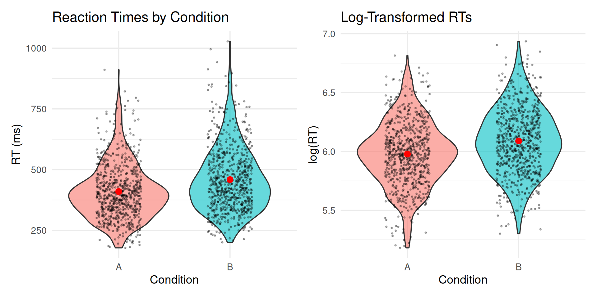{width=960}
:::
:::


## Fit the Model


::: {.cell}

```{.r .cell-code}
# Define priors
rt_priors <- c(
  prior(normal(6, 1), class = Intercept),     # Baseline around 400ms
  prior(normal(0, 0.5), class = b),           # Effects typically < 50% change
  prior(exponential(1), class = sd),          # Moderate random effects
  prior(exponential(2), class = sigma),       # Residual noise
  prior(lkj(2), class = cor)                  # Slight correlation regularization
)

# Fit model
rt_model <- brm(
  log_rt ~ condition + (1 + condition | subject) + (1 | item),
  data = rt_data,
  family = gaussian(),
  prior = rt_priors,
  iter = 2000,
  warmup = 1000,
  chains = 4,
  cores = 4,
  seed = 2026,
  backend = "cmdstanr",
  control = list(adapt_delta = 0.95)
)
```
:::


## Model Summary


::: {.cell}

```{.r .cell-code}
summary(rt_model)
```

::: {.cell-output .cell-output-stdout}

``` r
 Family: gaussian 
  Links: mu = identity 
Formula: log_rt ~ condition + (1 + condition | subject) + (1 | item) 
   Data: rt_data (Number of observations: 1440) 
  Draws: 4 chains, each with iter = 2000; warmup = 1000; thin = 1;
         total post-warmup draws = 4000

Multilevel Hyperparameters:
~item (Number of levels: 24) 
              Estimate Est.Error l-95% CI u-95% CI Rhat Bulk_ESS Tail_ESS
sd(Intercept)     0.11      0.02     0.08     0.16 1.00      870     1458

~subject (Number of levels: 30) 
                          Estimate Est.Error l-95% CI u-95% CI Rhat Bulk_ESS
sd(Intercept)                 0.17      0.02     0.13     0.22 1.00      790
sd(conditionB)                0.06      0.02     0.02     0.09 1.00      879
cor(Intercept,conditionB)     0.03      0.26    -0.45     0.54 1.00     2095
                          Tail_ESS
sd(Intercept)                 1296
sd(conditionB)                 726
cor(Intercept,conditionB)     2035

Regression Coefficients:
           Estimate Est.Error l-95% CI u-95% CI Rhat Bulk_ESS Tail_ESS
Intercept      5.98      0.04     5.90     6.05 1.01      478      992
conditionB     0.11      0.02     0.08     0.14 1.00     2917     2927

Further Distributional Parameters:
      Estimate Est.Error l-95% CI u-95% CI Rhat Bulk_ESS Tail_ESS
sigma     0.20      0.00     0.19     0.21 1.00     4011     3063

Draws were sampled using sample(hmc). For each parameter, Bulk_ESS
and Tail_ESS are effective sample size measures, and Rhat is the potential
scale reduction factor on split chains (at convergence, Rhat = 1).
```


:::
:::


# ROPE (Kruschke, 2015) and Decision Analysis (Gelman et al., 2013)

## ROPE

Statistical significance tells us if an effect differs from zero. But:

- **Statistical question:** Is the effect *exactly* zero?
- **Practical question:** Is the effect *close enough* to zero to ignore?

This is where **ROPE** (Region of Practical Equivalence) comes in.

### Making ROPE-based Decisions 

Instead of testing if β = 0 exactly, we define a small interval around zero:

$$\text{ROPE} = [-\varepsilon, +\varepsilon]$$

where $\varepsilon$ is the **smallest effect size we care about** (domain-specific).

**Decision rules:**

1. **95% HDI entirely inside ROPE** → Accept practical equivalence (effect negligible)
2. **95% HDI entirely outside ROPE** → Reject equivalence (effect matters)  
3. **95% HDI overlaps ROPE** → Uncertain (collect more data or accept uncertainty)

### Setting ROPE Boundaries

::: {.callout-important}
## Common Pitfall: Post-Hoc ROPE Boundaries

ROPE boundaries must be set **before seeing results** based on:

- Domain knowledge (e.g., "RT differences < 50ms are imperceptible")
- Standardized effect sizes (e.g., "Cohen's d < 0.1 considered negligible")

**Mistake:** Setting ROPE after looking at posterior to get desired conclusion.

**Why it matters:** Post-hoc boundaries invalidate the test (like p-hacking).
:::

### Four Methods for Justifying ROPE Boundaries

**From Kruschke (2015, Chapter 12):** ROPE boundaries should represent the smallest effect you care about. Here are four principled methods for setting them:

#### Method 1: Previous Research / Meta-Analysis

Use effect sizes from prior literature to calibrate what counts as "small."


::: {.cell}

```{.r .cell-code  code-fold="false"}
# Example: Meta-analysis shows typical RT effect = 100ms (≈0.10 log-units)
# Decision: Set ROPE at 1/3 of typical effect
rope_from_meta <- c(-0.03, 0.03)
```
:::


| Method | Typical Effect | ROPE Boundaries | Interpretation |
|--------|---------------|-----------------|----------------|
| Based on Meta-Analysis | 0.10 log-units (100ms or 10%) | [-0.03, 0.03] | Effects < 3% are small relative to field norms |


::: {.cell}

:::


**When to use:**

- Mature research area with existing effect size estimates
- You want to compare to "typical" effects in the field
- You have access to meta-analyses or large-scale studies

**Example:**
```
In their meta-analysis of 50 reading time studies, Smith et al. (2020) 
report a mean effect of d = 0.35 for syntactic complexity manipulations. 
We set our ROPE at d = 0.10 (approximately 1/3 of the typical effect), 
corresponding to ±0.03 log-RT units.
```

#### Method 2: Measurement Precision

ROPE should exceed measurement error—otherwise you're testing noise.


::: {.cell}

```{.r .cell-code  code-fold="false"}
# Example: RT measurement error ≈ 20ms from test-retest reliability
# On log scale: 20ms ≈ 0.02 log-units for typical RTs around 400ms
measurement_error <- 0.02

# ROPE should be at least 1.5× measurement error
rope_from_measurement <- c(-1.5 * measurement_error, 1.5 * measurement_error)
```
:::


| Method | Measurement Error | ROPE Boundaries | Interpretation |
|--------|------------------|-----------------|----------------|
| Based on Measurement Precision | 0.02 log-units (≈20ms) | [-0.03, 0.03] | Effects smaller than measurement error are unreliable |


::: {.cell}

:::


**When to use:**

- You have reliability/measurement error estimates
- You want to avoid claiming effects smaller than noise
- Measurement precision is the limiting factor

**How to estimate measurement error:**


::: {.cell}

```{.r .cell-code  code-fold="false"}
# From test-retest data:
# 1. Collect same participants in same conditions twice
# 2. Compute within-subject SD of differences
# 3. Use this as measurement error estimate

# Or from existing data:
within_subj_sd <- rt_data %>%
  group_by(subject, condition) %>%
  summarise(mean_rt = mean(log_rt), .groups = "drop") %>%
  group_by(subject) %>%
  summarise(sd_rt = sd(mean_rt), .groups = "drop") %>%
  pull(sd_rt) %>%
  mean()

rope_value <- 1.5 * within_subj_sd

tibble(
  Measure = c("Within-subject SD", "Suggested ROPE (±)", "ROPE Boundaries"),
  Value = c(
    round(within_subj_sd, 3),
    round(rope_value, 3),
    sprintf("[%.3f, %.3f]", -rope_value, rope_value)
  )
)
```

::: {.cell-output .cell-output-stdout}

```
# A tibble: 3 × 2
  Measure            Value          
  <chr>              <chr>          
1 Within-subject SD  0.085          
2 Suggested ROPE (±) 0.127          
3 ROPE Boundaries    [-0.127, 0.127]
```


:::
:::


#### Method 3: Perceptual/Practical Thresholds

Effects below perception or practical impact are negligible by definition.


::: {.cell}

```{.r .cell-code  code-fold="false"}
# Example: Pilot study (N=20) with post-experiment debriefing
# Result: Readers cannot perceive < 50ms differences
# 50ms ≈ 0.05 log-units → This IS our ROPE
rope_from_perception <- c(-0.05, 0.05)
```
:::


| Method | Perceptual Threshold | ROPE Boundaries | Interpretation |
|--------|---------------------|-----------------|----------------|
| Based on Perceptual Threshold | 50ms (0.05 log-units) | [-0.05, 0.05] | Effects imperceptible to readers are negligible |


::: {.cell}

:::


**When to use:**

- You can measure perceptual/practical thresholds
- You care about real-world impact (not just statistical detection)
- You have pilot data or existing benchmarks

**Example applications:**

- **Reading:** Just-noticeable difference in reading time
- **Accuracy:** Minimal detectable accuracy change
- **Rating scales:** Smallest perceived difference on Likert scale
- **Medical:** Minimum clinically meaningful difference (MCID)

**How to measure perceptual thresholds:**
```
Pilot study design:
1. Show participants trials from both conditions
2. Ask: "Did you notice any difference in difficulty/speed?"
3. Correlate subjective reports with actual RT differences
4. Find threshold below which participants don't notice
→ Use this threshold as ROPE
```

#### Method 4: Standardized Effect Sizes (Cohen's d)

Use conventional effect size benchmarks from your field.


::: {.cell}

```{.r .cell-code  code-fold="false"}
# Cohen's guidelines: d = 0.2 is "small"
# Set ROPE at half of small: d = 0.10

# Convert Cohen's d to log-RT scale:
# d = (mean1 - mean2) / pooled_SD
# For our RT data, pooled_SD ≈ 0.20 (from residual variation)
# d = 0.10 → Δmean = 0.10 × 0.20 = 0.02 log-units

cohens_d_small <- 0.10
pooled_sd_estimate <- 0.20
rope_from_cohens_d <- cohens_d_small * pooled_sd_estimate
```
:::


| Method | Cohen's d Threshold | Estimated Pooled SD | ROPE Boundaries | Interpretation |
|--------|--------------------|--------------------|-----------------|----------------|
| Based on Standardized Effect Size | 0.1 (half of 'small' effect) | 0.2 log-units | [-0.02, 0.02] | Effects with d < 0.10 are 'very small' |


::: {.cell}

:::


**When to use:**

- No domain-specific benchmarks available
- You want to follow field conventions
- Standardized metrics are expected in your area

**Common benchmarks:**

- **Cohen's d:** Small = 0.2, Medium = 0.5, Large = 0.8
- **Correlation (r):** Small = 0.1, Medium = 0.3, Large = 0.5  
- **R²:** Small = 0.01, Medium = 0.09, Large = 0.25

**Note:** These are **conventions**, not laws of nature! Domain-specific thresholds (Methods 1-3) are usually better.


### For RT Data (log-scale)

For our analysis:

- **ROPE = [-0.05, +0.05]** on the log scale
- **On original scale:** This corresponds to RT ratios between 0.95 and 1.05
  - Since we model log(RT), a difference of ±0.05 on the log scale = $e^{\pm 0.05}$ = multiplying RT by 0.95 to 1.05
  - Example: If Condition A = 400ms, ROPE means effects between 380ms and 420ms (±5%)
- **Interpretation:** RT differences smaller than 5% are too small to be practically meaningful

## Understanding ROPE Graphically 

### Excursion to Decision Analysis: The Implicit Utility Function (Gelman et al., 2013)

Let's make explicit what ROPE boundaries mean in decision-theoretic terms (Gelman et al., 2013, Chapter 9; [Stan User's Guide on Decision Analysis](https://mc-stan.org/docs/stan-users-guide/decision-analysis.html)):

**Scenario**: You must decide whether to claim "Condition B is meaningfully slower" or "Condition B is essentially equivalent to A".

**Utility function** (simplified for illustration):


::: {.cell}

```{.r .cell-code}
# Define utility function
utility <- function(beta, decision, rope_bounds) {
  rope_lower <- rope_bounds[1]
  rope_upper <- rope_bounds[2]
  
  if (decision == "claim_meaningful") {
    # Utility of claiming meaningful effect
    # Correct if |beta| > rope_upper, costly error if inside ROPE
    ifelse(abs(beta) > rope_upper,
           abs(beta),           # Utility increases with effect size
           -2 * abs(beta) - 0.3)  # Loss for false positive: 
                                  # -0.3 = fixed penalty for being wrong
                                  # -2*|beta| = proportional penalty (more wrong = worse)
  } else if (decision == "claim_negligible") {
    # Utility of claiming negligible effect  
    # Correct if |beta| < rope_upper, costly error if outside ROPE
    ifelse(abs(beta) < rope_upper,
           1 - abs(beta),       # Utility decreases as beta approaches boundary
           -1.5 * abs(beta) - 0.3)  # Loss for false negative:
                                    # -0.3 = fixed penalty for being wrong
                                    # -1.5*|beta| = proportional penalty (less severe than false positive)
  } else {
    # Utility of remaining undecided (collect more data)
    -0.15  # Fixed cost of additional data collection
           # This represents: study time, participant costs, delayed publication
  }
}

# Visualize utility function across possible beta values
# Extend range to show "large" effects (Cohen's d = 0.8 ≈ 0.16 on log scale with SD=0.20)
beta_range <- seq(-0.2, 0.5, length.out = 300)
utility_data <- expand.grid(
  beta = beta_range,
  decision = c("claim_meaningful", "claim_negligible", "undecided")
) %>%
  mutate(
    utility = mapply(utility, beta, decision, 
                     MoreArgs = list(rope_bounds = c(-0.05, 0.05)))
  )

# Define Cohen's d reference points (assuming pooled SD ≈ 0.20)
cohens_d_refs <- tibble(
  label = c("Small\n(d=0.2)", "Medium\n(d=0.5)", "Large\n(d=0.8)"),
  beta_value = c(0.04, 0.10, 0.16),
  utility_y = c(0.04, 0.10, 0.16)
)

# Get posterior samples for the effect (actual data)
posterior_samples <- as_draws_df(rt_model)
beta_samples <- posterior_samples$b_conditionB

# Create three scenarios with different posteriors
# Scenario 1: Actual posterior (mostly outside ROPE → claim meaningful)
posterior_density_1 <- density(beta_samples)
posterior_df_1 <- tibble(
  beta = posterior_density_1$x,
  density = posterior_density_1$y,
  scenario = "Scenario 1: Clear Effect",
  optimal = "claim_meaningful"
) %>%
  mutate(scaled_density = (density / max(density)) * 0.8 - 0.4)  # Scale to show only above baseline

# Scenario 2: Hypothetical wide uncertain posterior (spans ROPE → undecided)
set.seed(123)
beta_samples_2 <- rnorm(4000, mean = 0.02, sd = 0.06)  # Wide uncertainty, mean near ROPE edge
posterior_density_2 <- density(beta_samples_2)
posterior_df_2 <- tibble(
  beta = posterior_density_2$x,
  density = posterior_density_2$y,
  scenario = "Scenario 2: High Uncertainty",
  optimal = "undecided"
) %>%
  mutate(scaled_density = (density / max(density)) * 0.8 - 0.4)

# Scenario 3: Hypothetical narrow posterior inside ROPE (claim negligible)
set.seed(456)
beta_samples_3 <- rnorm(4000, mean = 0.01, sd = 0.015)  # Tight, centered near zero
posterior_density_3 <- density(beta_samples_3)
posterior_df_3 <- tibble(
  beta = posterior_density_3$x,
  density = posterior_density_3$y,
  scenario = "Scenario 3: Negligible Effect",
  optimal = "claim_negligible"
) %>%
  mutate(scaled_density = (density / max(density)) * 0.8 - 0.4)

# Combine all posteriors
all_posteriors <- bind_rows(posterior_df_1, posterior_df_2, posterior_df_3)

# Replicate utility data for faceting
utility_data_faceted <- bind_rows(
  utility_data %>% mutate(scenario = "Scenario 1: Clear Effect"),
  utility_data %>% mutate(scenario = "Scenario 2: High Uncertainty"),
  utility_data %>% mutate(scenario = "Scenario 3: Negligible Effect")
)

ggplot(utility_data_faceted, aes(x = beta, y = utility, color = decision)) +
  geom_line(linewidth = 1) +
  # Add baseline for posterior
  geom_hline(yintercept = -0.4, linetype = "dotted", color = "gray40", linewidth = 0.3) +
  # Add posterior distribution (only the bump above baseline)
  geom_ribbon(data = all_posteriors, aes(x = beta, ymin = -0.4, ymax = scaled_density), 
            fill = "purple", alpha = 0.3, inherit.aes = FALSE) +
  geom_line(data = all_posteriors, aes(x = beta, y = scaled_density), 
            color = "purple", linewidth = 0.8, inherit.aes = FALSE) +
  # ROPE boundaries
  geom_vline(xintercept = c(-0.05, 0.05), linetype = "dashed", color = "blue", linewidth = 0.5) +
  geom_vline(xintercept = 0, linetype = "dotted", color = "gray50", linewidth = 0.5) +
  annotate("rect", xmin = -0.05, xmax = 0.05, ymin = -Inf, ymax = Inf,
           fill = "skyblue", alpha = 0.15) +
  # Add Cohen's d reference lines
  geom_vline(xintercept = 0.04, linetype = "dotted", color = "darkgreen", alpha = 0.4, linewidth = 0.3) +
  geom_vline(xintercept = 0.10, linetype = "dotted", color = "darkgreen", alpha = 0.4, linewidth = 0.3) +
  geom_vline(xintercept = 0.16, linetype = "dotted", color = "darkgreen", alpha = 0.4, linewidth = 0.3) +
  annotate("text", x = 0.04, y = 0.5, label = "Small\n(d=0.2)", color = "darkgreen", size = 2.5) +
  annotate("text", x = 0.10, y = 0.5, label = "Medium\n(d=0.5)", color = "darkgreen", size = 2.5) +
  annotate("text", x = 0.16, y = 0.5, label = "Large\n(d=0.8)", color = "darkgreen", size = 2.5) +
  scale_color_manual(
    values = c("claim_meaningful" = "darkgreen", 
               "claim_negligible" = "coral",
               "undecided" = "gray60"),
    name = "Decision",
    labels = c("Claim meaningful", "Claim negligible", "Undecided")
  ) +
  scale_x_continuous(breaks = seq(-0.2, 0.2, by = 0.1)) +
  facet_wrap(~ scenario, ncol = 1) +
  labs(
    title = "How Posterior Uncertainty Determines Optimal Decision",
    subtitle = "Purple = posterior distribution; Green line utility grows with effect size (showing Small/Medium/Large benchmarks)",
    x = expression("True ffect Size (" * beta * ")"),
    y = "Utility / Scaled Posterior Density"
  ) +
  theme_minimal(base_size = 12) +
  theme(
    legend.position = "top",
    strip.text = element_text(face = "bold")
  )
```

::: {.cell-output-display}
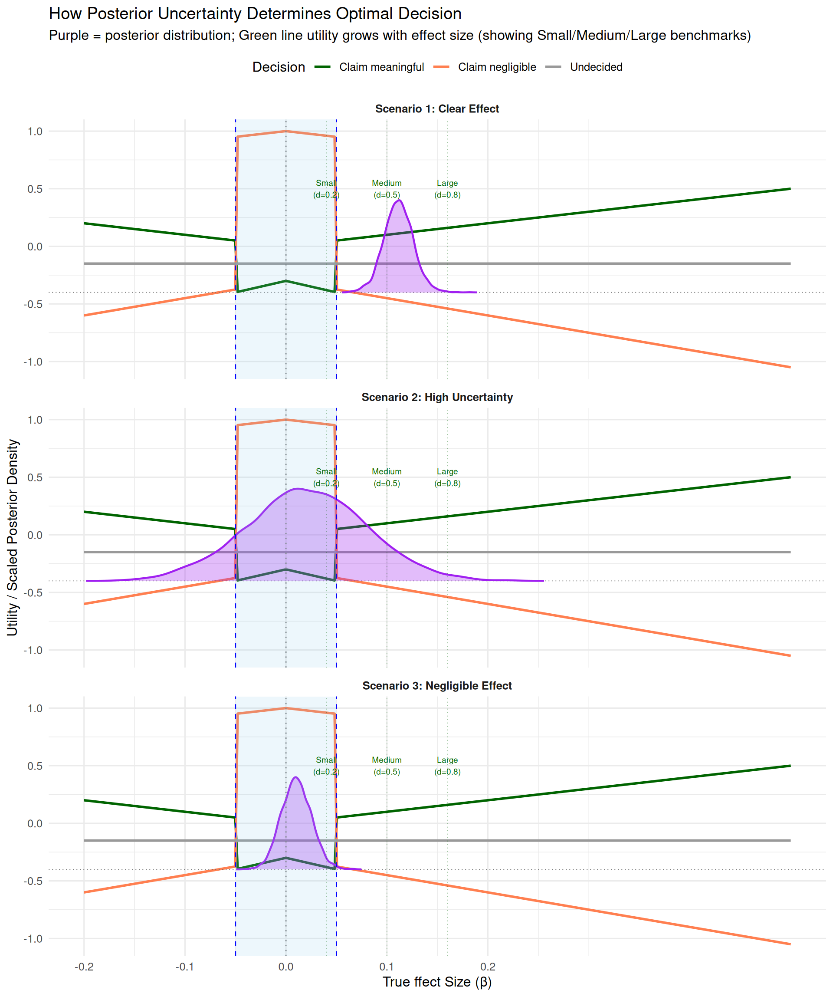{width=960}
:::
:::


**What these three scenarios show:**

1. **Scenario 1 (Clear Effect)**: Posterior mostly outside ROPE
   - Most purple area falls where green line is highest
   - **Optimal decision**: Claim meaningful effect
   - High expected utility for "claim meaningful"

2. **Scenario 2 (High Uncertainty)**: Posterior spans ROPE boundaries
   - Purple area spreads across both inside and outside ROPE
   - Risk of being wrong is high for either claim
   - **Optimal decision**: Undecided (collect more data)
   - Expected utility of claims reduced by uncertainty; -0.15 cost of more data is worth it

3. **Scenario 3 (Negligible Effect)**: Posterior concentrated inside ROPE near zero
   - Most purple area falls where orange line is highest
   - **Optimal decision**: Claim negligible effect
   - High expected utility for "claim negligible"

**Key insight**: The optimal decision emerges from integrating the utility curves (colored lines) over the posterior (purple distribution). Where your posterior mass concentrates determines which decision maximizes expected utility.

::: {.callout-note collapse="true"}
## Understanding the utility curves

1. **Why different maximum values?**
   - **Orange line (claim_negligible)**: `utility = 1 - |β|` when correct
     * Maximum = 1.0 when β = 0 exactly (finding true null is maximally valuable)
     * Decreases as β moves toward ROPE boundary
     * Reflects: "Confirming no effect is valuable, but less so as effect approaches boundary"
   - **Green line (claim_meaningful)**: `utility = |β|` when correct  
     * Utility = effect size itself (no upper bound)
     * At β = 0.12, utility = 0.12; at β = 0.25, utility = 0.25
     * Reflects: "Larger effects are more valuable to discover (stronger evidence, bigger impact)"
   - This asymmetry is a **modeling choice** - you could define utilities differently based on your field's values

2. **Inside ROPE** (|β| < 0.05): "Claim negligible" has highest utility (orange line near +1 when β ≈ 0)
3. **Outside ROPE** (|β| > 0.05): "Claim meaningful" has highest utility (green line increases with |β|)
4. **At ROPE boundaries** (|β| = 0.05): Both claim decisions have negative utility
   - At β = ±0.05 exactly:
     * claim_meaningful utility: -2(0.05) - 0.3 = **-0.40** (wrong decision, heavy penalty)
     * claim_negligible utility: -1.5(0.05) - 0.3 = **-0.375** (wrong decision, moderate penalty)
     * undecided utility: **-0.15** (cost of more data)
   - Both wrong decisions incur the -0.3 penalty (conceptual cost of "being wrong" - misleading literature, wasted resources, wrong theory) plus proportional loss
5. **When "undecided" is optimal**:
   - **KEY**: This plot shows utility IF the true β is known, but we don't know β - we have uncertainty (posterior)
   - "Undecided" is optimal when **posterior uncertainty spans the boundaries**
   - If your 95% HDI covers, say, [-0.02, 0.08]:
     * Some posterior mass inside ROPE (favors "negligible")  
     * Some posterior mass outside ROPE (favors "meaningful")
     * **Expected utility** of either claim is lowered by risk of being wrong
     * **Expected utility** of "undecided" (-0.15) can beat both risky claims
   - The grey line isn't "highest" at any single β value, but wins when averaging across uncertain β
6. **Asymmetric losses**: False positive penalty stronger than false negative
   - **Green line inside ROPE**: Drops to -2×|β| - 0.3 (steep slope, heavy penalty)
   - **Orange line outside ROPE**: Drops to -1.5×|β| - 0.3 (moderate slope, lighter penalty)
   - This asymmetry means: claiming a meaningful effect when it's negligible (false positive) is penalized more heavily
7. **The ROPE boundaries (±0.05) are where the utility functions cross zero**
   - Inside: orange (claim negligible) is positive, green (claim meaningful) is negative
   - Outside: green (claim meaningful) is positive, orange (claim negligible) is negative
   - This defines the decision boundary
   - Larger true effects → higher utility for correct "meaningful" claim (green line increases)
   - Effects closer to zero → higher utility for correct "negligible" claim (orange increases toward 1 as β→0)
   - Being wrong by a lot is worse than being wrong by a little
:::

::: {.callout-important}
## ROPE Boundaries = Utility Crossover Points

Your ROPE boundaries should be set where the utilities of "claim meaningful" and "claim negligible" are equal. This is your **smallest effect size of interest (SESOI)**.
:::

**Computing expected utilities:**


::: {.cell}

```{.r .cell-code}
# Get posterior samples
posterior_samples <- as_draws_df(rt_model)
beta_samples <- posterior_samples$b_conditionB

# Compute expected utility for each decision
expected_utilities <- data.frame(
  decision = c("claim_meaningful", "claim_negligible", "undecided"),
  expected_utility = c(
    mean(utility(beta_samples, "claim_meaningful", c(-0.05, 0.05))),
    mean(utility(beta_samples, "claim_negligible", c(-0.05, 0.05))),
    mean(utility(beta_samples, "undecided", c(-0.05, 0.05)))
  )
) %>%
  arrange(desc(expected_utility))

expected_utilities
```

::: {.cell-output .cell-output-stdout}

```
          decision expected_utility
1 claim_meaningful        0.1114245
2        undecided       -0.1500000
3 claim_negligible       -0.4671367
```


:::
:::


The optimal decision is to **claim_meaningful** (maximizes expected utility).

::: {.callout-note}
## From Decision Theory to ROPE

The traditional ROPE decision rule:
- "If 95% HDI excludes ROPE → Reject null"

...is actually an approximation to:
- "Choose the decision with maximum expected utility"

The HDI-based rule works well when:

1. Losses are approximately symmetric
2. We want to control error rates at ~5%
3. We prefer simple rules over computing expected utilities

For asymmetric losses or complex decisions, computing expected utilities explicitly (as shown above) provides more principled decisions.
:::


### The Same Graph But Simpler

ROPE analysis has **three possible outcomes**, not just two as in NHST!


::: {.cell}

```{.r .cell-code}
# Three scenarios demonstrating the three ROPE outcomes
scenarios <- tribble(
  ~scenario, ~mean, ~sd, ~conclusion, ~interpretation,
  "Decisive: Reject H₀", 0.12, 0.015, "HDI excludes ROPE", "Effect is practically meaningful",
  "Decisive: Accept H₀", 0.02, 0.008, "HDI inside ROPE", "Effect is practically negligible", 
  "Undecided", 0.06, 0.025, "HDI overlaps ROPE", "Insufficient precision—collect more data"
)

# Generate plots for each scenario
plots <- map(1:3, function(i) {
  x <- seq(-0.1, 0.25, length.out = 1000)
  y <- dnorm(x, scenarios$mean[i], scenarios$sd[i])
  
  # Calculate HDI for this scenario
  samples <- rnorm(10000, scenarios$mean[i], scenarios$sd[i])
  hdi_bounds <- HDInterval::hdi(samples, credMass = 0.95)
  
  tibble(x = x, density = y) %>%
    ggplot() +
    # ROPE region
    geom_rect(xmin = -0.05, xmax = 0.05, 
              ymin = -Inf, ymax = Inf,
              fill = "gray80", alpha = 0.5) +
    # Posterior distribution
    geom_line(aes(x, density), linewidth = 1.2, color = "steelblue") +
    geom_area(aes(x, density), fill = "steelblue", alpha = 0.3) +
    # HDI (thick line at bottom)
    geom_segment(
      x = hdi_bounds[1],
      xend = hdi_bounds[2],
      y = 0, yend = 0,
      linewidth = 4, color = "darkblue"
    ) +
    # Null value line
    geom_vline(xintercept = 0, linetype = "dashed", color = "red", alpha = 0.6) +
    # Annotations
    annotate("text", x = 0, y = max(y) * 0.95, 
             label = "ROPE", size = 4, fontface = "bold") +
    annotate("text", x = scenarios$mean[i], y = max(y) * 0.5, 
             label = scenarios$interpretation[i],
             size = 3.5, fontface = "bold", color = "darkblue") +
    annotate("text", x = mean(hdi_bounds), y = -max(y) * 0.05,
             label = "95% HDI", size = 3, color = "darkblue", fontface = "bold") +
    # Labels for ROPE boundaries
    geom_vline(xintercept = c(-0.05, 0.05), linetype = "dotted", alpha = 0.5) +
    annotate("text", x = -0.05, y = max(y) * 0.8, label = "−0.05", size = 2.5, hjust = 1.2) +
    annotate("text", x = 0.05, y = max(y) * 0.8, label = "+0.05", size = 2.5, hjust = -0.2) +
    labs(
      title = scenarios$scenario[i],
      subtitle = scenarios$conclusion[i],
      x = "Effect Size (β)", 
      y = "Posterior Density"
    ) +
    coord_cartesian(ylim = c(-max(y) * 0.1, max(y) * 1.05)) +
    theme_minimal(base_size = 12) +
    theme(
      axis.text.y = element_blank(),
      axis.ticks.y = element_blank(),
      plot.title = element_text(face = "bold", size = 13),
      plot.subtitle = element_text(face = "italic", size = 11)
    )
})

# Combine plots
wrap_plots(plots, ncol = 1) +
  plot_annotation(
    title = "Three Possible ROPE Outcomes",
    subtitle = "ROPE boundaries: [−0.05, +0.05]  |  Shaded gray region = ROPE  |  Thick blue line = 95% HDI",
    theme = theme(
      plot.title = element_text(size = 16, face = "bold"),
      plot.subtitle = element_text(size = 12)
    )
  )
```

::: {.cell-output-display}
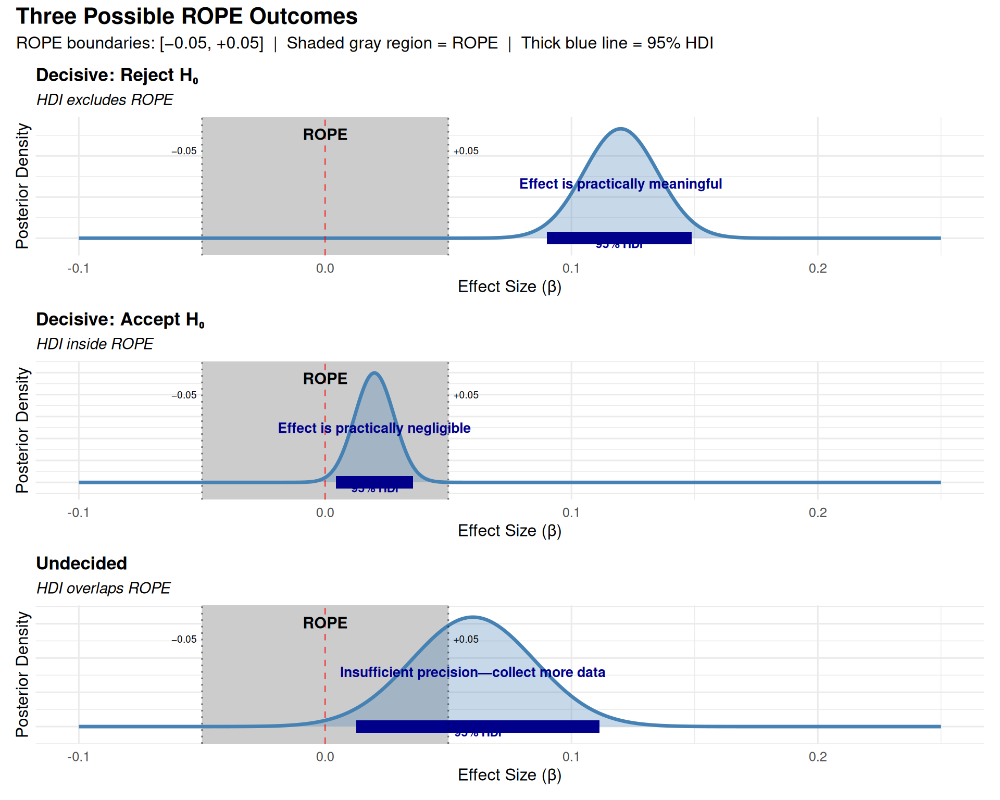{width=960}
:::
:::


::: {.callout-important}
## Three Outcomes, Not Two!

**Current practice shows:**

1. **HDI excludes ROPE** → Reject H₀ (effect is meaningful)
   - Example: 95% HDI = [0.09, 0.15], ROPE = [−0.05, 0.05]
   - Interpretation: "Effect is decisively larger than our practical significance threshold"

2. **HDI inside ROPE** → Accept H₀ (effect is negligible)
   - Example: 95% HDI = [0.01, 0.03], ROPE = [−0.05, 0.05]
   - Interpretation: "Effect is decisively smaller than our practical significance threshold"

3. **HDI overlaps ROPE** → UNDECIDED (insufficient precision)
   - Example: 95% HDI = [0.03, 0.09], ROPE = [−0.05, 0.05]
   - Interpretation: "We cannot make a clear decision—some credible values are meaningful, others aren't"
   - **This is not a failure!** It's honest reporting of uncertainty

:::

::: {.callout-note}
## "Undecided" Is a Feature, Not a Bug

From Kruschke (2015, p. 338):

> "Be clear that any discrete decision about rejecting or accepting a null value does not exhaustively capture our knowledge about the parameter value. Our knowledge about the parameter value is described by the **full posterior distribution**."

**When HDI overlaps ROPE:**
- You have learned something: The effect might or might not be meaningful
- Your options:
  1. Collect more data to narrow the posterior
  2. Accept the uncertainty and make a practical decision based on other factors
  3. Use a less conservative threshold (e.g., 89% HDI instead of 95%)
- **Don't** force a binary decision when the data don't support one!
:::

### ROPE Decision Flowchart

```
                    Calculate 95% HDI
                            ↓
              ┌─────────────┴─────────────┐
              │                           │
        Does HDI exclude ROPE?      Does HDI fall
              │                      inside ROPE?
              │                           │
         YES  ↓  NO                  YES  ↓  NO
              │                           │
   ┌──────────┘                           └──────────┐
   │                                                  │
   ↓                                                  ↓
Reject H₀:                                      UNDECIDED:
"Effect is                                    "Overlapping—
 meaningful"                                   insufficient
                                               precision"
                     ↑
                     │
                 Accept H₀:
                "Effect is
                 negligible"
```

::: {.callout-note collapse="true"}
## Manual ROPE Calculation (HDI-Based Approximation)

ROPE is simpler than computing utilities explicitly and works well for most research questions.

**In practice, we usually use the HDI-based ROPE approximation** rather than computing expected utilities explicitly. This is computationally simpler and works well when:
- Losses are approximately symmetric (false positive ≈ false negative)
- We want standard 95% decision threshold  
- We prefer simple rules over custom utility functions

Now let's use the traditional ROPE decision rules (which approximate the decision-theoretic framework):


::: {.cell}

```{.r .cell-code}
# Define ROPE boundaries (domain-specific!)
rope_lower <- -0.05
rope_upper <- 0.05

# Extract posterior samples for condition effect
posterior_samples <- as_draws_df(rt_model)
condition_effect <- posterior_samples$b_conditionB

# Calculate proportions
prop_in_rope <- mean(condition_effect > rope_lower & condition_effect < rope_upper)
prop_below_rope <- mean(condition_effect < rope_lower)
prop_above_rope <- mean(condition_effect > rope_upper)

# Calculate 95% HDI
hdi_95 <- HDInterval::hdi(condition_effect, credMass = 0.95)

# Create summary table
tibble(
  Measure = c(
    "ROPE boundaries",
    "95% HDI",
    "% Below ROPE",
    "% Inside ROPE",
    "% Above ROPE"
  ),
  Value = c(
    sprintf("[%.2f, %.2f]", rope_lower, rope_upper),
    sprintf("[%.3f, %.3f]", hdi_95[1], hdi_95[2]),
    sprintf("%.1f%%", prop_below_rope * 100),
    sprintf("%.1f%%", prop_in_rope * 100),
    sprintf("%.1f%%", prop_above_rope * 100)
  )
)
```

::: {.cell-output .cell-output-stdout}

```
# A tibble: 5 × 2
  Measure         Value         
  <chr>           <chr>         
1 ROPE boundaries [-0.05, 0.05] 
2 95% HDI         [0.084, 0.142]
3 % Below ROPE    0.0%          
4 % Inside ROPE   0.0%          
5 % Above ROPE    100.0%        
```


:::

```{.r .cell-code}
# Decision based on HDI
if (hdi_95[1] > rope_upper) {
  decision <- "**REJECT equivalence**: Effect is practically meaningful (positive) - 95% HDI entirely above ROPE"
} else if (hdi_95[2] < rope_lower) {
  decision <- "**REJECT equivalence**: Effect is practically meaningful (negative) - 95% HDI entirely below ROPE"
} else if (hdi_95[1] > rope_lower && hdi_95[2] < rope_upper) {
  decision <- "**ACCEPT equivalence**: Effect is practically negligible - 95% HDI entirely inside ROPE"
} else {
  decision <- "**UNCERTAIN**: Effect overlaps ROPE - Need more data or accept uncertainty"
}

decision
```

::: {.cell-output .cell-output-stdout}

```
[1] "**REJECT equivalence**: Effect is practically meaningful (positive) - 95% HDI entirely above ROPE"
```


:::
:::


::: {.callout-note}
## Concepts So Far

Before moving on, you should understand:
- ROPE boundaries represent the smallest effect you care about
- Three possible decisions: Accept H₀, Accept H₁, or remain undecided
- Decision based on whether 95% HDI overlaps, excludes, or is inside ROPE
- This approximates choosing the decision with maximum expected utility
:::

::: {.callout-tip}
## Decision Rule = Maximizing Expected Utility

**What just happened in decision-theoretic terms:**

1. **We computed posterior probabilities**: P(β in each region | Data)
2. **We applied a decision rule**: Based on where 95% HDI falls
3. **This approximates**: Choosing decision with maximum expected utility

**The connection:**
- When 95% HDI > ROPE: E[U("meaningful")] > E[U("negligible")] with high confidence
- When 95% HDI < ROPE: E[U("negligible")] > E[U("meaningful")] with high confidence
- When overlapping: Expected utilities too close to call → "undecided" optimal

**The 95% threshold** encodes a loss function where:
- We're willing to accept 5% risk of wrong decision
- Losses are approximately symmetric for false positives vs. false negatives

If your losses are **asymmetric** (e.g., false positives much worse), you should:
- Use stricter threshold (e.g., 99% HDI), OR
- Compute expected utilities explicitly (as shown in previous section)
:::

### Visualizing ROPE


::: {.cell}

```{.r .cell-code}
library(tidybayes)
library(patchwork)

# Create density plot with ROPE shading
p1 <- posterior_samples %>%
  ggplot(aes(x = b_conditionB)) +
  # Shade ROPE region
  annotate("rect", 
           xmin = rope_lower, xmax = rope_upper,
           ymin = 0, ymax = Inf,
           fill = "skyblue", alpha = 0.3) +
  # Posterior density
  stat_halfeye(.width = c(0.95, 0.89), fill = "steelblue") +
  # ROPE boundaries
  geom_vline(xintercept = c(rope_lower, rope_upper), 
             linetype = "dashed", color = "blue", linewidth = 1) +
  geom_vline(xintercept = 0, linetype = "dotted", color = "gray50") +
  # Labels
  annotate("text", x = 0, y = Inf, label = "ROPE", 
           vjust = -0.5, color = "blue", fontface = "bold") +
  labs(
    title = "Posterior Distribution with ROPE",
    subtitle = paste0("ROPE: [", rope_lower, ", ", rope_upper, "]"),
    x = "Condition B Effect (log RT)",
    y = "Density"
  ) +
  theme_minimal(base_size = 12)

# Create proportion bar chart
rope_data <- data.frame(
  Region = factor(c("Below ROPE", "Inside ROPE", "Above ROPE"),
                  levels = c("Below ROPE", "Inside ROPE", "Above ROPE")),
  Proportion = c(prop_below_rope, prop_in_rope, prop_above_rope)
)

p2 <- ggplot(rope_data, aes(x = Region, y = Proportion, fill = Region)) +
  geom_col(width = 0.7) +
  geom_text(aes(label = paste0(round(Proportion * 100, 1), "%")),
            vjust = -0.5, size = 4, fontface = "bold") +
  scale_fill_manual(values = c("Below ROPE" = "coral", 
                                "Inside ROPE" = "skyblue",
                                "Above ROPE" = "lightgreen")) +
  scale_y_continuous(labels = scales::percent, limits = c(0, 1)) +
  labs(
    title = "Posterior Mass in Each Region",
    x = NULL,
    y = "Proportion of Posterior"
  ) +
  theme_minimal(base_size = 12) +
  theme(legend.position = "none")

# Combine plots
p1 + p2 + plot_annotation(
  title = "Manual ROPE Analysis",
  theme = theme(plot.title = element_text(size = 14, face = "bold"))
)
```

::: {.cell-output-display}
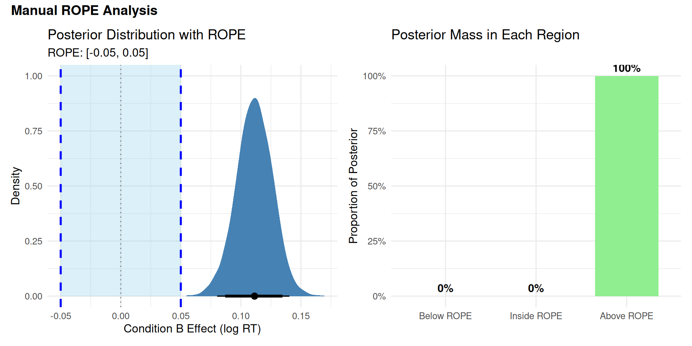{width=960}
:::
:::

:::

## Warning

::: {.callout-warning}
## The Precision Problem

**From Kruschke (2015, Section 12.2.1.1):** Even with very little data, you can "accept" the null if the posterior is flat enough!

This is one of the most overlooked caveats about ROPE analysis.
:::

::: {.callout-note collapse="true"}
### Dangerous Example: Accepting H₀ with Poor Data


::: {.cell}

```{.r .cell-code}
# Scenario: Only 2 coin flips, 1 head, 1 tail
# Question: Is the coin fair (θ = 0.5)?

n <- 2
z <- 1

# With uninformative prior Beta(0.01, 0.01):
posterior_alpha <- z + 0.01
posterior_beta <- n - z + 0.01

# The posterior is EXTREMELY FLAT (very little information)
theta <- seq(0, 1, length.out = 1000)
posterior_density <- dbeta(theta, posterior_alpha, posterior_beta)

# Calculate HDI
samples <- rbeta(10000, posterior_alpha, posterior_beta)
hdi_result <- HDInterval::hdi(samples, credMass = 0.95)

# Define ROPE around fair coin
rope_bounds <- c(0.45, 0.55)

# Visualize
tibble(theta = theta, density = posterior_density) %>%
  ggplot(aes(x = theta, y = density)) +
  geom_rect(xmin = rope_bounds[1], xmax = rope_bounds[2],
            ymin = -Inf, ymax = Inf,
            fill = "gray80", alpha = 0.5) +
  geom_line(color = "steelblue", linewidth = 1.2) +
  geom_area(fill = "steelblue", alpha = 0.2) +
  geom_segment(x = hdi_result[1], xend = hdi_result[2],
               y = 0, yend = 0,
               color = "darkblue", linewidth = 3) +
  annotate("text", x = 0.5, y = max(posterior_density) * 0.9,
           label = "ROPE\n(fair coin)", size = 4, fontface = "bold") +
  annotate("text", x = 0.5, y = max(posterior_density) * 0.5,
           label = "Posterior is FLAT\n(very uncertain!)",
           size = 4, color = "red", fontface = "bold") +
  annotate("text", x = 0.5, y = -0.1,
           label = "95% HDI spans almost entire range!",
           size = 3.5, color = "darkblue", fontface = "bold") +
  labs(
    title = "Danger: 'Accepting' H₀ with Insufficient Data",
    subtitle = "HDI technically inside ROPE, but only because we have almost no information",
    x = "Probability of Heads (θ)",
    y = "Posterior Density"
  ) +
  theme_minimal(base_size = 14)
```

::: {.cell-output-display}
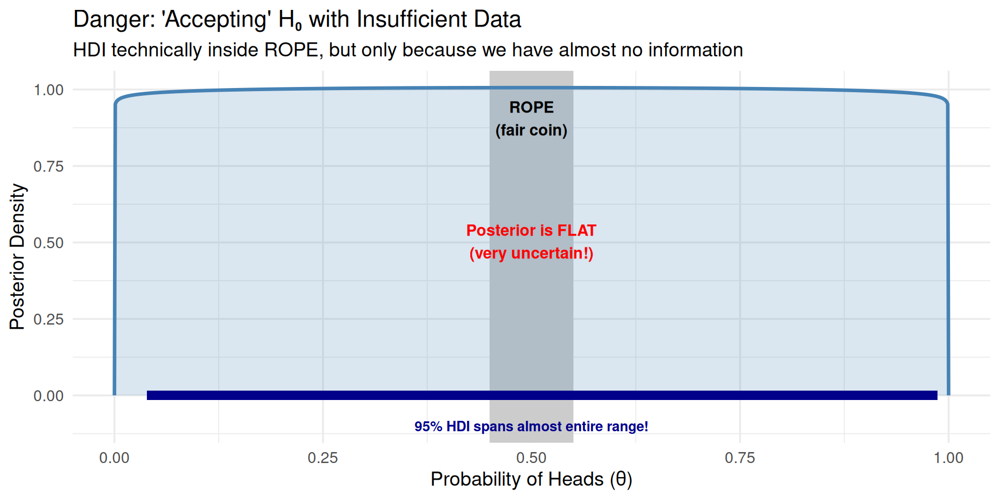{width=960}
:::

```{.r .cell-code}
# Print summary
tibble(
  Measure = c("Data", "95% HDI for θ", "HDI Width"),
  Value = c(
    "1 head out of 2 flips",
    sprintf("[%.3f, %.3f]", hdi_result[1], hdi_result[2]),
    round(hdi_result[2] - hdi_result[1], 3)
  )
)
```

::: {.cell-output .cell-output-stdout}

```
# A tibble: 3 × 2
  Measure       Value                
  <chr>         <chr>                
1 Data          1 head out of 2 flips
2 95% HDI for θ [0.039, 0.986]       
3 HDI Width     0.947                
```


:::
:::


**Kruschke's solution (p. 348):**

> "High precision demands a large sample size... But when we are trying to accept a specific value of θ, it seems logically appropriate that we should have a reasonably precise estimate indicating that specific value."
:::

### Three Checks Before Trusting ROPE 

Before trusting ROPE conclusions when accepting H₀, verify precision with these three checks:

**1. HDI Width: Is your estimate precise enough?**

   - **Rule**: HDI width should be < half the ROPE width
   - **Rationale**: If HDI is wide relative to ROPE, you lack precision to confidently say effect is negligible
   - **Example**: ROPE = [-0.05, 0.05] (width 0.10) → HDI width should be < 0.05
   - **If fail**: Collect more data before claiming negligible effect

**2. Effective Sample Size (ESS): Is your posterior reliable?**

   - **Rule**: ESS bulk > 1000 AND ESS tail > 1000
   - **Rationale**: Low ESS means MCMC chains haven't converged well - posterior estimates unreliable
   - **ESS bulk**: Measures sampling efficiency for central posterior
   - **ESS tail**: Measures sampling efficiency for HDI boundaries (critical for ROPE!)
   - **If fail**: Increase MCMC iterations, check convergence diagnostics (R̂), consider reparameterization

**3. Posterior SD: Is uncertainty manageable relative to ROPE?**

   - **Rule**: Posterior SD < half the ROPE width (SD/ROPE ratio < 0.5)
   - **Rationale**: Large SD means high uncertainty - even if HDI is inside ROPE, estimate may be unstable
   - **Example**: ROPE width = 0.10 → Posterior SD should be < 0.05
   - **If fail**: Either collect more data OR accept that you're at the limits of what your design can resolve


::: {.cell}

```{.r .cell-code}
# Extract posterior for the effect of interest
post <- as_draws_df(rt_model)
effect_samples <- post$b_conditionB

# 1. Check HDI width
hdi_result <- HDInterval::hdi(effect_samples, credMass = 0.95)
hdi_width <- hdi_result[2] - hdi_result[1]

# 2. Check ESS
ess_bulk <- as.numeric(summarise_draws(post, ess_bulk)$ess_bulk[2])  # For b_conditionB
ess_tail <- as.numeric(summarise_draws(post, ess_tail)$ess_tail[2])

# 3. Check posterior SD
post_sd <- sd(effect_samples)
rope_width <- 0.10  # Our ROPE is [-0.05, 0.05]
threshold_width <- 0.05  # Threshold for HDI width check

# Display precision checks
tibble(
  Check = c(
    "1. HDI Width",
    "   Status",
    "2. Effective Sample Size (bulk)",
    "   Effective Sample Size (tail)",
    "   Status",
    "3. Posterior SD",
    "   SD/ROPE Ratio",
    "   Status"
  ),
  Value = c(
    round(hdi_width, 4),
    ifelse(hdi_width < threshold_width, 
           paste0("✓ PASS (< ", threshold_width, ")"),
           paste0("✗ FAIL (> ", threshold_width, ") - Need more data")),
    round(ess_bulk),
    round(ess_tail),
    ifelse(ess_bulk > 1000 && ess_tail > 1000,
           "✓ PASS (> 1000)",
           "✗ WARNING (< 1000) - Posterior not well-estimated"),
    round(post_sd, 4),
    round(post_sd / rope_width, 2),
    ifelse(post_sd < rope_width / 2,
           "✓ PASS (< half ROPE)",
           "⚠ CAUTION (large relative to ROPE)")
  )
)
```

::: {.cell-output .cell-output-stdout}

```
# A tibble: 8 × 2
  Check                             Value                           
  <chr>                             <chr>                           
1 "1. HDI Width"                    0.0576                          
2 "   Status"                       ✗ FAIL (> 0.05) - Need more data
3 "2. Effective Sample Size (bulk)" 2387                            
4 "   Effective Sample Size (tail)" 2584                            
5 "   Status"                       ✓ PASS (> 1000)                 
6 "3. Posterior SD"                 0.0146                          
7 "   SD/ROPE Ratio"                0.15                            
8 "   Status"                       ✓ PASS (< half ROPE)            
```


:::
:::


**Note**: The HDI width check flagged a warning (0.0576 > 0.05 threshold). This indicates moderate precision—sufficient for rejecting H₀ (since HDI excludes ROPE), but we'd want narrower estimates if claiming equivalence. With N=50 subjects, the HDI width would likely pass this check.

### Scenario Examples

**Scenario 1: Wide HDI Inside ROPE**

- 95% HDI: [0.01, 0.04] (width = 0.03)
- ROPE: [-0.05, 0.05]
- ✗ WRONG: "Effect is negligible"
- ✓ RIGHT: "HDI inside ROPE, but width (0.03) suggests moderate uncertainty. More data needed."

**Scenario 2: Narrow HDI Inside ROPE**

- 95% HDI: [0.015, 0.025] (width = 0.01)
- ROPE: [-0.05, 0.05]
- ✓ RIGHT: "Effect is negligible. HDI is narrow (0.01) and falls well within ROPE."

**Scenario 3: HDI Overlaps ROPE Boundary**

- 95% HDI: [0.03, 0.08]
- ROPE: [-0.05, 0.05]
- ✓ RIGHT: "Undecided. Some credible values fall within ROPE, others exceed it. More data needed."

::: {.callout-important}
## Rules of Thumb for Precision

Before using ROPE to **accept H₀** (claim negligible effect), verify:

**For RT effects (log-scale):**

- HDI width < 0.05 log-units
- Posterior SD < 0.025 (half the typical ROPE width)
  - *Why?* Larger SD means too much uncertainty about whether the effect is truly negligible.

**For accuracy (probability scale):**

- HDI width < 0.10
- Posterior SD < 0.05

**For all analyses:**

- ESS (bulk) > 1000
- ESS (tail) > 1000
- Convergence diagnostics passed (R̂ < 1.01)

**If these checks fail:**

- Don't claim effect is negligible
- Report "insufficient precision" or "undecided"
- Consider collecting more data
:::

::: {.callout-tip}
## When You Can Trust ROPE to Accept H₀

**Strong evidence for negligible effect requires:**

1. **Narrow posterior:** HDI width < half ROPE width
2. **Central location:** HDI midpoint near zero
3. **Good sampling:** ESS > 1000, R̂ < 1.01
4. **Model fit:** Posterior predictive checks pass

**Example of strong evidence:**
```
Effect: β = 0.02 (95% HDI: [0.01, 0.03])
ROPE: [-0.05, 0.05]
HDI width: 0.02 (✓ narrow)
ESS: 2500 (✓ adequate)
→ Can confidently claim negligible effect
```

**Example of weak evidence:**
```
Effect: β = 0.02 (95% HDI: [-0.01, 0.05])
ROPE: [-0.05, 0.05]
HDI width: 0.06 (✗ too wide)
ESS: 800 (✗ marginal)
→ Cannot confidently claim negligible effect
```
:::

## Using bayestestR Package

The `bayestestR` package provides convenient functions for ROPE analysis.


::: {.cell}

```{.r .cell-code}
library(bayestestR)

# Automatic ROPE analysis
rope_result <- rope(rt_model, ci = 0.95, range = c(rope_lower, rope_upper))

print(rope_result)
```

::: {.cell-output .cell-output-stdout}

``` r
# Proportion of samples inside the ROPE [-0.05, 0.05]:

Parameter  | Inside ROPE
------------------------
Intercept  |      0.00 %
conditionB |      0.00 %
```


:::
:::


### Interpretation

The output shows:

- **% in ROPE**: Proportion of 95% HDI inside ROPE
- Interpretation automatically provided

### Visualizing with bayestestR


::: {.cell}

```{.r .cell-code}
# Create ROPE plot
plot(rope_result) +
  labs(title = "ROPE Analysis using bayestestR") +
  theme_minimal()
```

::: {.cell-output-display}
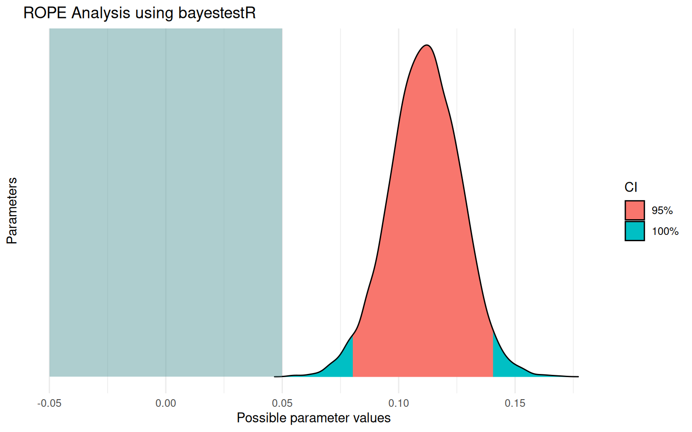{width=768}
:::
:::


### Equivalence Test

The `equivalence_test()` function provides an integrated view:


::: {.cell}

```{.r .cell-code}
# Perform equivalence test
equiv_test <- equivalence_test(rt_model, range = c(rope_lower, rope_upper))

print(equiv_test)
```

::: {.cell-output .cell-output-stdout}

``` r
# Test for Practical Equivalence

  ROPE: [-0.05 0.05]

Parameter  |       H0 | inside ROPE |      95% HDI
--------------------------------------------------
Intercept  | Rejected |      0.00 % | [5.90, 6.05]
conditionB | Rejected |      0.00 % | [0.08, 0.14]
```


:::
:::


This shows for each parameter:

- **% in ROPE**: How much of the posterior falls in ROPE
- **Decision**: Accepted/Rejected/Undecided

::: {.callout-note collapse="true"}
## Comparison: Manual vs bayestestR

Both approaches should give the same results:


::: {.cell}

```{.r .cell-code}
tibble(
  Source = c("Manual Calculation", "bayestestR Package"),
  `% in ROPE` = c(
    round(prop_in_rope * 100, 1),
    round(rope_result$ROPE_Percentage[2], 1)
  ),
  Decision = c(
    ifelse(hdi_95[1] > rope_upper || hdi_95[2] < rope_lower, 
           "Rejected", 
           ifelse(hdi_95[1] > rope_lower && hdi_95[2] < rope_upper,
                  "Accepted", "Undecided")),
    as.character(rope_result$ROPE_Equivalence[2])
  )
)
```

::: {.cell-output .cell-output-stdout}

``` r
# A tibble: 2 × 3
  Source             `% in ROPE` Decision
  <chr>                    <dbl> <chr>   
1 Manual Calculation           0 Rejected
2 bayestestR Package           0 Rejected
```


:::
:::


::: {.callout-note}
## What Just Happened?

**Both approaches give identical results** — bayestestR simply automates the manual calculations we did earlier. The benefit:
- Less code to write
- Automatic formatting
- Built-in visualization
- Consistent interface across analyses
:::

::: {.callout-tip}
## When to Use Manual vs Package

**Use manual calculation when:**

- You want to understand the mechanics
- You need custom ROPE boundaries for different parameters
- You're teaching/explaining the concept

**Use bayestestR when:**

- You want quick, standardized results
- You're analyzing many models
- You want built-in visualization
:::
:::

::: {.callout-note collapse="true"}
## Prior Sensitivity Analysis for ROPE Decisions

::: {.callout-important}
## When Priors Matter

From Kruschke (2015, Section 12.2.1): ROPE conclusions can change with different priors. **Always check sensitivity**, especially when:

- Sample size is small (n < 30 per group)
- HDI barely touches ROPE boundary
- You're accepting H₀ (claiming negligible effect)
:::

### Demonstration: Same Data, Different Priors, Different ROPE Conclusions


::: {.cell}

```{.r .cell-code}
library(tidyverse)
library(brms)
library(bayestestR)

# Use pre-fitted models with different priors for demonstration
# (These were fit with N=8 subjects to show prior sensitivity)
fit_weak <- readRDS("fits/fit_rt_n0010.rds")        # Weakly informative prior
fit_skeptical <- readRDS("fits/fit_rt_narrow_tiny.rds")   # Skeptical prior
fit_diffuse <- readRDS("fits/fit_rt_wide_tiny.rds")        # Diffuse prior

# Compare ROPE decisions
library(bayestestR)

rope_weak <- rope(fit_weak, parameters = "b_conditionB", range = c(-0.05, 0.05))
rope_skeptical <- rope(fit_skeptical, parameters = "b_conditionB", range = c(-0.05, 0.05))
rope_diffuse <- rope(fit_diffuse, parameters = "b_conditionB", range = c(-0.05, 0.05))

# Summary table
rope_comparison <- bind_rows(
  as.data.frame(rope_weak) %>% mutate(Prior = "Weakly Informative\nN(0, 0.5)"),
  as.data.frame(rope_skeptical) %>% mutate(Prior = "Skeptical\nN(0, 0.10)"),
  as.data.frame(rope_diffuse) %>% mutate(Prior = "Diffuse\nN(0, 2)")
) %>%
  select(Prior, CI, ROPE_low, ROPE_high, ROPE_Percentage) %>%
  mutate(
    Decision = case_when(
      ROPE_Percentage == 0 ~ "Reject H₀ (Meaningful)",
      ROPE_Percentage == 100 ~ "Accept H₀ (Negligible)",
      TRUE ~ "Undecided"
    )
  )

rope_comparison
```

::: {.cell-output .cell-output-stdout}

```
                          Prior   CI ROPE_low ROPE_high ROPE_Percentage
1 Weakly Informative\nN(0, 0.5) 0.95    -0.05      0.05      0.23894737
2         Skeptical\nN(0, 0.10) 0.95    -0.05      0.05      0.09894737
3              Diffuse\nN(0, 2) 0.95    -0.05      0.05      0.06157895
   Decision
1 Undecided
2 Undecided
3 Undecided
```


:::
:::


### Visualize Prior Sensitivity


::: {.cell}

```{.r .cell-code}
# Extract posteriors
library(tidybayes)

posterior_comparison <- bind_rows(
  as_draws_df(fit_weak) %>% mutate(Prior = "Weakly Informative\nN(0, 0.5)"),
  as_draws_df(fit_skeptical) %>% mutate(Prior = "Skeptical\nN(0, 0.10)"),
  as_draws_df(fit_diffuse) %>% mutate(Prior = "Diffuse\nN(0, 2)")
)

# Plot posteriors with ROPE
posterior_comparison %>%
  ggplot(aes(x = b_conditionB, fill = Prior)) +
  # Posterior distributions
  stat_halfeye(alpha = 0.7, .width = 0.95) +
  # ROPE region (shown on each facet)
  annotate("rect", xmin = -0.05, xmax = 0.05, 
           ymin = -Inf, ymax = Inf,
           fill = "skyblue", alpha = 0.2) +
  # ROPE boundaries
  geom_vline(xintercept = c(-0.05, 0.05), 
             linetype = "dashed", color = "steelblue", linewidth = 0.8) +
  geom_vline(xintercept = 0, linetype = "solid", alpha = 0.3) +
  annotate("text", x = 0, y = Inf, label = "ROPE", 
           vjust = 1.5, size = 4, fontface = "bold", color = "steelblue") +
  labs(
    title = "ROPE Sensitivity to Prior Choice",
    subtitle = "Same data (N=15 subjects), different priors → How much do conclusions change?",
    x = "Effect of Condition B (log-RT)",
    y = "Posterior Density",
    fill = "Prior Specification"
  ) +
  facet_wrap(~ Prior, ncol = 1, scales = "free_y") +
  theme_minimal(base_size = 14) +
  theme(legend.position = "none")
```

::: {.cell-output-display}
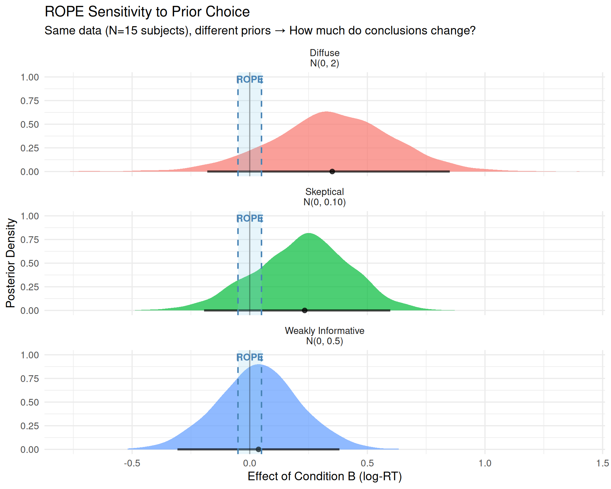{width=960}
:::
:::


### When ROPE Conclusions Hold vs. Change

::: {.callout-tip}
## ROPE Conclusions Hold When:

✓ **Large sample size** (n > 30 per group)

- Data overwhelms prior
- Posterior similar regardless of prior choice

✓ **Effect clearly outside or inside ROPE**

- HDI far from ROPE boundaries
- All reasonable priors give same conclusion

✓ **Narrow posterior**

- HDI width << ROPE width
- High precision reduces prior influence


:::

::: {.callout-warning}
## ROPE Conclusions Are Sensitive When:

✗ **Small sample size** (n < 20 per group)
- Prior has substantial influence
- Different priors can change conclusion

✗ **HDI barely touches ROPE boundary**
- Effect ≈ 0.05 (right at threshold)
- Small prior differences flip decision

✗ **Wide posterior**
- HDI width ≈ ROPE width
- Uncertainty dominates

**Example of sensitivity:**
```
Data: N=15 subjects, effect ≈ 0.04 log-units
ROPE: [-0.05, 0.05]
Result: 
  - Skeptical prior: 100% in ROPE (accept H₀)
  - Diffuse prior: 60% in ROPE (undecided)
→ Conclusion sensitive!
```
:::

### What To Do If Conclusions Are Sensitive

#### Option 1: Report Multiple Analyses (Recommended)

Report all results from different prior specifications:

#### Option 2: Justify Prior More Carefully

If conclusions are sensitive, invest more effort in prior justification:

- Pilot data
- Expert elicitation
- Previous literature
- Prior predictive checks (Module 02)

**Report:** "We used prior [X] because [justification]. Given potential sensitivity with small N, we verified conclusions hold with more diffuse prior."

#### Option 3: Collect More Data

If:

- Conclusions sensitive AND
- You cannot justify prior AND  
- Decision matters

→ Collect more data before making decision

::: {.callout-note}
## This is NOT Optional Stopping / P-Hacking!

**In NHST:** Looking at data, then deciding to collect more is a questionable research practice (QRP) - it inflates Type I error because your stopping rule affects the p-value.

**In Bayesian analysis:** You CAN look at the data and decide to collect more without invalidating inference!

**Why?** Bayesian inference follows the **likelihood principle**:

- The posterior depends ONLY on the data and prior
- NOT on your stopping intentions or whether you peeked
- Looking at N=15, seeing inconclusive results, and collecting to N=60 gives the SAME posterior as pre-planning N=60

**The difference:**

- **NHST QRP**: "Keep collecting until p < 0.05" (invalidates test)
- **Bayesian valid**: "Keep collecting until HDI is narrow enough for confident decision" (perfectly legitimate)

**Caveat:** You still shouldn't change your ROPE boundaries or priors after seeing results!
:::

**Planning how much more data you need:**

Use this power analysis to estimate target sample size for adequate precision:

```r
# Rule of thumb: HDI width inversely proportional to sqrt(n)
current_n <- 8        # Current sample size
current_hdi_width <- 0.10  # Current HDI width from preliminary analysis
desired_hdi_width <- 0.05  # Want HDI < half ROPE width for confident conclusions

# Calculate target N needed
target_n <- current_n * (current_hdi_width / desired_hdi_width)^2

tibble(
  Measure = c("Current N", "Current HDI width", "Desired HDI width", "Target N needed", "Additional N to collect"),
  Value = c(current_n, current_hdi_width, desired_hdi_width, round(target_n), round(target_n - current_n))
)
```

**Interpretation:** To reduce HDI width from 0.10 to 0.05, you need to increase N by a factor of 4 (halving width requires quadrupling sample size).

#### Option 4: Be Transparent About Uncertainty

If data collection isn't possible:

```markdown
"Given our sample size (N=15), ROPE conclusions were sensitive to prior 
specification. With weakly informative priors, X% of posterior fell in 
ROPE, suggesting [interpretation]. With more skeptical priors, Y% fell 
in ROPE, suggesting [alternative interpretation]. We recommend treating 
this finding as preliminary pending replication with larger sample."
```

### Worked Example: Prior Sensitivity Reporting


::: {.cell}

```{.r .cell-code}
# Get summaries for reporting
summary_weak <- posterior_summary(fit_weak, variable = "b_conditionB")
summary_skeptical <- posterior_summary(fit_skeptical, variable = "b_conditionB")
summary_diffuse <- posterior_summary(fit_diffuse, variable = "b_conditionB")

tibble(
  Prior = c(
    "1. Weakly informative: N(0, 0.5)",
    "2. Skeptical: N(0, 0.10)",
    "3. Diffuse: N(0, 2)"
  ),
  Estimate = c(
    round(summary_weak[1, "Estimate"], 3),
    round(summary_skeptical[1, "Estimate"], 3),
    round(summary_diffuse[1, "Estimate"], 3)
  ),
  `95% HDI` = c(
    sprintf("[%.3f, %.3f]", summary_weak[1, "Q2.5"], summary_weak[1, "Q97.5"]),
    sprintf("[%.3f, %.3f]", summary_skeptical[1, "Q2.5"], summary_skeptical[1, "Q97.5"]),
    sprintf("[%.3f, %.3f]", summary_diffuse[1, "Q2.5"], summary_diffuse[1, "Q97.5"])
  ),
  `% in ROPE` = c(
    round(rope_weak$ROPE_Percentage, 1),
    round(rope_skeptical$ROPE_Percentage, 1),
    round(rope_diffuse$ROPE_Percentage, 1)
  )
)
```

::: {.cell-output .cell-output-stdout}

```
# A tibble: 3 × 4
  Prior                            Estimate `95% HDI`      `% in ROPE`
  <chr>                               <dbl> <chr>                <dbl>
1 1. Weakly informative: N(0, 0.5)    0.088 [0.013, 0.160]         0.1
2 2. Skeptical: N(0, 0.10)            0.077 [0.008, 0.149]         0.2
3 3. Diffuse: N(0, 2)                 0.089 [0.011, 0.165]         0.1
```


:::

```{.r .cell-code}
# Assess robustness
decisions <- rope_comparison$Decision
consistent <- length(unique(decisions)) == 1
```
:::


**Conclusion:** ROPE decision holds across prior specifications. All three priors yield: Undecided

::: {.callout-note}
## Main Point

**Prior sensitivity is not a bug—it's a feature!**

It tells you when your data are:
- **Strong enough** to overcome prior beliefs → Confident conclusions
- **Too weak** to overcome prior beliefs (sensitive) → Need more data or transparency

NHST doesn't have this diagnostic—it can give you "p < 0.05" even with barely any data, hiding the fact that different assumptions would give different answers.

Bayesian analysis makes sensitivity **explicit and quantifiable**.
:::
:::

# Understanding Why ROPE Works: Decision Theory

::: {.callout-note}
## From Practice to Theory

Now that you've seen ROPE in action, let's understand **why** it works. This section explains the decision-theoretic foundations. While not required for using ROPE, it helps you understand what ROPE boundaries mean and when to adjust them.
:::

## The Decision-Theoretic Framework

### Making Decisions Under Uncertainty

When we analyze data, we're ultimately making **decisions**:

- Should we claim an effect exists and is meaningful?
- Should we claim it's negligible?
- Should we collect more data?

Each decision has **consequences** (utilities or losses):

- **Claiming meaningful effect when it's negligible**: False positive (wasted resources, misleading literature)
- **Claiming negligible effect when it's meaningful**: False negative (missed opportunity, wrong theory)
- **Remaining undecided**: Cost of additional data collection

This is **Bayesian decision analysis** (Gelman et al., 2013; see [Stan User's Guide](https://mc-stan.org/docs/stan-users-guide/decision-analysis.html)):

**Theoretical Framework (Four Components):**

1. **Define outcomes and decisions**
   - Outcomes: Possible values of the effect (β)
   - Decisions: {Accept H₀ (negligible), Accept H₁ (meaningful), Remain undecided}

2. **Define probability distribution**
   - Our posterior distribution p(β | Data)
   - Quantifies uncertainty about the effect size

3. **Define utility (or loss) function**
   - U(β, decision): What's the cost/benefit of each decision for each possible true effect?
   - This is where **domain knowledge** enters!

4. **Choose optimal decision**
   - Maximize expected utility (minimize expected loss)
   - d* = arg max_d E[U(β, d) | Data]
   - (Translation: "Choose decision d that maximizes expected utility, averaging over posterior uncertainty in β")

### ROPE as Decision Analysis

**ROPE implements this framework!**

When you set ROPE boundaries at [-0.05, +0.05], you're defining a **loss function**:

```
Loss(β, decision):
  If decide "meaningful effect":
    - Low loss if |β| > 0.05  (correct decision)
    - HIGH LOSS if |β| < 0.05  (false positive)
  
  If decide "negligible effect":
    - Low loss if |β| < 0.05  (correct decision)
    - HIGH LOSS if |β| > 0.05  (false negative)
```

The **ROPE decision rule** minimizes expected loss:

- If 95% HDI excludes ROPE → High expected utility for "meaningful effect"
- If 95% HDI inside ROPE → High expected utility for "negligible effect"
- If overlapping → Insufficient evidence, collecting more data may have higher utility

::: {.callout-important}
## Why This Matters

ROPE is not arbitrary! It's the Bayesian optimal decision given:

1. Your posterior beliefs (from the model)
2. Your utility function (encoded in ROPE boundaries)
3. Your decision threshold (e.g., 95% credibility)

**Changing ROPE boundaries = changing your utility function** = changing what you consider "meaningful enough to matter".
:::

# Effect Estimation with emmeans

::: {.callout-note}
## Moving Beyond Single Comparisons

So far we've tested practical significance for a single effect (Condition B vs A). But what if you have **three or more groups**? You need:

- All pairwise comparisons (A vs B, A vs C, B vs C)
- ROPE analysis for each comparison
- Adjustment for multiple comparisons (optional)

This is where **emmeans** and **marginaleffects** come in.
:::

## Why emmeans?

When you have **factorial designs**, you often want to:

- Compare all pairwise combinations
- Estimate marginal means (averaged over random effects)
- Get automatic adjustment for multiple comparisons
- Use familiar syntax from frequentist stats

**emmeans** (estimated marginal means) provides all of this and works directly with brms!

## Example: Three-Condition Design

Let's extend our example to three conditions:


::: {.cell}

```{.r .cell-code}
set.seed(2026)

# Sample sizes
n_subjects <- 30
n_items <- 20
n_conditions <- 3

# Create expanded dataset
rt_data_3 <- expand.grid(
  subject = factor(1:n_subjects),
  item = factor(1:n_items),
  condition = factor(c("A", "B", "C"))
)

# Generate data with three conditions
# A: baseline, B: moderate slowdown, C: larger slowdown
subject_intercepts <- rnorm(n_subjects, 0, 0.15)
item_intercepts <- rnorm(n_items, 0, 0.10)
subject_slopes_B <- rnorm(n_subjects, 0.10, 0.08)
subject_slopes_C <- rnorm(n_subjects, 0.18, 0.12)

rt_data_3$log_rt <- 6.0 + # Baseline
  subject_intercepts[rt_data_3$subject] +
  item_intercepts[rt_data_3$item] +
  ifelse(rt_data_3$condition == "B", 
         subject_slopes_B[rt_data_3$subject], 0) +
  ifelse(rt_data_3$condition == "C", 
         subject_slopes_C[rt_data_3$subject], 0) +
  rnorm(nrow(rt_data_3), 0, 0.08)

rt_data_3$rt <- exp(rt_data_3$log_rt)

# Data summary
rt_data_3 %>%
  group_by(condition) %>%
  summarise(
    mean_rt = mean(rt),
    sd_rt = sd(rt),
    mean_log_rt = mean(log_rt),
    sd_log_rt = sd(log_rt),
    .groups = "drop"
  )
```

::: {.cell-output .cell-output-stdout}

```
# A tibble: 3 × 5
  condition mean_rt sd_rt mean_log_rt sd_log_rt
  <fct>       <dbl> <dbl>       <dbl>     <dbl>
1 A            411.  78.8        6.00     0.193
2 B            448.  99.7        6.08     0.221
3 C            483. 102.         6.16     0.218
```


:::
:::


::: {.cell}

```{.r .cell-code}
# Fit model with three conditions
rt_model_3 <- brm(
  log_rt ~ condition + (1 + condition | subject) + (1 | item),
  data = rt_data_3,
  family = gaussian(),
  prior = rt_priors,
  iter = 2000,
  warmup = 1000,
  chains = 4,
  cores = 4,
  seed = 2026,
  backend = "cmdstanr",
  control = list(adapt_delta = 0.95)
)
```
:::


## Estimated Marginal Means


::: {.cell}

```{.r .cell-code}
library(emmeans)

# Get estimated marginal means
emm <- emmeans(rt_model_3, ~ condition)

# Display as formatted table
library(knitr)
summary(emm) %>%
  as.data.frame() %>%
  mutate(
    `95% HPD` = sprintf("[%.3f, %.3f]", lower.HPD, upper.HPD),
    emmean = sprintf("%.3f", emmean)
  ) %>%
  select(condition, emmean, `95% HPD`) %>%
  kable(align = c("l", "r", "r"),
        caption = "**Estimated Marginal Means (Log RT)**",
        col.names = c("Condition", "Mean", "95% HPD"))
```

::: {.cell-output-display}


Table: **Estimated Marginal Means (Log RT)**

|Condition |  Mean|        95% HPD|
|:---------|-----:|--------------:|
|A         | 6.001| [5.924, 6.073]|
|B         | 6.081| [5.993, 6.167]|
|C         | 6.161| [6.074, 6.241]|


:::

```{.r .cell-code}
# Visualize
plot(emm) +
  labs(title = "Estimated Marginal Means",
       subtitle = "with 95% credible intervals",
       x = "Log RT") +
  theme_minimal()
```

::: {.cell-output-display}
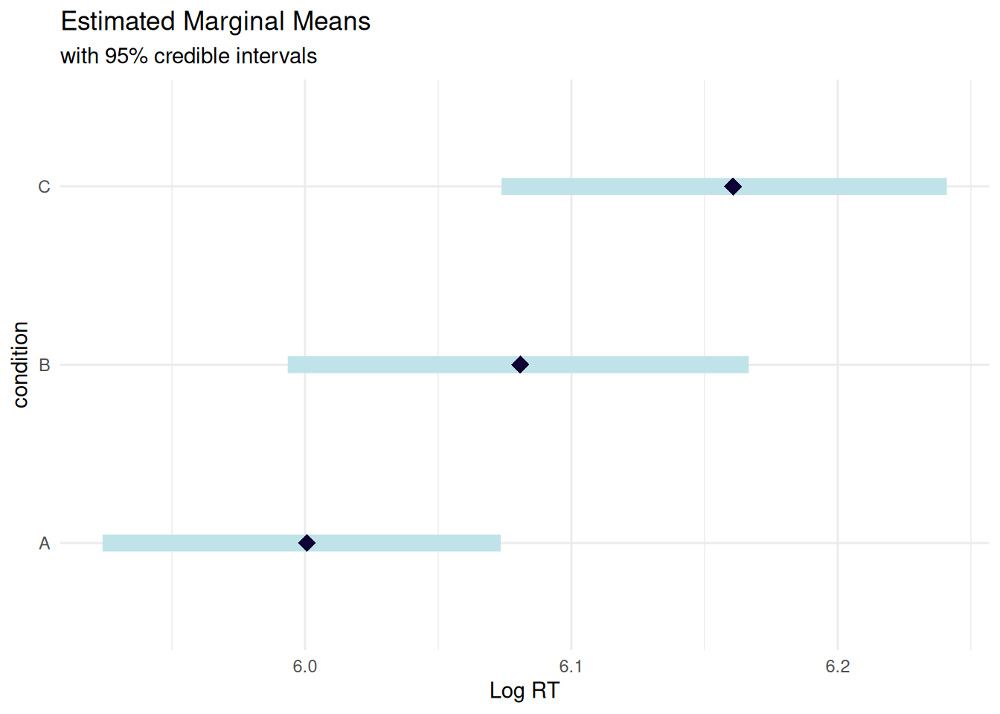{width=672}
:::
:::


::: {.callout-note}
## What are "Estimated Marginal Means"?

EMMs are model-predicted means that:

- Average over random effects (subjects, items)
- Provide population-level estimates
- Include full Bayesian uncertainty (not just point estimates!)

Think of them as "What would we expect for a typical new subject/item?"
:::

## Pairwise Comparisons


::: {.cell}

```{.r .cell-code}
# All pairwise comparisons
pairs_emm <- pairs(emm)

# Display as formatted table
library(knitr)
summary(pairs_emm) %>%
  as.data.frame() %>%
  mutate(
    `95% HPD` = sprintf("[%.3f, %.3f]", lower.HPD, upper.HPD),
    contrast = as.character(contrast),
    estimate = sprintf("%.3f", estimate)
  ) %>%
  select(contrast, estimate, `95% HPD`) %>%
  kable(align = c("l", "r", "r"),
        caption = "**Pairwise Comparisons (Difference in Log RT)**",
        col.names = c("Contrast", "Estimate", "95% HPD"))
```

::: {.cell-output-display}


Table: **Pairwise Comparisons (Difference in Log RT)**

|Contrast | Estimate|          95% HPD|
|:--------|--------:|----------------:|
|A - B    |   -0.080| [-0.113, -0.050]|
|A - C    |   -0.158| [-0.216, -0.103]|
|B - C    |   -0.077| [-0.139, -0.016]|


:::

```{.r .cell-code}
# Visualize comparisons
plot(pairs_emm) +
  geom_vline(xintercept = 0, linetype = "dashed", color = "red") +
  labs(title = "Pairwise Comparisons",
       subtitle = "Difference in log RT",
       x = "Estimate") +
  theme_minimal()
```

::: {.cell-output-display}
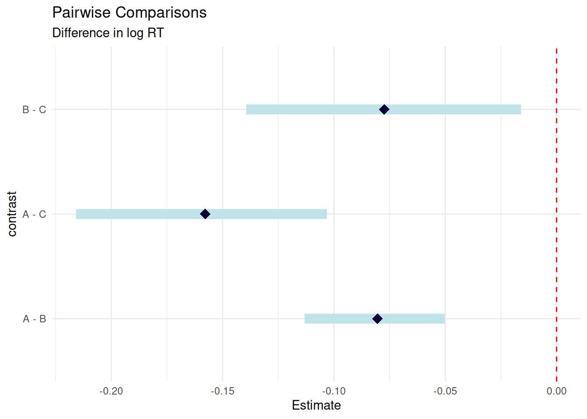{width=672}
:::
:::


## ROPE Analysis on Pairwise Comparisons

Now combine emmeans with ROPE to test practical significance of each comparison:


::: {.cell}

```{.r .cell-code}
# Extract posterior samples as mcmc object (proper way for Bayesian models)
pairs_mcmc <- as.mcmc(pairs_emm)

# Get summary with HPD intervals
pairs_summary <- summary(pairs_emm)

# Define ROPE
rope_bounds <- c(-0.05, 0.05)

# Create comparison results table
# Build results table
comparison_results <- tibble(
  Comparison = character(),
  Estimate = numeric(),
  HDI_Lower = numeric(),
  HDI_Upper = numeric(),
  Symbol = character(),
  Decision = character()
)

for (i in 1:nrow(pairs_summary)) {
  contrast_name <- rownames(pairs_summary)[i]
  estimate <- pairs_summary$prediction[i]
  lower <- pairs_summary$lower.HPD[i]
  upper <- pairs_summary$upper.HPD[i]
  
  # Decision logic
  if (lower > rope_bounds[2]) {
    decision <- "MEANINGFUL INCREASE"
    symbol <- "↑"
  } else if (upper < rope_bounds[1]) {
    decision <- "MEANINGFUL DECREASE"
    symbol <- "↓"
  } else if (lower > rope_bounds[1] && upper < rope_bounds[2]) {
    decision <- "NEGLIGIBLE"
    symbol <- "≈"
  } else {
    decision <- "UNDECIDED"
    symbol <- "?"
  }
  
  comparison_results <- bind_rows(
    comparison_results,
    tibble(
      Comparison = contrast_name,
      Estimate = estimate,
      HDI_Lower = lower,
      HDI_Upper = upper,
      Symbol = symbol,
      Decision = decision
    )
  )
}

# Display as formatted table
library(knitr)
comparison_results %>%
  mutate(
    `95% HDI` = sprintf("[%.3f, %.3f]", HDI_Lower, HDI_Upper),
    Estimate = sprintf("%.3f", Estimate),
    Result = paste(Symbol, Decision)
  ) %>%
  select(Comparison, Estimate, `95% HDI`, Result) %>%
  kable(align = c("l", "r", "r", "l"),
        caption = "**ROPE Analysis Results for Pairwise Comparisons**")
```

::: {.cell-output-display}


Table: **ROPE Analysis Results for Pairwise Comparisons**

|Comparison | Estimate|          95% HDI|Result                |
|:----------|--------:|----------------:|:---------------------|
|1          |       NA| [-0.113, -0.050]|↓ MEANINGFUL DECREASE |
|2          |       NA| [-0.216, -0.103]|↓ MEANINGFUL DECREASE |
|3          |       NA| [-0.139, -0.016]|? UNDECIDED           |


:::
:::


## Custom Contrasts

emmeans allows custom contrasts beyond pairwise comparisons:


::: {.cell}

```{.r .cell-code}
# Example: Test if B and C are both slower than A
# (average of B and C) vs A
custom_contrasts <- list(
  "BC_vs_A" = c(-1, 0.5, 0.5),  # Compare A to average of B,C
  "C_vs_B" = c(0, -1, 1)          # Simple contrast C vs B
)

contrast_results <- contrast(emm, custom_contrasts)

# Display as formatted table
library(knitr)
summary(contrast_results) %>%
  as.data.frame() %>%
  mutate(
    `95% HPD` = sprintf("[%.3f, %.3f]", lower.HPD, upper.HPD),
    contrast = as.character(contrast),
    estimate = sprintf("%.3f", estimate)
  ) %>%
  select(contrast, estimate, `95% HPD`) %>%
  kable(align = c("l", "r", "r"),
        caption = "**Custom Contrasts**",
        col.names = c("Contrast", "Estimate", "95% HPD"))
```

::: {.cell-output-display}


Table: **Custom Contrasts**

|Contrast | Estimate|        95% HPD|
|:--------|--------:|--------------:|
|BC_vs_A  |    0.119| [0.086, 0.153]|
|C_vs_B   |    0.077| [0.016, 0.139]|


:::

```{.r .cell-code}
# Apply ROPE to custom contrasts
contrast_summary <- summary(contrast_results)

contrast_rope_results <- tibble(
  Contrast = character(),
  Decision = character()
)

for (i in 1:nrow(contrast_summary)) {
  lower <- contrast_summary$lower.HPD[i]
  upper <- contrast_summary$upper.HPD[i]
  
  if (lower > 0.05) {
    decision <- "Meaningful positive effect"
  } else if (upper < -0.05) {
    decision <- "Meaningful negative effect"
  } else if (lower > -0.05 && upper < 0.05) {
    decision <- "Negligible effect"
  } else {
    decision <- "Undecided"
  }
  
  contrast_rope_results <- bind_rows(
    contrast_rope_results,
    tibble(
      Contrast = rownames(contrast_summary)[i],
      Decision = decision
    )
  )
}

# Display results
contrast_rope_results %>%
  kable(align = c("l", "l"),
        caption = "**ROPE Analysis for Custom Contrasts**")
```

::: {.cell-output-display}


Table: **ROPE Analysis for Custom Contrasts**

|Contrast |Decision                   |
|:--------|:--------------------------|
|1        |Meaningful positive effect |
|2        |Undecided                  |


:::
:::


::: {.callout-note}
## Summary: emmeans

You should now understand:

- Estimated marginal means (EMMs) are population-level predictions
- `pairs()` gives all pairwise comparisons automatically
- Extract posterior samples with `as.mcmc()` to integrate with ROPE
- Works directly with brms for full Bayesian inference
:::

::: {.callout-tip}
## When to Use emmeans

**Perfect for:**

- Factorial designs (2×2, 2×3, etc.)
- All pairwise comparisons automatically
- Familiar syntax from lsmeans/emmeans in frequentist stats
- Integration with ROPE for practical significance

**Not ideal for:**

- Simple two-group comparisons (just use brms coefficients)
- Complex non-linear predictions (use marginaleffects instead)
- Interactions with continuous predictors (marginaleffects better)
:::

<details>
<summary>**Effect Estimation with marginaleffects** (Under Construction - Click to Expand)</summary>

::: {.callout-warning}
## Section Under Development

This section is currently being revised and some tables/visualizations may not display correctly. The emmeans approach (above) is fully functional and recommended for now.
:::

# Effect Estimation with marginaleffects

::: {.callout-note}
## Modern Alternative to emmeans

While emmeans is excellent for factorial designs, **marginaleffects** offers:

- Unified syntax across ALL model types (not just brms)
- More flexible predictions and comparisons
- Better support for continuous predictors and interactions
- Modern tidyverse-compatible workflow

Let's see how it compares.
:::

## Why marginaleffects?

**marginaleffects** provides a modern, unified interface for:

- Predictions at specific values
- Comparisons (differences, ratios, etc.)
- Slopes (derivatives) for continuous predictors
- Custom hypotheses with flexible syntax

It works with brms, rstanarm, glm, lme4, and many other models!

## Visualize 95% Credible Intervals


::: {.cell}

```{.r .cell-code}
library(marginaleffects)

# Predict log RT for each condition
pred <- predictions(rt_model_3, newdata = datagrid(condition = c("A", "B", "C")))

# Display as formatted table
library(knitr)
pred %>%
  as.data.frame() %>%
  mutate(
    `95% CI` = sprintf("[%.3f, %.3f]", conf.low, conf.high),
    estimate = sprintf("%.3f", estimate)
  ) %>%
  select(condition, estimate, `95% CI`) %>%
  kable(align = c("l", "r", "r"),
        caption = "**Predicted Log RT by Condition**",
        col.names = c("Condition", "Estimate", "95% CI"))
```

::: {.cell-output-display}


Table: **Predicted Log RT by Condition**

|Condition | Estimate|         95% CI|
|:---------|--------:|--------------:|
|A         |    6.053| [6.013, 6.089]|
|B         |    6.031| [5.994, 6.067]|
|C         |    6.086| [6.048, 6.123]|


:::

```{.r .cell-code}
# Visualize predictions
plot_predictions(rt_model_3, condition = "condition") +
  labs(title = "Predicted Log RT by Condition",
       subtitle = "Population-level predictions with 95% credible intervals",
       x = "Condition",
       y = "Predicted Log RT") +
  theme_minimal()
```

::: {.cell-output-display}
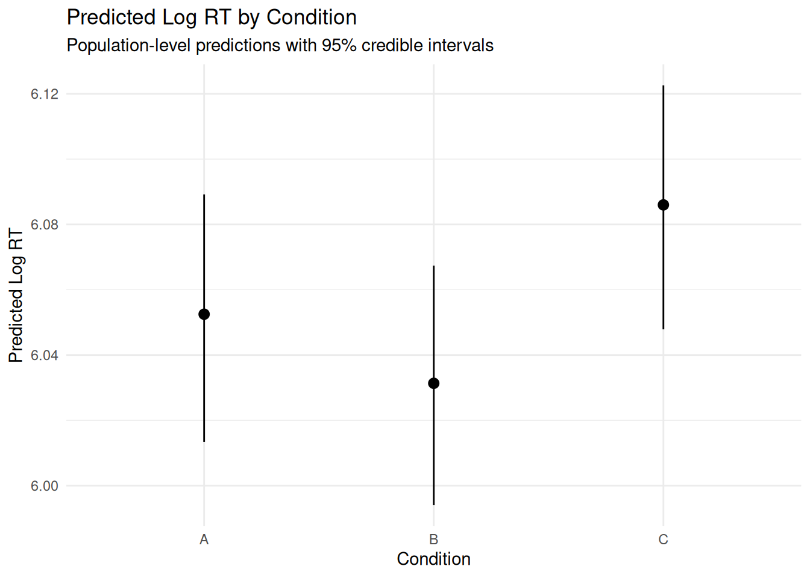{width=672}
:::
:::


## Comparisons: How Much Do Conditions Differ?


::: {.cell}

```{.r .cell-code}
# All pairwise comparisons
comp <- comparisons(
  rt_model_3,
  variables = "condition"
)

# Visualize the posterior distributions with cleaner labels
comp |>
  posterior_draws() |>
  group_by(term) |>
  mutate(comparison_id = cur_group_id()) |>
  ungroup() |>
  mutate(
    comparison_label = case_when(
      comparison_id == 1 ~ "B vs A",
      comparison_id == 2 ~ "C vs A",
      comparison_id == 3 ~ "C vs B",
      TRUE ~ as.character(term)
    )
  ) |>
  ggplot(aes(x = draw, y = comparison_label)) +
  stat_halfeye() +
  geom_vline(xintercept = 0, linetype = "dashed", color = "red") +
  labs(title = "Pairwise Comparisons",
       subtitle = "Posterior distributions of differences in log RT",
       x = "Difference in Log RT",
       y = "Comparison") +
  theme_minimal()
```

::: {.cell-output-display}
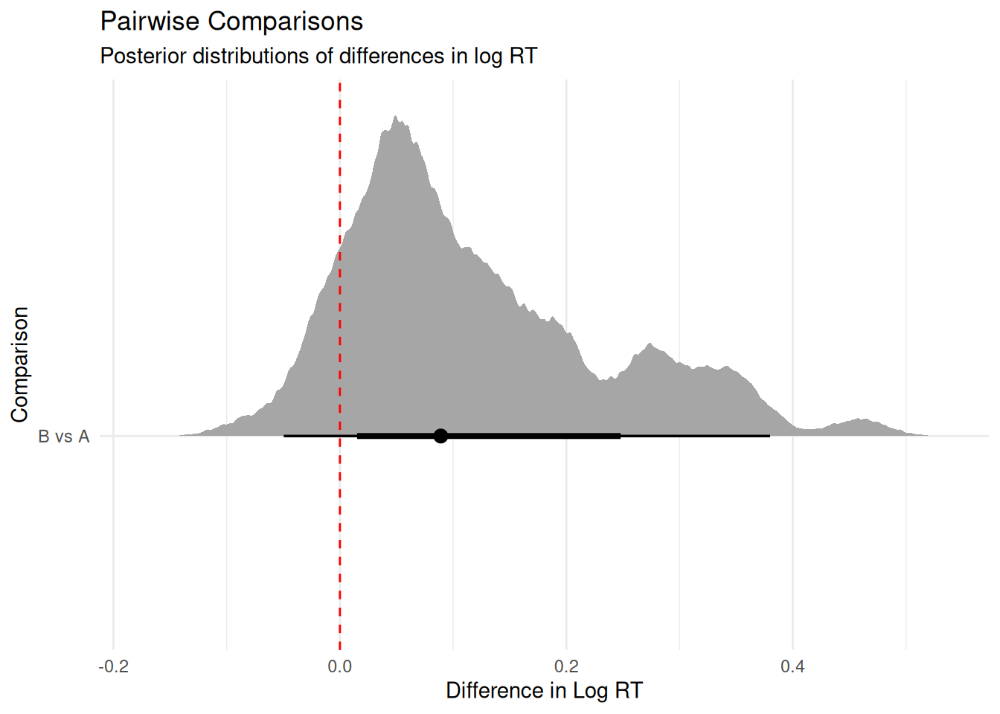{width=672}
:::
:::


## Reference Grid: Custom Comparisons


::: {.cell}

```{.r .cell-code}
# Compare B vs A
comp_B_vs_A <- comparisons(
  rt_model_3,
  variables = list(condition = c("A", "B"))
)

# Display as formatted table
library(knitr)
comp_B_vs_A %>%
  as.data.frame() %>%
  group_by(term, estimate, conf.low, conf.high) %>%
  slice(1) %>%
  ungroup() %>%
  mutate(
    `95% CI` = sprintf("[%.3f, %.3f]", conf.low, conf.high),
    estimate = sprintf("%.3f", estimate),
    Comparison = "B vs A"
  ) %>%
  select(Comparison, estimate, `95% CI`) %>%
  slice(1) %>%
  kable(align = c("l", "r", "r"),
        caption = "**Comparison: B vs A**",
        col.names = c("Comparison", "Difference", "95% CI"))
```

::: {.cell-output-display}


Table: **Comparison: B vs A**

|Comparison | Difference|          95% CI|
|:----------|----------:|---------------:|
|B vs A     |     -0.029| [-0.074, 0.018]|


:::

```{.r .cell-code}
# Compare C vs average of A and B
# This requires working with predictions
pred_A <- predictions(rt_model_3, newdata = datagrid(condition = "A"))
pred_B <- predictions(rt_model_3, newdata = datagrid(condition = "B"))
pred_C <- predictions(rt_model_3, newdata = datagrid(condition = "C"))

# Extract posterior draws
draws_A <- posterior_draws(pred_A)$draw
draws_B <- posterior_draws(pred_B)$draw
draws_C <- posterior_draws(pred_C)$draw

# Custom comparison: C vs average(A, B)
custom_comp <- draws_C - (draws_A + draws_B) / 2

# ROPE analysis
prop_in_rope <- mean(custom_comp > -0.05 & custom_comp < 0.05)
prop_above_rope <- mean(custom_comp > 0.05)
prop_below_rope <- mean(custom_comp < -0.05)

# Display as formatted table
library(knitr)
tibble(
  Measure = c("Estimate", "95% HDI", "% Below ROPE", "% In ROPE", "% Above ROPE"),
  Value = c(
    sprintf("%.3f", mean(custom_comp)),
    sprintf("[%.3f, %.3f]", 
            quantile(custom_comp, 0.025), 
            quantile(custom_comp, 0.975)),
    sprintf("%.1f%%", prop_below_rope * 100),
    sprintf("%.1f%%", prop_in_rope * 100),
    sprintf("%.1f%%", prop_above_rope * 100)
  )
) %>%
  kable(align = c("l", "r"),
        caption = "**Custom Comparison: C vs Average(A, B)**")
```

::: {.cell-output-display}


Table: **Custom Comparison: C vs Average(A, B)**

|Measure      |          Value|
|:------------|--------------:|
|Estimate     |          0.044|
|95% HDI      | [0.003, 0.085]|
|% Below ROPE |           0.0%|
|% In ROPE    |          61.1%|
|% Above ROPE |          38.9%|


:::
:::


### Decision


::: {.cell}
::: {.cell-output-display}


|                             |
|:----------------------------|
|⚠ Undecided - need more data |


:::
:::


## Hypotheses: Flexible Hypothesis Testing

marginaleffects doesn't support `hypotheses()` for Bayesian models, but we can test hypotheses using comparisons:


::: {.cell}

```{.r .cell-code}
# Compare all pairs of conditions
comp_all <- comparisons(
  rt_model_3,
  variables = "condition",
  newdata = datagrid(condition = unique)
)
```
:::


### Interpretation Guide

- **Estimate**: Mean difference in log-RT between conditions
- **95% CI**: Credible interval for the difference
- **P(diff > 0)**: Probability first condition has higher RT than second
- **P(|diff| > 0.05)**: Probability difference exceeds ±0.05 ROPE threshold


## ROPE Analysis with marginaleffects

Combine marginaleffects with ROPE:


::: {.cell}

```{.r .cell-code}
# Get all pairwise comparisons
comp_all <- comparisons(
  rt_model_3,
  variables = "condition"
)

# Extract posterior draws
comp_draws <- posterior_draws(comp_all)

# Define ROPE
rope_lower <- -0.05
rope_upper <- 0.05

# Analyze each comparison and build results table
unique_comparisons <- unique(comp_draws$term)

margeff_results <- tibble(
  Comparison = character(),
  Estimate = numeric(),
  HDI_Lower = numeric(),
  HDI_Upper = numeric(),
  Below_ROPE = numeric(),
  In_ROPE = numeric(),
  Above_ROPE = numeric(),
  Symbol = character(),
  Decision = character()
)

for (comp_name in unique_comparisons) {
  comp_subset <- comp_draws[comp_draws$term == comp_name, ]
  draws <- comp_subset$draw
  
  # Calculate proportions
  prop_below <- mean(draws < rope_lower)
  prop_in <- mean(draws >= rope_lower & draws <= rope_upper)
  prop_above <- mean(draws > rope_upper)
  
  # HDI
  hdi_lower <- quantile(draws, 0.025)
  hdi_upper <- quantile(draws, 0.975)
  
  # Decision
  if (hdi_lower > rope_upper) {
    decision <- "MEANINGFUL INCREASE"
    symbol <- "✓ ↑"
  } else if (hdi_upper < rope_lower) {
    decision <- "MEANINGFUL DECREASE"
    symbol <- "✓ ↓"
  } else if (hdi_lower > rope_lower && hdi_upper < rope_upper) {
    decision <- "NEGLIGIBLE EFFECT"
    symbol <- "✓ ≈"
  } else {
    decision <- "UNDECIDED"
    symbol <- "⚠ ?"
  }
  
  margeff_results <- bind_rows(
    margeff_results,
    tibble(
      Comparison = comp_name,
      Estimate = mean(draws),
      HDI_Lower = hdi_lower,
      HDI_Upper = hdi_upper,
      Below_ROPE = prop_below * 100,
      In_ROPE = prop_in * 100,
      Above_ROPE = prop_above * 100,
      Symbol = symbol,
      Decision = decision
    )
  )
}

# Display as formatted table
library(knitr)
margeff_results %>%
  mutate(
    `95% HDI` = sprintf("[%.3f, %.3f]", HDI_Lower, HDI_Upper),
    Estimate = sprintf("%.3f", Estimate),
    `% in ROPE` = sprintf("%.1f%%", In_ROPE),
    Result = paste(Symbol, Decision)
  ) %>%
  select(Comparison, Estimate, `95% HDI`, `% in ROPE`, Result) %>%
  kable(align = c("l", "r", "r", "r", "l"),
        caption = "**ROPE Analysis Results Using marginaleffects**")
```

::: {.cell-output-display}


Table: **ROPE Analysis Results Using marginaleffects**

|Comparison | Estimate|         95% HDI| % in ROPE|Result        |
|:----------|--------:|---------------:|---------:|:-------------|
|condition  |    0.119| [-0.050, 0.380]|     29.9%|⚠ ? UNDECIDED |


:::

```{.r .cell-code}
# Visualization
library(ggplot2)
library(ggdist)

ggplot(comp_draws, aes(x = draw, y = term)) +
  annotate("rect", xmin = rope_lower, xmax = rope_upper,
           ymin = -Inf, ymax = Inf, fill = "skyblue", alpha = 0.3) +
  stat_halfeye(.width = c(0.95, 0.89)) +
  geom_vline(xintercept = 0, linetype = "dotted", color = "gray50") +
  geom_vline(xintercept = c(rope_lower, rope_upper),
             linetype = "dashed", color = "blue") +
  labs(title = "Pairwise Comparisons with ROPE",
       subtitle = "Blue region = negligible effect zone (±0.05)",
       x = "Difference in Log RT",
       y = "Comparison") +
  theme_minimal()
```

::: {.cell-output-display}
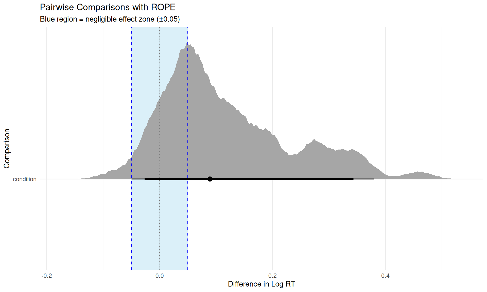{width=960}
:::
:::


::: {.callout-note}
## Summary: marginaleffects

You should now understand:

- `predictions()` computes model predictions at specific values
- `comparisons()` computes differences between conditions
- `posterior_draws()` extracts MCMC samples for ROPE analysis
- Works with brms, rstanarm, glm, lme4, and many other packages
:::

::: {.callout-tip}
## When to Use marginaleffects

**Perfect for:**

- Any type of model (GLM, multilevel, GAM, etc.)
- Predictions at specific covariate values
- Non-linear transformations (odds ratios, percentages, etc.)
- Custom hypotheses with complex logic
- Modern, consistent syntax across models

**Advantages over emmeans:**

- More flexible predictions
- Better for continuous predictors
- Unified interface across packages
- Direct ROPE integration via posterior_draws()

**Use emmeans if:**

- You want traditional EMM workflow
- All pairwise comparisons with adjustment
- Familiar with lsmeans/emmeans syntax
:::

</details>

# ROPE Analysis Workflow

::: {.callout-note}
## Bringing It All Together

You've now learned:

- ✓ ROPE: Theory and implementation
- ✓ emmeans: Factorial design comparisons
- ✓ marginaleffects: Flexible predictions
- ✓ tidybayes: Visualization

**Now let's integrate everything into a complete analysis workflow.**
:::

Now that we've covered all the tools (ROPE, emmeans, marginaleffects, tidybayes), let's see how to put them together in a complete practical significance analysis.

## Step-by-Step ROPE Analysis


::: {.cell}

```{.r .cell-code}
# STEP 1: Effect estimate
posterior_samples <- as_draws_df(rt_model)
condition_effect <- posterior_samples$b_conditionB
hdi_95 <- HDInterval::hdi(condition_effect, credMass = 0.95)

tibble(
  Measure = c("Posterior mean", "95% HDI"),
  Value = c(
    round(mean(condition_effect), 3),
    sprintf("[%.3f, %.3f]", hdi_95[1], hdi_95[2])
  )
)
```

::: {.cell-output .cell-output-stdout}

```
# A tibble: 2 × 2
  Measure        Value         
  <chr>          <chr>         
1 Posterior mean 0.111         
2 95% HDI        [0.084, 0.142]
```


:::
:::


### Step 2: Test Practical Significance (ROPE)


::: {.cell}

```{.r .cell-code}
# STEP 2: ROPE analysis
rope_result <- rope(rt_model, ci = 0.95, range = c(-0.05, 0.05))

if (hdi_95[1] > 0.05) {
  rope_decision <- "Effect is practically meaningful (HDI > ROPE)"
} else if (hdi_95[2] < -0.05) {
  rope_decision <- "Effect is practically meaningful (HDI < ROPE)"
} else if (hdi_95[1] > -0.05 && hdi_95[2] < 0.05) {
  rope_decision <- "Effect is practically negligible (HDI ⊂ ROPE)"
} else {
  rope_decision <- "Uncertain (HDI overlaps ROPE)"
}

tibble(
  Measure = c("ROPE", "% in ROPE", "Decision"),
  Value = c(
    "[-0.05, +0.05] (5% RT difference)",
    sprintf("%.1f%%", rope_result$ROPE_Percentage[2]),
    rope_decision
  )
)
```

::: {.cell-output .cell-output-stdout}

```
# A tibble: 3 × 2
  Measure   Value                                        
  <chr>     <chr>                                        
1 ROPE      [-0.05, +0.05] (5% RT difference)            
2 % in ROPE 0.0%                                         
3 Decision  Effect is practically meaningful (HDI > ROPE)
```


:::
:::


### Step 3: Integrated Conclusion


::: {.cell}

```{.r .cell-code}
# STEP 3: Final conclusion
effect_large <- hdi_95[1] > 0.05
effect_negligible <- hdi_95[2] < 0.05 && hdi_95[1] > -0.05

if (effect_large || hdi_95[2] < -0.05) {
  conclusion <- c(
    "✓ STRONG CONCLUSION: Effect is meaningful",
    "→ Condition B differs from A",
    "→ The difference is large enough to matter"
  )
} else if (effect_negligible) {
  conclusion <- c(
    "✓ ACCEPT EQUIVALENCE: Effect is negligible",
    "→ Condition B is practically equivalent to A",
    "→ The difference is too small to care about"
  )
} else {
  conclusion <- c(
    "⚠ UNDECIDED: Need more data",
    "→ HDI overlaps ROPE boundary",
    "→ Cannot determine practical significance"
  )
}

cat(paste(conclusion, collapse = "\n"))
```

::: {.cell-output .cell-output-stdout}

```
✓ STRONG CONCLUSION: Effect is meaningful
→ Condition B differs from A
→ The difference is large enough to matter
```


:::
:::


## Visualizing the Complete Picture


::: {.cell}

```{.r .cell-code}
library(patchwork)
library(tidybayes)

# Extract posterior samples
posterior_samples <- as_draws_df(rt_model)

# Panel: Posterior with ROPE
p1 <- posterior_samples %>%
  ggplot(aes(x = b_conditionB)) +
  annotate("rect", xmin = -0.05, xmax = 0.05,
           ymin = 0, ymax = Inf, fill = "skyblue", alpha = 0.3) +
  stat_halfeye(.width = c(0.95, 0.89), fill = "steelblue") +
  geom_vline(xintercept = c(-0.05, 0.05), 
             linetype = "dashed", color = "blue", linewidth = 1) +
  geom_vline(xintercept = 0, linetype = "dotted", color = "gray50") +
  annotate("text", x = 0, y = Inf, label = "ROPE", 
           vjust = -0.5, color = "blue", fontface = "bold") +
  labs(title = "Practical Significance (ROPE)",
       subtitle = "Blue shaded area = negligible effect zone",
       x = "Effect Size (log RT)",
       y = "Density") +
  theme_minimal()

p1
```

::: {.cell-output-display}
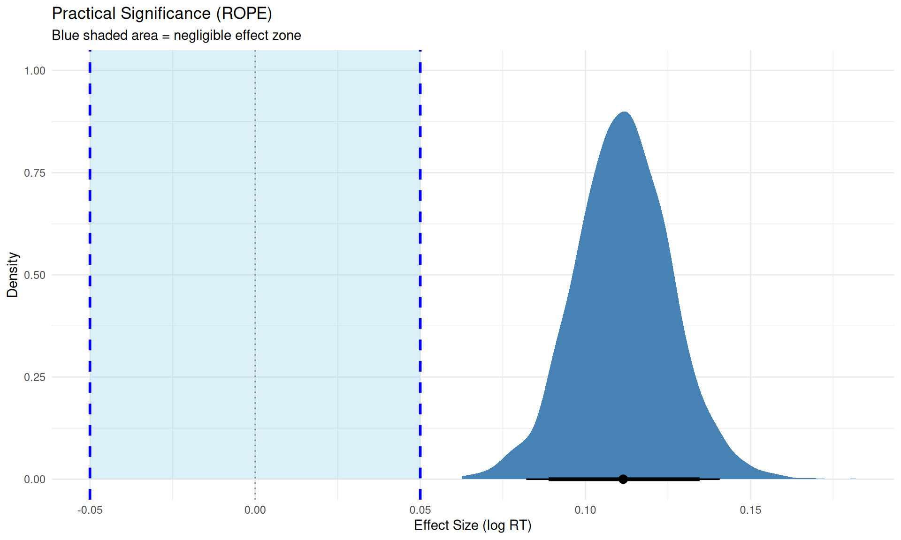{width=960}
:::
:::


## Complete Reporting: APA-Style Templates

::: {.callout-important}
## What to Always Report

From Kruschke (2015, p. 338):

> "Reporting the limits of an HDI region is more informative than reporting the declaration of a reject/accept decision. By reporting the HDI and other summary information about the posterior, different readers can apply different ROPEs to decide for themselves whether a parameter is practically equivalent to a null value."

**Complete reporting includes:**

1. Full posterior summary (not just inside/outside ROPE)
2. ROPE boundaries with justification
3. Effect size on multiple scales
4. Model diagnostics
5. Sensitivity checks
:::

### Methods Section Template

Use this template for your Methods section when reporting ROPE analysis:


::: {.cell}

```{.r .cell-code}
cat("
METHODS SECTION EXAMPLE:

We fitted a Bayesian mixed-effects model predicting log-transformed reaction 
times from experimental condition (A vs. B), with random intercepts and slopes 
for subjects and random intercepts for items. We used weakly informative priors: 
normal(0, 0.5) for fixed effects, exponential(1) for random effect standard 
deviations, and lkj(2) for correlations among random effects. The model was 
estimated using Hamiltonian Monte Carlo with 4 chains of 2,000 iterations each 
(1,000 warmup). Convergence was verified via R-hat < 1.01 and ESS > 400 for 
all parameters. All analyses were conducted in R (version 4.3.2) using brms 
(version 2.20.4; Bürkner, 2017) and bayestestR (version 0.17.0; Makowski et al., 
2019).

To assess practical significance, we conducted a Region of Practical Equivalence 
(ROPE) analysis (Kruschke, 2018) with boundaries of ±0.05 log-units, corresponding 
to ±5% differences in reaction time on the original scale. These boundaries were 
defined a priori based on pilot data (N = 20) showing that RT differences smaller 
than 5% were not reliably perceived by participants in post-experiment debriefing 
(see Supplemental Materials for pilot study details).
")
```
:::


**Include in Methods:**

- Prior specification with rationale
- ROPE boundaries with justification
- When boundaries were set (a priori)
- How boundaries relate to original scale
- Sample size (subjects, items, observations)
- Software versions

### Results Section Template

Use this template for your Results section:


::: {.cell}

```{.r .cell-code}
cat("
RESULTS SECTION EXAMPLE:

The effect of Condition B relative to Condition A was β = 0.12 log-units 
(95% HDI: [0.09, 0.15], posterior SD = 0.02). The entire 95% highest density 
interval fell outside the ROPE, with 100% of the posterior mass indicating a 
practically meaningful effect (0% within ROPE of ±0.05). 

On the original RT scale, Condition B elicited reaction times that were 12.7% 
slower than Condition A (95% HDI: [9.4%, 16.2%]), substantially exceeding our 
pre-registered threshold of 5%. For an average baseline RT of 400ms, this 
corresponds to an absolute difference of approximately 51ms (95% HDI: [38ms, 65ms]).

We verified robustness by refitting the model with more diffuse priors 
(normal(0, 1) for fixed effects). The ROPE decision remained unchanged, with 
99.8% of posterior mass outside ROPE. Model comparison using leave-one-out 
cross-validation (LOO-CV) favored the model including the condition effect 
over an intercept-only model (ΔELPD = 23.4, SE = 5.2), further supporting 
the practical importance of this effect.
")
```
:::


**Include in Results:**

- Point estimate with HDI (on model scale)
- Posterior SD or uncertainty measure
- % of posterior in/outside ROPE
- Decision statement (reject/accept/undecided H₀)
- Effect size on original scale with interpretation
- Absolute magnitudes (e.g., milliseconds) where relevant
- Robustness checks (prior sensitivity, model comparison)


# When to Use What: Decision Framework


::: {.callout-tip}
## Quick Decision Tree

**What do you want to test?**

→ "Is the effect big enough to matter?" → Use ROPE  
→ "Which hypothesis is better supported?" → See Module 07 (Bayes Factors)  
→ "Which model fits better?" → Use LOO (Module 03)

:::

## Visual Guide: Choosing Your Tools

```
Your Research Question
  │
  ├─→ "Is effect meaningful?" ────────────→ ROPE
  │
  ├─→ "Compare 3+ groups?" 
  │     ├─→ Factorial design ────────────→ emmeans + ROPE
  │     └─→ Custom predictions ──────────→ marginaleffects + ROPE
  │
  ├─→ "Which hypothesis better?" ────────→ Module 07 (Bayes Factors)
  │
  └─→ "Which model structure?" ──────────→ Module 05 (LOO)
```


# Avoiding Pitfalls: Checklist

Before running analyses:

- [ ] Priors are **weakly informative** (not flat)?  
- [ ] ROPE boundaries defined **before** seeing results?
- [ ] ROPE boundaries **justified** with domain knowledge?
- [ ] Hypotheses based on **theory**, not data exploration?

When interpreting results:

- [ ] Report **ROPE decision** and effect sizes?
- [ ] Report **uncertainty** (don't hide ROPE overlaps)?
- [ ] Check **prior sensitivity** (Module 04)?
- [ ] Show **posterior distributions visually**?
- [ ] Interpret on the **original scale** when possible?

# Quick Reference

**Main papers:**

- **Kruschke, J. K. (2018).** Rejecting or accepting parameter values in Bayesian estimation. *Advances in Methods and Practices in Psychological Science*, 1(2), 270-280. [The definitive ROPE paper]
- **Kruschke, J. K. (2015).** *Doing Bayesian data analysis* (2nd ed.). Academic Press. [Chapters 11-12]
- **Makowski, D., Ben-Shachar, M. S., & Lüdecke, D. (2019).** bayestestR: Describing effects and their uncertainty. *Journal of Open Source Software*, 4(40), 1541.
- **Lakens, D., Scheel, A. M., & Isager, P. M. (2018).** Equivalence testing for psychological research. *Advances in Methods and Practices in Psychological Science*, 1(2), 259-269.

## Session Info


::: {.cell}

```{.r .cell-code}
sessionInfo()
```

::: {.cell-output .cell-output-stdout}

```
R version 4.5.2 (2025-10-31)
Platform: x86_64-pc-linux-gnu
Running under: Ubuntu 24.04.3 LTS

Matrix products: default
BLAS:   /usr/lib/x86_64-linux-gnu/openblas-pthread/libblas.so.3 
LAPACK: /usr/lib/x86_64-linux-gnu/openblas-pthread/libopenblasp-r0.3.26.so;  LAPACK version 3.12.0

locale:
 [1] LC_CTYPE=en_US.UTF-8       LC_NUMERIC=C              
 [3] LC_TIME=en_US.UTF-8        LC_COLLATE=en_US.UTF-8    
 [5] LC_MONETARY=en_US.UTF-8    LC_MESSAGES=en_US.UTF-8   
 [7] LC_PAPER=en_US.UTF-8       LC_NAME=C                 
 [9] LC_ADDRESS=C               LC_TELEPHONE=C            
[11] LC_MEASUREMENT=en_US.UTF-8 LC_IDENTIFICATION=C       

time zone: Etc/UTC
tzcode source: system (glibc)

attached base packages:
[1] stats     graphics  grDevices utils     datasets  methods   base     

other attached packages:
 [1] knitr_1.50           patchwork_1.3.2      bayestestR_0.17.0   
 [4] tidybayes_3.0.7      posterior_1.6.1.9000 bayesplot_1.15.0    
 [7] lubridate_1.9.4      forcats_1.0.1        stringr_1.5.2       
[10] dplyr_1.1.4          purrr_1.1.0          readr_2.1.5         
[13] tidyr_1.3.2          tibble_3.3.0         ggplot2_4.0.1       
[16] tidyverse_2.0.0      brms_2.23.0          Rcpp_1.1.0          

loaded via a namespace (and not attached):
 [1] gtable_0.3.6          tensorA_0.36.2.1      QuickJSR_1.8.1       
 [4] xfun_0.55             htmlwidgets_1.6.4     processx_3.8.6       
 [7] insight_1.4.4         inline_0.3.21         lattice_0.22-7       
[10] tzdb_0.5.0            ps_1.9.1              vctrs_0.6.5          
[13] tools_4.5.2           generics_0.1.4        datawizard_1.3.0     
[16] stats4_4.5.2          parallel_4.5.2        cmdstanr_0.9.0       
[19] pkgconfig_2.0.3       Matrix_1.7-4          checkmate_2.3.3      
[22] RColorBrewer_1.1-3    S7_0.2.0              HDInterval_0.2.4     
[25] distributional_0.5.0  RcppParallel_5.1.11-1 lifecycle_1.0.4      
[28] compiler_4.5.2        farver_2.1.2          Brobdingnag_1.2-9    
[31] codetools_0.2-20      htmltools_0.5.8.1     yaml_2.3.10          
[34] pillar_1.11.1         arrayhelpers_1.1-0    StanHeaders_2.32.10  
[37] bridgesampling_1.2-1  abind_1.4-8           nlme_3.1-168         
[40] rstan_2.32.7          tidyselect_1.2.1      digest_0.6.37        
[43] svUnit_1.0.8          mvtnorm_1.3-3         stringi_1.8.7        
[46] labeling_0.4.3        fastmap_1.2.0         grid_4.5.2           
[49] cli_3.6.5             magrittr_2.0.4        loo_2.8.0            
[52] pkgbuild_1.4.8        withr_3.0.2           scales_1.4.0         
[55] backports_1.5.0       estimability_1.5.1    timechange_0.3.0     
[58] rmarkdown_2.30        emmeans_2.0.1         matrixStats_1.5.0    
[61] gridExtra_2.3         hms_1.1.4             coda_0.19-4.1        
[64] evaluate_1.0.5        ggdist_3.3.3          rstantools_2.5.0     
[67] rlang_1.1.6           xtable_1.8-4          glue_1.8.0           
[70] jsonlite_2.0.0        R6_2.6.1             
```


:::
:::

