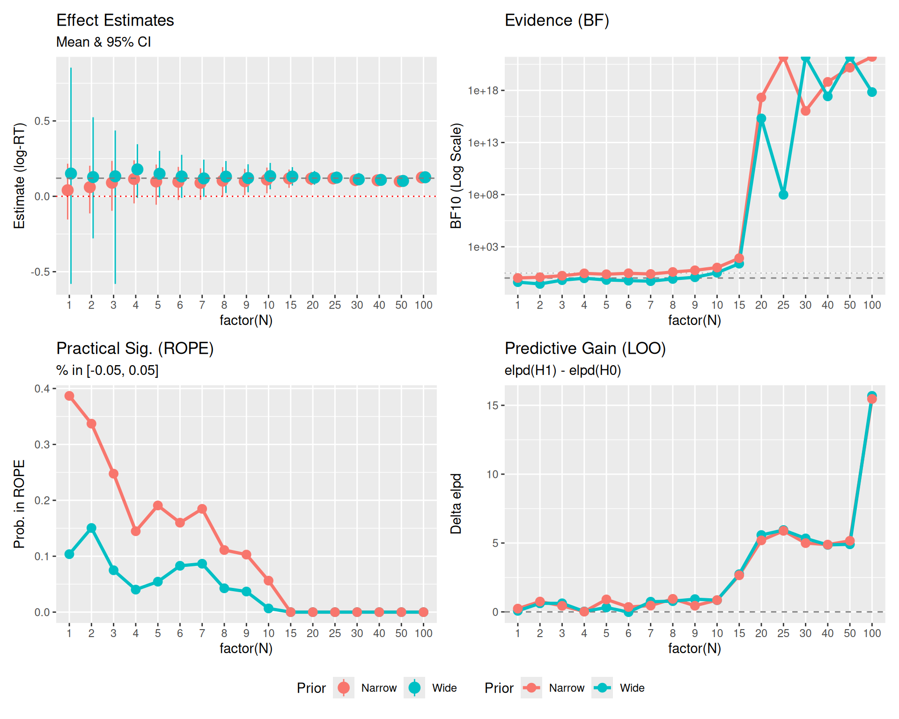

# Introduction

In this specific example, we will simulate a scenario where we collect data sequentially ($N=20, 50, 100$) and track how three different Bayesian decision metrics behave:

1.  **ROPE (Region of Practical Equivalence)**: Does the effect magnitude matter?
2.  **Bayes Factor (via Savage-Dickey)**: Is the null hypothesis ($H_0: \beta=0$) less likely than the alternative?
3.  **LOO (Leave-One-Out CV)**: Does including the parameter improve predictive accuracy?

We will also see how **prior width** affects the Bayes Factor but has less impact on ROPE and LOO (once N is moderate).


::: {.cell}

```{.r .cell-code}
library(brms)
library(tidyverse)
library(bayesplot)
library(posterior)
library(bayestestR)
library(emmeans)
library(marginaleffects)
library(patchwork)
library(tidybayes)

theme_set(theme_minimal(base_size = 14))
```
:::


# Part 1: The Simulation Study

## Data Generation

We generate data where there is a **small but real effect** ($d \approx 0.2$). This is the "danger zone" where decision criteria often disagree.


::: {.cell}

```{.r .cell-code}
set.seed(2025) # Fixed seed for reproducibility

# Function to generate data
# n represents number of subjects here
generate_data <- function(n_subj) {
  n_item <- 10 # Number of items (kept small for efficiency)
  
  expand_grid(
    subject = factor(1:n_subj),
    item = factor(1:n_item),
    condition = factor(c("A", "B"))
  ) %>%
    # Add random effects
    group_by(subject) %>%
    mutate(
      subj_intercept = rnorm(1, mean = 0, sd = 0.15),
      subj_slope = rnorm(1, mean = 0, sd = 0.08)
    ) %>%
    group_by(item) %>%
    mutate(
      item_intercept = rnorm(1, mean = 0, sd = 0.10)
    ) %>%
    ungroup() %>%
    # Generate log-RT
    mutate(
      condition_effect = if_else(condition == "B", 0.12, 0),  # 12% slower (effect size)
      log_rt = 6.0 +  # baseline ≈ 400ms (log scale)
               subj_intercept + 
               item_intercept + 
               condition_effect + 
               (condition == "B") * subj_slope +
               rnorm(n(), mean = 0, sd = 0.20),  # residual noise
      # Map log_rt to y for compatibility
      y = log_rt
    ) %>%
    select(subject, item, condition, y)
}
```
:::


## The Loop

We will loop through sample sizes $N = \{20, 50, 100\}$. At each step, we fit three models:

1.  **Null Model ($H_0$)**: `y ~ 1`
2.  **Wide Prior Model ($H_1$ Wide)**: `y ~ condition`, prior `normal(0, 5)`
3.  **Narrow Prior Model ($H_1$ Narrow)**: `y ~ condition`, prior `normal(0, 0.2)`


::: {.cell}

```{.r .cell-code}
# Sample sizes (Number of subjects)
# Sample sizes (Number of subjects)
sample_sizes <- c(1:10, seq(15, 30, 5), 40, 50, 100)
results_list <- list()

# Ensure models directory exists
dir.create("models", showWarnings = FALSE)

# Generate the full dataset once (Sequential design: N=20 contains N=10)
max_n <- max(sample_sizes)
data_full <- generate_data(max_n)

for (n in sample_sizes) {
  
  # 1. Subset Data (Cumulative/Sequential)
  data_n <- data_full %>% 
    filter(as.integer(subject) <= n) %>%
    droplevels()
  
  # 2. Fit Models
  # Using mixed-effects models to match data structure
  
  # H0: Null model (no fixed condition effect, but allowing random slopes)
  fit_null <- brm(
    y ~ 1 + (1 + condition | subject) + (1 | item), 
    data = data_n,
    prior = c(
        prior(normal(6, 0.5), class = Intercept), # Centered around 6 (log-RT)
        prior(exponential(2), class = sd),
        prior(exponential(2), class = sigma),
        prior(lkj(2), class = cor)
    ),
    file = paste0("models/fit_null_N", n),
    silent = 2, refresh = 0, seed = 123
  )
  
  # H1 Wide: Wide prior on slope
  fit_wide <- brm(
    y ~ condition + (1 + condition | subject) + (1 | item),
    data = data_n,
    prior = c(
      prior(normal(6, 0.5), class = Intercept),
      prior(normal(0, 1.0), class = b), # Wide for log scale
      prior(exponential(2), class = sd),
      prior(exponential(2), class = sigma),
      prior(lkj(2), class = cor)
    ),
    sample_prior = "yes", # Needed for Bayes Factor
    file = paste0("models/fit_wide_N", n),
    silent = 2, refresh = 0, seed = 123
  )
  
  # H1 Narrow: Narrow prior on slope (informed by expected effect size)
  fit_narrow <- brm(
    y ~ condition + (1 + condition | subject) + (1 | item),
    data = data_n,
    prior = c(
      prior(normal(6, 0.5), class = Intercept),
      prior(normal(0, 0.1), class = b), # Narrow (around 0.12)
      prior(exponential(2), class = sd),
      prior(exponential(2), class = sigma),
      prior(lkj(2), class = cor)
    ),
    sample_prior = "yes",
    file = paste0("models/fit_narrow_N", n),
    silent = 2, refresh = 0, seed = 123
  )
  
  # 3. Compute Metrics
  
  # --- ROPE ---
  # ROPE range [-0.05, 0.05] (approx 5% change, suitable for log-RT practical significance)
  
  # For Narrow Model
  rope_res_narrow <- rope(fit_narrow, range = c(-0.05, 0.05), ci = 0.95)
  rope_pct_in_narrow <- rope_res_narrow$ROPE_Percentage[2] # conditionB
  
  # For Wide Model
  rope_res_wide <- rope(fit_wide, range = c(-0.05, 0.05), ci = 0.95)
  rope_pct_in_wide <- rope_res_wide$ROPE_Percentage[2] # conditionB
  
  # --- Bayes Factor (Savage-Dickey) ---
  # For Wide Model
  bf_wide <- hypothesis(fit_wide, "conditionB = 0")
  bf_val_wide <- 1 / bf_wide$hypothesis$Evid.Ratio # BF10 (evidence FOR effect)
  
  # For Narrow Model
  bf_narrow <- hypothesis(fit_narrow, "conditionB = 0")
  bf_val_narrow <- 1 / bf_narrow$hypothesis$Evid.Ratio # BF10
  
  # --- LOO ---
  loo_null <- loo(fit_null)
  loo_wide <- loo(fit_wide)
  loo_narrow <- loo(fit_narrow)
  
  # elpd_gain: elpd(H1) - elpd(H0)
  elpd_gain_wide <- loo_wide$estimates["elpd_loo", "Estimate"] - loo_null$estimates["elpd_loo", "Estimate"]
  elpd_gain_narrow <- loo_narrow$estimates["elpd_loo", "Estimate"] - loo_null$estimates["elpd_loo", "Estimate"]
  
  # --- Posterior Estimates (with 95% CIs) ---
  est_narrow <- fixef(fit_narrow, probs = c(0.025, 0.975))["conditionB", ]
  est_wide <- fixef(fit_wide, probs = c(0.025, 0.975))["conditionB", ]
  
  # Store
  results_list[[paste0("N", n)]] <- tibble(
    N = n,
    # Estimates
    Est_Narrow = est_narrow["Estimate"],
    Low_Narrow = est_narrow["Q2.5"],
    High_Narrow = est_narrow["Q97.5"],
    Est_Wide = est_wide["Estimate"],
    Low_Wide = est_wide["Q2.5"],
    High_Wide = est_wide["Q97.5"],
    # Metrics
    ROPE_in_prob_Wide = rope_pct_in_wide,
    ROPE_in_prob_Narrow = rope_pct_in_narrow,
    BF10_Wide = bf_val_wide,
    BF10_Narrow = bf_val_narrow,
    LOO_gain_Wide = elpd_gain_wide,
    LOO_gain_Narrow = elpd_gain_narrow
  )
}

results_df <- bind_rows(results_list)
```
:::


## Results Table


::: {.cell}

```{.r .cell-code}
results_df %>%
  pivot_longer(
    cols = -N,
    names_to = c("Metric", "Prior"),
    names_pattern = "(.*)_(Narrow|Wide)"
  ) %>%
  pivot_wider(names_from = Metric, values_from = value) %>%
  mutate(
    Estimate_CI = sprintf("%.2f [%.2f, %.2f]", Est, Low, High)
  ) %>%
  select(N, Prior, Estimate_CI, BF10, ROPE_Prob = ROPE_in_prob, LOO_Gain = LOO_gain) %>%
  arrange(N, desc(Prior)) %>%
  knitr::kable(digits = 3, caption = "Comparison of Decision Metrics by Sample Size and Prior Sensitivity")
```

::: {.cell-output-display}


Table: Comparison of Decision Metrics by Sample Size and Prior Sensitivity

|  N|Prior  |Estimate_CI       |         BF10| ROPE_Prob| LOO_Gain|
|--:|:------|:-----------------|------------:|---------:|--------:|
| 10|Wide   |0.17 [0.08, 0.25] | 1.003400e+01|     0.000|    1.318|
| 10|Narrow |0.14 [0.05, 0.22] | 2.778000e+01|     0.000|    1.596|
| 20|Wide   |0.13 [0.05, 0.20] | 5.132000e+00|     0.000|    1.282|
| 20|Narrow |0.11 [0.04, 0.19] | 3.622400e+01|     0.026|    0.893|
| 50|Wide   |0.13 [0.10, 0.16] | 7.450869e+92|     0.000|   13.583|
| 50|Narrow |0.12 [0.10, 0.15] | 4.183176e+15|     0.000|   13.620|


:::
:::


## Visualization of Divergence

Let's visualize how these metrics evolve as N increases.


::: {.cell}

```{.r .cell-code}
# 1. Estimates Data
plot_est <- results_df %>%
  select(N, starts_with("Est"), starts_with("Low"), starts_with("High")) %>%
  pivot_longer(
    cols = -N,
    names_to = c("Type", "Prior"),
    names_sep = "_"
  ) %>%
  pivot_wider(names_from = Type, values_from = value)

# 2. Metrics Data
plot_metrics <- results_df %>%
  select(N, contains("BF10"), contains("ROPE"), contains("LOO")) %>%
  pivot_longer(
    cols = -N,
    names_to = c("MetricType", "Prior"),
    names_pattern = "(.*)_(Wide|Narrow)",
    values_to = "Value"
  )

# Plot 0: Estimates
p0 <- ggplot(plot_est, aes(x = factor(N), y = Est, color = Prior, group = Prior)) +
  geom_pointrange(aes(ymin = Low, ymax = High), position = position_dodge(width = 0.3), size = 0.8) +
  geom_hline(yintercept = 0.12, linetype = "dashed", color = "gray50") + # True effect
  geom_hline(yintercept = 0, linetype = "dotted", color = "red") +
  labs(title = "Effect Estimates", subtitle = "Mean & 95% CI", y = "Estimate (log-RT)") +
  theme(legend.position = "bottom")

# Plot 1: Bayes Factors
p1 <- plot_metrics %>%
  filter(MetricType == "BF10") %>%
  ggplot(aes(x = factor(N), y = Value, color = Prior, group = Prior)) +
  geom_hline(yintercept = 1, linetype = "dashed", color = "gray50") +
  geom_hline(yintercept = 3, linetype = "dotted", color = "gray50", alpha=0.5) +
  geom_line(size = 1.2) +
  geom_point(size = 3) +
  scale_y_log10() +
  labs(title = "Evidence (BF)", y = "BF10 (Log Scale)")

# Plot 2: ROPE
p2 <- plot_metrics %>%
  filter(MetricType == "ROPE_in_prob") %>%
  ggplot(aes(x = factor(N), y = Value, color = Prior, group = Prior)) +
  geom_line(size = 1.2) +
  geom_point(size = 3) +
  labs(title = "Practical Sig. (ROPE)", 
       subtitle = "% in [-0.05, 0.05]", 
       y = "Prob. in ROPE") 
  # ylim removed for dynamic scaling

# Plot 3: LOO Prediction
p3 <- plot_metrics %>%
  filter(MetricType == "LOO_gain") %>%
  ggplot(aes(x = factor(N), y = Value, color = Prior, group = Prior)) +
  geom_hline(yintercept = 0, linetype = "dashed", color = "gray50") +
  geom_line(size = 1.2) +
  geom_point(size = 3) +
  labs(title = "Predictive Gain (LOO)", 
       subtitle = "elpd(H1) - elpd(H0)",
       y = "Delta elpd")

(p0 + p1 + p2 + p3) + 
  plot_layout(guides = "collect") & theme(legend.position = "bottom")
```

::: {.cell-output-display}
{width=960}
:::
:::


### Interpretation

1.  **Bayes Factor Divergence**: Notice that `BF10_Wide` is significantly lower than `BF10_Narrow`. The wide prior penalizes the alternative hypothesis because it spreads probability density over a huge range where data is not found ("Dilution Effect").
2.  **Small N (20)**:
