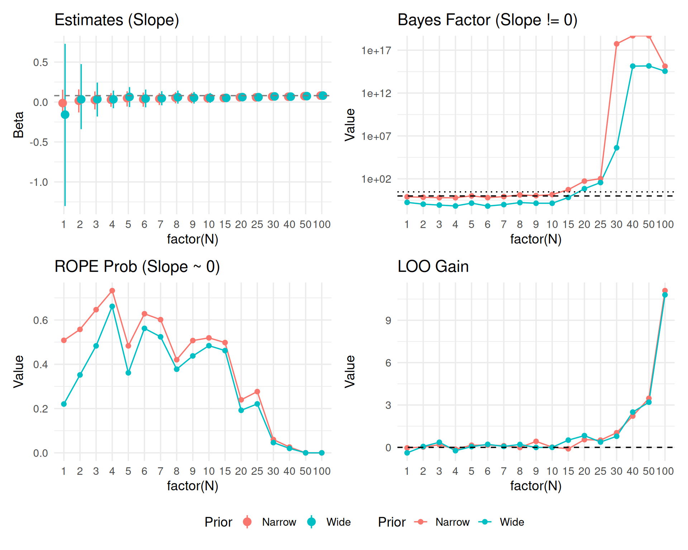
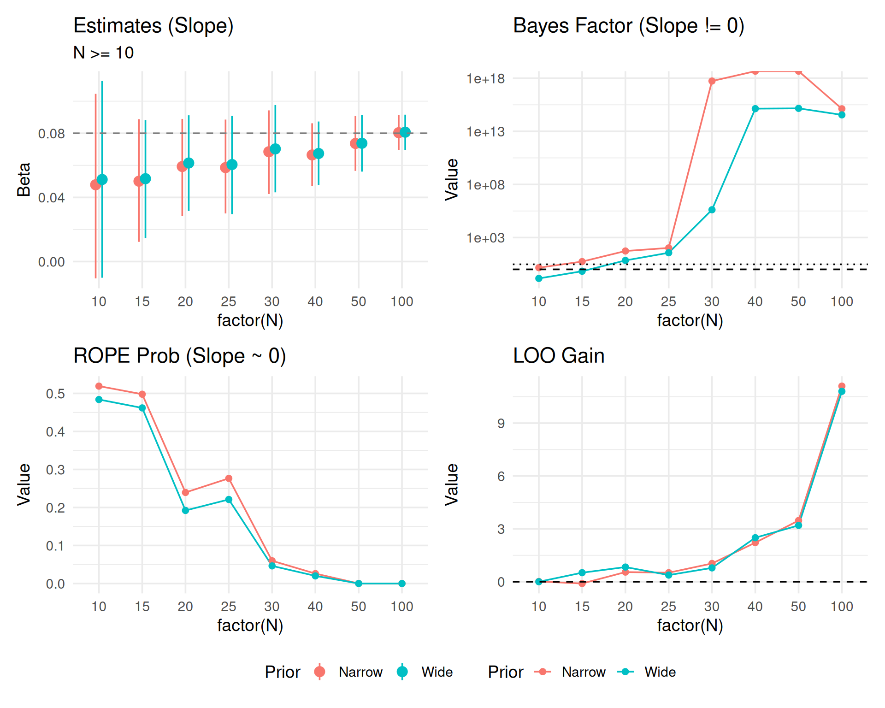
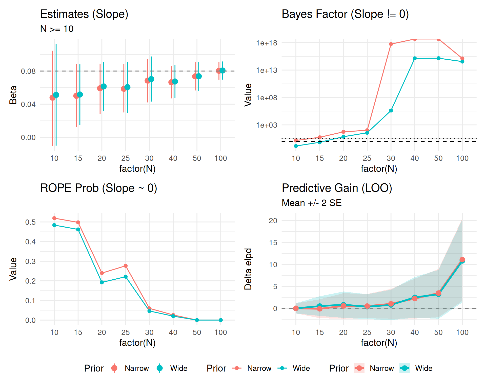

::: {.cell}

```{.r .cell-code}
library(brms)
library(tidyverse)
library(bayesplot)
library(posterior)
library(bayestestR)
library(emmeans)
library(marginaleffects)
library(patchwork)
library(tidybayes)

theme_set(theme_minimal(base_size = 14))
```
:::


# Part 2: Continuous Predictor Simulation

In this second part, we repeat the sequential testing process for a **continuous predictor** (e.g., word frequency or trial number) to see if decision metrics behave similarly.

## Data Generation (Continuous)

We simulate a log-RT variable with a continuous predictor $X$ (centered, range approx -2 to 2).
True Effect of X: 0.05 (approx 5% change per unit of X).


::: {.cell}

```{.r .cell-code}
set.seed(999)

generate_data_cont <- function(n_subj) {
  n_item <- 10
  
  expand_grid(
    subject = factor(1:n_subj),
    item = factor(1:n_item),
    trial_x = seq(-1, 1, length.out = 10) # Continuous predictor per item/trial
  ) %>%
    group_by(subject) %>%
    mutate(
      subj_intercept = rnorm(1, 0, 0.15),
      subj_slope = rnorm(1, 0, 0.05)
    ) %>%
    ungroup() %>%
    mutate(
      # True effect: 0.08 per unit of X
      log_rt = 6.0 + 
               subj_intercept + 
               0.08 * trial_x + 
               trial_x * subj_slope + 
               rnorm(n(), 0, 0.2),
      y = log_rt
    ) %>%
    select(subject, item, trial_x, y)
}
```
:::


## Simulation Loop (Continuous)

We fit three models again:
1. **Null**: `y ~ 1 + (1|subject) + (1|item)`
2. **Wide**: `y ~ trial_x`, prior `normal(0, 5)`
3. **Narrow**: `y ~ trial_x`, prior `normal(0, 0.2)`


::: {.cell}

```{.r .cell-code}
# Same extended sample sizes
sample_sizes_cont <- c(1:10, seq(15, 30, 5), 40, 50, 100)
results_list_cont <- list()

# Generate full dataset
max_n_cont <- max(sample_sizes_cont)
data_full_cont <- generate_data_cont(max_n_cont)

for (n in sample_sizes_cont) {
  
  # Subset Data
  data_n <- data_full_cont %>% 
    filter(as.integer(subject) <= n) %>% 
    droplevels()
    
  # Fit Models
  # H0: Null (Random slopes for X could be included, but keeping simple for null)
  fit_null <- brm(
    y ~ 1 + (1 + trial_x | subject) + (1 | item),
    data = data_n,
    prior = c(
      prior(normal(6, 0.5), class = Intercept),
      prior(exponential(2), class = sd),
      prior(exponential(2), class = sigma)
    ),
    file = paste0("models/fit_cont_null_N", n),
    silent = 2, refresh = 0, seed = 123
  )
  
  # H1 Wide
  fit_wide <- brm(
    y ~ trial_x + (1 + trial_x | subject) + (1 | item),
    data = data_n,
    prior = c(
      prior(normal(6, 0.5), class = Intercept),
      prior(normal(0, 1.0), class = b), # Wide for slope
      prior(exponential(2), class = sd),
      prior(exponential(2), class = sigma)
    ),
    sample_prior = "yes",
    file = paste0("models/fit_cont_wide_N", n),
    silent = 2, refresh = 0, seed = 123
  )
  
  # H1 Narrow
  fit_narrow <- brm(
    y ~ trial_x + (1 + trial_x | subject) + (1 | item),
    data = data_n,
    prior = c(
      prior(normal(6, 0.5), class = Intercept),
      prior(normal(0, 0.1), class = b), # Narrow expectation for slope
      prior(exponential(2), class = sd),
      prior(exponential(2), class = sigma)
    ),
    sample_prior = "yes",
    file = paste0("models/fit_cont_narrow_N", n),
    silent = 2, refresh = 0, seed = 123
  )
  
  # Metrics
  
  # ROPE [-0.05, 0.05] on slope
  rope_wide_df <- rope(fit_wide, range = c(-0.05, 0.05), ci = 0.95)
  rope_narrow_df <- rope(fit_narrow, range = c(-0.05, 0.05), ci = 0.95)
  
  # Select duplicate rows (Intercept + Trial_x) -> Take only trial_x (usually 2nd param)
  # Safer: filter by Parameter name if possible, or take index 2
  rope_wide <- rope_wide_df$ROPE_Percentage[2]
  rope_narrow <- rope_narrow_df$ROPE_Percentage[2]
  
  # Bayes Factor (Slope = 0)
  bf_wide <- 1 / hypothesis(fit_wide, "trial_x = 0")$hypothesis$Evid.Ratio
  bf_narrow <- 1 / hypothesis(fit_narrow, "trial_x = 0")$hypothesis$Evid.Ratio
  
  # LOO
  loo_null <- loo(fit_null)
  loo_wide <- loo(fit_wide)
  loo_narrow <- loo(fit_narrow)
  
  # Calculate LOO gain and SE of the difference
  diff_wide <- loo_wide$pointwise[,"elpd_loo"] - loo_null$pointwise[,"elpd_loo"]
  gain_wide <- sum(diff_wide)
  se_wide <- sqrt(length(diff_wide) * var(diff_wide))
  
  diff_narrow <- loo_narrow$pointwise[,"elpd_loo"] - loo_null$pointwise[,"elpd_loo"]
  gain_narrow <- sum(diff_narrow)
  se_narrow <- sqrt(length(diff_narrow) * var(diff_narrow))
  
  # Estimates
  est_narrow <- fixef(fit_narrow, probs = c(0.025, 0.975))["trial_x", ]
  est_wide <- fixef(fit_wide, probs = c(0.025, 0.975))["trial_x", ]
  
  results_list_cont[[paste0("N", n)]] <- tibble(
    N = n,
    # Est
    Est_Narrow = as.numeric(est_narrow["Estimate"]), 
    Low_Narrow = as.numeric(est_narrow["Q2.5"]), 
    High_Narrow = as.numeric(est_narrow["Q97.5"]),
    Est_Wide = as.numeric(est_wide["Estimate"]), 
    Low_Wide = as.numeric(est_wide["Q2.5"]), 
    High_Wide = as.numeric(est_wide["Q97.5"]),
    # Metrics
    ROPE_in_prob_Narrow = as.numeric(rope_narrow), 
    ROPE_in_prob_Wide = as.numeric(rope_wide),
    BF10_Narrow = as.numeric(bf_narrow), 
    BF10_Wide = as.numeric(bf_wide),
    LOO_gain_Narrow = as.numeric(gain_narrow), 
    LOO_se_Narrow = as.numeric(se_narrow),
    LOO_gain_Wide = as.numeric(gain_wide),
    LOO_se_Wide = as.numeric(se_wide)
  )
}

results_df_cont <- bind_rows(results_list_cont)
```
:::


## Continuous Results Table


::: {.cell}

```{.r .cell-code}
results_df_cont %>%
  pivot_longer(
    cols = -N,
    names_to = c("Metric", "Prior"),
    names_pattern = "(.*)_(Narrow|Wide)"
  ) %>%
  mutate(value = map_dbl(value, ~ if(is.list(.x)) as.numeric(.x[[1]]) else as.numeric(.x))) %>%
  pivot_wider(names_from = Metric, values_from = value) %>%
  unnest(cols = everything()) %>%
  mutate(Estimate_CI = sprintf("%.2f [%.2f, %.2f]", Est, Low, High)) %>%
  select(N, Prior, Estimate_CI, BF10, ROPE_Prob = ROPE_in_prob, LOO_Gain = LOO_gain) %>%
  arrange(N, desc(Prior)) %>%
  knitr::kable(digits = 3, caption = "Continuous Predictor: Decision Metrics")
```

::: {.cell-output-display}


Table: Continuous Predictor: Decision Metrics

|   N|Prior  |Estimate_CI         |         BF10| ROPE_Prob| LOO_Gain|
|---:|:------|:-------------------|------------:|---------:|--------:|
|   1|Wide   |-0.16 [-1.30, 0.73] | 1.780000e-01|     0.220|   -0.387|
|   1|Narrow |-0.01 [-0.16, 0.15] | 7.920000e-01|     0.508|   -0.038|
|   2|Wide   |0.03 [-0.34, 0.47]  | 1.110000e-01|     0.352|    0.062|
|   2|Narrow |0.02 [-0.13, 0.16]  | 7.070000e-01|     0.557|    0.023|
|   3|Wide   |0.03 [-0.18, 0.24]  | 8.600000e-02|     0.483|    0.361|
|   3|Narrow |0.02 [-0.09, 0.13]  | 6.280000e-01|     0.647|    0.190|
|   4|Wide   |0.03 [-0.08, 0.14]  | 6.800000e-02|     0.662|   -0.235|
|   4|Narrow |0.03 [-0.06, 0.11]  | 6.170000e-01|     0.733|   -0.133|
|   5|Wide   |0.06 [-0.06, 0.19]  | 1.460000e-01|     0.361|    0.053|
|   5|Narrow |0.05 [-0.06, 0.13]  | 1.023000e+00|     0.483|    0.150|
|   6|Wide   |0.04 [-0.07, 0.16]  | 6.600000e-02|     0.562|    0.214|
|   6|Narrow |0.04 [-0.06, 0.12]  | 6.350000e-01|     0.628|    0.163|
|   7|Wide   |0.05 [-0.04, 0.14]  | 9.800000e-02|     0.524|    0.069|
|   7|Narrow |0.04 [-0.04, 0.11]  | 8.460000e-01|     0.602|    0.117|
|   8|Wide   |0.06 [-0.02, 0.14]  | 1.680000e-01|     0.378|    0.205|
|   8|Narrow |0.05 [-0.02, 0.12]  | 1.338000e+00|     0.421|   -0.010|
|   9|Wide   |0.05 [-0.02, 0.13]  | 1.420000e-01|     0.438|   -0.005|
|   9|Narrow |0.05 [-0.02, 0.11]  | 1.094000e+00|     0.507|    0.426|
|  10|Wide   |0.05 [-0.01, 0.11]  | 1.410000e-01|     0.484|    0.001|
|  10|Narrow |0.05 [-0.01, 0.10]  | 1.450000e+00|     0.519|    0.014|
|  15|Wide   |0.05 [0.01, 0.09]   | 6.710000e-01|     0.462|    0.513|
|  15|Narrow |0.05 [0.01, 0.09]   | 5.445000e+00|     0.498|   -0.100|
|  20|Wide   |0.06 [0.03, 0.09]   | 7.014000e+00|     0.192|    0.833|
|  20|Narrow |0.06 [0.03, 0.09]   | 5.400300e+01|     0.239|    0.548|
|  25|Wide   |0.06 [0.03, 0.09]   | 3.674800e+01|     0.221|    0.379|
|  25|Narrow |0.06 [0.03, 0.09]   | 1.050360e+02|     0.277|    0.513|
|  30|Wide   |0.07 [0.04, 0.10]   | 4.132826e+05|     0.046|    0.786|
|  30|Narrow |0.07 [0.04, 0.09]   | 5.481336e+17|     0.060|    1.036|
|  40|Wide   |0.07 [0.05, 0.09]   | 1.375817e+15|     0.020|    2.498|
|  40|Narrow |0.07 [0.05, 0.09]   |          Inf|     0.026|    2.218|
|  50|Wide   |0.07 [0.06, 0.09]   | 1.465803e+15|     0.000|    3.197|
|  50|Narrow |0.07 [0.06, 0.09]   |          Inf|     0.000|    3.473|
| 100|Wide   |0.08 [0.07, 0.09]   | 3.552615e+14|     0.000|   10.803|
| 100|Narrow |0.08 [0.07, 0.09]   | 1.330036e+15|     0.000|   11.100|


:::
:::


## Visualization (Continuous)


::: {.cell}

```{.r .cell-code}
# First, ensure all columns are properly numeric by unnesting and converting
results_clean <- results_df_cont %>%
  mutate(across(everything(), ~ {
    if(is.list(.x)) {
      map_dbl(.x, ~ if(length(.x) > 0) as.numeric(.x[[1]]) else NA_real_)
    } else {
      as.numeric(.x)
    }
  })) %>%
  # Double-check: convert to data frame to remove any remaining list structure
  as.data.frame() %>%
  as_tibble()

# 1. Estimates
p_est_c <- results_clean %>%
  select(N, starts_with("Est"), starts_with("Low"), starts_with("High")) %>%
  pivot_longer(cols = -N, names_to = c("Type", "Prior"), names_sep = "_") %>%
  pivot_wider(names_from = Type, values_from = value) %>%
  unnest(cols = c(Est, Low, High)) %>%
  ggplot(aes(x = factor(N), y = Est, color = Prior, group = Prior)) +
  geom_pointrange(aes(ymin = Low, ymax = High), position = position_dodge(width = 0.3)) +
  geom_hline(yintercept = 0.08, linetype = "dashed", color = "gray50") +
  labs(title = "Estimates (Slope)", y = "Beta") +
  theme(legend.position = "bottom")

# 2. Metrics
plot_met_c <- results_clean %>%
  select(N, contains("BF10"), contains("ROPE"), contains("LOO")) %>%
  pivot_longer(cols = -N, names_to = c("MetricType", "Prior"), names_pattern = "(.*)_(Wide|Narrow)", values_to = "Value") %>%
  mutate(Value = as.numeric(Value))

p_bf_c <- plot_met_c %>% filter(MetricType == "BF10") %>%
  ggplot(aes(x = factor(N), y = Value, color = Prior, group = Prior)) +
  geom_line() + geom_point() + scale_y_log10() +
  geom_hline(yintercept = c(1, 3), linetype = c("dashed", "dotted")) +
  labs(title = "Bayes Factor (Slope != 0)")

p_rope_c <- plot_met_c %>% filter(MetricType == "ROPE_in_prob") %>%
  ggplot(aes(x = factor(N), y = Value, color = Prior, group = Prior)) +
  geom_line() + geom_point() +
  labs(title = "ROPE Prob (Slope ~ 0)")

p_loo_c <- plot_met_c %>% filter(MetricType == "LOO_gain") %>%
  ggplot(aes(x = factor(N), y = Value, color = Prior, group = Prior)) +
  geom_line() + geom_point() + geom_hline(yintercept = 0, linetype = "dashed") +
  labs(title = "LOO Gain")

(p_est_c + p_bf_c + p_rope_c + p_loo_c) + 
  plot_layout(guides = "collect") & theme(legend.position = "bottom")
```

::: {.cell-output-display}
{width=960}
:::
:::


## Visualization (Zoomed: N >= 10)

Checking convergence by ignoring small N chaos.


::: {.cell}

```{.r .cell-code}
results_clean_zoom <- results_clean %>% filter(N >= 10)

# 1. Estimates
p_est_cz <- results_clean_zoom %>%
  select(N, starts_with("Est"), starts_with("Low"), starts_with("High")) %>%
  pivot_longer(cols = -N, names_to = c("Type", "Prior"), names_sep = "_") %>%
  pivot_wider(names_from = Type, values_from = value) %>%
  unnest(cols = c(Est, Low, High)) %>%
  ggplot(aes(x = factor(N), y = Est, color = Prior, group = Prior)) +
  geom_pointrange(aes(ymin = Low, ymax = High), position = position_dodge(width = 0.3)) +
  geom_hline(yintercept = 0.08, linetype = "dashed", color = "gray50") +
  labs(title = "Estimates (Slope)", y = "Beta", subtitle="N >= 10") +
  theme(legend.position = "bottom")

# 2. Metrics
plot_met_cz <- results_clean_zoom %>%
  select(N, contains("BF10"), contains("ROPE"), contains("LOO_gain")) %>% # Exclude SE for this long format
  pivot_longer(cols = -N, names_to = c("MetricType", "Prior"), names_pattern = "(.*)_(Wide|Narrow)", values_to = "Value") %>%
  mutate(Value = as.numeric(Value))

p_bf_cz <- plot_met_cz %>% filter(MetricType == "BF10") %>%
  ggplot(aes(x = factor(N), y = Value, color = Prior, group = Prior)) +
  geom_line() + geom_point() + scale_y_log10() +
  geom_hline(yintercept = c(1, 3), linetype = c("dashed", "dotted")) +
  labs(title = "Bayes Factor (Slope != 0)")

p_rope_cz <- plot_met_cz %>% filter(MetricType == "ROPE_in_prob") %>%
  ggplot(aes(x = factor(N), y = Value, color = Prior, group = Prior)) +
  geom_line() + geom_point() +
  labs(title = "ROPE Prob (Slope ~ 0)")

p_loo_cz <- plot_met_cz %>% filter(MetricType == "LOO_gain") %>%
  ggplot(aes(x = factor(N), y = Value, color = Prior, group = Prior)) +
  geom_line() + geom_point() + geom_hline(yintercept = 0, linetype = "dashed") +
  labs(title = "LOO Gain")

(p_est_cz + p_bf_cz + p_rope_cz + p_loo_cz) + 
  plot_layout(guides = "collect") & theme(legend.position = "bottom")
```

::: {.cell-output-display}
{width=960}
:::
:::


## Visualization (Uncertainty: N >= 10)

Including LOO uncertainty ($SE_{diff}$).


::: {.cell}

```{.r .cell-code}
# Create specific LOO data frame with SE
plot_loo_unc_c <- results_clean_zoom %>%
  select(N, LOO_gain_Wide, LOO_se_Wide, LOO_gain_Narrow, LOO_se_Narrow) %>%
  pivot_longer(
    cols = -N,
    names_to = c(".value", "Prior"),
    names_pattern = "LOO_(.*)_(Wide|Narrow)"
  ) %>% # Creates N, Prior, gain, se
  mutate(
    # Unnest just in case, though results_clean should be flat
    gain = as.numeric(gain),
    se = as.numeric(se),
    Low = gain - 2*se,
    High = gain + 2*se
  )

p_loo_unc_c <- ggplot(plot_loo_unc_c, aes(x = factor(N), y = gain, color = Prior, group = Prior)) +
  geom_hline(yintercept = 0, linetype = "dashed", color = "gray50") +
  geom_ribbon(aes(ymin = Low, ymax = High, fill = Prior), alpha = 0.2, color = NA) +
  geom_line(size = 1.2) + 
  geom_point(size = 3) +
  labs(title = "Predictive Gain (LOO)", subtitle = "Mean +/- 2 SE", y = "Delta elpd")

(p_est_cz + p_bf_cz + p_rope_cz + p_loo_unc_c) + 
  plot_layout(guides = "collect") & theme(legend.position = "bottom")
```

::: {.cell-output-display}
{width=960}
:::
:::

