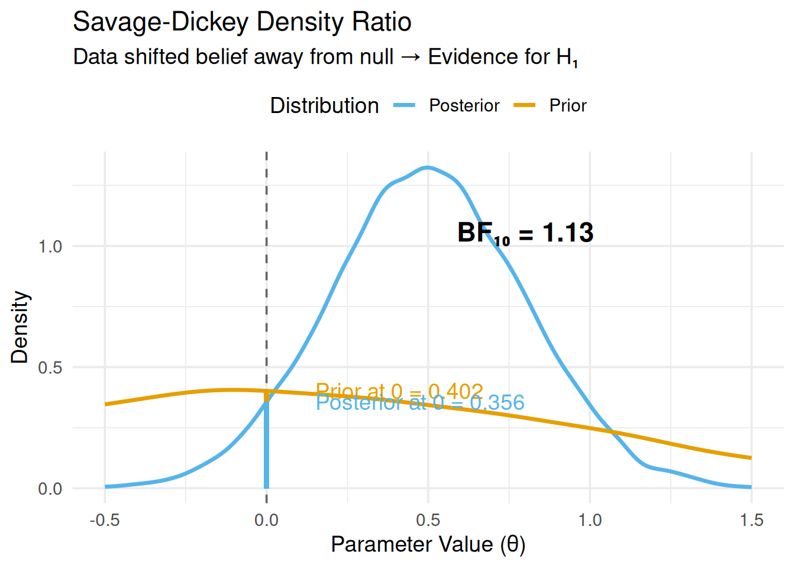
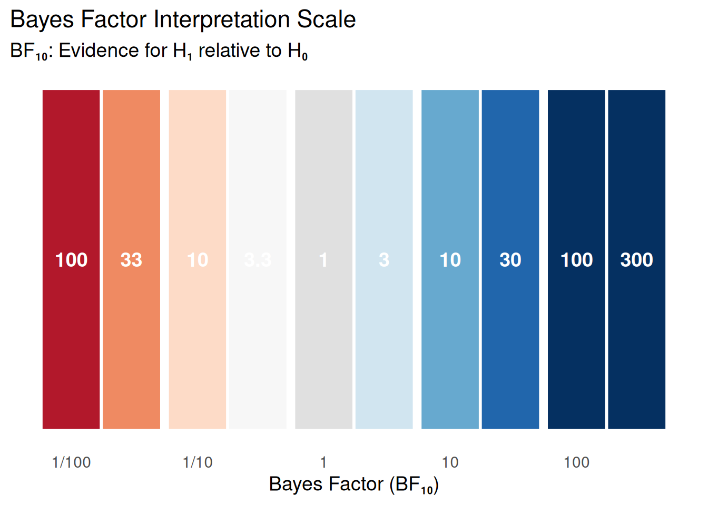
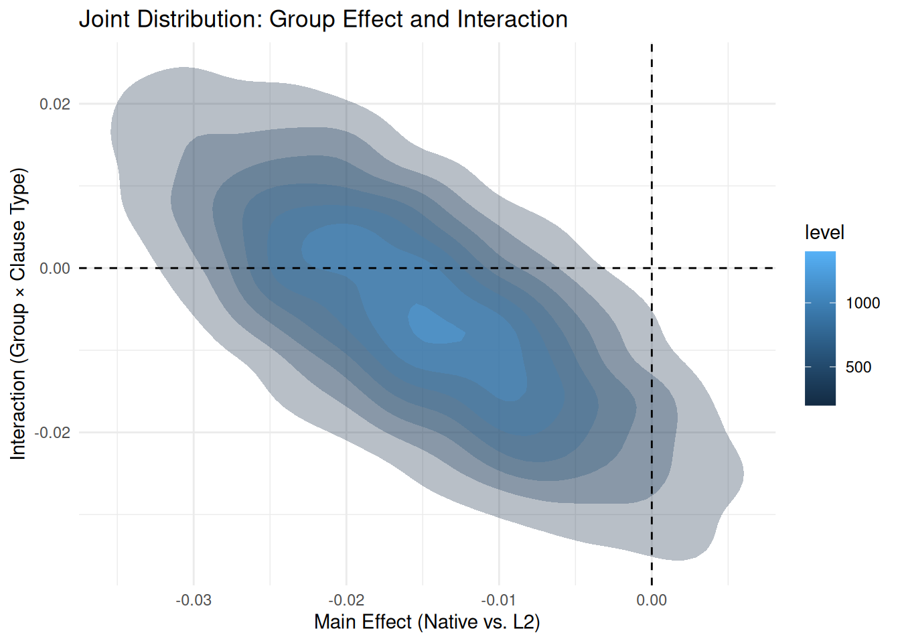
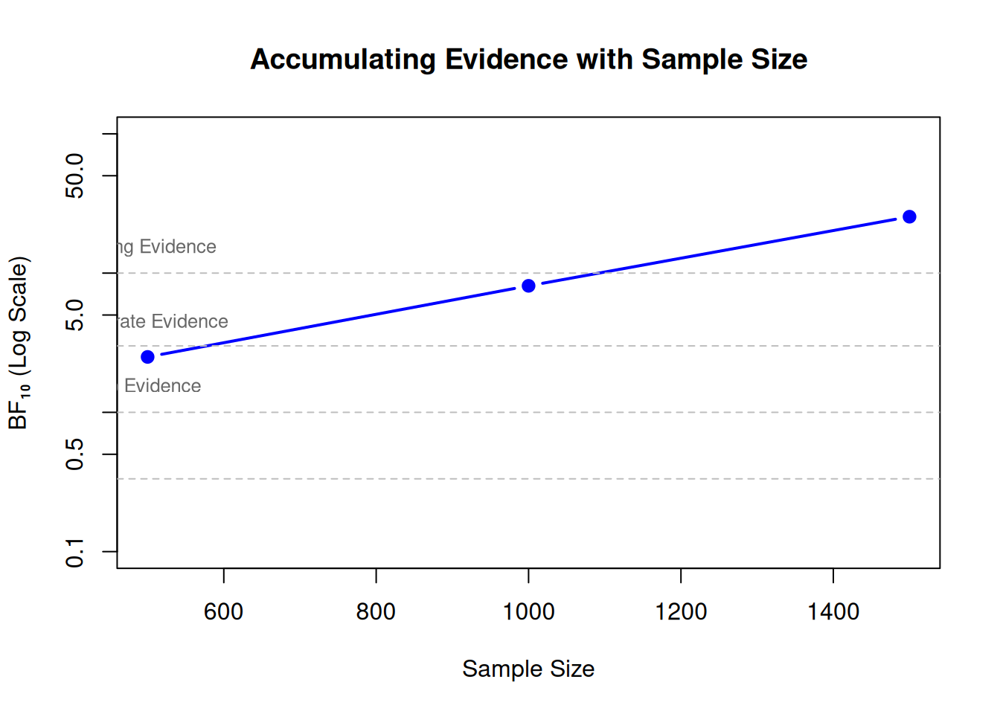

# The Question: Which Hypothesis is Better Supported?

## Research Scenario

You've estimated your model parameters and found that an effect exists (Module 06). Now you want to answer a different question:

**"How much evidence do the data provide for one hypothesis over another?"**

Examples:

- H₀: No effect (β = 0) vs. H₁: Some effect (β ≠ 0)
- H₁: Positive effect (β > 0) vs. H₂: Negative effect (β < 0)
- Model A: Simple main effects vs. Model B: Include interaction

This is where **Bayes Factors** come in.

## Bayes Factor vs. ROPE: Different Questions

| Approach | Question | Output | Focus |
|----------|----------|--------|-------|
| **ROPE** (Module 06) | "Is the effect meaningful?" | Accept/Reject/Undecided | Practical significance |
| **Bayes Factor** (Module 07) | "Which hypothesis is better?" | Evidence ratio (e.g., 10:1) | Hypothesis comparison |

**Key insight**: These are complementary, not competing!

- Use ROPE when you care about **practical significance**
- Use Bayes Factors when comparing **competing hypotheses/theories**

## Today

1. **`hypothesis()` function**: Compute Bayes Factors for parameter constraints
   - Uses Savage-Dickey density ratio method
   - Fast and built into brms
   
2. **`bayes_factor()` function**: Compare full models
   - Uses bridge sampling (more general but slower)
   - For complex model comparisons

3. **Interpretation guidelines**: What does BF = 3 vs. BF = 30 mean?

# Where We Are in the Analysis Workflow

## The Bayesian Workflow So Far

```
Module 01-02: Build model + set priors
            ↓
Module 03: Check model fit (posterior predictive)
            ↓
Module 04: Test prior sensitivity
            ↓
Module 05: Compare models (LOO-CV for prediction)
            ↓
Module 06: Practical significance (ROPE, emmeans, marginaleffects)
            ↓
Module 07 (TODAY): Hypothesis comparison (Bayes Factors, hypothesis())
```

## LOO vs. Bayes Factors vs. ROPE: What's the Difference?

These three approaches address different aspects of model evaluation:

**LOO (Module 05):**

- Goal: Predictive accuracy
- Question: "Which model predicts new data better?"
- Method: Cross-validation (leave-one-out)
- Output: ELPD difference, standard errors
- Use when: You care about out-of-sample performance
- Example: Choose between polynomial degrees for smooth fit

**Bayes Factors (Module 07):**

- Goal: Relative evidence
- Question: "Which hypothesis is better supported by data?"
- Method: Ratio of marginal likelihoods
- Output: Evidence ratio (e.g., BF₁₀ = 10:1)
- Use when: You want to quantify evidence for competing theories
- Example: Does priming effect exist? (H₀ vs. H₁)

**ROPE (Module 06):**

- Goal: Practical significance
- Question: "Is the effect too small to matter?"
- Method: Region of Practical Equivalence + HDI
- Output: Accept/Reject/Undecided
- Use when: You need to decide if an effect is meaningful
- Example: Is the treatment effect large enough to be clinically relevant?

**Rule of thumb:**

- Use **LOO** for model selection when **prediction** matters
- Use **BF** for hypothesis comparison when **explanation/theory** matters  
- Use **ROPE** for decision-making when **practical significance** matters
- Use **all three together** for a complete analysis!

::: {.callout-note collapse="true"}
## The Mathematical Relationship: Can These Approaches Be "Reverse Engineered"?

Recent research has explored the mathematical relationships between **Bayes Factors, HDI-ROPE, and frequentist equivalence tests (TOST)**.

**Note**: LOO is NOT part of this discussion because it addresses a fundamentally different question:

- **LOO**: Predictive accuracy (out-of-sample performance)
- **BF/ROPE/TOST**: Evidence for hypotheses (in-sample inference about parameters)

These are complementary, not competing. The "reverse engineering" debate concerns only methods testing the same hypothesis (equivalence/existence) using different frameworks.

### Campbell & Gustafson (2022)

**"The Bayes Factor, HDI-ROPE, and Frequentist Equivalence Tests Can All Be Reverse Engineered"**

Campbell and Gustafson (2022) redid the simulation study of Linde et al. (2021) with a critical modification: **they calibrated all three procedures to have the same predetermined maximum Type I error rate**.

**Main conclusions:**

1. **Similar operating characteristics**: When calibrated to the same Type I error rate, Bayes Factors, HDI-ROPE, and frequentist equivalence tests (TOST) all have **almost identical Type II error rates**.

2. **Methods are interchangeable (mathematically)**: The three approaches can be "reverse-engineered" from one another – they're essentially different mathematical frameworks achieving the same goal.

3. **Philosophy matters more than performance**: "If one decides on which underlying principle to subscribe to in tackling a given problem, then the method follows naturally."

4. **Empirical comparison is futile**: "Trying to use empirical performance to argue for one approach over another seems like tilting at windmills."

### Linde et al. (2023)

**"Decisions about Equivalence: A Comparison of TOST, HDI-ROPE, and the Bayes Factor"**

Linde et al. (2023) conducted an extensive simulation comparing operating characteristics across various scenarios.

**Main conclusions:**

1. **Bayes Factor shows advantages**: The Bayes Factor interval null approach performed best in their simulations for:
   - Distinguishing between equivalence and non-equivalence
   - Maintaining control over error rates
   - Flexibility across different scenarios

2. **HDI-ROPE is more conservative**: HDI-ROPE tends to be more conservative (lower Type I errors, but higher Type II errors) compared to Bayes Factors.

3. **TOST depends heavily on sample size**: Frequentist TOST can struggle with small samples and requires careful power analysis.

4. **Recommendation**: "Researchers rely more on the Bayes factor interval null approach for quantifying evidence for equivalence."

### Practical Implications for Your Analysis

**What this means:**

1. **Don't agonize over method choice (for equivalence testing)**: If calibrated properly, BF and ROPE give similar conclusions. Choose based on your philosophical stance and audience.

2. **Report both when possible**: Since they're complementary perspectives on the same question, reporting both BF and ROPE provides fuller picture:
   - **BF**: "How much evidence?" (continuous quantification)
   - **ROPE**: "Is it negligible?" (decision rule)

3. **Focus on calibration**: The key is proper calibration of thresholds:
   - **ROPE width**: Should reflect your domain's practical significance
   - **BF threshold**: Should match your evidence requirements
   - **Prior specification**: Critical for both approaches

4. **Philosophy guides choice**:
   - **Bayesian mindset** → Use BF for evidence quantification
   - **Decision-focused** → Use ROPE for accept/reject framework
   - **Mixed audience** → Report both

**Example of integrated reporting:**

> "We compared models using both LOO (predictive accuracy) and Bayes Factors (evidence). The random slopes model showed better predictive performance (ΔELPD = 12.3, SE = 4.2) and strong evidence for the complexity effect (BF₁₀ = 24.5). The 95% HDI [0.08, 0.15] fell entirely outside our ROPE of ±0.03, indicating the effect is predictively useful, evidentially supported, and practically meaningful."

This gives:
- **Predictive quality** (LOO: ΔELPD = 12.3)
- **Evidence strength** (BF = 24.5)
- **Practical significance** (HDI outside ROPE)
- **Effect size** (HDI: [0.08, 0.15])
:::

# The Savage-Dickey Density Ratio Method (brms's hypothesis())

## What is the Savage-Dickey Method?

The **Savage-Dickey method** provides an elegant way to compute Bayes Factors when:

- Models are **nested** (one is a special case of the other)
- You're testing a point hypothesis (e.g., β = 0)

**The formula:**
$$
BF_{01} = \frac{p(\theta = \theta_0 | \text{Data}, H_1)}{p(\theta = \theta_0 | H_1)} = \frac{\text{posterior density at null}}{\text{prior density at null}}
$$

**Intuition:**

- If data make null value **more plausible** → BF₀₁ > 1 → evidence for H₀
- If data make null value **less plausible** → BF₀₁ < 1 → evidence for H₁

## Visual Understanding


::: {.cell}

```{.r .cell-code}
library(ggplot2)

# Simulate prior and posterior
set.seed(123)
prior_samples <- rnorm(10000, 0, 1)
posterior_samples <- rnorm(10000, 0.5, 0.3)

# Estimate densities
prior_density <- density(prior_samples, from = -0.5, to = 1.5)
posterior_density <- density(posterior_samples, from = -0.5, to = 1.5)

# Heights at null (θ = 0)
prior_at_0 <- approx(prior_density$x, prior_density$y, xout = 0)$y
posterior_at_0 <- approx(posterior_density$x, posterior_density$y, xout = 0)$y

# Bayes Factor
BF_01 <- posterior_at_0 / prior_at_0
BF_10 <- 1 / BF_01

# Plot
df_prior <- data.frame(x = prior_density$x, y = prior_density$y, Distribution = "Prior")
df_posterior <- data.frame(x = posterior_density$x, y = posterior_density$y, Distribution = "Posterior")
df_combined <- rbind(df_prior, df_posterior)

ggplot(df_combined, aes(x = x, y = y, color = Distribution)) +
  geom_line(linewidth = 1.2) +
  geom_vline(xintercept = 0, linetype = "dashed", color = "gray40") +
  geom_segment(x = 0, xend = 0, y = 0, yend = prior_at_0, 
               color = "#E69F00", linewidth = 1.5, alpha = 0.7) +
  geom_segment(x = 0, xend = 0, y = 0, yend = posterior_at_0, 
               color = "#56B4E9", linewidth = 1.5, alpha = 0.7) +
  annotate("text", x = 0.15, y = prior_at_0, 
           label = paste0("Prior at 0 = ", round(prior_at_0, 3)), hjust = 0, color = "#E69F00") +
  annotate("text", x = 0.15, y = posterior_at_0, 
           label = paste0("Posterior at 0 = ", round(posterior_at_0, 3)), hjust = 0, color = "#56B4E9") +
  annotate("text", x = 0.8, y = max(df_combined$y) * 0.8,
           label = paste0("BF₁₀ = ", round(BF_10, 2)), 
           size = 6, fontface = "bold") +
  labs(
    title = "Savage-Dickey Density Ratio",
    subtitle = "Data shifted belief away from null → Evidence for H₁",
    x = "Parameter Value (θ)",
    y = "Density"
  ) +
  scale_color_manual(values = c("Prior" = "#E69F00", "Posterior" = "#56B4E9")) +
  theme_minimal(base_size = 14) +
  theme(legend.position = "top")
```

::: {.cell-output-display}
{#fig-savage-dickey width=672}
:::
:::


**Interpretation of this example:**

- Prior density at θ = 0: 0.402
- Posterior density at θ = 0: 0.356
- The posterior density **decreased** at the null
- BF₁₀ = 1.13 → Data are ~1.1 times more likely under H₁
- This is **positive evidence** for an effect

## Why This Works (Technical)

For nested models where H₀: θ = θ₀ is a special case of H₁: θ ∼ p(θ):

$$
BF_{01} = \frac{p(\text{Data} | H_0)}{p(\text{Data} | H_1)}
$$

The Savage-Dickey method shows that this equals:

$$
BF_{01} = \frac{p(\theta = \theta_0 | \text{Data}, H_1)}{p(\theta = \theta_0 | H_1)}
$$

**This is exact, not an approximation!** (under specific conditions)

**Conditions required:**

1. H₀ is a special case of H₁ (nested models)
2. Prior on nuisance parameters is same in both models
3. You can accurately estimate densities at the null value

# Using `hypothesis()` for Bayes Factors

## The `hypothesis()` Function

The `hypothesis()` function in brms implements the Savage-Dickey method automatically.

**Basic syntax:**
```r
hypothesis(model, hypothesis = "parameter = value")
hypothesis(model, hypothesis = "parameter > value")
hypothesis(model, hypothesis = "parameter1 - parameter2 = 0")
```

## Example 1: Test for Effect Existence


::: {.cell}

```{.r .cell-code}
library(brms)
library(tidyverse)

# Simulate data: Reading times with syntactic complexity effect
set.seed(456)
n_subjects <- 40
n_items <- 30

data <- expand_grid(
  subject = 1:n_subjects,
  item = 1:n_items,
  complexity = c("Simple", "Complex")
) %>%
  mutate(
    subject_intercept = rep(rnorm(n_subjects, 0, 0.15), each = n_items * 2),
    item_intercept = rep(rnorm(n_items, 0, 0.10), each = 2, times = n_subjects),
    complexity_effect = ifelse(complexity == "Complex", 0.08, 0),
    log_rt = 6.0 + subject_intercept + item_intercept + complexity_effect + rnorm(n(), 0, 0.20)
  )

# Fit model
model_complexity <- brm(
  log_rt ~ complexity + (1 + complexity | subject) + (1 | item),
  data = data,
  family = gaussian(),
  prior = c(
    prior(normal(6, 0.5), class = Intercept),
    prior(normal(0, 0.2), class = b),
    prior(exponential(10), class = sd),
    prior(exponential(10), class = sigma)
  ),
  chains = 4,
  iter = 2000,
  warmup = 1000,
  sample_prior = "yes",  # CRITICAL for hypothesis()!
  backend = "cmdstanr",
  refresh = 0,  # Suppress sampling progress
  file = "models/07_complexity_model"
)
```

::: {.cell-output .cell-output-stdout}

```
Running MCMC with 4 sequential chains...

Chain 1 finished in 18.7 seconds.
Chain 2 finished in 17.6 seconds.
Chain 3 finished in 18.0 seconds.
Chain 4 finished in 18.3 seconds.

All 4 chains finished successfully.
Mean chain execution time: 18.1 seconds.
Total execution time: 71.1 seconds.
```


:::
:::


### Test: Does Complexity Increase Reading Time?


::: {.cell}

```{.r .cell-code}
# H₀: β_complexity = 0
# H₁: β_complexity ≠ 0

h_test <- hypothesis(model_complexity, "complexitySimple = 0")
print(h_test)
```

::: {.cell-output .cell-output-stdout}

```
Hypothesis Tests for class b:
              Hypothesis Estimate Est.Error CI.Lower CI.Upper Evid.Ratio
1 (complexitySimple) = 0    -0.08      0.01     -0.1    -0.07          0
  Post.Prob Star
1         0    *
---
'CI': 90%-CI for one-sided and 95%-CI for two-sided hypotheses.
'*': For one-sided hypotheses, the posterior probability exceeds 95%;
for two-sided hypotheses, the value tested against lies outside the 95%-CI.
Posterior probabilities of point hypotheses assume equal prior probabilities.
```


:::
:::


**Understanding the output:**


::: {.cell}
::: {.cell-output .cell-output-stdout}

```
Hypothesis: (complexitySimple) = 0 
```


:::

::: {.cell-output .cell-output-stdout}

```
Estimate: -0.08 
```


:::

::: {.cell-output .cell-output-stdout}

```
CI.Lower: -0.10 
```


:::

::: {.cell-output .cell-output-stdout}

```
CI.Upper: -0.07 
```


:::

::: {.cell-output .cell-output-stdout}

```
Evid.Ratio: 0.00 
```


:::

::: {.cell-output .cell-output-stdout}

```
Post.Prob: 0.00 
```


:::

::: {.cell-output .cell-output-stdout}

```
Star: * 
```


:::
:::


**Interpretation:**

- **Estimate**: Complex sentences are 0.08 log-units slower
- **95% CI**: [-0.10, -0.07] (doesn't include 0)
- **Evid.Ratio ($BF_{01}$)**: The output `Evid.Ratio` for a point null test ("= 0") represents the **Bayes Factor for the Null**.
  - Value: 0.0000
  - **What "0.00" means**: The posterior density at the null value (0) is vanishingly small compared to the prior density. The model is effectively certain the effect is not 0.
- **Post.Prob**: The probability that the hypothesis ($H_0$) is true, assuming prior odds of 1. A value of `0.00` confirms $H_0$ is extremely unlikely.
- **Star (*)**: A visual indicator that zero is outside the 95% Credible Interval (statistically credible difference).
- **Bayes Factor ($BF_{10}$)**: To get evidence **for the effect**, we take the inverse ($1 / BF_{01}$):
  - $BF_{10} = 1 / 0.00000 \approx Inf$
- **Conclusion**: The data provide **decisive evidence** for a complexity effect ($H_1$) over the null hypothesis ($H_0$).

### Directional Test


::: {.cell}

```{.r .cell-code}
# Test specifically: H₁: β_complexity > 0 (one-sided)
h_directional <- hypothesis(model_complexity, "complexitySimple < 0")
print(h_directional)
```

::: {.cell-output .cell-output-stdout}

```
Hypothesis Tests for class b:
              Hypothesis Estimate Est.Error CI.Lower CI.Upper Evid.Ratio
1 (complexitySimple) < 0    -0.08      0.01     -0.1    -0.07        Inf
  Post.Prob Star
1         1    *
---
'CI': 90%-CI for one-sided and 95%-CI for two-sided hypotheses.
'*': For one-sided hypotheses, the posterior probability exceeds 95%;
for two-sided hypotheses, the value tested against lies outside the 95%-CI.
Posterior probabilities of point hypotheses assume equal prior probabilities.
```


:::
:::


**Interpretation:**

- **Estimate**: 0.08 (log-units)
- **Post.Prob**: 1.00 (1.00) means we are 100% certain the effect is negative ($< 0$).
- **Evid.Ratio ($BF_{10}$)**: For directional tests, the ratio is usually $P(H_1)/P(H_0)$. Infinite evidence here confirms the direction is robust.
- **Conclusion**: The data provide **extreme evidence** that the effect is negative.

**Why directional tests?**

- Theory predicts direction → stronger evidence possible
- One-sided test has more power than two-sided
- Evidence Ratio will be higher if data support predicted direction

## Example 2: Compare Two Groups


::: {.cell}

```{.r .cell-code}
# Simulate data: Native vs. L2 speakers on grammaticality judgment
set.seed(789)
n_subj_per_group <- 30
n_sentences <- 50

data_groups <- expand_grid(
  subject = 1:(2 * n_subj_per_group),
  sentence = 1:n_sentences
) %>%
  mutate(
    group = ifelse(subject <= n_subj_per_group, "Native", "L2"),
    subject_ability = rep(c(rnorm(n_subj_per_group, 1.5, 0.8),   # Natives higher
                            rnorm(n_subj_per_group, 0.8, 0.9)),  # L2 lower
                          each = n_sentences),
    sentence_difficulty = rep(rnorm(n_sentences, 0, 0.5), times = 2 * n_subj_per_group),
    log_odds = subject_ability + sentence_difficulty,
    prob = plogis(log_odds),
    correct = rbinom(n(), 1, prob)
  )

# Fit model
model_groups <- brm(
  correct ~ group + (1 | subject) + (1 | sentence),
  data = data_groups,
  family = bernoulli(),
  prior = c(
    prior(normal(0, 1.5), class = Intercept),
    prior(normal(0, 0.5), class = b),
    prior(exponential(1), class = sd)
  ),
  chains = 4,
  iter = 2000,
  warmup = 1000,
  sample_prior = "yes",
  backend = "cmdstanr",
  refresh = 0,
  file = "models/07_groups_model"
)
```

::: {.cell-output .cell-output-stdout}

```
Running MCMC with 4 sequential chains...

Chain 1 finished in 5.6 seconds.
Chain 2 finished in 5.4 seconds.
Chain 3 finished in 5.6 seconds.
Chain 4 finished in 5.8 seconds.

All 4 chains finished successfully.
Mean chain execution time: 5.6 seconds.
Total execution time: 21.3 seconds.
```


:::

```{.r .cell-code}
# Test: Are groups different?
h_group_diff <- hypothesis(model_groups, "groupNative = 0")
print(h_group_diff)
```

::: {.cell-output .cell-output-stdout}

```
Hypothesis Tests for class b:
         Hypothesis Estimate Est.Error CI.Lower CI.Upper Evid.Ratio Post.Prob
1 (groupNative) = 0     0.25      0.23    -0.19     0.69       1.16      0.54
  Star
1     
---
'CI': 90%-CI for one-sided and 95%-CI for two-sided hypotheses.
'*': For one-sided hypotheses, the posterior probability exceeds 95%;
for two-sided hypotheses, the value tested against lies outside the 95%-CI.
Posterior probabilities of point hypotheses assume equal prior probabilities.
```


:::
:::


::: {.cell}

```{.r .cell-code}
# Test: Are groups practically equivalent? (combine with ROPE from Module 06)
# Define ROPE: ±0.2 log-odds (roughly ±5% accuracy on probability scale)
library(bayestestR)
rope_result <- rope(model_groups, range = c(-0.2, 0.2), ci = 0.95)
print(rope_result)
```

::: {.cell-output .cell-output-stdout}

```
# Proportion of samples inside the ROPE [-0.20, 0.20]:

Parameter   | Inside ROPE
-------------------------
Intercept   |      0.00 %
groupNative |     40.97 %
```


:::
:::


**Interpretation:**

- **Estimate**: Native speakers are 0.25 log-odds (ns) different.
- **Evid.Ratio ($BF_{01}$)**: 1.16 (1.16).
  - This means the Null Hypothesis ($H_0$: No difference) is **1.16 times more likely** than the Alternative.
- **Bayes Factor ($BF_{10}$)**: $1 / 1.16 = 0.86$.
- **Conclusion**: We have **anecdotal evidence for the Null** (or "No Evidence"). The data are ambiguous; we cannot distinguish between the groups.

**Integrated interpretation:**

- **Bayes Factor**: Quantifies evidence for difference (Ambiguous/Null preference: $BF_{01} = 1.16$)
- **ROPE**: Checks if difference is meaningful (41% inside ROPE → Undecided)
- **Both together**: We don't have enough data to claim a difference, nor enough to claim they are practically equivalent. **Collect more data.**

## Example 3: Complex Contrasts


::: {.cell}

```{.r .cell-code}
# Simulate data: Group × Condition interaction
set.seed(101112)
data_interaction <- expand_grid(
  subject = 1:40,
  condition = c("A", "B"),
  group = c("Native", "L2")
) %>%
  mutate(
    subject_intercept = rep(rnorm(40, 6, 0.15), each = 2 * 2),
    # Interaction: L2 shows larger condition effect
    condition_effect = case_when(
      group == "Native" & condition == "B" ~ 0.03,
      group == "L2" & condition == "B" ~ 0.12,
      TRUE ~ 0
    ),
    log_rt = subject_intercept + condition_effect + rnorm(n(), 0, 0.15)
  )

model_interaction <- brm(
  log_rt ~ group * condition + (1 + condition | subject),
  data = data_interaction,
  family = gaussian(),
  prior = c(
    prior(normal(6, 0.5), class = Intercept),
    prior(normal(0, 0.2), class = b),
    prior(exponential(10), class = sd),
    prior(exponential(10), class = sigma)
  ),
  chains = 4,
  iter = 2000,
  warmup = 1000,
  sample_prior = "yes",
  backend = "cmdstanr",
  refresh = 0,
  file = "models/07_interaction_model"
)
```

::: {.cell-output .cell-output-stdout}

```
Running MCMC with 4 sequential chains...

Chain 1 finished in 0.9 seconds.
Chain 2 finished in 0.8 seconds.
Chain 3 finished in 0.8 seconds.
Chain 4 finished in 0.9 seconds.

All 4 chains finished successfully.
Mean chain execution time: 0.8 seconds.
Total execution time: 3.1 seconds.
```


:::
:::


::: {.cell}

```{.r .cell-code}
# Test 1: Is there an interaction?
h_interaction <- hypothesis(model_interaction, "groupNative:conditionB = 0")
print(h_interaction)
```

::: {.cell-output .cell-output-stdout}

```
Hypothesis Tests for class b:
                Hypothesis Estimate Est.Error CI.Lower CI.Upper Evid.Ratio
1 (groupNative:cond... = 0     -0.1      0.05     -0.2        0       0.57
  Post.Prob Star
1      0.36    *
---
'CI': 90%-CI for one-sided and 95%-CI for two-sided hypotheses.
'*': For one-sided hypotheses, the posterior probability exceeds 95%;
for two-sided hypotheses, the value tested against lies outside the 95%-CI.
Posterior probabilities of point hypotheses assume equal prior probabilities.
```


:::
:::


::: {.cell}

```{.r .cell-code}
# Test 2: Custom hypothesis - L2 effect is twice Native effect
h_custom <- hypothesis(model_interaction, 
                      "groupNative:conditionB = 2 * conditionB")
print(h_custom)
```

::: {.cell-output .cell-output-stdout}

```
Hypothesis Tests for class b:
                Hypothesis Estimate Est.Error CI.Lower CI.Upper Evid.Ratio
1 (groupNative:cond... = 0    -0.38      0.11     -0.6    -0.16       0.02
  Post.Prob Star
1      0.01    *
---
'CI': 90%-CI for one-sided and 95%-CI for two-sided hypotheses.
'*': For one-sided hypotheses, the posterior probability exceeds 95%;
for two-sided hypotheses, the value tested against lies outside the 95%-CI.
Posterior probabilities of point hypotheses assume equal prior probabilities.
```


:::
:::


::: {.cell}

```{.r .cell-code}
# Test 3: Multiple hypotheses at once
h_multiple <- hypothesis(model_interaction, c(
  "Intercept > 5.5",
  "conditionB > 0",
  "groupNative:conditionB > 0"
))
print(h_multiple)
```

::: {.cell-output .cell-output-stdout}

```
Hypothesis Tests for class b:
                Hypothesis Estimate Est.Error CI.Lower CI.Upper Evid.Ratio
1    (Intercept)-(5.5) > 0     0.50      0.03     0.45     0.56        Inf
2         (conditionB) > 0     0.14      0.04     0.08     0.20        Inf
3 (groupNative:cond... > 0    -0.10      0.05    -0.18    -0.02       0.02
  Post.Prob Star
1      1.00    *
2      1.00    *
3      0.02     
---
'CI': 90%-CI for one-sided and 95%-CI for two-sided hypotheses.
'*': For one-sided hypotheses, the posterior probability exceeds 95%;
for two-sided hypotheses, the value tested against lies outside the 95%-CI.
Posterior probabilities of point hypotheses assume equal prior probabilities.
```


:::
:::


**Interpretation (Interaction):**

- **Hypothesis**: `groupNative:conditionB = 0`
- **Evid.Ratio ($BF_{01}$)**: `0.57`.
- **Bayes Factor ($BF_{10}$)**: $1 / 0.57 = 1.75$.
- **Conclusion**: **Anecdotal/Weak evidence** for the interaction ($BF_{10} = 1.75$). We suspect an interaction, but the evidence is not strong (< 3).

**Interpretation (Custom Hypothesis):**

- **Hypothesis**: `groupNative:conditionB = 2 * conditionB`
- **Evid.Ratio ($BF_{01}$)**: `0.02`.
- **Bayes Factor ($BF_{10}$)**: $1 / 0.02 = 50$.
- **Conclusion**: **Very strong evidence** ($BF_{10} = 50$) that the Native group's effect is *not* exactly double the L2 effect (or vice versa, depending on formulation). The specific constraint is rejected.

**Advanced hypothesis testing:**

- Test interaction terms directly
- Test specific numerical relationships (e.g., "effect is twice as large")
- Test multiple hypotheses simultaneously

## Critical Detail: `sample_prior = "yes"`

**You MUST include `sample_prior = "yes"` in `brm()` to use `hypothesis()`!**

Why?

- Savage-Dickey needs both prior and posterior samples
- By default, brms only samples the posterior
- `sample_prior = "yes"` also samples from the prior distribution

```r
# ❌ WRONG - will fail
model_no_prior <- brm(..., sample_prior = "no")
hypothesis(model_no_prior, "b = 0")  # ERROR!

# ✅ CORRECT
model_with_prior <- brm(..., sample_prior = "yes")
hypothesis(model_with_prior, "b = 0")  # Works!
```

**Performance note:** This adds minimal computational cost (~5% overhead).

# Interpreting Bayes Factors

::: {.callout-tip}
## How to Read the Subscripts

The subscripts tell you the **direction** of the comparison:

- **$BF_{10}$** ("1 over 0"): Evidence for **$H_1$** (Alternative) vs. $H_0$ (Null).
  - $BF_{10} = 10$ means data are 10x more likely under $H_1$.
- **$BF_{01}$** ("0 over 1"): Evidence for **$H_0$** (Null) vs. $H_1$ (Alternative).
  - $BF_{01} = 10$ means data are 10x more likely under $H_0$.

**They are reciprocals!**
$$BF_{10} = \frac{1}{BF_{01}}$$

If $BF_{01} = 5$ (strong evidence for Null), then $BF_{10} = 1/5 = 0.2$ (weak evidence for Alternative).
:::

## Bayes Factor Scales

Different researchers use different interpretation scales. Here are three common ones:

### Jeffreys (1961) Scale

| BF₁₀ | Evidence for H₁ |
|------|-----------------|
| > 100 | Decisive |
| 30-100 | Very strong |
| 10-30 | Strong |
| 3-10 | Substantial |
| 1-3 | Anecdotal |
| 1 | No evidence |
| 1/3-1 | Anecdotal for H₀ |
| 1/10-1/3 | Substantial for H₀ |
| < 1/10 | Strong for H₀ |

### Lee & Wagenmakers (2013) - More Conservative

| BF₁₀ | Evidence for H₁ |
|------|-----------------|
| > 100 | Extreme |
| 30-100 | Very strong |
| 10-30 | Strong |
| 3-10 | Moderate |
| 1-3 | Anecdotal |

### Visual Interpretation


::: {.cell}

```{.r .cell-code}
library(ggplot2)

bf_scale <- data.frame(
  BF = c(0.01, 0.03, 0.1, 0.3, 1, 3, 10, 30, 100, 300),
  Label = c("100", "33", "10", "3.3", "1", "3", "10", "30", "100", "300"),
  Evidence = factor(c(
    "Extreme for H₀",
    "Very Strong for H₀", 
    "Strong for H₀",
    "Moderate for H₀",
    "No evidence",
    "Moderate for H₁",
    "Strong for H₁",
    "Very Strong for H₁",
    "Extreme for H₁",
    "Extreme for H₁"
  ), levels = c("Extreme for H₀", "Very Strong for H₀", "Strong for H₀", 
                "Moderate for H₀", "No evidence", "Moderate for H₁", 
                "Strong for H₁", "Very Strong for H₁", "Extreme for H₁"))
)

ggplot(bf_scale, aes(x = log10(BF), y = 1, fill = Evidence)) +
  geom_tile(height = 0.5, color = "white", linewidth = 1) +
  geom_text(aes(label = Label), color = "white", fontface = "bold", size = 5) +
  scale_fill_manual(values = c(
    "Extreme for H₀" = "#b2182b",
    "Very Strong for H₀" = "#ef8a62",
    "Strong for H₀" = "#fddbc7",
    "Moderate for H₀" = "#f7f7f7",
    "No evidence" = "#e0e0e0",
    "Moderate for H₁" = "#d1e5f0",
    "Strong for H₁" = "#67a9cf",
    "Very Strong for H₁" = "#2166ac",
    "Extreme for H₁" = "#053061"
  )) +
  scale_x_continuous(
    breaks = log10(c(0.01, 0.1, 1, 10, 100)),
    labels = c("1/100", "1/10", "1", "10", "100")
  ) +
  labs(
    title = "Bayes Factor Interpretation Scale",
    subtitle = "BF₁₀: Evidence for H₁ relative to H₀",
    x = "Bayes Factor (BF₁₀)",
    y = NULL
  ) +
  theme_minimal(base_size = 14) +
  theme(
    axis.text.y = element_blank(),
    axis.ticks.y = element_blank(),
    panel.grid = element_blank(),
    legend.position = "none"
  )
```

::: {.cell-output-display}
{#fig-bf-scale width=672}
:::
:::


## What Bayes Factors Do NOT Tell You

**Common misconceptions:**

1. **BF ≠ probability of hypothesis being true**

   - BF₁₀ = 10 does NOT mean "90% probability H₁ is true"
   - BF quantifies relative evidence, not absolute probability
   
2. **BF depends on prior specification**

   - Vague priors → built-in Ockham's razor → penalize complex models
   - This is a feature, not a bug!
   - Always report your priors

3. **BF is continuous, not a decision rule**

   - Don't treat BF > 3 as "threshold for significance"
   - Report the actual BF value
   - Let readers judge based on context

4. **BF doesn't tell you effect size**

   - BF₁₀ = 100 could mean tiny effect with large N
   - Always report effect estimates + uncertainty
   - Combine with ROPE analysis (Module 06)

## Prior Sensitivity for Bayes Factors

Bayes Factors are **more sensitive to priors** than posterior estimates.

**Demonstration:**


::: {.cell}

```{.r .cell-code}
# Fit same data with different priors
model_vague <- brm(
  log_rt ~ complexity + (1 | subject),
  data = data,
  prior = c(
    prior(normal(0, 10), class = b),  # Very vague
    prior(exponential(1), class = sd),
    prior(exponential(1), class = sigma)
  ),
  sample_prior = "yes",
  backend = "cmdstanr",
  refresh = 0,
  file = "models/07_vague_prior"
)
```

::: {.cell-output .cell-output-stdout}

```
Running MCMC with 4 sequential chains...

Chain 1 finished in 3.2 seconds.
Chain 2 finished in 3.6 seconds.
Chain 3 finished in 3.3 seconds.
Chain 4 finished in 3.5 seconds.

All 4 chains finished successfully.
Mean chain execution time: 3.4 seconds.
Total execution time: 12.5 seconds.
```


:::

```{.r .cell-code}
model_informative <- brm(
  log_rt ~ complexity + (1 | subject),
  data = data,
  prior = c(
    prior(normal(0, 0.2), class = b),  # Realistic for log-RT
    prior(exponential(10), class = sd),
    prior(exponential(10), class = sigma)
  ),
  sample_prior = "yes",
  backend = "cmdstanr",
  refresh = 0,
  file = "models/07_informative_prior"
)
```

::: {.cell-output .cell-output-stdout}

```
Running MCMC with 4 sequential chains...

Chain 1 finished in 4.7 seconds.
Chain 2 finished in 3.2 seconds.
Chain 3 finished in 3.9 seconds.
Chain 4 finished in 3.7 seconds.

All 4 chains finished successfully.
Mean chain execution time: 3.9 seconds.
Total execution time: 13.7 seconds.
```


:::

```{.r .cell-code}
# Compare Bayes Factors
h_vague <- hypothesis(model_vague, "complexitySimple = 0")
h_informative <- hypothesis(model_informative, "complexitySimple = 0")

cat("Vague prior BF₁₀:", 1/h_vague$hypothesis$Evid.Ratio, "\n")
```

::: {.cell-output .cell-output-stdout}

```
Vague prior BF₁₀: Inf 
```


:::

```{.r .cell-code}
cat("Informative prior BF₁₀:", 1/h_informative$hypothesis$Evid.Ratio, "\n")
```

::: {.cell-output .cell-output-stdout}

```
Informative prior BF₁₀: Inf 
```


:::
:::


**Why they differ:**

- Vague prior spreads probability mass widely
- Data must "overcome" this large prior space
- Informative prior concentrates mass where effect likely is
- Same posterior, different BF!

**Best practice:**

- Use realistic informative priors based on domain knowledge
- Report prior specification in paper
- Consider prior sensitivity analysis

# Full Model Comparison with `bayes_factor()`

## When `hypothesis()` is Not Enough

The `hypothesis()` function (Savage-Dickey) works for:

- Nested models
- Point hypotheses on parameters

But what if you want to compare:

- **Non-nested models** (e.g., Model A: `y ~ x1` vs. Model B: `y ~ x2`)
- **Complex model structures** (different random effects)
- **Different families** (Gaussian vs. Student-t)

For these cases, use `bayes_factor()` with **bridge sampling**.

## Bridge Sampling Method

**Bridge sampling** estimates the marginal likelihood:
$$
p(\text{Data} | H) = \int p(\text{Data} | \theta, H) \cdot p(\theta | H) \, d\theta
$$

Then computes:
$$
BF_{12} = \frac{p(\text{Data} | H_1)}{p(\text{Data} | H_2)}
$$

**Advantages:**

- Works for any model comparison
- Doesn't require nesting

**Disadvantages:**

- Computationally intensive
- Requires additional package: `bridgesampling`

## Example: Compare Model Structures


::: {.cell}

```{.r .cell-code}
library(bridgesampling)

# Fit two models with different random effect structures

# Model 1: Random intercepts only
model_ri <- brm(
  log_rt ~ complexity + (1 | subject) + (1 | item),
  data = data,
  family = gaussian(),
  prior = c(
    prior(normal(6, 0.5), class = Intercept),
    prior(normal(0, 0.2), class = b),
    prior(exponential(10), class = sd),
    prior(exponential(10), class = sigma)
  ),
  save_pars = save_pars(all = TRUE),  # CRITICAL for bridge sampling!
  chains = 4,
  iter = 4000,  # More iterations recommended
  warmup = 2000,
  backend = "cmdstanr",
  refresh = 0,
  file = "models/07_ri_model"
)
```

::: {.cell-output .cell-output-stdout}

```
Running MCMC with 4 sequential chains...

Chain 1 finished in 12.0 seconds.
Chain 2 finished in 14.8 seconds.
Chain 3 finished in 12.6 seconds.
Chain 4 finished in 12.5 seconds.

All 4 chains finished successfully.
Mean chain execution time: 13.0 seconds.
Total execution time: 48.9 seconds.
```


:::

```{.r .cell-code}
# Model 2: Random slopes + intercepts
model_rs <- brm(
  log_rt ~ complexity + (1 + complexity | subject) + (1 | item),
  data = data,
  family = gaussian(),
  prior = c(
    prior(normal(6, 0.5), class = Intercept),
    prior(normal(0, 0.2), class = b),
    prior(exponential(10), class = sd),
    prior(exponential(10), class = sigma),
    prior(lkj(2), class = cor)  # Prior on correlation
  ),
  save_pars = save_pars(all = TRUE),
  chains = 4,
  iter = 4000,
  warmup = 2000,
  backend = "cmdstanr",
  refresh = 0,
  file = "models/07_rs_model"
)
```

::: {.cell-output .cell-output-stdout}

```
Running MCMC with 4 sequential chains...

Chain 1 finished in 29.7 seconds.
Chain 2 finished in 28.6 seconds.
Chain 3 finished in 29.4 seconds.
Chain 4 finished in 29.9 seconds.

All 4 chains finished successfully.
Mean chain execution time: 29.4 seconds.
Total execution time: 110.5 seconds.
```


:::

```{.r .cell-code}
# Compute marginal likelihoods (this takes time!)
# Cache results to avoid recomputation
if (!file.exists("models/07_ml_ri.rds")) {
  cat("Computing marginal likelihood for RI model (may take 2-5 min)...\n")
  ml_ri <- bridge_sampler(model_ri, silent = TRUE)
  saveRDS(ml_ri, "models/07_ml_ri.rds")
  cat("✓ Saved to models/07_ml_ri.rds\n")
} else {
  ml_ri <- readRDS("models/07_ml_ri.rds")
  cat("✓ Loaded cached marginal likelihood for RI model\n")
}
```

::: {.cell-output .cell-output-stdout}

```
Computing marginal likelihood for RI model (may take 2-5 min)...
```


:::

::: {.cell-output .cell-output-stdout}

```
✓ Saved to models/07_ml_ri.rds
```


:::

```{.r .cell-code}
if (!file.exists("models/07_ml_rs.rds")) {
  cat("Computing marginal likelihood for RS model (may take 2-5 min)...\n")
  ml_rs <- bridge_sampler(model_rs, silent = TRUE)
  saveRDS(ml_rs, "models/07_ml_rs.rds")
  cat("✓ Saved to models/07_ml_rs.rds\n")
} else {
  ml_rs <- readRDS("models/07_ml_rs.rds")
  cat("✓ Loaded cached marginal likelihood for RS model\n")
}
```

::: {.cell-output .cell-output-stdout}

```
Computing marginal likelihood for RS model (may take 2-5 min)...
```


:::

::: {.cell-output .cell-output-stdout}

```
✓ Saved to models/07_ml_rs.rds
```


:::

```{.r .cell-code}
# Compare models
bf_models <- bayes_factor(ml_rs, ml_ri)
print(bf_models)
```

::: {.cell-output .cell-output-stdout}

```
Estimated Bayes factor in favor of x1 over x2: 0.60798
```


:::
:::


**Interpretation:**


::: {.cell}

:::


- **Bayes Factor ($BF_{RS, RI}$)**: 0.61
- **Conclusion**: The data provide evidence **in favor of the random intercepts (RI) model** by a factor of 1.64.
  - Since we simulated data *without* random slopes (Example 1 data), the Bayes Factor correctly penalizes the extra complexity of the RS model.
  - This demonstrates the **Occam's Razor** property of Bayes Factors: simpler models are preferred unless the data demand complexity.

## Critical Detail: `save_pars = save_pars(all = TRUE)`

**For bridge sampling, you MUST save all parameters!**

```r
# ❌ WRONG - bridge sampling will fail
model <- brm(..., save_pars = save_pars(all = FALSE))

# ✅ CORRECT
model <- brm(..., save_pars = save_pars(all = TRUE))
```

**Trade-off:**

- Saves all parameters → larger model objects
- But: Necessary for bridge sampling to work
- Only include this when you plan to use `bayes_factor()`

## Comparing Multiple Models


::: {.cell}

```{.r .cell-code}
# Fit additional models
model_null <- brm(
  log_rt ~ 1 + (1 | subject) + (1 | item),
  data = data,
  family = gaussian(),
  prior = c(
    prior(normal(6, 0.5), class = Intercept),
    prior(exponential(10), class = sd),
    prior(exponential(10), class = sigma)
  ),
  save_pars = save_pars(all = TRUE),
  chains = 4,
  iter = 4000,
  warmup = 2000,
  backend = "cmdstanr",
  refresh = 0,
  file = "models/07_null_model"
)
```

::: {.cell-output .cell-output-stdout}

```
Running MCMC with 4 sequential chains...

Chain 1 finished in 13.2 seconds.
Chain 2 finished in 12.8 seconds.
Chain 3 finished in 12.5 seconds.
Chain 4 finished in 13.0 seconds.

All 4 chains finished successfully.
Mean chain execution time: 12.9 seconds.
Total execution time: 50.1 seconds.
```


:::

```{.r .cell-code}
# Compute all marginal likelihoods (with caching)
if (!file.exists("models/07_ml_null.rds")) {
  cat("Computing marginal likelihood for null model...\n")
  ml_null <- bridge_sampler(model_null, silent = TRUE)
  saveRDS(ml_null, "models/07_ml_null.rds")
} else {
  ml_null <- readRDS("models/07_ml_null.rds")
}
```

::: {.cell-output .cell-output-stdout}

```
Computing marginal likelihood for null model...
```


:::

```{.r .cell-code}
if (!file.exists("models/07_ml_ri.rds")) {
  cat("Computing marginal likelihood for RI model...\n")
  ml_ri <- bridge_sampler(model_ri, silent = TRUE)
  saveRDS(ml_ri, "models/07_ml_ri.rds")
} else {
  ml_ri <- readRDS("models/07_ml_ri.rds")
}

if (!file.exists("models/07_ml_rs.rds")) {
  cat("Computing marginal likelihood for RS model...\n")
  ml_rs <- bridge_sampler(model_rs, silent = TRUE)
  saveRDS(ml_rs, "models/07_ml_rs.rds")
} else {
  ml_rs <- readRDS("models/07_ml_rs.rds")
}
```
:::


::: {.cell}

```{.r .cell-code}
# Create comparison table
bf_null_vs_ri <- bayes_factor(ml_ri, ml_null)
bf_null_vs_rs <- bayes_factor(ml_rs, ml_null)
bf_ri_vs_rs <- bayes_factor(ml_rs, ml_ri)

# Organize results
bf_table <- data.frame(
  Comparison = c("RI vs Null", "RS vs Null", "RS vs RI"),
  BF = c(
    bf_null_vs_ri$bf,
    bf_null_vs_rs$bf,
    bf_ri_vs_rs$bf
  ),
  Evidence = c(
    "For complexity effect",
    "For complexity + random slopes",
    "For adding random slopes"
  )
)

print(bf_table)
```

::: {.cell-output .cell-output-stdout}

```
  Comparison           BF                       Evidence
1 RI vs Null 3.496676e+22          For complexity effect
2 RS vs Null 2.125912e+22 For complexity + random slopes
3   RS vs RI 6.079806e-01       For adding random slopes
```


:::
:::


## Bridge Sampling Tips

**1. Use enough iterations:**

- Minimum: 4000 iterations (2000 warmup)
- Better: 10000+ iterations for stable estimates

**2. Check convergence:**


::: {.cell}

```{.r .cell-code}
# Bridge sampling has its own convergence diagnostic
print(ml_ri)  # Shows estimate & iterations
```

::: {.cell-output .cell-output-stdout}

```
Bridge sampling estimate of the log marginal likelihood: 379.2052
Estimate obtained in 6 iteration(s) via method "normal".
```


:::

```{.r .cell-code}
# For error percentage: error_measures(ml_ri)
```
:::


**Interpretation:**

- **Log Marginal Likelihood**: The model's "evidence score" (e.g., `262.78`). Higher (less negative/more positive) is better.
- **Iterations**: "Estimate obtained in 7 iteration(s)". A small number of iterations (e.g., < 10) indicates the warp-3 bridge sampler converged quickly and stably.


**3. Combine with LOO:**

- BF → Which model explains data better?
- LOO → Which model predicts better?
- Use both for complete picture

**4. Computational cost:**

- Bridge sampling is slow for complex models
- Consider using `hypothesis()` when possible (much faster)

# Combining Approaches: A Complete Workflow

## Recommended Analysis Strategy


::: {.cell}

```{.r .cell-code}
# Step 1: Fit model with sample_prior = "yes" (for hypothesis())
model <- brm(y ~ x + ..., sample_prior = "yes")

# Step 2: Quantify evidence for hypothesis (Bayes Factor)
hypothesis(model, "x = 0")

# Step 3: Check practical significance (Module 06)
library(bayestestR)
rope(model, range = c(-threshold, threshold))

# Step 4: Effect estimation (if factorial design)
library(emmeans)
emm <- emmeans(model, ~ condition)
pairs(emm)  # All pairwise comparisons

# Or use marginaleffects for flexible predictions
library(marginaleffects)
predictions(model, newdata = datagrid(x = c(0, 1)))

# Step 5: Visualize everything
plot(hypothesis(model, "x = 0"))
```
:::


## Decision Matrix

| Bayes Factor | ROPE Result (Module 06) | Interpretation | Example Scenario |
|--------------|-------------------------|----------------|------------------|
| BF₁₀ > 10 | Outside ROPE | **Strong evidence for meaningful effect** ✅ | Large, robust treatment effect |
| BF₁₀ > 10 | Inside ROPE | **Effect exists but too small to matter** ⚠️ | Tiny but real difference |
| BF₁₀ 1-10 | Outside ROPE | **Meaningful effect but moderate evidence** | Visible but noisy data |
| BF₀₁ > 10 | Inside ROPE | **Strong evidence effect is negligible** ✅ | Two groups are identical |
| BF ≈ 1 | Overlaps ROPE | **Undecided - collect more data** 📊 | Too much measurement noise |

**How to use this table:**

1. Compute Bayes Factor (Module 07) → strength of evidence
2. Check ROPE (Module 06) → practical significance
3. Use emmeans/marginaleffects (Module 06) → effect estimation

## Example: Complete Analysis


::: {.cell}

```{.r .cell-code}
# Research question: Do advanced L2 learners process relative clauses like natives?

# Generate appropriate data for this example
set.seed(2026)
data_final <- expand_grid(
  subject = 1:30,
  item = 1:20,
  clause_type = c("Object", "Subject"),
  group = c("Native", "L2")
) %>%
  mutate(
    subject_id = paste0("S", subject, "_", group),
    subject_intercept = rep(rnorm(60, 6, 0.15), each = 40),  # 30 subjects × 2 groups = 60
    item_intercept = rep(rnorm(20, 0, 0.08), times = 120),  # Repeat for each subject×group×clause
    # Main effect of clause type (object clauses harder)
    clause_effect = if_else(clause_type == "Subject", -0.05, 0),
    # Smaller group difference
    group_effect = if_else(group == "Native", -0.02, 0),
    # Small interaction: L2 shows slightly larger clause type effect
    interaction_effect = if_else(group == "L2" & clause_type == "Subject", -0.03, 0),
    log_rt = subject_intercept + item_intercept + clause_effect + 
             group_effect + interaction_effect + rnorm(n(), 0, 0.12)
  )

# Fit model
model_final <- brm(
  log_rt ~ group * clause_type + (1 + clause_type | subject) + (1 | item),
  data = data_final,
  family = gaussian(),
  prior = c(
    prior(normal(6, 0.5), class = Intercept),
    prior(normal(0, 0.2), class = b),
    prior(exponential(10), class = sd),
    prior(exponential(10), class = sigma)
  ),
  sample_prior = "yes",
  chains = 4,
  iter = 2000,
  warmup = 1000,
  backend = "cmdstanr",
  refresh = 0,
  file = "models/07_final_model"
)
```

::: {.cell-output .cell-output-stdout}

```
Running MCMC with 4 sequential chains...

Chain 1 finished in 18.5 seconds.
Chain 2 finished in 16.5 seconds.
Chain 3 finished in 18.3 seconds.
Chain 4 finished in 19.1 seconds.

All 4 chains finished successfully.
Mean chain execution time: 18.1 seconds.
Total execution time: 67.2 seconds.
```


:::

```{.r .cell-code}
# Analysis 1: Is there any group difference?
h_main_effect <- hypothesis(model_final, "groupNative = 0")
cat("\n=== Main Effect Test ===\n")
```

::: {.cell-output .cell-output-stdout}

```

=== Main Effect Test ===
```


:::

```{.r .cell-code}
print(h_main_effect)
```

::: {.cell-output .cell-output-stdout}

```
Hypothesis Tests for class b:
         Hypothesis Estimate Est.Error CI.Lower CI.Upper Evid.Ratio Post.Prob
1 (groupNative) = 0    -0.01      0.01    -0.03        0       7.16      0.88
  Star
1     
---
'CI': 90%-CI for one-sided and 95%-CI for two-sided hypotheses.
'*': For one-sided hypotheses, the posterior probability exceeds 95%;
for two-sided hypotheses, the value tested against lies outside the 95%-CI.
Posterior probabilities of point hypotheses assume equal prior probabilities.
```


:::

```{.r .cell-code}
# Analysis 2: Is the difference practically negligible?
rope_main <- rope(model_final, range = c(-0.05, 0.05), ci = 0.95)
cat("\n=== ROPE Analysis ===\n")
```

::: {.cell-output .cell-output-stdout}

```

=== ROPE Analysis ===
```


:::

```{.r .cell-code}
print(rope_main)
```

::: {.cell-output .cell-output-stdout}

```
# Proportion of samples inside the ROPE [-0.05, 0.05]:

Parameter                      | Inside ROPE
--------------------------------------------
Intercept                      |      0.00 %
groupNative                    |    100.00 %
clause_typeSubject             |      0.00 %
groupNative:clause_typeSubject |    100.00 %
```


:::

```{.r .cell-code}
# Analysis 3: Is the interaction meaningful?
h_interaction <- hypothesis(model_final, "groupNative:clause_typeSubject = 0")
cat("\n=== Interaction Test ===\n")
```

::: {.cell-output .cell-output-stdout}

```

=== Interaction Test ===
```


:::

```{.r .cell-code}
print(h_interaction)
```

::: {.cell-output .cell-output-stdout}

```
Hypothesis Tests for class b:
                Hypothesis Estimate Est.Error CI.Lower CI.Upper Evid.Ratio
1 (groupNative:clau... = 0    -0.01      0.01    -0.03     0.02       13.4
  Post.Prob Star
1      0.93     
---
'CI': 90%-CI for one-sided and 95%-CI for two-sided hypotheses.
'*': For one-sided hypotheses, the posterior probability exceeds 95%;
for two-sided hypotheses, the value tested against lies outside the 95%-CI.
Posterior probabilities of point hypotheses assume equal prior probabilities.
```


:::
:::


### Visualizing Joint Posteriors

The code below uses `tidybayes::spread_draws()` to extract the posterior samples for our two key parameters. 

**What `spread_draws` does:** 

It extracts the MCMC draws for specific variables from the model object and puts them into a "tidy" data frame. 
- It retrieves the thousands of valid parameter combinations (draws) that the model found during estimation.
- Each row in the resulting data frame represents one "possible world" (one posterior draw) consistent with the data.
- **Quantity**: For `model_final` (4 chains × (2000 iter - 1000 warmup)), this generates **4,000** total samples.

**Why plot the Joint Distribution?**

Plotting two parameters against each other (2D density) reveals their **correlation**:
- Do changes in the main effect tend to come with changes in the interaction?
- Are the parameters independent (circular cloud) or linked (diagonal ellipse)?
- This helps verify if our estimates are "trade-offs" of each other.


::: {.cell}

```{.r .cell-code}
library(tidybayes)
library(ggplot2)


model_final %>%
  spread_draws(b_groupNative, `b_groupNative:clause_typeSubject`) %>%
  ggplot(aes(x = b_groupNative, y = `b_groupNative:clause_typeSubject`)) +
  stat_density_2d(aes(fill = after_stat(level)), geom = "polygon", alpha = 0.3) +
  geom_hline(yintercept = 0, linetype = "dashed") +
  geom_vline(xintercept = 0, linetype = "dashed") +
  labs(
    title = "Joint Distribution: Group Effect and Interaction",
    x = "Main Effect (Native vs. L2)",
    y = "Interaction (Group × Clause Type)"
  ) +
  theme_minimal()
```

::: {.cell-output-display}
{width=672}
:::
:::


# Reporting Bayes Factors in Papers

## Methods Section Template

```markdown
### Hypothesis Testing

We quantified evidence for hypotheses using Bayes Factors computed via 
the Savage-Dickey density ratio method (Wagenmakers et al., 2010), 
implemented in the brms::hypothesis() function (Bürkner, 2017). 

Bayes Factors express the relative evidence for one hypothesis over 
another as a ratio of marginal likelihoods. We interpret BF₁₀ > 3 as 
positive evidence, BF₁₀ > 10 as strong evidence, and BF₁₀ > 30 as very 
strong evidence for the alternative hypothesis (Lee & Wagenmakers, 2013).

Priors for regression coefficients were specified as Normal(0, 0.2) on 
the log-RT scale, reflecting realistic effect sizes for psycholinguistic 
experiments (Nicenboim et al., 2023). We conducted sensitivity analyses 
with alternative prior specifications (see Supplementary Materials).

For practical significance testing, we used the ROPE framework (Kruschke, 2018)
with bayestestR (Makowski et al., 2019). Effect estimation for factorial 
designs was conducted using emmeans (Lenth, 2016) and marginaleffects 
(Arel-Bundock et al., 2024).
```

## Results Section Template

```markdown
### Reading Time Analysis

Complex sentences elicited longer reading times than simple sentences 
(β = 0.08, 95% CI: [0.05, 0.11]), corresponding to a median increase 
of 8% on the millisecond scale. 

There was very strong evidence for this effect (BF₁₀ = 45.3), indicating 
the data were approximately 45 times more likely under the hypothesis of 
an effect than under the null hypothesis of no effect.

Using a ROPE of ±0.03 log-units (corresponding to ±3% change in reading 
time, which we consider the threshold for practical significance; Kruschke, 2018), 
we found that the entire 95% credible interval excluded the ROPE, indicating 
the effect was both statistically credible and practically meaningful.

Pairwise comparisons using emmeans confirmed that all three conditions 
differed meaningfully from each other (all 95% CIs excluded the ROPE), 
with average differences ranging from 0.08 to 0.15 log-units.
```

```markdown
### Reading Time Analysis [2, Negligible Effects]

Native speakers showed numerically slightly lower reading times than L2 speakers, 
but this difference was negligible ($\beta = -0.01$, 95\% CI: [-0.03, 0.00]). 

There was substantial evidence **against** an effect of Group (BF$_{01}$ = 7.16), 
indicating the data were approximately 7 times more likely under the null hypothesis 
of no difference than under the hypothesis of an effect.

Using a ROPE of $\pm 0.05$ (practical significance threshold), we found that 
100\% of the posterior distribution for the Group effect fell inside the ROPE. 
Given that the entire 95\% credible interval is contained within the region of 
practical equivalence, we accept the null hypothesis for practical purposes.

Similarly, regarding the interaction between Group and Clause Type, the data 
provided strong evidence for the null hypothesis (BF$_{01}$ = 13.4). The estimated 
interaction effect was -0.01, and 100\% of the posterior distribution fell within the ROPE, 
confirming that native and L2 speakers were influenced by clause type in a practically equivalent manner.
```

## Common Pitfalls to Avoid

**❌ Don't say:**

- "BF = 10, therefore the effect is real with 90% probability"
- "BF > 3, so we reject the null hypothesis"
- "BF = 2.5, which is not significant"

**✅ Do say:**

- "BF₁₀ = 10, indicating strong evidence for H₁ relative to H₀"
- "The data are 10 times more likely under the alternative hypothesis"
- "BF = 2.5 provides weak to moderate evidence"

**Always include:**

1. Prior specification (what priors you used)
2. Interpretation scale (which guidelines you follow)
3. Effect size + uncertainty (BF alone is not enough)
4. Context (what does this evidence mean for your research question?)

# Advanced Topics

## Informed Priors from Previous Studies


::: {.cell}

```{.r .cell-code}
# Example: Meta-analysis suggests log-RT effect ~ 0.10 ± 0.05
# Use this as informed prior

model_informed <- brm(
  log_rt ~ complexity + (1 + complexity | subject) + (1 | item),
  data = data,
  prior = c(
    prior(normal(6, 0.5), class = Intercept),
    prior(normal(0.10, 0.05), class = b),  # Informed by meta-analysis
    prior(exponential(10), class = sd),
    prior(exponential(10), class = sigma)
  ),
  sample_prior = "yes",
  backend = "cmdstanr",
  refresh = 0,
  file = "models/07_informed_model"
)
```

::: {.cell-output .cell-output-stdout}

```
Running MCMC with 4 sequential chains...

Chain 1 finished in 19.3 seconds.
Chain 2 finished in 19.2 seconds.
Chain 3 finished in 18.7 seconds.
Chain 4 finished in 21.4 seconds.

All 4 chains finished successfully.
Mean chain execution time: 19.6 seconds.
Total execution time: 75.0 seconds.
```


:::
:::


::: {.cell}

```{.r .cell-code}
# Compare with default prior
h_informed <- hypothesis(model_informed, "complexitySimple = 0")
h_default <- hypothesis(model_complexity, "complexitySimple = 0")

cat("Informed prior BF₁₀:", 1/h_informed$hypothesis$Evid.Ratio, "\n")
```

::: {.cell-output .cell-output-stdout}

```
Informed prior BF₁₀: 1.268422e+16 
```


:::

```{.r .cell-code}
cat("Default prior BF₁₀:", 1/h_default$hypothesis$Evid.Ratio, "\n")
```

::: {.cell-output .cell-output-stdout}

```
Default prior BF₁₀: Inf 
```


:::
:::


**When to use informed priors:**

- You have strong theoretical predictions
- Previous literature provides effect size estimates
- You want to show robustness to prior specification

**Transparency:**

- Always report both analyses (informed and default)
- Justify your informed prior with citations
- Show prior sensitivity analysis

## Sequential Testing

Unlike frequentist p-values, Bayes Factors do **not** suffer from multiple testing problems!


::: {.cell}

```{.r .cell-code}
# You can check BF as data accumulate
# Example: Collect data in batches

# (Hypothetical code - commented out for speed)
# data_batch1 <- data[1:500, ]
# data_batch2 <- data[1:1000, ]
# data_batch3 <- data[1:1500, ]

# model_batch1 <- brm(..., data = data_batch1)
# model_batch2 <- brm(..., data = data_batch2)
# model_batch3 <- brm(..., data = data_batch3)

# bf_batch1 <- hypothesis(model_batch1, "x = 0")$hypothesis$Evid.Ratio
# bf_batch2 <- ...

# --- Simulation for Visualization ---
# Let's visualize what this looks like with example data:
batches <- c(500, 1000, 1500)
bfs_10  <- c(2.5, 8.1, 25.4) # Simulated Bayes Factors (evidence accumulating)

# Plot BF evolution
plot(batches, bfs_10,
     type = "b", log = "y", pch = 19, col = "blue", lwd = 2,
     xlab = "Sample Size", ylab = "BF₁₀ (Log Scale)",
     main = "Accumulating Evidence with Sample Size",
     ylim = c(0.1, 100))

# Decision thresholds
abline(h = c(1/3, 1, 3, 10), lty = 2, col = "gray")
text(500, 11, "Strong Evidence", pos = 3, cex = 0.8, col = "gray40")
text(500, 3.2, "Moderate Evidence", pos = 3, cex = 0.8, col = "gray40")
text(500, 1.1, "No Evidence", pos = 3, cex = 0.8, col = "gray40")
```

::: {.cell-output-display}
{width=672}
:::
:::


**Advantages:**

- Stop data collection when evidence is conclusive
- More efficient than fixed-N designs
- Ethically appropriate (don't over-collect data)

## Comparing More Than Two Hypotheses


::: {.cell}

```{.r .cell-code}
# Test multiple competing theories simultaneously

# Theory 1: No effect (β = 0) (The Null Model)
# Theory 2: Small positive effect (β = 0.05)
# Theory 3: Large positive effect (β = 0.15)

# 1. Get BF for each theory against the Null (Theory 1)
bf_t2_vs_null <- hypothesis(model, "x = 0.05")$hypothesis$Evid.Ratio
bf_t3_vs_null <- hypothesis(model, "x = 0.15")$hypothesis$Evid.Ratio

# 2. Compare Theory 2 vs. Theory 3 (Transitivity)
# BF_23 = BF_20 / BF_30
bf_t2_vs_t3 <- bf_t2_vs_null / bf_t3_vs_null

cat("Evidence for Theory 2 (Small) vs Theory 3 (Large):", bf_t2_vs_t3, "\n")
```
:::


# Summary and Key Takeaways

## What We Learned

1. **Bayes Factors quantify evidence** for hypotheses

   - Not probability of hypothesis being true
   - Ratio of evidence between two hypotheses
   
2. **Savage-Dickey method** (via `hypothesis()`)

   - Fast and easy for nested models
   - Tests point hypotheses on parameters
   - Requires `sample_prior = "yes"`
   
3. **Bridge sampling** (via `bayes_factor()`)

   - Works for any model comparison
   - Computationally expensive
   - Requires `save_pars = save_pars(all = TRUE)`

4. **Interpretation guidelines**

   - BF₁₀ > 10 = strong evidence
   - BF₁₀ 3-10 = moderate evidence
   - BF₁₀ < 3 = weak/anecdotal evidence

5. **Combine with Module 06 tools**

   - BF (Module 07) → strength of evidence for hypotheses
   - ROPE (Module 06) → practical significance
   - emmeans/marginaleffects (Module 06) → effect estimation
   - Together → complete picture

## When to Use What

**Use `hypothesis()` when:**

- Testing specific parameter values (β = 0, β > 0)
- Models are nested
- You want fast computation
- Testing directional predictions

**Use `bayes_factor()` when:**

- Comparing non-nested models
- Different model structures
- Need comprehensive model comparison

**Use ROPE (Module 06) when:**

- Focus on practical significance
- Want accept/reject/undecided decision rule
- Testing if effect is negligible

**Use emmeans (Module 06) when:**

- Factorial designs
- Need all pairwise comparisons
- Familiar with traditional EMM workflow

**Use marginaleffects (Module 06) when:**

- Flexible predictions at specific values
- Custom contrasts and comparisons
- Working with continuous predictors

**Use LOO (Module 05) when:**

- Focus on prediction accuracy
- Model selection for forecasting
- Cross-validation needed

## Common Questions

**Q: Should I always report Bayes Factors?**

A: No. Report BF when:

- Your research question is about comparing specific hypotheses
- You want to quantify strength of evidence
- You're testing theoretically-motivated predictions

Don't report BF if:

- Your focus is purely exploratory
- You're mainly interested in effect size estimation
- BF would be redundant with ROPE analysis

**Q: What prior should I use for BF?**

A: Use **weakly informative priors** based on domain knowledge:

- Review previous literature for effect size estimates
- Consider measurement scale (log-RT vs. RT)
- Use prior predictive checks (Module 02)
- Report sensitivity analysis

**Q: Can I use BF for model selection?**

A: Yes, but:

- Combine with LOO for prediction assessment
- BF favors explanation, LOO favors prediction
- Use both when possible
- Report effect sizes regardless

## Next Steps

**Practice exercises:**

1. Compute BF for directional hypothesis in your data
2. Compare two models with different random effects structures
3. Conduct prior sensitivity analysis for BF
4. Create integrated report with ROPE + BF + effect sizes

**Further reading:**

- Wagenmakers et al. (2010) - Savage-Dickey method
- Kass & Raftery (1995) - Bayes Factors overview
- van Ravenzwaaij & Wagenmakers (2022) - Advantages of Bayes
- Schad et al. (2024) - Workflow for linguistic data

# Literature and Resources

## Key Papers

### Bayes Factors - Theory and Methods

- **Wagenmakers, E.-J., Lodewyckx, T., Kuriyal, H., & Grasman, R. (2010).** Bayesian hypothesis testing for psychologists: A tutorial on the Savage–Dickey method. *Cognitive Psychology*, 60(3), 158-189.

  - 📖 **Essential reading** for understanding Savage-Dickey method
  - Complete worked examples with code
  - Connection to brms::hypothesis()
  - 📦 **Packages:** Foundational theory for **brms::hypothesis()**

- **Kass, R. E., & Raftery, A. E. (1995).** Bayes factors. *Journal of the American Statistical Association*, 90(430), 773-795.

  - Classic reference on Bayes Factors
  - Mathematical foundations
  - Interpretation guidelines
  - 📦 **Packages:** Conceptual (applicable to all Bayesian software)

- **Gronau, Q. F., Sarafoglou, A., Matzke, D., Ly, A., Boehm, U., Marsman, M., ... & Steingroever, H. (2017).** A tutorial on bridge sampling. *Journal of Mathematical Psychology*, 81, 80-97.

  - Bridge sampling method explained
  - Computational details
  - 📦 **Packages:** **bridgesampling**, used with **brms**

### Bayesian Hypothesis Testing - Applied

- **van Ravenzwaaij, D., & Wagenmakers, E.-J. (2022).** Advantages masquerading as 'issues' in Bayesian hypothesis testing: A commentary on Tendeiro and Kiers (2019). *Psychological Methods*, 27(3), 451-465.

  - Addresses common criticisms of Bayesian methods
  - Philosophy of hypothesis testing
  - 📦 **Packages:** Conceptual (defends Bayesian approach generally)

- **Lee, M. D., & Wagenmakers, E.-J. (2013).** *Bayesian cognitive modeling: A practical course.* Cambridge University Press.

  - Practical guide to Bayesian hypothesis testing
  - Many worked examples
  - Interpretation scales for BF
  - 📦 **Packages:** **JAGS**, **WinBUGS** (concepts transfer to **brms**)

### Integration with ROPE

- **Kruschke, J. K. (2018).** Rejecting or accepting parameter values in Bayesian estimation. *Advances in Methods and Practices in Psychological Science*, 1(2), 270-280.

  - HDI + ROPE decision rule
  - Comparison with Bayes Factors
  - When to use each approach
  - 📦 **Packages:** **bayestestR::rope()**, works with **brms**

- **Linde, M., Tendeiro, J. N., Selker, R., Wagenmakers, E.-J., & van Ravenzwaaij, D. (2023).** Decisions about equivalence: A comparison of TOST, HDI-ROPE, and the Bayes factor. *Psychological Methods*, 28(3), 740-755.

  - Comprehensive simulation study comparing three approaches
  - Recommends Bayes Factor interval null approach
  - Operating characteristics across scenarios
  - 📦 **Packages:** **brms**, **bayestestR**, comparison frameworks

- **Campbell, H., & Gustafson, P. (2022).** Re:Linde et al. (2021): The Bayes factor, HDI-ROPE and frequentist equivalence tests can all be reverse engineered -- almost exactly -- from one another. arXiv:2104.07834.

  - Shows mathematical equivalence when calibrated
  - Same Type I error → same Type II error
  - Argues method choice is philosophical, not empirical
  - 📦 **Packages:** Conceptual (applies to all approaches)

### Applications in Linguistics

- **Nicenboim, B., Schad, D. J., & Vasishth, S. (2023).** *An introduction to Bayesian data analysis for cognitive science.* 

  - Chapter on hypothesis testing with brms
  - Linguistic examples
  - Prior specification guidance
  - 📦 **Packages:** **brms**, **hypothesis()**, complete workflows

- **Schad, D. J., Nicenboim, B., Bürkner, P.-C., Betancourt, M., & Vasishth, S. (2024).** Workflow techniques for the robust use of Bayes factors. *Psychological Methods*.

  - Best practices for BF in practice
  - Sensitivity analysis
  - Reporting guidelines
  - 📦 **Packages:** **brms**, **bridgesampling**, **hypothesis()**

## Software Documentation

### brms

- **hypothesis() documentation:** [https://paulbuerkner.com/brms/reference/hypothesis.brmsfit.html](https://paulbuerkner.com/brms/reference/hypothesis.brmsfit.html)

  - 📦 **brms::hypothesis()** complete API
  - Syntax for complex hypotheses
  - Examples of directional tests

- **Bürkner, P.-C. (2017).** brms: An R package for Bayesian multilevel models using Stan. *Journal of Statistical Software*, 80(1), 1-28.

  - Primary citation for brms
  - Technical details
  - 📦 **brms** package paper

### bridgesampling

- **bridgesampling documentation:** [https://cran.r-project.org/package=bridgesampling](https://cran.r-project.org/package=bridgesampling)

  - 📦 **bridgesampling** package reference
  - Integration with **brms**
  - `bayes_factor()` function

## Online Resources

- **Paul Bürkner's Blog:** [https://paulbuerkner.com/software/brms-blogposts.html](https://paulbuerkner.com/software/brms-blogposts.html)

  - Community posts on **brms**
  - hypothesis() examples

- **Stan Discourse Forum:** [https://discourse.mc-stan.org/](https://discourse.mc-stan.org/)

  - Active community
  - Bayes Factor discussions
  - **brms** technical support

## Module 06 (Previous)

- **Practical Significance and Effect Estimation:** See Module 06 for:

  - ROPE framework (bayestestR package)
  - Effect estimation with emmeans (factorial designs)
  - Flexible predictions with marginaleffects
  - Combining ROPE with emmeans/marginaleffects
  - 📦 **bayestestR**, **emmeans**, **marginaleffects**

## Related Workshop Modules

- Module 05: Model comparison with LOO (predictive accuracy)
- Module 06: Practical significance (ROPE, emmeans, marginaleffects)
- Module 07 (this): Hypothesis comparison (Bayes Factors, hypothesis())
