# The Problem: Can We Trust These Estimates?

## Research Scenario

You've fitted a Bayesian model with `brms`. The code ran without errors. You got parameter estimates and credible intervals. But before you interpret or report these results, you need to ask:

**"Did the MCMC sampler actually converge to the posterior distribution?"**

If the chains haven't converged, your estimates are **unreliable** — no matter how plausible they look!

## Why Convergence Matters

MCMC (Markov Chain Monte Carlo) is a sampling algorithm that explores the posterior distribution. Think of it like:

- **Goal**: Map out a mountain range (the posterior)
- **Method**: Send out 4 hikers (chains) who wander randomly but tend toward high peaks
- **Success**: After enough time, all hikers explore the same regions proportionally to altitude
- **Failure**: Hikers get stuck in different valleys, never finding the true peaks

**Convergence** means all chains have "forgotten" their starting points and are sampling from the same distribution.

## What Can Go Wrong?

### Example Problems

1. **Chains haven't mixed**: Each chain explores a different part of parameter space
2. **Chains stuck in local modes**: Model has multiple peaks, chains haven't found the global one
3. **High autocorrelation**: Chains move slowly, need many more iterations
4. **Insufficient information**: Data too sparse, posterior poorly defined
5. **Model misspecification**: Priors or likelihood don't match the data structure

## Preview: Our Diagnostic Tools

Today we'll learn to check convergence using:

1. **Trace plots**: Visual inspection of chain behavior over iterations
2. **R-hat statistic**: Quantitative measure of between-chain vs within-chain variance
3. **Effective sample size (ESS)**: How many independent samples you really have
4. **Posterior predictive distributions**: Do parameter values make substantive sense?
5. **Autocorrelation plots**: How correlated are consecutive samples?
6. **Iteration doubling test**: Does inference change with more samples?

# Where We Are in the Analysis Workflow

## The Bayesian Workflow So Far

```
Module 01-02: Build model + set priors
            ↓
Module 03: Check model fit (posterior predictive)
            ↓
Module 04: Test prior sensitivity
            ↓
Module 05: Compare models (LOO-CV for prediction)
            ↓
Module 06: Practical significance (ROPE, emmeans, marginaleffects)
            ↓
Module 07: Hypothesis comparison (Bayes Factors)
            ↓
Module 08 (TODAY): Convergence diagnostics
            ↓
         Report results!
```

## When to Check Convergence?

**Answer: ALWAYS, before interpreting any results!**

Typical workflow:

1. Fit model with default settings (4 chains, 2000 iterations)
2. **Check convergence diagnostics** ← TODAY
3. If problems detected:
   - Increase iterations
   - Adjust adapt_delta (for divergent transitions)
   - Reparameterize model
   - Check for coding errors or model misspecification
4. Once converged → proceed to inference

# The Five Essential Checks

## Overview: What We'll Check

For each model, we'll ask:

1. ✅ **Trace plots**: Do chains mix well and explore the same space?
2. ✅ **R-hat < 1.01**: Are between-chain and within-chain variances similar?
3. ✅ **ESS > 400** (bulk and tail): Do we have enough effective samples?
4. ✅ **Low autocorrelation**: Are consecutive samples reasonably independent?
5. ✅ **Substantive sense**: Do parameter values match what we know about the phenomenon?

We'll also test:
6. ✅ **Stability test**: Does doubling iterations change our conclusions?

Let's work through these with real examples.

# Setup and Data

## Load Packages


::: {.cell}

```{.r .cell-code}
library(brms)          # Bayesian regression models
library(tidyverse)     # Data manipulation
library(bayesplot)     # MCMC diagnostic plots
library(posterior)     # Working with posterior draws
library(tidybayes)     # Tidy MCMC tools
library(patchwork)     # Combining plots

# Set plotting theme
theme_set(theme_minimal(base_size = 14))

# Set seed for reproducibility
set.seed(42)

# Bayesplot options
color_scheme_set("viridis")
```
:::


## Simulate Reaction Time Data

We'll use the same data structure as Modules 06 and 07: a psycholinguistic experiment with reaction times.


::: {.cell}

```{.r .cell-code}
# Parameters
n_subjects <- 40
n_items <- 60
n_per_cell <- 3

# Generate data
rt_data <- expand_grid(
  subject = factor(1:n_subjects),
  item = factor(1:n_items),
  condition = factor(c("A", "B", "C"))
) %>%
  slice_sample(n = n_subjects * n_items * n_per_cell) %>%
  # Add random effects
  group_by(subject) %>%
  mutate(
    subj_intercept = rnorm(1, mean = 0, sd = 0.15),
    subj_slope_B = rnorm(1, mean = 0, sd = 0.08),
    subj_slope_C = rnorm(1, mean = 0, sd = 0.08)
  ) %>%
  group_by(item) %>%
  mutate(
    item_intercept = rnorm(1, mean = 0, sd = 0.10)
  ) %>%
  ungroup() %>%
  # Generate log-RT
  mutate(
    condition_effect_B = if_else(condition == "B", 0.12, 0),  # 12% slower
    condition_effect_C = if_else(condition == "C", 0.18, 0),  # 18% slower
    log_rt = 6.0 +  # baseline ≈ 400ms
             subj_intercept + 
             item_intercept + 
             condition_effect_B + 
             condition_effect_C +
             (condition == "B") * subj_slope_B +
             (condition == "C") * subj_slope_C +
             rnorm(n(), mean = 0, sd = 0.20),  # residual noise
    rt = exp(log_rt)
  ) %>%
  select(subject, item, condition, log_rt, rt)

# Data summary
cat("=== DATA SUMMARY ===\n")
```

::: {.cell-output .cell-output-stdout}

```
=== DATA SUMMARY ===
```


:::

```{.r .cell-code}
rt_data %>%
  group_by(condition) %>%
  summarise(
    n = n(),
    mean_rt = mean(rt) %>% round(0),
    median_rt = median(rt) %>% round(0),
    sd_rt = sd(rt) %>% round(0),
    mean_log_rt = mean(log_rt) %>% round(3),
    .groups = "drop"
  ) %>%
  print()
```

::: {.cell-output .cell-output-stdout}

```
# A tibble: 3 × 6
  condition     n mean_rt median_rt sd_rt mean_log_rt
  <fct>     <int>   <dbl>     <dbl> <dbl>       <dbl>
1 A          2400     414       400   117        5.99
2 B          2400     474       454   145        6.12
3 C          2400     509       480   154        6.19
```


:::

```{.r .cell-code}
cat("\nCondition B - A effect (log):", 
    round(mean(rt_data$log_rt[rt_data$condition == "B"]) - 
          mean(rt_data$log_rt[rt_data$condition == "A"]), 3), "\n")
```

::: {.cell-output .cell-output-stdout}

```

Condition B - A effect (log): 0.13 
```


:::

```{.r .cell-code}
cat("Condition C - A effect (log):", 
    round(mean(rt_data$log_rt[rt_data$condition == "C"]) - 
          mean(rt_data$log_rt[rt_data$condition == "A"]), 3), "\n")
```

::: {.cell-output .cell-output-stdout}

```
Condition C - A effect (log): 0.203 
```


:::
:::


## Visualize the Data


::: {.cell}

```{.r .cell-code}
p1 <- ggplot(rt_data, aes(x = condition, y = rt, fill = condition)) +
  geom_violin(alpha = 0.6) +
  geom_jitter(width = 0.2, alpha = 0.3, size = 0.5) +
  stat_summary(fun = mean, geom = "point", size = 3, color = "red") +
  stat_summary(fun.data = mean_cl_boot, geom = "errorbar", 
               width = 0.2, color = "red", linewidth = 1) +
  labs(title = "Reaction Times by Condition",
       y = "RT (ms)", x = "Condition") +
  theme(legend.position = "none")

p2 <- ggplot(rt_data, aes(x = condition, y = log_rt, fill = condition)) +
  geom_violin(alpha = 0.6) +
  geom_jitter(width = 0.2, alpha = 0.3, size = 0.5) +
  stat_summary(fun = mean, geom = "point", size = 3, color = "red") +
  stat_summary(fun.data = mean_cl_boot, geom = "errorbar",
               width = 0.2, color = "red", linewidth = 1) +
  labs(title = "Log-Transformed RTs",
       y = "log(RT)", x = "Condition") +
  theme(legend.position = "none")

p1 + p2
```

::: {.cell-output-display}
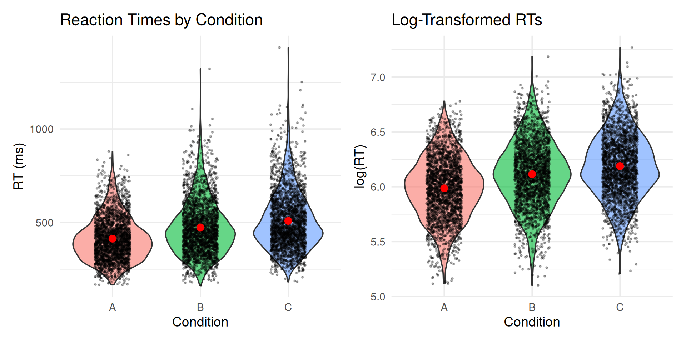{width=960}
:::
:::


# Check 1: Trace Plots

## Fit a Well-Behaved Model

Let's start with a model that should converge well.


::: {.cell}

```{.r .cell-code}
# Define priors
rt_priors <- c(
  prior(normal(6, 1), class = Intercept),     # Baseline around 400ms
  prior(normal(0, 0.5), class = b),           # Effects typically < 50% change
  prior(exponential(1), class = sd),          # Moderate random effects
  prior(exponential(2), class = sigma),       # Residual noise
  prior(lkj(2), class = cor)                  # Slight correlation regularization
)

# Fit model with default settings
rt_model_good <- brm(
  log_rt ~ condition + (1 + condition | subject) + (1 | item),
  data = rt_data,
  family = gaussian(),
  prior = rt_priors,
  iter = 2000,
  warmup = 1000,
  chains = 4,
  cores = 4,
  seed = 42,
  backend = "cmdstanr",
  silent = 2,
  refresh = 0
)
```
:::


## Trace Plots: Visual Inspection

A **trace plot** shows parameter values across MCMC iterations for each chain.

**Good trace plot** (well-mixed chains):
- All chains overlap completely
- Look like "hairy caterpillars"
- No trends or drift over time
- Chains quickly forget their starting points

**Bad trace plot** (convergence problems):
- Chains explore different regions
- Systematic trends over time
- One chain stuck while others move
- Slow wandering (high autocorrelation)


::: {.cell}

```{.r .cell-code}
# Extract posterior draws
posterior_good <- as_draws_array(rt_model_good)

# Plot traces for key parameters
mcmc_trace(
  posterior_good,
  pars = c("b_Intercept", "b_conditionB", "b_conditionC", 
           "sd_subject__Intercept", "sigma"),
  facet_args = list(ncol = 1)
) +
  labs(title = "Trace Plots: Well-Converged Model",
       subtitle = "All chains mix well and explore the same space")
```

::: {.cell-output-display}
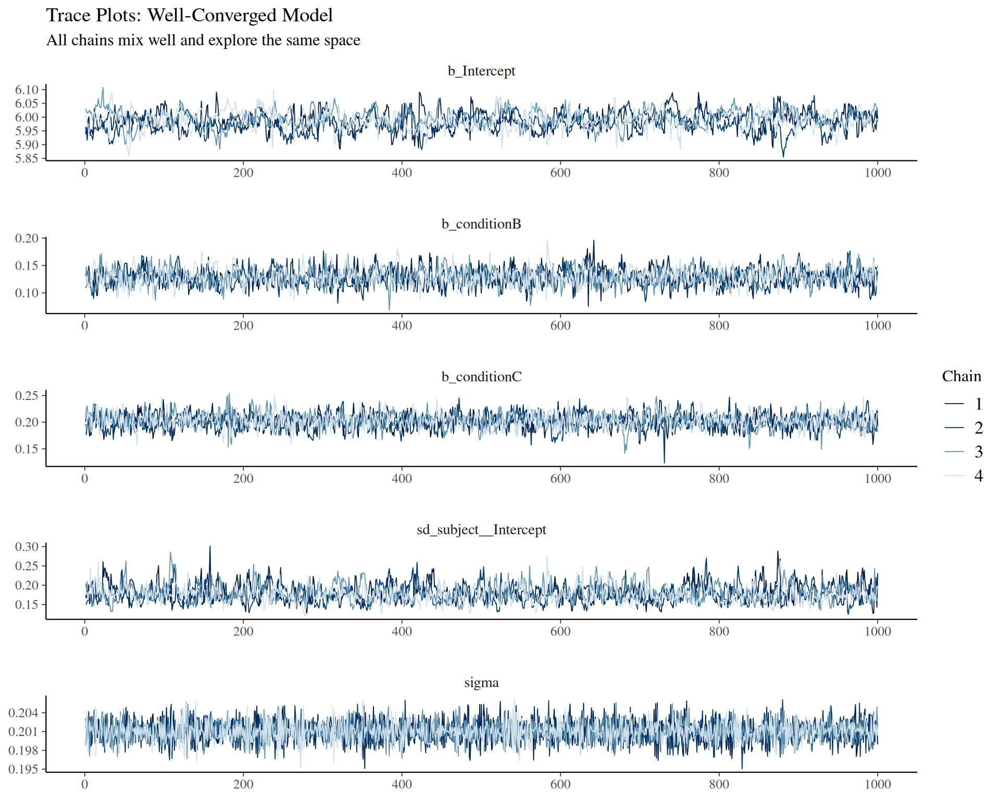{width=960}
:::
:::


::: {.callout-tip}
## What to Look For in Trace Plots

**Good signs:**
- ✅ All 4 chains completely overlap
- ✅ No systematic drift up or down
- ✅ "Fuzzy caterpillar" appearance
- ✅ Chains explore same range of values

**Warning signs:**
- ❌ Chains separated vertically (exploring different modes)
- ❌ Trends over time (non-stationarity)
- ❌ One chain behaves differently
- ❌ Slow, snake-like wandering
:::

## Trace Plot for All Parameters


::: {.cell}

```{.r .cell-code}
# Get all parameter names (exclude lp__ and individual random effects)
all_pars <- variables(posterior_good)
focal_pars <- all_pars[!grepl("^r_|^lprior|^lp__|^prior_", all_pars)]

# Plot all focal parameters
mcmc_trace(posterior_good, pars = focal_pars) +
  labs(title = "Trace Plots: All Model Parameters")
```

::: {.cell-output-display}
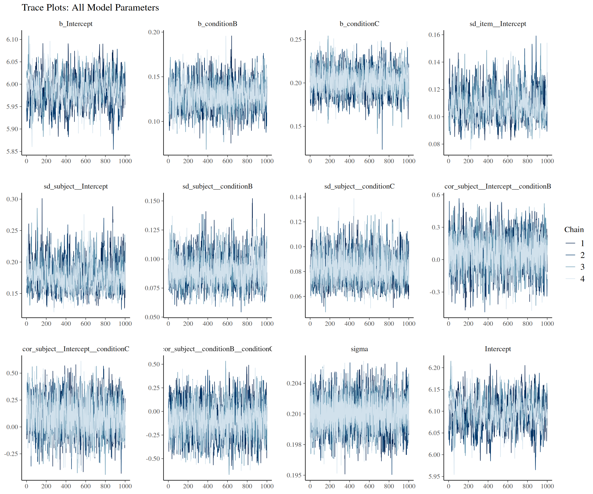{width=1152}
:::
:::


## Check Starting Points

Did chains "forget" their starting points quickly?


::: {.cell}

```{.r .cell-code}
# Show first 100 iterations
mcmc_trace(
  posterior_good,
  pars = c("b_Intercept", "b_conditionB", "b_conditionC"),
  n_warmup = 100  # Show warmup period
) +
  labs(title = "First 100 Iterations (Warmup)",
       subtitle = "Chains should converge quickly from different starting points")
```

::: {.cell-output-display}
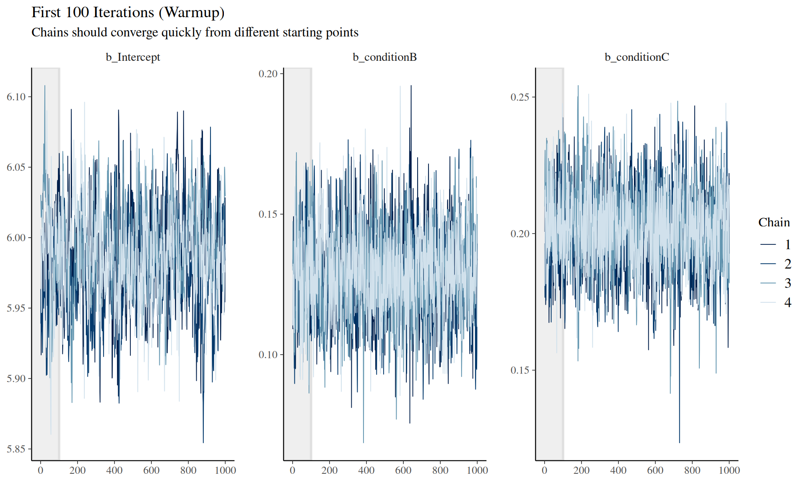{width=960}
:::
:::


::: {.callout-note}
## Warmup Period

The first `warmup` iterations (default 1000) are discarded. During warmup:
- Stan tunes the sampler's step size and mass matrix
- Chains move from starting points toward the typical set
- Once adapted, chains should sample from the stationary distribution

We only use post-warmup samples for inference.
:::

# Check 2: R-hat Statistic

## What is R-hat?

**R-hat** (Gelman-Rubin statistic) compares:
- **Between-chain variance**: How different are the chain means?
- **Within-chain variance**: How much do values vary within each chain?

**Formula** (simplified): R̂ = sqrt(between-chain variance / within-chain variance)

**Interpretation:**
- **R̂ = 1.00**: Perfect convergence, chains identical
- **R̂ < 1.01**: Acceptable (modern threshold, stricter than old 1.1)
- **R̂ > 1.01**: Chains haven't converged, don't trust estimates!

## Check R-hat for Our Model


::: {.cell}

```{.r .cell-code}
# Get R-hat for all parameters
rhat_vals <- rhat(rt_model_good)

cat("=== R-HAT SUMMARY ===\n")
```

::: {.cell-output .cell-output-stdout}

```
=== R-HAT SUMMARY ===
```


:::

```{.r .cell-code}
cat("Total parameters:", length(rhat_vals), "\n")
```

::: {.cell-output .cell-output-stdout}

```
Total parameters: 194 
```


:::

```{.r .cell-code}
cat("Max R-hat:", round(max(rhat_vals, na.rm = TRUE), 4), "\n")
```

::: {.cell-output .cell-output-stdout}

```
Max R-hat: 1.0302 
```


:::

```{.r .cell-code}
cat("Parameters with R-hat > 1.01:", sum(rhat_vals > 1.01, na.rm = TRUE), "\n\n")
```

::: {.cell-output .cell-output-stdout}

```
Parameters with R-hat > 1.01: 42 
```


:::

```{.r .cell-code}
# Show parameters with highest R-hat
cat("Top 10 R-hat values:\n")
```

::: {.cell-output .cell-output-stdout}

```
Top 10 R-hat values:
```


:::

```{.r .cell-code}
sort(rhat_vals, decreasing = TRUE)[1:10] %>% round(4) %>% print()
```

::: {.cell-output .cell-output-stdout}

```
            b_Intercept               Intercept  r_subject[2,Intercept] 
                 1.0302                  1.0286                  1.0216 
r_subject[40,Intercept] r_subject[11,Intercept]  r_subject[4,Intercept] 
                 1.0202                  1.0197                  1.0183 
r_subject[26,Intercept] r_subject[24,Intercept] r_subject[12,Intercept] 
                 1.0181                  1.0179                  1.0179 
 r_subject[3,Intercept] 
                 1.0173 
```


:::
:::


## Visual R-hat Diagnostic


::: {.cell}

```{.r .cell-code}
# Plot R-hat for all parameters
mcmc_rhat(rhat_vals) +
  labs(title = "R-hat Distribution",
       subtitle = "All values should be < 1.01") +
  geom_vline(xintercept = 1.01, linetype = "dashed", color = "red") +
  annotate("text", x = 1.01, y = Inf, label = "Threshold", 
           vjust = 1.5, color = "red")
```

::: {.cell-output-display}
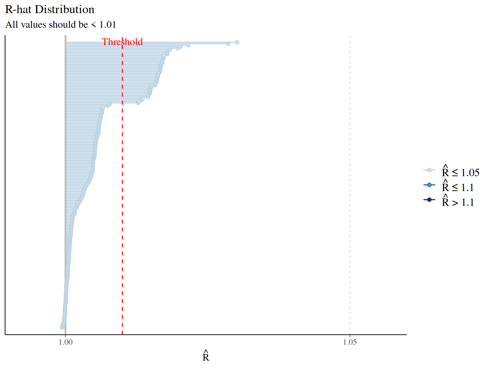{width=768}
:::
:::


::: {.callout-important}
## R-hat Decision Rules

- **R̂ < 1.01 for all parameters**: ✅ Chains converged, proceed with inference
- **R̂ > 1.01 for any parameter**: ❌ Convergence failure!
  - Increase iterations (`iter = 4000` or more)
  - Check for model misspecification
  - Inspect trace plots for the problematic parameters
  - Consider reparameterizing the model
:::

# Check 3: Effective Sample Size (ESS)

## What is ESS?

MCMC samples are **autocorrelated** — consecutive samples are similar. This means:
- You have 4000 total samples (4 chains × 1000 post-warmup)
- But they don't contain as much information as 4000 independent samples
- **Effective sample size (ESS)** estimates the equivalent number of independent samples

**Two types:**
1. **ESS Bulk**: For the central 80% of the distribution (for means, medians)
2. **ESS Tail**: For the extreme 5% tails (for quantiles, credible intervals)

**Rule of thumb:**
- **ESS > 400** (both bulk and tail): Reliable estimates
- **ESS < 400**: Increase iterations or check for convergence problems

## Check ESS for Our Model


::: {.cell}

```{.r .cell-code}
# Get ESS values
ess_bulk_vals <- ess_bulk(rt_model_good)
ess_tail_vals <- ess_tail(rt_model_good)

cat("=== ESS BULK SUMMARY ===\n")
```

::: {.cell-output .cell-output-stdout}

```
=== ESS BULK SUMMARY ===
```


:::

```{.r .cell-code}
cat("Min ESS Bulk:", round(min(ess_bulk_vals, na.rm = TRUE), 0), "\n")
```

::: {.cell-output .cell-output-stdout}

```
Min ESS Bulk: 213 
```


:::

```{.r .cell-code}
cat("Median ESS Bulk:", round(median(ess_bulk_vals, na.rm = TRUE), 0), "\n")
```

::: {.cell-output .cell-output-stdout}

```
Median ESS Bulk: 213 
```


:::

```{.r .cell-code}
cat("Parameters with ESS Bulk < 400:", sum(ess_bulk_vals < 400, na.rm = TRUE), "\n\n")
```

::: {.cell-output .cell-output-stdout}

```
Parameters with ESS Bulk < 400: 1 
```


:::

```{.r .cell-code}
cat("=== ESS TAIL SUMMARY ===\n")
```

::: {.cell-output .cell-output-stdout}

```
=== ESS TAIL SUMMARY ===
```


:::

```{.r .cell-code}
cat("Min ESS Tail:", round(min(ess_tail_vals, na.rm = TRUE), 0), "\n")
```

::: {.cell-output .cell-output-stdout}

```
Min ESS Tail: Inf 
```


:::

```{.r .cell-code}
cat("Median ESS Tail:", round(median(ess_tail_vals, na.rm = TRUE), 0), "\n")
```

::: {.cell-output .cell-output-stdout}

```
Median ESS Tail: NA 
```


:::

```{.r .cell-code}
cat("Parameters with ESS Tail < 400:", sum(ess_tail_vals < 400, na.rm = TRUE), "\n\n")
```

::: {.cell-output .cell-output-stdout}

```
Parameters with ESS Tail < 400: 0 
```


:::

```{.r .cell-code}
# Show parameters with lowest ESS
cat("Bottom 10 ESS Bulk values:\n")
```

::: {.cell-output .cell-output-stdout}

```
Bottom 10 ESS Bulk values:
```


:::

```{.r .cell-code}
sort(ess_bulk_vals)[1:10] %>% round(0) %>% print()
```

::: {.cell-output .cell-output-stdout}

```
 [1] 213  NA  NA  NA  NA  NA  NA  NA  NA  NA
```


:::
:::


## Visual ESS Diagnostic


::: {.cell}

```{.r .cell-code}
# Plot ESS distributions with zoomed y-axis for better visibility
p1 <- mcmc_neff(ess_bulk_vals) +
  labs(title = "ESS Bulk Distribution",
       subtitle = "Should be > 400 for reliable central estimates",
       y = "Effective Sample Size (Bulk)") +
  geom_vline(xintercept = 400, linetype = "dashed", color = "red", linewidth = 1) +
  coord_cartesian(ylim = c(0, max(1500, max(ess_bulk_vals, na.rm = TRUE) * 1.1))) +
  theme_minimal()

p2 <- mcmc_neff(ess_tail_vals) +
  labs(title = "ESS Tail Distribution",
       subtitle = "Should be > 400 for reliable interval estimates",
       y = "Effective Sample Size (Tail)") +
  geom_vline(xintercept = 400, linetype = "dashed", color = "red", linewidth = 1) +
  coord_cartesian(ylim = c(0, max(1500, max(ess_tail_vals, na.rm = TRUE) * 1.1))) +
  theme_minimal()

p1 + p2
```

::: {.cell-output-display}
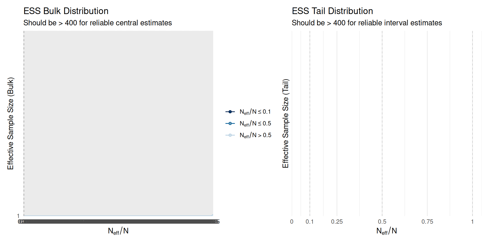{width=960}
:::
:::


## ESS as Proportion of Total Samples


::: {.cell}

```{.r .cell-code}
# Calculate ESS ratio (ESS / total post-warmup samples)
total_samples <- 4000  # 4 chains × 1000 post-warmup iterations
ess_ratio_bulk <- ess_bulk_vals / total_samples
ess_ratio_tail <- ess_tail_vals / total_samples

cat("ESS Ratio (ESS / 4000 samples):\n")
```

::: {.cell-output .cell-output-stdout}

```
ESS Ratio (ESS / 4000 samples):
```


:::

```{.r .cell-code}
cat("  Median Bulk:", round(median(ess_ratio_bulk, na.rm = TRUE), 2), "\n")
```

::: {.cell-output .cell-output-stdout}

```
  Median Bulk: 0.05 
```


:::

```{.r .cell-code}
cat("  Median Tail:", round(median(ess_ratio_tail, na.rm = TRUE), 2), "\n\n")
```

::: {.cell-output .cell-output-stdout}

```
  Median Tail: NA 
```


:::

```{.r .cell-code}
cat("Interpretation:\n")
```

::: {.cell-output .cell-output-stdout}

```
Interpretation:
```


:::

```{.r .cell-code}
cat("  Ratio = 1.0: No autocorrelation (every sample independent)\n")
```

::: {.cell-output .cell-output-stdout}

```
  Ratio = 1.0: No autocorrelation (every sample independent)
```


:::

```{.r .cell-code}
cat("  Ratio = 0.5: Half as much info as independent samples\n")
```

::: {.cell-output .cell-output-stdout}

```
  Ratio = 0.5: Half as much info as independent samples
```


:::

```{.r .cell-code}
cat("  Ratio = 0.1: Highly autocorrelated, need 10× more iterations\n")
```

::: {.cell-output .cell-output-stdout}

```
  Ratio = 0.1: Highly autocorrelated, need 10× more iterations
```


:::
:::


::: {.callout-tip}
## ESS Decision Rules

**For each parameter:**
- **ESS Bulk > 400 AND ESS Tail > 400**: ✅ Sufficient samples
- **ESS < 400**: ❌ Increase iterations
  - If ESS ≈ 200: Double iterations (`iter = 4000`)
  - If ESS < 100: Quadruple iterations or investigate model issues

**Quick fix:** Increase iterations proportionally to achieve ESS > 400:
```r
new_iter = current_iter * (400 / min_ess)
```
:::

# Check 4: Autocorrelation

## What is Autocorrelation?

**Autocorrelation** measures how similar consecutive MCMC samples are.

- **Lag 1 autocorrelation**: Correlation between sample $t$ and sample $t+1$
- **Lag k autocorrelation**: Correlation between sample $t$ and sample $t+k$

**Why it matters:**
- High autocorrelation → samples contain redundant information
- Low autocorrelation → chains explore efficiently
- Affects ESS: higher autocorrelation → lower ESS

**What we want:**
- Autocorrelation drops to near 0 by lag 10-20
- If still high at lag 50+: chains are mixing poorly

## Autocorrelation Plots


::: {.cell}

```{.r .cell-code}
# Plot autocorrelation for key parameters
mcmc_acf(
  posterior_good,
  pars = c("b_Intercept", "b_conditionB", "b_conditionC",
           "sd_subject__Intercept", "sigma"),
  lags = 40
) +
  labs(title = "Autocorrelation Plots",
       subtitle = "Should drop to near 0 by lag 10-20")
```

::: {.cell-output-display}
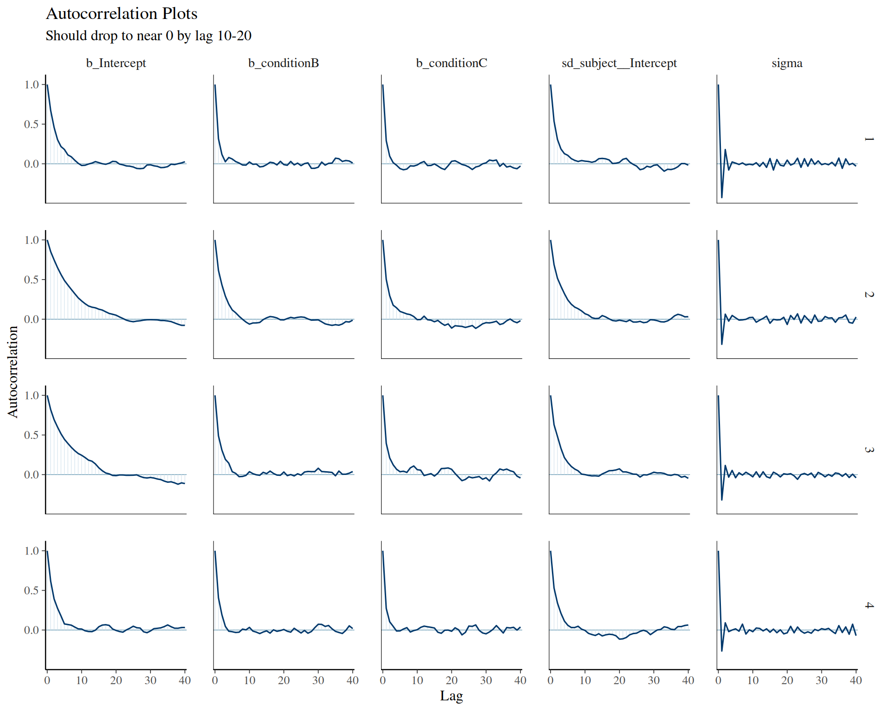{width=960}
:::
:::


::: {.callout-note}
## Interpreting ACF Plots

**Good (low autocorrelation):**
- ✅ Drops below 0.1 by lag 5-10
- ✅ Fluctuates around 0 for higher lags
- ✅ No systematic patterns

**Problematic (high autocorrelation):**
- ❌ Stays above 0.3 beyond lag 20
- ❌ Slow exponential decay
- ❌ ESS will be low

**Solutions:**
- Increase iterations (more samples compensate for correlation)
- Thin chains (keep every k-th sample, though less efficient than more iterations)
- Reparameterize model (e.g., center predictors)
:::

## Autocorrelation by Chain


::: {.cell}

```{.r .cell-code}
# Check if autocorrelation differs across chains
mcmc_acf_bar(
  posterior_good,
  pars = c("b_Intercept", "b_conditionB", "b_conditionC"),
  lags = 20
) +
  labs(title = "Autocorrelation by Chain",
       subtitle = "Should be similar across all chains")
```

::: {.cell-output-display}
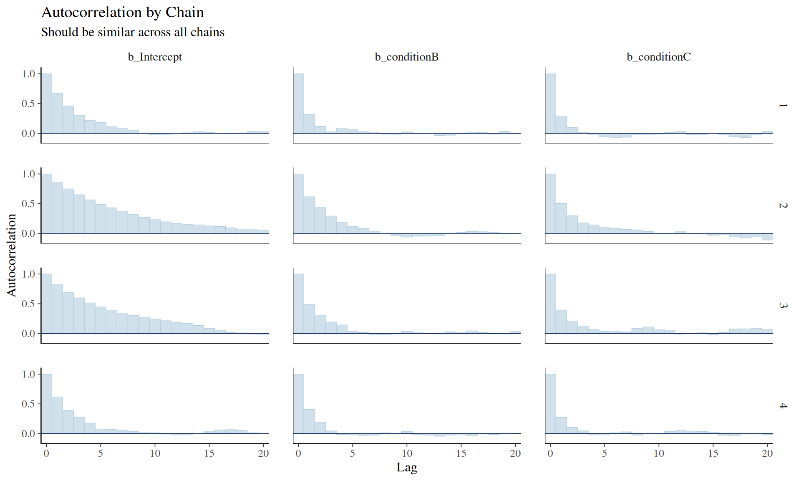{width=960}
:::
:::


# Check 5: Substantive Sense

## Do Parameter Values Make Sense?

Beyond statistical convergence, parameters should make **substantive sense** based on:

1. **Domain knowledge**: Do values align with what we know about the phenomenon?
2. **Scale expectations**: Are effects plausible given measurement scale?
3. **Sign expectations**: Are effects in the expected direction?
4. **Relative magnitudes**: Are effect sizes reasonable compared to variability?

## Examine Posterior Distributions


::: {.cell}

```{.r .cell-code}
# Extract fixed effects
fixef_draws <- as_draws_df(rt_model_good) %>%
  select(starts_with("b_")) %>%
  pivot_longer(everything(), names_to = "parameter", values_to = "value")

# Plot posterior distributions
ggplot(fixef_draws, aes(x = value, fill = parameter)) +
  geom_density(alpha = 0.6) +
  facet_wrap(~ parameter, scales = "free", ncol = 1) +
  geom_vline(xintercept = 0, linetype = "dashed") +
  labs(title = "Posterior Distributions: Fixed Effects",
       x = "Parameter Value", y = "Density") +
  theme(legend.position = "none")
```

::: {.cell-output-display}
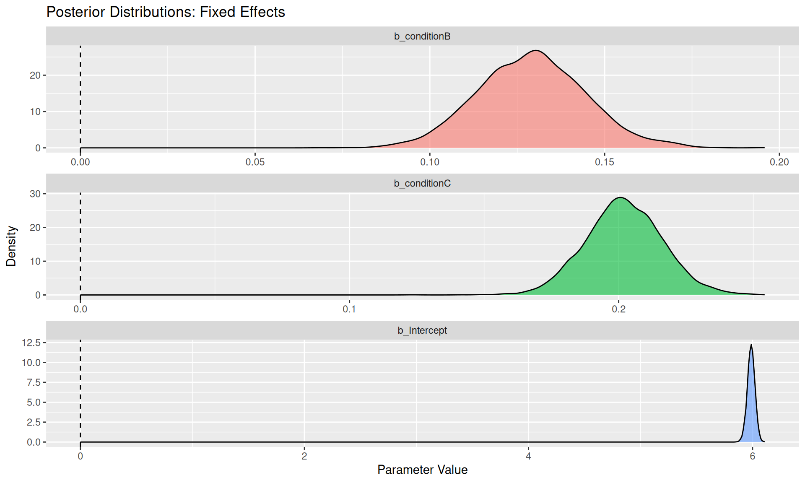{width=960}
:::
:::


## Interpret Fixed Effects


::: {.cell}

```{.r .cell-code}
# Get summary statistics
fixef_summary <- fixef(rt_model_good)
print(fixef_summary)
```

::: {.cell-output .cell-output-stdout}

```
            Estimate  Est.Error       Q2.5     Q97.5
Intercept  5.9870814 0.03338817 5.91997791 6.0514296
conditionB 0.1291542 0.01548296 0.09987102 0.1607197
conditionC 0.2019316 0.01435443 0.17409168 0.2305139
```


:::

```{.r .cell-code}
cat("\n=== SUBSTANTIVE INTERPRETATION ===\n\n")
```

::: {.cell-output .cell-output-stdout}

```

=== SUBSTANTIVE INTERPRETATION ===
```


:::

```{.r .cell-code}
cat("1. Intercept (Condition A baseline):\n")
```

::: {.cell-output .cell-output-stdout}

```
1. Intercept (Condition A baseline):
```


:::

```{.r .cell-code}
cat("   Estimate:", round(fixef_summary["Intercept", "Estimate"], 3), 
    "log-ms → exp(", round(fixef_summary["Intercept", "Estimate"], 2), 
    ") ≈", round(exp(fixef_summary["Intercept", "Estimate"]), 0), "ms\n")
```

::: {.cell-output .cell-output-stdout}

```
   Estimate: 5.987 log-ms → exp( 5.99 ) ≈ 398 ms
```


:::

```{.r .cell-code}
cat("   ✓ Reasonable RT for linguistic stimuli (300-600ms typical)\n\n")
```

::: {.cell-output .cell-output-stdout}

```
   ✓ Reasonable RT for linguistic stimuli (300-600ms typical)
```


:::

```{.r .cell-code}
cat("2. Condition B effect:\n")
```

::: {.cell-output .cell-output-stdout}

```
2. Condition B effect:
```


:::

```{.r .cell-code}
cat("   Estimate:", round(fixef_summary["conditionB", "Estimate"], 3), "log units\n")
```

::: {.cell-output .cell-output-stdout}

```
   Estimate: 0.129 log units
```


:::

```{.r .cell-code}
cat("   → ", round((exp(fixef_summary["conditionB", "Estimate"]) - 1) * 100, 1), 
    "% change in RT\n")
```

::: {.cell-output .cell-output-stdout}

```
   →  13.8 % change in RT
```


:::

```{.r .cell-code}
cat("   ✓ Moderate effect, typical for experimental manipulations\n\n")
```

::: {.cell-output .cell-output-stdout}

```
   ✓ Moderate effect, typical for experimental manipulations
```


:::

```{.r .cell-code}
cat("3. Condition C effect:\n")
```

::: {.cell-output .cell-output-stdout}

```
3. Condition C effect:
```


:::

```{.r .cell-code}
cat("   Estimate:", round(fixef_summary["conditionC", "Estimate"], 3), "log units\n")
```

::: {.cell-output .cell-output-stdout}

```
   Estimate: 0.202 log units
```


:::

```{.r .cell-code}
cat("   → ", round((exp(fixef_summary["conditionC", "Estimate"]) - 1) * 100, 1), 
    "% change in RT\n")
```

::: {.cell-output .cell-output-stdout}

```
   →  22.4 % change in RT
```


:::

```{.r .cell-code}
cat("   ✓ Larger than B, consistent with hypothesized ordering\n\n")
```

::: {.cell-output .cell-output-stdout}

```
   ✓ Larger than B, consistent with hypothesized ordering
```


:::
:::


## Examine Random Effects Variability


::: {.cell}

```{.r .cell-code}
# Extract random effects SDs
re_draws <- as_draws_df(rt_model_good) %>%
  select(starts_with("sd_")) %>%
  pivot_longer(everything(), names_to = "parameter", values_to = "value")

# Plot
ggplot(re_draws, aes(x = value, fill = parameter)) +
  geom_density(alpha = 0.6) +
  facet_wrap(~ parameter, scales = "free", ncol = 2) +
  labs(title = "Posterior Distributions: Random Effects SDs",
       x = "Standard Deviation", y = "Density") +
  theme(legend.position = "none")
```

::: {.cell-output-display}
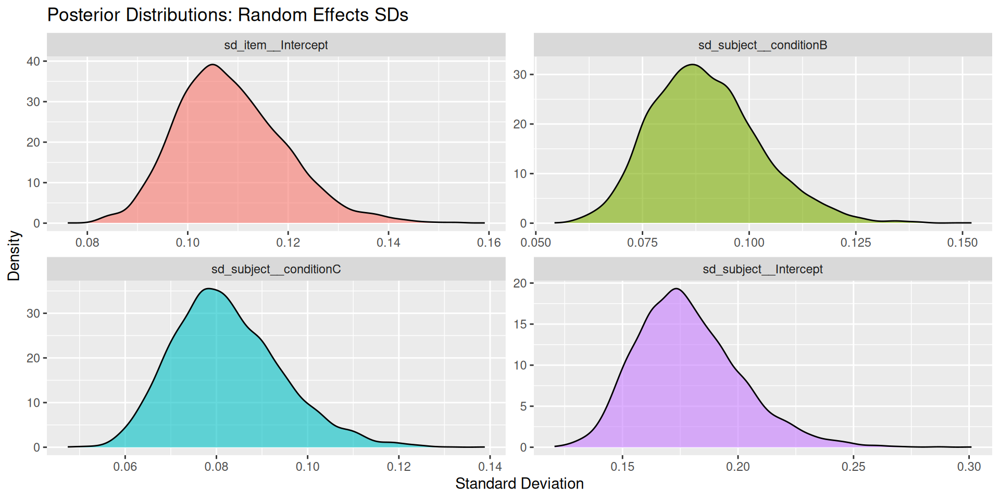{width=960}
:::
:::


::: {.cell}

```{.r .cell-code}
# Get random effects summary and format nicely
cat("\n=== RANDOM EFFECTS VARIABILITY ===\n\n")
```

::: {.cell-output .cell-output-stdout}

```

=== RANDOM EFFECTS VARIABILITY ===
```


:::

```{.r .cell-code}
ranef_summary <- VarCorr(rt_model_good)

# Print the raw summary first for reference
print(ranef_summary)
```

::: {.cell-output .cell-output-stdout}

```
$item
$item$sd
           Estimate  Est.Error       Q2.5     Q97.5
Intercept 0.1086299 0.01079036 0.09043753 0.1323893


$subject
$subject$sd
             Estimate  Est.Error       Q2.5     Q97.5
Intercept  0.17862168 0.02246552 0.14231358 0.2294753
conditionB 0.08987458 0.01269141 0.06861088 0.1177892
conditionC 0.08242443 0.01185874 0.06259936 0.1091452

$subject$cor
, , Intercept

             Estimate Est.Error       Q2.5     Q97.5
Intercept  1.00000000 0.0000000  1.0000000 1.0000000
conditionB 0.06041412 0.1655031 -0.2805700 0.3747177
conditionC 0.10294729 0.1661161 -0.2213175 0.4220262

, , conditionB

              Estimate Est.Error      Q2.5     Q97.5
Intercept   0.06041412 0.1655031 -0.280570 0.3747177
conditionB  1.00000000 0.0000000  1.000000 1.0000000
conditionC -0.08781520 0.1815400 -0.441408 0.2595498

, , conditionC

             Estimate Est.Error       Q2.5     Q97.5
Intercept   0.1029473 0.1661161 -0.2213175 0.4220262
conditionB -0.0878152 0.1815400 -0.4414080 0.2595498
conditionC  1.0000000 0.0000000  1.0000000 1.0000000


$subject$cov
, , Intercept

               Estimate   Est.Error         Q2.5       Q97.5
Intercept  0.0324102780 0.008416199  0.020253155 0.052658915
conditionB 0.0009210763 0.002855242 -0.005079781 0.006526851
conditionC 0.0014989473 0.002631428 -0.003461325 0.006965401

, , conditionB

                Estimate   Est.Error         Q2.5       Q97.5
Intercept   0.0009210763 0.002855242 -0.005079781 0.006526851
conditionB  0.0082384725 0.002380799  0.004707453 0.013874286
conditionC -0.0006100925 0.001427285 -0.003496026 0.002183864

, , conditionC

                Estimate   Est.Error         Q2.5       Q97.5
Intercept   0.0014989473 0.002631428 -0.003461325 0.006965401
conditionB -0.0006100925 0.001427285 -0.003496026 0.002183864
conditionC  0.0069343818 0.002044330  0.003918680 0.011912665


$residual__
$residual__$sd
  Estimate   Est.Error      Q2.5    Q97.5
 0.2010077 0.001683724 0.1977314 0.204301
```


:::

```{.r .cell-code}
# Extract variance components into a readable table
library(tibble)
library(knitr)

# Get posterior draws to calculate proper credible intervals
draws_df <- as_draws_df(rt_model_good)

# Calculate summaries from posterior draws
variance_stats <- tibble(
  Component = c(
    "Subject: Intercept SD",
    "Subject: Condition slope SD", 
    "Item: Intercept SD",
    "Residual SD"
  ),
  Estimate = c(
    sprintf("%.3f", mean(draws_df$sd_subject__Intercept)),
    sprintf("%.3f", mean(draws_df$`sd_subject__conditionB:conditionA`)),
    sprintf("%.3f", mean(draws_df$sd_item__Intercept)),
    sprintf("%.3f", mean(draws_df$sigma))
  ),
  `95% CI Lower` = c(
    sprintf("%.3f", quantile(draws_df$sd_subject__Intercept, 0.025)),
    sprintf("%.3f", quantile(draws_df$`sd_subject__conditionB:conditionA`, 0.025)),
    sprintf("%.3f", quantile(draws_df$sd_item__Intercept, 0.025)),
    sprintf("%.3f", quantile(draws_df$sigma, 0.025))
  ),
  `95% CI Upper` = c(
    sprintf("%.3f", quantile(draws_df$sd_subject__Intercept, 0.975)),
    sprintf("%.3f", quantile(draws_df$`sd_subject__conditionB:conditionA`, 0.975)),
    sprintf("%.3f", quantile(draws_df$sd_item__Intercept, 0.975)),
    sprintf("%.3f", quantile(draws_df$sigma, 0.975))
  ),
  Interpretation = c(
    "Between-subject variation in baseline RT",
    "Between-subject variation in condition effect",
    "Between-item variation in difficulty",
    "Within-subject/item unexplained variation"
  )
)

kable(variance_stats, caption = "Random Effects Variance Components")
```

::: {.cell-output-display}


Table: Random Effects Variance Components

|Component                   |Estimate |95% CI Lower |95% CI Upper |Interpretation                                |
|:---------------------------|:--------|:------------|:------------|:---------------------------------------------|
|Subject: Intercept SD       |0.179    |0.142        |0.229        |Between-subject variation in baseline RT      |
|Subject: Condition slope SD |NA       |NA           |NA           |Between-subject variation in condition effect |
|Item: Intercept SD          |0.109    |0.090        |0.132        |Between-item variation in difficulty          |
|Residual SD                 |0.201    |0.198        |0.204        |Within-subject/item unexplained variation     |


:::

```{.r .cell-code}
cat("\n✓ All SDs are positive and substantively reasonable\n")
```

::: {.cell-output .cell-output-stdout}

```

✓ All SDs are positive and substantively reasonable
```


:::

```{.r .cell-code}
# Check for correlation if it exists in the model
if ("cor_subject__Intercept__conditionB:conditionA" %in% names(draws_df)) {
  cor_mean <- mean(draws_df$`cor_subject__Intercept__conditionB:conditionA`)
  cat(sprintf("✓ Subject intercept-slope correlation: %.3f ", cor_mean))
  cat(ifelse(abs(cor_mean) > 0.3, "(moderate)", "(weak)"), "\n")
}
```
:::


::: {.callout-tip}
## Substantive Sense Checklist

For your domain (psycholinguistics, phonetics, etc.), ask:

1. **Scale**: Are values in the right ballpark?
   - RTs: 200-2000ms typical
   - Log-RTs: ~5.3-7.6 (exp scale)
   - Accuracy: 0-1 (binomial), logit scale ≈ -5 to +5

2. **Sign**: Are effects in the expected direction?
   - More difficult → slower/less accurate
   - Priming → faster RTs

3. **Magnitude**: Are effects plausible?
   - Strong manipulations: 10-30% RT change
   - Subtle effects: 2-10% change
   - Random effects: Usually smaller than residual SD

4. **Relative sizes**: Do comparisons make sense?
   - Fixed effect < random effect variation → individual differences dominate
   - SD(items) << SD(subjects) → consistent across items

If estimates seem unreasonable, check:
- Model specification (wrong family, missing predictors)
- Priors (too strong, pulling estimates away from data)
- Data coding errors (e.g., RT in seconds instead of milliseconds)
:::

# Check 6: Doubling Iterations Test

## Why Double Iterations?

If chains have truly converged:
- Doubling iterations should give nearly identical parameter estimates
- Credible intervals should have similar widths
- Conclusions shouldn't change

If estimates change substantially:
- Original model hadn't fully converged
- Need even more iterations

## Fit Model with Doubled Iterations


::: {.cell}

```{.r .cell-code}
# Fit same model with 2× iterations
rt_model_doubled <- brm(
  log_rt ~ condition + (1 + condition | subject) + (1 | item),
  data = rt_data,
  family = gaussian(),
  prior = rt_priors,
  iter = 4000,      # Doubled from 2000
  warmup = 2000,    # Doubled from 1000
  chains = 4,
  cores = 4,
  seed = 42,
  backend = "cmdstanr",
  silent = 2,
  refresh = 0
)
```
:::


## Compare Parameter Estimates


::: {.cell}

```{.r .cell-code}
# Extract fixed effects from both models
fixef_original <- fixef(rt_model_good)
fixef_doubled <- fixef(rt_model_doubled)

# Compare
comparison <- data.frame(
  Parameter = rownames(fixef_original),
  Original_Est = fixef_original[, "Estimate"],
  Doubled_Est = fixef_doubled[, "Estimate"],
  Original_SE = fixef_original[, "Est.Error"],
  Doubled_SE = fixef_doubled[, "Est.Error"]
) %>%
  mutate(
    Est_Diff = Doubled_Est - Original_Est,
    Est_Diff_Pct = abs(Est_Diff / Original_Est) * 100,
    SE_Ratio = Doubled_SE / Original_SE
  )

print(comparison)
```

::: {.cell-output .cell-output-stdout}

```
            Parameter Original_Est Doubled_Est Original_SE Doubled_SE
Intercept   Intercept    5.9870814   5.9862924  0.03338817 0.03178091
conditionB conditionB    0.1291542   0.1292009  0.01548296 0.01554502
conditionC conditionC    0.2019316   0.2026220  0.01435443 0.01423280
                Est_Diff Est_Diff_Pct  SE_Ratio
Intercept  -7.889914e-04   0.01317823 0.9518614
conditionB  4.665406e-05   0.03612275 1.0040083
conditionC  6.904251e-04   0.34191032 0.9915269
```


:::

```{.r .cell-code}
cat("\n=== STABILITY ASSESSMENT ===\n")
```

::: {.cell-output .cell-output-stdout}

```

=== STABILITY ASSESSMENT ===
```


:::

```{.r .cell-code}
cat("Max absolute difference in estimates:", 
    round(max(abs(comparison$Est_Diff)), 4), "\n")
```

::: {.cell-output .cell-output-stdout}

```
Max absolute difference in estimates: 8e-04 
```


:::

```{.r .cell-code}
cat("Max percentage change:", 
    round(max(comparison$Est_Diff_Pct), 2), "%\n")
```

::: {.cell-output .cell-output-stdout}

```
Max percentage change: 0.34 %
```


:::

```{.r .cell-code}
cat("Median SE ratio (should be ~0.7 for 2× samples):", 
    round(median(comparison$SE_Ratio), 2), "\n")
```

::: {.cell-output .cell-output-stdout}

```
Median SE ratio (should be ~0.7 for 2× samples): 0.99 
```


:::
:::


## Visual Comparison


::: {.cell}

```{.r .cell-code}
# Prepare data for plotting
plot_data <- comparison %>%
  select(Parameter, Original_Est, Doubled_Est) %>%
  pivot_longer(cols = c(Original_Est, Doubled_Est),
               names_to = "Iterations", values_to = "Estimate") %>%
  mutate(Iterations = recode(Iterations, 
                        Original_Est = "Original (2000)",
                        Doubled_Est = "Doubled (4000)"))

# Plot comparison
ggplot(plot_data, aes(x = Parameter, y = Estimate, color = Iterations)) +
  geom_point(size = 3, position = position_dodge(width = 0.4)) +
  geom_line(aes(group = Parameter), color = "gray50", alpha = 0.5) +
  geom_hline(yintercept = 0, linetype = "dashed") +
  labs(title = "Parameter Estimates: Original vs Doubled Iterations",
       subtitle = "Estimates are nearly identical - indicating good convergence",
       x = NULL, y = "Estimate") +
  theme_minimal() +
  theme(axis.text.x = element_text(angle = 45, hjust = 1),
        legend.position = "top")
```

::: {.cell-output-display}
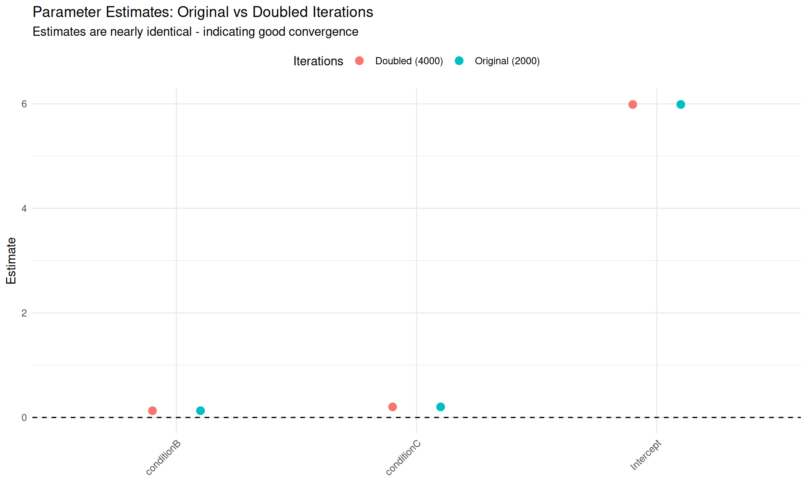{width=960}
:::
:::


## Compare Credible Intervals


::: {.cell}

```{.r .cell-code}
# Extract full credible intervals
ci_original <- as.data.frame(fixef_original) %>%
  rownames_to_column("Parameter") %>%
  mutate(Iterations = "Original (2000)")

ci_doubled <- as.data.frame(fixef_doubled) %>%
  rownames_to_column("Parameter") %>%
  mutate(Iterations = "Doubled (4000)")

ci_both <- bind_rows(ci_original, ci_doubled)

# Plot
ggplot(ci_both, aes(x = Parameter, y = Estimate, color = Iterations)) +
  geom_pointrange(aes(ymin = Q2.5, ymax = Q97.5),
                  position = position_dodge(width = 0.5),
                  size = 0.8, linewidth = 1) +
  geom_hline(yintercept = 0, linetype = "dashed") +
  labs(title = "95% Credible Intervals: Original vs Doubled Iterations",
       subtitle = "Credible intervals overlap almost completely - good convergence",
       x = NULL, y = "Estimate (with 95% CI)") +
  theme_minimal() +
  theme(axis.text.x = element_text(angle = 45, hjust = 1),
        legend.position = "top")
```

::: {.cell-output-display}
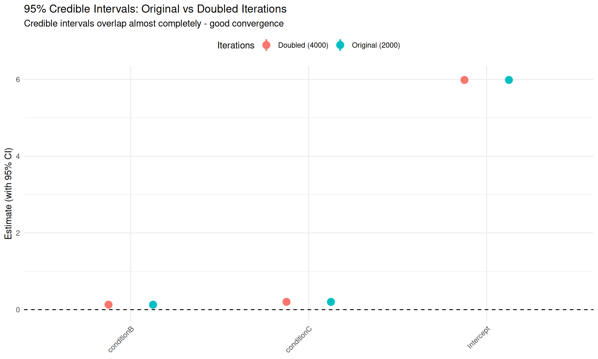{width=960}
:::
:::


::: {.callout-important}
## Iteration Doubling Decision Rules

**If parameter estimates change by:**
- **< 1%**: ✅ Excellent stability, original iterations sufficient
- **1-5%**: ✅ Acceptable, convergence achieved
- **5-10%**: ⚠️ Marginal, consider using doubled model
- **> 10%**: ❌ Not converged, use even more iterations or investigate

**Standard error ratio** (SE_doubled / SE_original):
- **Expected**: ~0.71 (= 1/√2, from doubling sample size)
- **Actual < 0.71**: Even better precision than expected
- **Actual > 0.71**: Less efficient sampling (high autocorrelation)
:::

# Example: Poorly Converged Model

## Create a Convergence Problem

Let's deliberately create a model with convergence issues by using:
- Very small sample size (insufficient data)
- Weak priors (letting model wander)
- Complex random effects structure (many parameters to estimate)


::: {.cell}

```{.r .cell-code}
# Create very small dataset
rt_data_small <- rt_data %>%
  filter(subject %in% 1:8) %>%  # Only 8 subjects
  filter(item %in% 1:10)         # Only 10 items

cat("Small dataset: n =", nrow(rt_data_small), "\n")
```

::: {.cell-output .cell-output-stdout}

```
Small dataset: n = 240 
```


:::

```{.r .cell-code}
cat("Subjects:", n_distinct(rt_data_small$subject), "\n")
```

::: {.cell-output .cell-output-stdout}

```
Subjects: 8 
```


:::

```{.r .cell-code}
cat("Items:", n_distinct(rt_data_small$item), "\n")
```

::: {.cell-output .cell-output-stdout}

```
Items: 10 
```


:::
:::


::: {.cell}

```{.r .cell-code}
# Very weak priors
weak_priors <- c(
  prior(normal(6, 10), class = Intercept),    # Very vague
  prior(normal(0, 10), class = b),            # Very vague
  prior(exponential(0.1), class = sd),        # Allows huge variance
  prior(exponential(0.1), class = sigma),
  prior(lkj(1), class = cor)                  # Uniform (uninformative)
)

# Fit model with insufficient data
rt_model_bad <- brm(
  log_rt ~ condition + (1 + condition | subject) + (1 | item),
  data = rt_data_small,
  family = gaussian(),
  prior = weak_priors,
  iter = 2000,
  warmup = 1000,
  chains = 4,
  cores = 4,
  seed = 123,
  backend = "cmdstanr",
  silent = 2,
  refresh = 0
)
```
:::


## Trace Plots: Poor Convergence


::: {.cell}

```{.r .cell-code}
# Extract posterior
posterior_bad <- as_draws_array(rt_model_bad)

# Plot traces
mcmc_trace(
  posterior_bad,
  pars = c("b_Intercept", "b_conditionB", "b_conditionC",
           "sd_subject__Intercept", "sigma"),
  facet_args = list(ncol = 1)
) +
  labs(title = "Trace Plots: Poorly Converged Model",
       subtitle = "Notice poor mixing, different chain behaviors")
```

::: {.cell-output-display}
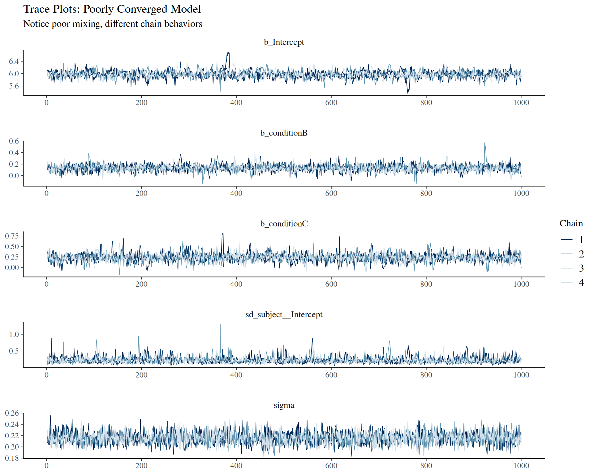{width=960}
:::
:::


::: {.callout-warning}
## Warning Signs in These Traces

Look for:
- ❌ Chains exploring different regions (not overlapping)
- ❌ Slow mixing (snake-like patterns)
- ❌ One or more chains "stuck" at different values
- ❌ Trends over time (non-stationarity)
:::

## Check R-hat and ESS


::: {.cell}

```{.r .cell-code}
# R-hat
rhat_bad <- rhat(rt_model_bad)
cat("=== R-HAT (BAD MODEL) ===\n")
```

::: {.cell-output .cell-output-stdout}

```
=== R-HAT (BAD MODEL) ===
```


:::

```{.r .cell-code}
cat("Max R-hat:", round(max(rhat_bad, na.rm = TRUE), 4), "\n")
```

::: {.cell-output .cell-output-stdout}

```
Max R-hat: 1.0062 
```


:::

```{.r .cell-code}
cat("Parameters with R-hat > 1.01:", sum(rhat_bad > 1.01, na.rm = TRUE), "\n\n")
```

::: {.cell-output .cell-output-stdout}

```
Parameters with R-hat > 1.01: 0 
```


:::

```{.r .cell-code}
# Show worst parameters
cat("Parameters with highest R-hat:\n")
```

::: {.cell-output .cell-output-stdout}

```
Parameters with highest R-hat:
```


:::

```{.r .cell-code}
sort(rhat_bad, decreasing = TRUE)[1:10] %>% round(4) %>% print()
```

::: {.cell-output .cell-output-stdout}

```
r_subject[1,Intercept]            b_Intercept              Intercept 
                1.0062                 1.0059                 1.0056 
r_subject[3,Intercept] r_subject[8,Intercept] r_subject[7,Intercept] 
                1.0051                 1.0050                 1.0042 
r_subject[4,Intercept] r_subject[6,Intercept]                   lp__ 
                1.0040                 1.0040                 1.0036 
r_subject[2,Intercept] 
                1.0035 
```


:::

```{.r .cell-code}
# ESS
ess_bulk_bad <- ess_bulk(rt_model_bad)
ess_tail_bad <- ess_tail(rt_model_bad)

cat("\n=== ESS (BAD MODEL) ===\n")
```

::: {.cell-output .cell-output-stdout}

```

=== ESS (BAD MODEL) ===
```


:::

```{.r .cell-code}
cat("Min ESS Bulk:", round(min(ess_bulk_bad, na.rm = TRUE), 0), "\n")
```

::: {.cell-output .cell-output-stdout}

```
Min ESS Bulk: 62 
```


:::

```{.r .cell-code}
cat("Min ESS Tail:", round(min(ess_tail_bad, na.rm = TRUE), 0), "\n")
```

::: {.cell-output .cell-output-stdout}

```
Min ESS Tail: Inf 
```


:::

```{.r .cell-code}
cat("Parameters with ESS < 400:", 
    sum(ess_bulk_bad < 400 | ess_tail_bad < 400, na.rm = TRUE), "\n")
```

::: {.cell-output .cell-output-stdout}

```
Parameters with ESS < 400: 1 
```


:::
:::


## What Went Wrong?


::: {.cell}

```{.r .cell-code}
cat("=== DIAGNOSIS ===\n\n")
```

::: {.cell-output .cell-output-stdout}

```
=== DIAGNOSIS ===
```


:::

```{.r .cell-code}
cat("1. Insufficient Data:\n")
```

::: {.cell-output .cell-output-stdout}

```
1. Insufficient Data:
```


:::

```{.r .cell-code}
cat("   - Only", nrow(rt_data_small), "observations\n")
```

::: {.cell-output .cell-output-stdout}

```
   - Only 240 observations
```


:::

```{.r .cell-code}
cat("   - Trying to estimate", length(rhat_bad), "parameters\n")
```

::: {.cell-output .cell-output-stdout}

```
   - Trying to estimate 48 parameters
```


:::

```{.r .cell-code}
cat("   - Ratio:", round(nrow(rt_data_small) / length(rhat_bad), 1), 
    "observations per parameter\n")
```

::: {.cell-output .cell-output-stdout}

```
   - Ratio: 5 observations per parameter
```


:::

```{.r .cell-code}
cat("   → PROBLEM: Not enough data to estimate all random effects precisely\n\n")
```

::: {.cell-output .cell-output-stdout}

```
   → PROBLEM: Not enough data to estimate all random effects precisely
```


:::

```{.r .cell-code}
cat("2. Weak Priors:\n")
```

::: {.cell-output .cell-output-stdout}

```
2. Weak Priors:
```


:::

```{.r .cell-code}
cat("   - Very vague priors don't constrain parameter space\n")
```

::: {.cell-output .cell-output-stdout}

```
   - Very vague priors don't constrain parameter space
```


:::

```{.r .cell-code}
cat("   - With limited data, posterior poorly defined\n")
```

::: {.cell-output .cell-output-stdout}

```
   - With limited data, posterior poorly defined
```


:::

```{.r .cell-code}
cat("   → SOLUTION: Use stronger, more informative priors\n\n")
```

::: {.cell-output .cell-output-stdout}

```
   → SOLUTION: Use stronger, more informative priors
```


:::

```{.r .cell-code}
cat("3. Complex Model Structure:\n")
```

::: {.cell-output .cell-output-stdout}

```
3. Complex Model Structure:
```


:::

```{.r .cell-code}
cat("   - Random slopes for 2 conditions + correlations\n")
```

::: {.cell-output .cell-output-stdout}

```
   - Random slopes for 2 conditions + correlations
```


:::

```{.r .cell-code}
cat("   - Many variance components with little data\n")
```

::: {.cell-output .cell-output-stdout}

```
   - Many variance components with little data
```


:::

```{.r .cell-code}
cat("   → SOLUTION: Simplify to random intercepts only\n")
```

::: {.cell-output .cell-output-stdout}

```
   → SOLUTION: Simplify to random intercepts only
```


:::
:::


## Test: Double Iterations on Bad Model

Let's see what happens when we double iterations on the poorly converged model:


::: {.cell}

```{.r .cell-code}
# Fit bad model with doubled iterations
rt_model_bad_doubled <- brm(
  log_rt ~ condition + (1 + condition | subject) + (1 | item),
  data = rt_data_small,
  family = gaussian(),
  prior = weak_priors,
  iter = 4000,      # Doubled from 2000
  warmup = 2000,
  chains = 4,
  cores = 4,
  seed = 123,
  backend = "cmdstanr",
  silent = 2,
  refresh = 0
)
```
:::


::: {.cell}

```{.r .cell-code}
# Compare bad model original vs doubled
fixef_bad_original <- fixef(rt_model_bad)
fixef_bad_doubled <- fixef(rt_model_bad_doubled)

comparison_bad <- data.frame(
  Parameter = rownames(fixef_bad_original),
  Original_Est = fixef_bad_original[, "Estimate"],
  Doubled_Est = fixef_bad_doubled[, "Estimate"],
  Original_SE = fixef_bad_original[, "Est.Error"],
  Doubled_SE = fixef_bad_doubled[, "Est.Error"]
) %>%
  mutate(
    Est_Diff = Doubled_Est - Original_Est,
    Est_Diff_Pct = abs(Est_Diff / Original_Est) * 100,
    SE_Ratio = Doubled_SE / Original_SE
  )

cat("\n=== BAD MODEL: STABILITY ASSESSMENT ===\n")
```

::: {.cell-output .cell-output-stdout}

```

=== BAD MODEL: STABILITY ASSESSMENT ===
```


:::

```{.r .cell-code}
print(comparison_bad)
```

::: {.cell-output .cell-output-stdout}

```
            Parameter Original_Est Doubled_Est Original_SE Doubled_SE
Intercept   Intercept    5.9748176   5.9733090  0.11456063 0.11241800
conditionB conditionB    0.1313419   0.1299990  0.05751411 0.05455722
conditionC conditionC    0.2342640   0.2321079  0.09600195 0.09238752
               Est_Diff Est_Diff_Pct  SE_Ratio
Intercept  -0.001508573   0.02524885 0.9812970
conditionB -0.001342911   1.02245400 0.9485884
conditionC -0.002156060   0.92035509 0.9623504
```


:::

```{.r .cell-code}
cat("\nMax absolute difference:", round(max(abs(comparison_bad$Est_Diff)), 4), "\n")
```

::: {.cell-output .cell-output-stdout}

```

Max absolute difference: 0.0022 
```


:::

```{.r .cell-code}
cat("Max percentage change:", round(max(comparison_bad$Est_Diff_Pct), 2), "%\n")
```

::: {.cell-output .cell-output-stdout}

```
Max percentage change: 1.02 %
```


:::

```{.r .cell-code}
cat("\n⚠️ Notice large percentage changes - model has NOT fully converged!\n")
```

::: {.cell-output .cell-output-stdout}

```

⚠️ Notice large percentage changes - model has NOT fully converged!
```


:::
:::


## Visual Comparison: Good vs Bad Model

Now let's compare how the good (converged) and bad (non-converged) models behave when we double iterations:


::: {.cell}

```{.r .cell-code}
# Prepare data for both models
plot_data_good <- comparison %>%
  select(Parameter, Original_Est, Doubled_Est) %>%
  pivot_longer(cols = c(Original_Est, Doubled_Est),
               names_to = "Iterations", values_to = "Estimate") %>%
  mutate(Iterations = recode(Iterations, 
                        Original_Est = "Original (2000)",
                        Doubled_Est = "Doubled (4000)"),
         Model_Type = "Good Model (Converged)")

plot_data_bad <- comparison_bad %>%
  select(Parameter, Original_Est, Doubled_Est) %>%
  pivot_longer(cols = c(Original_Est, Doubled_Est),
               names_to = "Iterations", values_to = "Estimate") %>%
  mutate(Iterations = recode(Iterations, 
                        Original_Est = "Original (2000)",
                        Doubled_Est = "Doubled (4000)"),
         Model_Type = "Bad Model (Not Converged)")

plot_data_combined <- bind_rows(plot_data_good, plot_data_bad)

# Plot comparison
ggplot(plot_data_combined, aes(x = Parameter, y = Estimate, color = Iterations)) +
  geom_point(size = 3, position = position_dodge(width = 0.4)) +
  geom_line(aes(group = Parameter), color = "gray50", alpha = 0.5) +
  geom_hline(yintercept = 0, linetype = "dashed") +
  facet_wrap(~ Model_Type, scales = "free_y", ncol = 1) +
  labs(title = "Parameter Stability: Good vs Bad Convergence",
       subtitle = "Top: Stable estimates | Bottom: Estimates drift with more iterations",
       x = NULL, y = "Estimate") +
  theme_minimal() +
  theme(axis.text.x = element_text(angle = 45, hjust = 1),
        legend.position = "top")
```

::: {.cell-output-display}
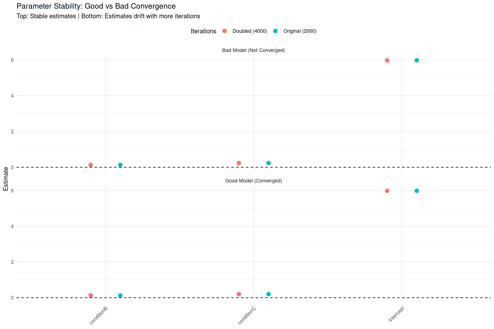{width=1152}
:::
:::


## Credible Intervals: Good vs Bad Model


::: {.cell}

```{.r .cell-code}
# Extract CIs for good model
ci_good_original <- as.data.frame(fixef_original) %>%
  rownames_to_column("Parameter") %>%
  mutate(Iterations = "Original (2000)", Model_Type = "Good Model (Converged)")

ci_good_doubled <- as.data.frame(fixef_doubled) %>%
  rownames_to_column("Parameter") %>%
  mutate(Iterations = "Doubled (4000)", Model_Type = "Good Model (Converged)")

# Extract CIs for bad model
ci_bad_original <- as.data.frame(fixef_bad_original) %>%
  rownames_to_column("Parameter") %>%
  mutate(Iterations = "Original (2000)", Model_Type = "Bad Model (Not Converged)")

ci_bad_doubled <- as.data.frame(fixef_bad_doubled) %>%
  rownames_to_column("Parameter") %>%
  mutate(Iterations = "Doubled (4000)", Model_Type = "Bad Model (Not Converged)")

ci_all <- bind_rows(ci_good_original, ci_good_doubled, ci_bad_original, ci_bad_doubled)

# Plot
ggplot(ci_all, aes(x = Parameter, y = Estimate, color = Iterations)) +
  geom_pointrange(aes(ymin = Q2.5, ymax = Q97.5),
                  position = position_dodge(width = 0.5),
                  size = 0.8, linewidth = 1) +
  geom_hline(yintercept = 0, linetype = "dashed") +
  facet_wrap(~ Model_Type, scales = "free", ncol = 1) +
  labs(title = "Credible Interval Stability: Good vs Bad Convergence",
       subtitle = "Top: CIs overlap completely | Bottom: CIs shift with more iterations",
       x = NULL, y = "Estimate (with 95% CI)") +
  theme_minimal() +
  theme(axis.text.x = element_text(angle = 45, hjust = 1),
        legend.position = "top")
```

::: {.cell-output-display}
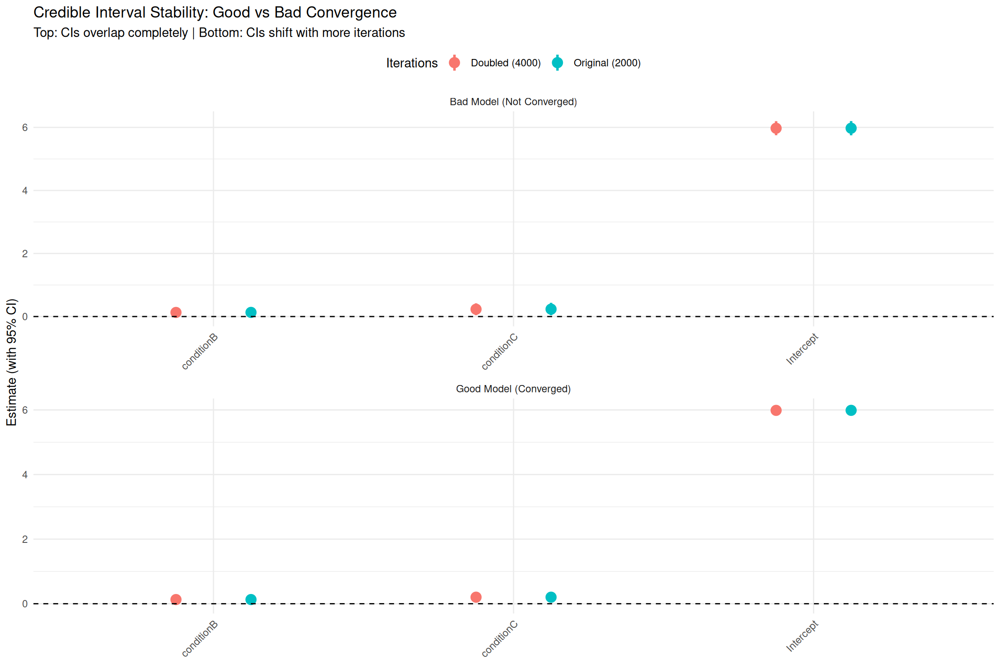{width=1152}
:::
:::


::: {.callout-important}
## Key Takeaway from Comparison

**Good model (top panels):**
- Estimates barely change when doubling iterations
- Credible intervals overlap almost completely
- ✅ Indicates chains have converged

**Bad model (bottom panels):**
- Estimates shift substantially with more iterations
- Credible intervals move to different locations
- ❌ Indicates chains have NOT converged - need to fix the underlying issues

**Lesson:** Doubling iterations alone won't fix a fundamentally problematic model. Address root causes (data, priors, model structure) first.
:::

::: {.callout-tip}
## Fixing Convergence Problems

**Common causes and solutions:**

1. **Insufficient data**
   - Simplify model (remove random slopes, interactions)
   - Use stronger priors to regularize
   - Collect more data

2. **Weak/improper priors**
   - Use informative priors based on domain knowledge
   - Check prior predictive distributions
   - Avoid completely flat priors

3. **Model misspecification**
   - Check data coding (units, factors, centering)
   - Verify distributional assumptions (family)
   - Consider transformations (log, logit, etc.)

4. **Sampler struggles (divergent transitions)**
   - Increase `adapt_delta` (e.g., 0.95 or 0.99)
   - Reparameterize (non-centered random effects)
   - Increase `max_treedepth`

5. **Just needs more time**
   - Double or quadruple iterations
   - Increase warmup period
   - Run longer chains (but check other issues first!)
:::

# Summary: Complete Convergence Checklist

## Step-by-Step Workflow

After fitting any Bayesian model, work through this checklist:

### ✅ 1. Automatic Warnings

```r
# brms automatically prints warnings
summary(model)
```

Look for:
- ❌ "The largest R-hat is..."
- ❌ "Bulk/Tail ESS is too low..."
- ❌ "There were X divergent transitions..."
- ❌ "Rhat > 1.01 for..."

### ✅ 2. Trace Plots

```r
plot(model, variable = c("b_", "sd_"), regex = TRUE)
# Or with bayesplot:
mcmc_trace(as_draws_array(model), pars = c("b_Intercept", ...))
```

Check:
- Do all chains overlap completely?
- No drift or trends over time?
- "Hairy caterpillar" appearance?

### ✅ 3. R-hat < 1.01

```r
max(rhat(model))
# Should be < 1.01 for ALL parameters
```

### ✅ 4. ESS > 400

```r
min(ess_bulk(model))
min(ess_tail(model))
# Both should be > 400 for ALL parameters
```

### ✅ 5. Low Autocorrelation

```r
mcmc_acf(as_draws_array(model), pars = c(...))
# Should drop to near 0 by lag 10-20
```

### ✅ 6. Substantive Sense

```r
summary(model)
fixef(model)
ranef(model)
```

Ask:
- Are parameter values in reasonable ranges?
- Do effect signs match expectations?
- Are magnitudes plausible?

### ✅ 7. Stability Test (Optional)

```r
# Refit with doubled iterations
model_doubled <- update(model, iter = 4000, warmup = 2000)
# Compare estimates - should be < 5% difference
```

## Decision Matrix

| Check | Status | Action |
|-------|--------|--------|
| Warnings | None | ✅ Proceed |
| Warnings | Divergent transitions | Increase `adapt_delta = 0.95+` |
| Warnings | Max treedepth | Increase `max_treedepth = 12+` |
| Trace plots | Well mixed | ✅ Proceed |
| Trace plots | Poor mixing | Increase iterations, check model |
| R-hat | All < 1.01 | ✅ Proceed |
| R-hat | Any > 1.01 | ❌ Don't trust results! Increase iterations |
| ESS | All > 400 | ✅ Proceed |
| ESS | Any < 400 | Increase iterations proportionally |
| Autocorrelation | Drops quickly | ✅ Proceed |
| Autocorrelation | Stays high | Increase iterations or reparameterize |
| Substantive | Makes sense | ✅ Proceed |
| Substantive | Implausible | Check model specification and data |
| Doubled iterations | < 5% change | ✅ Stable, proceed |
| Doubled iterations | > 10% change | ❌ Not converged, use more iterations |

## Quick Reference: Fixing Common Problems

### Problem: High R-hat, low ESS

```r
# Solution 1: More iterations
model <- brm(..., iter = 4000, warmup = 2000)

# Solution 2: Check for divergent transitions
# If yes, increase adapt_delta
model <- brm(..., control = list(adapt_delta = 0.95))
```

### Problem: Divergent transitions

```r
# Increase adapt_delta (makes sampler more careful)
model <- brm(..., control = list(adapt_delta = 0.95))

# If still divergent, try 0.99
model <- brm(..., control = list(adapt_delta = 0.99))

# Consider non-centered parameterization for random effects
# (Advanced: modify model formula or use custom Stan code)
```

### Problem: Max treedepth warnings

```r
# Increase max treedepth
model <- brm(..., control = list(max_treedepth = 12))
```

### Problem: Implausible parameter values

```r
# 1. Check data coding
summary(data)
str(data)

# 2. Use more informative priors
priors <- c(
  prior(normal(6, 1), class = Intercept),  # Stronger prior
  prior(normal(0, 0.5), class = b)          # More regularization
)

# 3. Simplify model
model <- brm(y ~ x + (1 | subject),  # Remove random slopes
             ...)
```

## When Everything Looks Good

Once all checks pass:

✅ **You can trust your posterior estimates!**

Proceed to:
- ROPE analysis (Module 06)
- Effect estimation with emmeans/marginaleffects (Module 06)
- Bayes Factors (Module 07)
- Report results in your manuscript

## Final Thoughts

**Convergence diagnostics are not optional!**

- Always check convergence before interpreting results
- If in doubt, run longer chains
- Document your diagnostics in supplementary materials
- Make convergence checks part of your standard workflow

Remember:
> "Garbage in, garbage out" applies to MCMC too. If your chains haven't converged, your inferences are meaningless—no matter how sophisticated your analysis!

# Exercises

## Exercise 1: Check Your Own Model

Take a model you've fitted in previous modules:

1. Run all convergence diagnostics
2. Create a trace plot for key parameters
3. Check R-hat and ESS values
4. Verify parameters make substantive sense
5. Document your findings

## Exercise 2: Fix a Convergence Problem

Use the poorly converged model from this module:

1. Identify the specific problems
2. Propose 2-3 solutions
3. Implement one solution and recheck diagnostics
4. Compare results before/after

## Exercise 3: Sensitivity to Iterations

Fit the same model with different iteration settings:
- 1000 iterations (500 warmup)
- 2000 iterations (1000 warmup) 
- 4000 iterations (2000 warmup)

Compare:
- Parameter estimates
- Credible interval widths
- ESS values
- Computation time

When do estimates stabilize?

# Literature and Resources

## Essential Reading

**Convergence diagnostics:**
- Vehtari, A., Gelman, A., Simpson, D., Carpenter, B., & Bürkner, P. C. (2021). Rank-normalization, folding, and localization: An improved R̂ for assessing convergence of MCMC. *Bayesian Analysis*, 16(2), 667-718.
  - Modern R-hat diagnostic (current standard)
  
- Gelman, A., & Rubin, D. B. (1992). Inference from iterative simulation using multiple sequences. *Statistical Science*, 7(4), 457-472.
  - Original R-hat diagnostic

**Effective sample size:**
- Vehtari et al. (2021) [same as above]
  - ESS bulk and tail diagnostics

**General MCMC diagnostics:**
- Gelman, A., Carlin, J. B., Stern, H. S., Dunson, D. B., Vehtari, A., & Rubin, D. B. (2013). *Bayesian Data Analysis* (3rd ed.). CRC Press.
  - Chapter 11: Basics of Markov Chain Simulation
  - Gold standard textbook

**Practical guidance:**
- Gabry, J., Simpson, D., Vehtari, A., Betancourt, M., & Gelman, A. (2019). Visualization in Bayesian workflow. *Journal of the Royal Statistical Society A*, 182(2), 389-402.
  - Comprehensive workflow including convergence checks

## Software Documentation

- **brms**: `help("brms-package")`, especially MCMC settings
- **bayesplot**: `vignette("visual-mcmc-diagnostics")`
- **posterior**: `vignette("posterior")`
- **Stan**: https://mc-stan.org/docs/reference-manual/

## Advanced Topics

- **Non-centered parameterizations**: Betancourt, M., & Girolami, M. (2015). Hamiltonian Monte Carlo for hierarchical models.
- **Divergent transitions**: https://mc-stan.org/docs/2_27/reference-manual/divergent-transitions.html

---

**Next Module**: With converged models in hand, you're ready to report your results!
